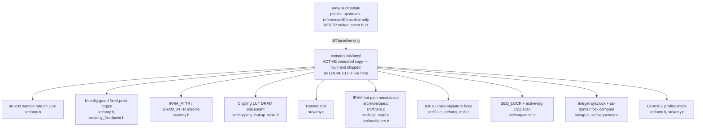

# AMY Local Edits

Edits applied on top of the upstream `shorepine/amy` submodule.
Upstream commit: `1e23c70` (v1.2.31, 2026-07-07).

All edits are marked `// LOCAL EDIT` in the source. ESP32-S3-specific edits are
permanent (upstream has no concept of IRAM/DRAM placement or FreeRTOS task
signatures); the fixes listed under "Dropped" were merged upstream and are no
longer carried here.



## Dropped (merged upstream)

| PR | Description |
|----|-------------|
| [#740](https://github.com/shorepine/amy/pull/740) + [#743](https://github.com/shorepine/amy/pull/743) | `chained_osc` NULL guard in `render_osc_wave` (amy.c) |
| [#744](https://github.com/shorepine/amy/pull/744) | `init_stereo_reverb()` → `bool` return + OOM crash safety (delay.h, delay.c, amy.h, amy.c, api.c) |
| [#787](https://github.com/shorepine/amy/pull/787) (merged as [#809](https://github.com/shorepine/amy/pull/809), v1.2.24) | Reverb `LPF()` state passed by pointer - feedback crossover lowpass now actually filters (delay.c) |
| [#790](https://github.com/shorepine/amy/pull/790) (merged as [#811](https://github.com/shorepine/amy/pull/811), v1.2.26) | Reverb delay-line state hoisted into loop locals (delay.c) |
| upstream `8ade0b1` | `MUL5A_SS` / `MUL6A_SS` float-mode fallbacks (amy_fixedpoint.h) |

## Active local edits

### `src/amy_simd.h` (new) + `amy.c` / `algorithms.c` — ESP32-S3 PIE (SIMD)

Routes the render path's bulk block clears and copies through the S3's PIE unit
(128-bit vector registers), via the local `components/pie_dsp` component.

New header `src/amy_simd.h` defines `AMY_PIE_SIMD` (requires both the S3 and
`AMY_USE_FIXEDPOINT` — the aligned allocator below is only wanted in the
fixed-point build) plus `AMY_BLOCK_BZERO` / `AMY_BLOCK_BCOPY`. Kept as a
separate header so an AMY re-vendor only has to re-apply call sites, not
re-untangle a modified `amy.h`.

Call sites changed:

| Site | Change |
|------|--------|
| `amy.c` `amy_render()` | per-bus `fbl` clear and the per-audible-oscillator `per_osc_fb` clear -> `AMY_BLOCK_BZERO` (PIE `EE.VST.128` block fill). The `per_osc_fb` clear is the hottest one: it runs once per audible oscillator per block. |
| `amy.c` chorus mod buffer | `bzero` -> `AMY_BLOCK_BZERO` |
| `algorithms.c` `zero()` / `copy()` | FM operator scratch (1 KB each, per operator per block) -> `AMY_BLOCK_BZERO` / `AMY_BLOCK_BCOPY`. This is where most of the win is: **dx7 6-op polyphony renders 10.4% cheaper** from the PIE routing alone (on-target A/B, median cycles/block; the oft-quoted 12.1% total also includes the separate dead-sum guard below). |
| `amy.c` `malloc_caps_block()` (new) + `amy.h` prototype | 16-byte-aligned allocator for the buffers PIE walks (`fbl`, `per_osc_fb`, `chorus.delay_mod`, `algorithms.c` scratch). **Deliberately not folded into `malloc_caps()`**: most AMY allocations are small structs and `heap_caps_aligned_alloc` over-allocates per block, and internal DRAM is the scarce resource here. Alignment is a correctness matter, not just speed — PIE loads/stores force the low address bits to zero, so an unaligned base silently reads the *wrong* address rather than faulting. |

Scope is deliberately narrow, and that is the finding rather than a shortcut:
PIE multiplies only on 8/16-bit lanes (`EE.VMULAS.S16` -> 40-bit QACC/ACCX),
while `SAMPLE` is s8.23 = int32, so every hot-path multiply (`MUL8_SS`,
`SMULR6`, `top16SMUL`) is a 32x32 product PIE cannot vectorize. On top of that
the LUT oscillators are gather-indexed (wavetable indexed by phase accumulator;
PIE has no gather) and the biquads/EQ/echo/chorus/reverb are all recurrence-
bound. esp-dsp independently reaches the same conclusion: its own ESP32-S3
biquad (`dsps_biquad_f32_aes3.S`) contains zero PIE instructions and is
hand-scheduled scalar FPU.

**`filters.c` is deliberately *not* routed through PIE.** `scan_max()` and
`block_norm()` are multiply-free reductions, so they looked eligible and an
earlier revision vectorized them. On-target A/B said no: that bought nothing on
any scene (four were flat to 0.00%) and cost up to 0.9% on filter-heavy ones.
Nearly every call is on a tiny buffer — `scan_max(w, 4)`, `scan_max(w, 6)` for
LPF24, and `scan_max`/`block_norm` over the 8-entry `filter_delay` — where the
vector setup costs more than the scalar loop it replaces, and those buffers sit
inside `synthinfo` so they are unaligned as well. Multiply-free is necessary but
not sufficient: the operation also has to be *long* enough to amortise the setup,
and in AMY only the bulk block clears and copies are. Don't re-add it.

Upstream PR candidate: the fast path is ESP32-S3 specific, but every entry
point degrades to libc memset/memcpy elsewhere (verified by host-compiling the
headers and .S sources off-IDF), so the same patch builds for AMY's other
targets. Pending upstream interest via issue.

### `src/amy.c` — skip the dead dual-core bus sum

`AMY_DUALCORE` is defined unconditionally for `ESP_PLATFORM`, but this build
runs `multicore = 0`, so `amy_render()` is only ever called with `core = 0` and
`fbl[1]` stays at its alloc-time zero fill forever. The mix-down loop was
therefore summing 512 int32 zeros per bus, every block, for nothing. Now
guarded on `amy_global.config.platform.multicore` — a runtime test, not
compile-time, so the sum reappears correctly if multicore is ever enabled.

### `src/amy.h` — 48 kHz sample rate on ESP

`AMY_SAMPLE_RATE` forced to 48000 in the `ESP_PLATFORM` branch (upstream's
generic fallback is 44100). Must match `CONFIG_UAC_SAMPLE_RATE`; a mismatch
detunes/distorts USB audio. Any re-vendor silently reverts this - after every
AMY update, verify `grep AMY_SAMPLE_RATE src/amy.h` shows the ESP branch at
48000.

### `src/amy.h` — Kconfig-gated fixed-point toggle

`#define AMY_USE_FIXEDPOINT` replaced with a `#ifdef CONFIG_AMY_USE_FIXEDPOINT`
guard. Enabled via menuconfig: **AMY Synthesizer → Use fixed-point arithmetic**
(default off). Requires `components/amy/Kconfig` (new file, not upstreamed).

The ESP32-S3 LX7 FPU makes float equal-or-faster; fixed-point was designed for
RP2040. The option is preserved for comparison or future portability needs.

### `src/amy_fixedpoint.h` — `ldexpf` SHIFTL/SHIFTR

One edit to the `#ifndef AMY_USE_FIXEDPOINT` (float mode) section (the former
`MUL5A_SS`/`MUL6A_SS` fallback edit was added upstream in `8ade0b1`):

**`SHIFTL` / `SHIFTR` use `ldexpf` instead of `exp2f`** — the original float
macros were `(s) * exp2f(b)`. When `b` is a runtime variable (e.g.
`exp2_lut()` integer part), `exp2f(runtime_int)` cannot be constant-folded
and emits a transcendental libcall. `ldexpf(s, b)` is the correct primitive
for ×2^n scaling and is never worse. **Caveat (verified by objdump):** on
this Xtensa LX7 toolchain GCC does *not* lower `ldexpf` (or `floorf`) to the
hardware `FLOOR.S`/exponent ops — both remain `call8` libcalls. So this is a
correctness/clarity win and a marginal speedup at most, NOT the fix for
float-mode CPU cost. Float mode is dominated by per-sample `floorf` libcalls
in `INT_OF_S` / `S_FRAC_OF_S` / `P_WRAPPED_SUM` (see note below); fixed-point
remains the product mode on this target.

### `src/amy.h` — IRAM_ATTR / DRAM_ATTR macros

Added `AMY_IRAM_ATTR` and `AMY_DRAM_ATTR` macro definitions inside the
`#ifdef ESP_PLATFORM` block. On non-ESP they expand to nothing.

- `AMY_IRAM_ATTR` → `IRAM_ATTR` — places functions in internal IRAM. Used
  instead of a linker fragment because GCC LTO renames `.text.*` sections in
  ltrans, so fragment-based `noflash` rules silently miss. IRAM_ATTR on the
  symbol itself (`.iram1.*`) survives LTO.
- `AMY_DRAM_ATTR` → `DRAM_ATTR` — places const data tables in internal DRAM
  (fast SRAM), not IRAM which is instruction-only and unsafe for halfword reads.

### `src/clipping_lookup_table.h` — DRAM placement

`clipping_lookup_table[4914]` annotated with `AMY_DRAM_ATTR`. This 9.6 KB table
is read on every output sample in `amy_fill_buffer`. Without this it lives in
flash `.rodata` and is served via the PSRAM XIP cache, causing cache-miss stalls
in the inner sample loop.

### `src/amy.c` — Render lock

`amy_render()` annotated with `AMY_IRAM_ATTR` and wrapped with
`amy_grab_lock()` / `amy_release_lock()` spanning the entire function body.

**Why:** `synth[]` / `msynth[]` arrays are structurally mutated by
`free_osc` / `alloc_osc` / `reset_osc` / patch loads on Core 0, while the
render walks the same pointers on Core 1. Without the lock a patch toggle can
free `synth[osc]` between the NULL check and the deref in `hold_and_modify`,
producing a `LoadProhibited` fault (EXCVADDR=0x8).

### `src/amy.h` — lock accessor prototypes

Added `extern SemaphoreHandle_t amy_queue_lock;` (ESP_PLATFORM branch, missing
alongside the existing `_WIN32`/`_POSIX_THREADS` externs) plus unconditional
prototypes for `amy_grab_lock(void)` / `amy_release_lock(void)` /
`amy_init_lock(void)`, none of which upstream declares anywhere despite every
platform branch in `amy.c` defining them.

**Why:** the runtime PCM sampler (`custompatches/sample_rec.c`) needs to grab
the render lock around its own `pcm_load()`/`pcm_unload_preset()` calls —
`pcm.c`'s memory-preset linked list is walked unlocked by `render_pcm()`
inside the render body, so mutating it from another task without the lock
races the render task across cores. `add_delta_to_queue()` already does
exactly this internally; this edit just lets code outside `amy.c` do the same
without an implicit-declaration warning. **Upstream-PR candidate** — the gap
is platform-agnostic (every accessor is unprototyped on every platform), not
an ESP32-specific fix.

### `src/envelope.c` — IRAM hot path

`compute_mod_value`, `compute_mod_scale`, `compute_breakpoint_scale` annotated
with `AMY_IRAM_ATTR`. Called per-sample from the render hot path.

### `src/filters.c` — IRAM hot path

`dsps_biquad_f32_ansi`, `dsps_biquad_f32_ansi_split_fb`,
`dsps_biquad_f32_ansi_split_fb_once`, `dsps_biquad_f32_ansi_split_fb_twice`,
`scan_max`, `parametric_eq_process`, `filter_process` annotated with
`AMY_IRAM_ATTR`. All are in the per-block render loop.

### `src/log2_exp2.c` — IRAM hot path

`log2_lut`, `exp2_lut` annotated with `AMY_IRAM_ATTR`. Used in pitch/amp
calculations per sample.

### `src/oscillators.c` — IRAM hot path

`render_lut_fm_fb`, `render_lut_fb`, `render_lut_fm`, `render_lut`,
`render_lut_cub`, `render_lpf_lut` annotated with `AMY_IRAM_ATTR`. Core of the
per-sample wavetable rendering.

### `src/i2s.c` — IDF 6.0 task signature + UART MIDI guard

1. `esp_fill_audio_buffer_task()` → `esp_fill_audio_buffer_task(void *pvParameters)`.
   IDF 6.0 FreeRTOS requires `TaskFunction_t` (`void (*)(void*)`); the old
   no-parameter form causes a type mismatch warning/error on `xTaskCreatePinnedToCore`.

2. `amy_update_tasks()`: `esp_poll_midi()` is now guarded by
   `if (amy_global.config.midi & AMY_MIDI_IS_UART)`. Without the guard, calling
   `esp_poll_midi()` with an uninstalled UART driver emits `uart_read_bytes()`
   errors at runtime (this project uses `AMY_MIDI_IS_NONE`).

### `src/amy_midi.c` — IDF 6.0 task signature

`run_midi_task()` → `run_midi_task(void *pvParameters)`. Same FreeRTOS
`TaskFunction_t` fix as `i2s.c` above.

### `src/sequencer.c` — SEQ_LOCK + active-tag O(1) scan

Two related improvements:

1. **SEQ_LOCK mutex** (`s_seq_lock`): `sequences[]` is written by
   `sequencer_add_event()` (any task) and read by `sequencer_process_tick()`
   (esp_timer ISR context on Core 0). On SMP these run concurrently. A dedicated
   mutex prevents torn reads/writes. Cannot reuse `amy_queue_lock` because
   `add_delta_to_queue()` re-acquires it inside the tick scan — doing so with a
   non-recursive mutex would deadlock.

2. **Active-tag dense index** (`s_active_tags`, `s_tag_slot`): The old scan
   iterated `0..highest_tag` where `highest_tag` is a high-water mark that never
   decreases (the arp pushes it to ~1119 and it stays there). Every 500 µs tick
   on Core 0 was O(1119) scanning mostly-NULL slots. Replaced with a compact
   dense list of only the tags that currently have deltas: the tick is now
   O(active events) regardless of tag magnitude. `s_tag_slot[tag]` → position in
   the dense list (or -1) enables O(1) removal via swap-with-last.

### `src/api.c` + `src/sequencer.c` — Integer sample clock + µs-domain tick compare

**Upstream-PR candidate** (universal 32-bit bugs, not target-specific). Three
related fixes to the sample-slaved clock and the sequencer timing path
(PR draft: `docs/pr-draft-sysclock-integer-clock.md`):

1. **`amy_sysclock()` integer math** (`src/api.c`): the float version
   `(uint32_t)((total_blocks * AMY_BLOCK_SIZE / (float)AMY_SAMPLE_RATE) * 1000)`
   had two correctness bugs, verified by host-side test:
   - the u32 samples-domain multiply wraps at 2^32 samples = **24.85 h at
     48 kHz** (the comment claims 49.7 days); at 25 h uptime the clock reads
     ~8.7 min and the sequencer re-fires ~25 h of absolute-tick events;
   - the 24-bit float mantissa quantizes the clock as uptime grows — by 12 h
     it advances in **8 ms jumps** (true block step 5.33 ms), lumping
     everything slaved to it (sequencer → arp/drone/song ticks).
   Replaced with `(uint32_t)(((uint64_t)total_blocks * (AMY_BLOCK_SIZE *
   1000u)) / AMY_SAMPLE_RATE)` — exact (0 mismatches vs a 128-bit reference
   over the full u32 range, sampled), monotonic, true 49.7-day u32-ms wrap.
   Costs one `__udivdi3` per call on 32-bit (u64 divide by constant is not
   strength-reduced there); a call-free 48 kHz/256 specialization
   (`total_blocks*5 + total_blocks/3`) exists if that ever matters, but the
   portable form is kept to match the upstream PR and minimize re-vendor
   drift.

2. **µs-domain tick compare** (`src/sequencer.c`,
   `sequencer_check_and_fill()`): the old loop condition
   `amy_sysclock() >= (uint32_t)(next_amy_tick_us / 1000L)` paid a
   `__udivdi3` **and** a second `amy_sysclock()` per check, every 500 µs
   timer callback. Now compares the already-computed `now_us` against
   `next_amy_tick_us` directly. Behavior delta: tick deadlines are no longer
   rounded down to the ms boundary, so a tick can fire up to 1 ms later
   (never earlier) on the 500 µs callback grid; accumulated tick rate is
   unchanged.

3. **`sequencer_recompute()` float-only** (`src/sequencer.c`): unsuffixed
   `1000000.0` / `60.0` literals promoted the tempo math to software-emulated
   double (`__extendsfdf2/__divdf3/__muldf3/__fixunsdfsi`). Rewritten as the
   equivalent single-divide `60000000.0f / (tempo * PPQ)`. Cold path (tempo
   changes only) — hygiene, not a hot-path win.

Net effect on the 2 kHz Core-0 timer callback: 77 → 53 insns, calls column
`__divsf3, __udivdi3` → one `__udivdi3` (the sysclock divide), float
conversion traffic gone. Origin: asmdiff ELF-mode sweep
(`2026-07-07-codegen-hotspots-handoff.md`).

### `src/amy.h` + `src/amy.c` — COARSE profiler mode

Upstream gates the whole profiler behind `AMY_DEBUG`, which times *every* tag —
including per-osc/inner tags that fire dozens of times per block **inside** the
`AMY_RENDER` window. Those nested timestamp calls inflate the `AMY_RENDER` total,
which would overstate the parallelizable fraction in a dual-core feasibility
measurement.

Added a second, lighter profiling level, `AMY_PROFILE_COARSE` (Kconfig:
`AMY_PROFILE_MODE`, see `components/amy/Kconfig` + `CMakeLists.txt`):

- The profiler tables / timers / `amy_profiles_init/print` now compile under
  `#if defined(AMY_DEBUG) || defined(AMY_PROFILE_COARSE)` (was `#ifdef AMY_DEBUG`).
- In coarse mode `AMY_PROFILE_START/STOP` act only on the outer stage tags
  (`AMY_RENDER`, `AMY_FILL_BUFFER`, `AMY_EXECUTE_DELTAS`, `AMY_ESP_FILL_BUFFER`)
  via `AMY_TAG_IS_COARSE(tag)`. Because `tag` is a compile-time enum literal at
  every call site, the guard folds to a constant and inner call sites compile to
  nothing — zero overhead and no inflation of `AMY_RENDER`.
- Macros expand to a complete statement with no trailing `;`, matching upstream
  call sites that omit the semicolon (e.g. `AMY_PROFILE_START(AMY_RENDER)`).

Full `AMY_DEBUG` behaviour is unchanged (select `AMY_PROFILE_FULL`). See
`docs/dual-core-render-analysis.md` for why and how this is used.

**Cross-core reset fix (`AMY_PROFILE_INIT`):** the dump runs on Core 0 (the
`app_main` idle loop) while render `START/STOP` run on Core 1. The upstream reset
zeroed `profiles[tag].start`; when that landed between a Core-1 `START` and
`STOP`, the `STOP` computed `(now - 0)` ≈ uptime, producing one ~uptime-µs spike
per window on whichever tag was mid-flight (see `docs/AMY-PROFILE-LOG.md` — every
window had exactly one tag reading billions of µs). Fix: `AMY_PROFILE_INIT` no
longer zeroes `.start` (it is only ever read by a `STOP` that follows a `START`,
so it never needs zeroing). `us_total`/`calls` are still reset each window; the
remaining `+=`-vs-`=0` race can at most carry one window's totals into the next
(both `us_total` and `calls` scale together, so **`us per call` stays correct**;
only that window's `% wall` may read high). Benefits coarse and full modes.

### `Kconfig` + `CMakeLists.txt` — wavetable oscillator build flag

Upstream's `wave=WAVETABLE` oscillator (`oscillators.c`, `pcm_tiny.h`,
`pcm_samples_tiny.h`) was already fully implemented in the vendored source but
gated behind a bare, unwired `#ifdef AMY_WAVETABLE` — no build path ever
defined it, so the feature was silently dead code. No source inside
`components/amy/src/` was edited; this only wires the existing gate to a
Kconfig option (`AMY_WAVETABLE`, default **y**), mirroring the
`AMY_USE_FIXEDPOINT` pattern above:

```
if(CONFIG_AMY_WAVETABLE)
    target_compile_definitions(${COMPONENT_LIB} PUBLIC AMY_WAVETABLE)
endif()
```

Measured cost (2026-07, this target): **+163,952 bytes flash `.rodata`** (5
built-in 64-cycle tables × 16384 samples × 2 bytes), **zero DIRAM/IRAM/PSRAM**
— `pcm_get_sample_ram_for_preset()` returns a pointer straight into the flash
`pcm[]` array (`pcm.c:77`), never RAM-copied. Verified via `idf.py size`
before/after on an otherwise-identical build.

### `Kconfig` + `CMakeLists.txt` — Gamma TR-808 PCM bank flag

Same pattern as `AMY_WAVETABLE` above — no vendored source is modified.
Kconfig option `AMY_PCM_GAMMA808` (default **y**) defines upstream's own
`GAMMA9001` compile-time switch (introduced in v1.2.31's Gamma9001 work),
which selects:

- `amy.c`: ROM PCM bank = `pcm_gamma808.h` (19 full-length TR-808 samples)
  instead of the legacy 11-sample `pcm_tiny.h`;
- `patches.h`: the patch-258 "MIDI drums" string matching that bank's map;
- `pcm.c`/`amy.h`: the gamma9001 streaming hooks (`amy_set_gamma9001_pcm()`
  + presets at `GAMMA9001_PRESET_BASE`+, NULL-guarded and inert until a blob
  is provided, e.g. mmapped from a flash partition).

PCM preset numbering differs between banks; the sequencer drum defaults in
`components/synth_core/sequencer_core/seq_core_synth.c` follow
`CONFIG_AMY_PCM_GAMMA808`. Wavetable presets are unaffected (addressed via
`pcm_wavetable_base`). Cost ≈ +268 KB flash `.rodata` (XIP-cached, never
RAM-copied); zero DRAM/PSRAM/IRAM.

### `filters.c` + `log2_exp2.c` + `log2_exp2_fxpt_lutable.h` + `amy.h` — LUT trig in biquad coefficient generators (upstream cherry-pick #875 + #877)

Cherry-picked from upstream (both MERGED post-1.2.31: shorepine/amy#875
"Avoid transcendentals" filters.c/log2_exp2 portions, and #877 "sin/cos_lut in
the hpf and bpf coefficient generators too"). **Retire on the next vendor
sync >= v1.2.53** — the hunks are verbatim, so the sync should apply cleanly.

- `filters.c`: `dsps_biquad_gen_lpf/hpf/bpf_f32` compute `cos/sin(2*pi*f)`
  via new `sin2pi`/`cos2pi` macros backed by a fixed-point quarter-sine LUT
  instead of libm `sinf`/`cosf` (removes transcendental libcalls from every
  filter-coefficient regen, i.e. once per block per filtered osc under EG/LFO
  sweeps). The rare LPF pole-correction branch keeps `acosf`/`cosf`, as
  upstream does. `M_PI` fallback literal gains an `f` suffix.
- `log2_exp2.c`: new `sin_lut()`/`cos_lut()` (quadrant fold over a 257-entry
  quarter-sine table, same `lut_val` interpolator as log2/exp2).
- `log2_exp2_fxpt_lutable.h`: `qsin_fxpt_lutable[257]` (+514 B flash rodata,
  XIP-cached like its neighbors).
- `amy.h`: `sin_lut`/`cos_lut` prototypes.

Deliberately NOT taken from #875: the `amy.c` `logfreq_of_freq` /
`freq_of_logfreq` / `freq_for_midi_note` LUT conversions (global tuning-
precision change; evaluate separately) and the `amy_fixedpoint.h`
`S2F/F2S_nofpu` experiment (dead code — upstream keeps `_orig` active).

### `pcm.c` + `amy.h` — `amy_gamma9001_pcm_bytes()` accessor (LOCAL EDIT)

Two-line helper returning `GAMMA9001_BIN_FRAMES * 2`. The constant lives only
in `pcm_gamma9001.h`, which also defines the map array and so cannot be
included a second time; the ESP32-S3 mount code (`main.c
gamma9001_pcm_mount()`) needs the exact blob size to flash-mmap it (a whole-
partition mmap exhausts data-cache MMU pages under PSRAM XIP) or to size the
PSRAM fallback copy. Upstream PR candidate (tiny, platform-neutral).

## Deferred / needs porting

| Edit | Status |
|------|--------|
| Block-processed ESP32 stereo reverb (`delay.c`, `#ifdef ESP_PLATFORM`) | **Not applied.** Upstream changed `stereo_reverb()` to take `reverb_params_t *rev` (all delay state inside struct); the block-processed optimization needs adapting to the new API before it can be reapplied. The locals-caching optimization (now upstream via #811) recovers part of the same win on the new API; re-evaluate whether full block processing is still worth it after hardware measurement. |
