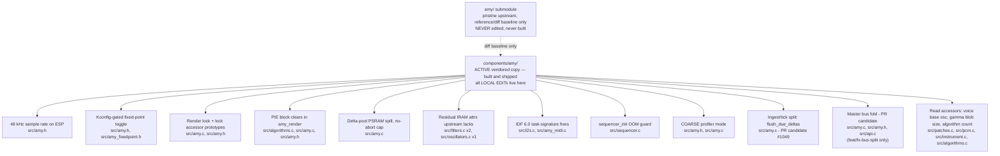

# AMY Local Edits

Edits applied on top of the upstream `shorepine/amy` submodule.
Upstream commit: `55e044d` (v1.2.145, vendored 2026-08-14) plus two of our
own PRs vendored ahead of their merge - see "Pending upstream" below.
Previous bases: v1.2.121 `85a7025`, v1.2.104 `fd09bd2`, v1.2.31 `1e23c70`. The submodule tracks upstream `main`
(`.gitmodules` `branch = main`; refresh with `git submodule update --remote amy`).

## Pending upstream (vendored ahead of merge, 2026-08-14)

Two of our PRs are part of this vendor base before upstream has merged
them. They carry NO `LOCAL EDIT` markers (written upstream-native); if a
PR is rejected, re-mark its diff as a LOCAL EDIT here instead.

| PR | What |
|----|------|
| [#1106](https://github.com/shorepine/amy/pull/1106) | Free a released voice's oscs (`RESET_FREE_OSC`); describe-paths (patch store, voice snapshot) no longer allocate oscs; deletion takes no snapshot. |
| [#1107](https://github.com/shorepine/amy/pull/1107) | `ram_caps_oscs` config field: per-osc state arena caps, defaults to `ram_caps_events`. Replaces the former af10219 LOCAL EDIT; `main/main.c` sets it to PSRAM explicitly. |

All edits are marked `// LOCAL EDIT` in the source. ESP32-S3-specific edits are
permanent (upstream has no concept of IRAM/DRAM placement or FreeRTOS task
signatures); the fixes listed under "Dropped" were merged upstream and are no
longer carried here.



## Dropped (merged upstream)

| PR | Description |
|----|-------------|
| [#740](https://github.com/shorepine/amy/pull/740) + [#743](https://github.com/shorepine/amy/pull/743) | `chained_osc` NULL guard in `render_osc_wave` (amy.c) |
| [#744](https://github.com/shorepine/amy/pull/744) | `init_stereo_reverb()` → `bool` return + OOM crash safety (delay.h, delay.c, amy.h, amy.c, api.c) |
| [#787](https://github.com/shorepine/amy/pull/787) (merged as [#809](https://github.com/shorepine/amy/pull/809), v1.2.24) | Reverb `LPF()` state passed by pointer - feedback crossover lowpass now actually filters (delay.c) |
| [#790](https://github.com/shorepine/amy/pull/790) (merged as [#811](https://github.com/shorepine/amy/pull/811), v1.2.26) | Reverb delay-line state hoisted into loop locals (delay.c) |
| upstream `8ade0b1` | `MUL5A_SS` / `MUL6A_SS` float-mode fallbacks (amy_fixedpoint.h) |
| [#961](https://github.com/shorepine/amy/pull/961) (merged `ae469e1`, 2026-07-24) | OOM survival on the voice/event allocation paths: `amy_oom()` + `amy_get_oom_count()`, `bool ensure_osc_allocd()`, alloc-before-free breakpoint realloc (amy.c, amy.h, instrument.c, cv_trigger.c, interp_partials.c). Vendored tree realigned to the merged version 2026-07-25 - see that entry for what stays local. |
| [#993](https://github.com/shorepine/amy/pull/993) (merged `56c8f1d`, 2026-07-27) | `amy_oom()` logs only the first failure, counts the rest - the vfprintf ran on the render thread and OOM retries re-fail per note-on, flooding stderr from the audio path (amy.c). Vendored shape identical to upstream; found via the BLE-MIDI + additive-piano slowdown. |
| [#875](https://github.com/shorepine/amy/pull/875) + [#877](https://github.com/shorepine/amy/pull/877) | LUT trig (`sin2pi`/`cos2pi` over the quarter-sine table) in the biquad coefficient generators, `sin_lut`/`cos_lut` + `qsin_fxpt_lutable` (filters.c, log2_exp2.c, log2_exp2_fxpt_lutable.h). Was carried as a verbatim cherry-pick; retired on the v1.2.104 sync. |
| upstream `470a6c0` (v1.2.55) | Float-suffixed literals in the biquad coefficient generators (filters.c). The local notch generator keeps its own suffixes (it postdates the fix and is still local). |
| [#951](https://github.com/shorepine/amy/pull/951) (v1.2.83) + upstream follow-ups | `SMUL64R` full-precision biquad multiply (`FILT_MUL_SS`) + BFP-free LPF24 path. Upstream evolved the vendored `_nobfp_fixedzeros` shape into `_once/_twice_fixedzeros` kernels with its own `AMY_HAS_MUL64`/`USE_BLOCK_FLOATING_POINT` split; the vendored tree now carries upstream's version verbatim. |
| [#949](https://github.com/shorepine/amy/pull/949) (v1.2.86) | `mod_osc_would_cause_loop()` cycle guard for chained modulators (amy.c) - our own PR, merged upstream. |
| [#827](https://github.com/shorepine/amy/pull/827) (v1.2.45) + [#982](https://github.com/shorepine/amy/pull/982) | Integer `amy_sysclock()` (our PR), then upstream's 64-bit `amy_sysclock64()` + wrap-relative `AMY_TIME_GEQ` + the 49.7-day rollover fix. #982 also adopted the µs-domain tick compare and the single-precision tempo math in sequencer.c, retiring the whole local api.c/sequencer.c clock family. |
| [#905](https://github.com/shorepine/amy/pull/905) + [#907](https://github.com/shorepine/amy/pull/907) (v1.2.63/64) | `AMY_IRAM_ATTR`/`AMY_DRAM_ATTR` macros (credited to this repo, now with a Tulip opt-out), the hot-path IRAM annotations for envelope.c, log2_exp2.c, delay.c, most of filters.c/oscillators.c/amy.c, and the clipping-LUT `AMY_DRAM_ATTR` placement. Only three annotations upstream lacks remain local (see below). |
| [#967](https://github.com/shorepine/amy/pull/967)/[#969](https://github.com/shorepine/amy/pull/969) (v1.2.90) | FM scratch allocated as one flat 16-byte-aligned block via `malloc_caps_block` (algorithms.c) - supersedes the vendored per-pointer alignment; our three remaining `malloc_caps_block` call sites in amy.c stay local. |
| [#1000](https://github.com/shorepine/amy/pull/1000) (v1.2.106) | `FILTER_NOTCH` type - our own PR (half-angle center recovery, `dsps_biquad_gen_notch_f32`), merged upstream with dpwe test coverage in #1005 (amy.h, filters.c). |
| [#1020](https://github.com/shorepine/amy/pull/1020) | `FILTER_PHASER` type - our own PR (6-stage allpass chain, `allpass1_chain` + `dsps_phaser_f32_ansi`), merged 2026-08-01 (amy.h, filters.c). |
| upstream sequencer rework (#1017 lineage, 1.2.104->1.2.121) | `SEQ_LOCK` mutex + active-tag dense index (sequencer.c) - superseded wholesale. Upstream rewrote the sequencer: entries store raw wire strings, all link/string mutations run under `amy_queue_lock` (taken inside `sequencer_add_wire` and the tick fire path, released around `amy_play_message` because the parser can re-enter), and the tick walk is lock-free over index links threaded through a fixed array (single aligned-store splices, ascending order - a stale link can skip/revisit one tick, never walk freed memory). That closes the same use-after-free our SEQ_LOCK guarded and replaces the O(highest_tag) sweep with an active-only list, so both local edits retire. The int16 index-array shrink retires with them. |
| upstream (1.2.104->1.2.121 interval) | UART MIDI poll guard in `amy_update_tasks()` (i2s.c) - upstream adopted the same `AMY_MIDI_IS_UART` gate with its own comment. |
| upstream (1.2.104->1.2.121 interval) | `AMY_RENDER_TASK_PRIORITY`/`AMY_FILL_BUFFER_TASK_PRIORITY` = `ESP_TASK_PRIO_MAX - 1` (amy.h) - upstream now carries the fix (Arduino gets `- 5`), retiring the 2026-03-22 edit. |

## Active local edits

### 2026-08-21 status — distortion edits re-ported to the upstream `dist-followups` shape

Upstream #1116 merged (per-osc distortion, 'G' wire, SILENT-head scope, crush
DC blocker, SMULR6 pre-gain), and the follow-on work was assembled as the
upstream PR branch `dist-followups` (stage-stacking bitmask, drive/mix coef
vectors on GD/GM, per-bus 'J' stage). The vendored tree now carries that
exact layout: per-stage enables (`dist_clip/fold/crush` + bus twins,
`*_EN` param ids), `dist_stages` bitmask, int-typed bits/rate, a shared G/J
stage parser, per-stage 1:1 printers. The old 'C' + 'U'/'W' wire and the
single-type 'J' are retired. Firmware callers (`voice_config.c`,
`amy_fx.c`) map their single-type UI model onto the enables.

The four distortion sections below describe how the edits were built and
remain accurate as history; as code, the SILENT-osc and DC-blocker parts are
upstream now, and the rest should diff clean against `dist-followups` -
reconcile by re-vendor once that PR merges.

### `algorithms.c` + `amy.h` — `amy_num_algorithms` count export (upstream PR candidate)

`const uint16_t amy_num_algorithms`, derived from `sizeof(algorithms)/sizeof(algorithms[0])`
at the end of `algorithms.c` (below the byte-identical-to-upstream line), with an
`extern` in `amy.h`. API users stepping or validating `amy_event.algorithm` need
the real table size: `render_algo` indexes `algorithms[]` unchecked, so any
out-of-range value is an OOB read, and hardcoding 33 breaks the moment the table
grows (locally-authored algorithms are planned). App consumers: the sequencer's
Shift+Turn algorithm stepper and the FM screen's ALGO row wrap.

**Rollback:** drop the definition in `algorithms.c` and the `extern` in `amy.h`;
consumers then need a local count define.

### `filters.c` + `amy.c` + `amy.h` — distortion on the SILENT control osc (upstream PR candidate)

Follow-up to the per-osc distortion stage (#1116), extending the SILENT control
osc to carry distortion alongside the envelope and filter it already applies.
Two parts:

**1. `dist_process` split into a scope-agnostic kernel.** `dist_block(block,
len, cfg, st)` takes an explicit `dist_config_t` and `dist_state_t` instead of
reading both off `synth[osc]`; `dist_process(block, osc)` remains as the per-osc
wrapper with identical behaviour. `synthinfo`'s five loose `dist_*` fields
become `dist_config_t dist`, and `dist_hold`/`dist_hold_count` become
`dist_state_t dist_state`. `amy_event` was untouched at this stage — its flat
`dist_*` fields were the wire/API surface — but the coef-rail edit below then
moves drive and mix onto control-coef vectors (see next section).

**2. Distortion on the SILENT chained-osc head.** `dist_process` was called only
inside the `if (wave != SILENT)` branch, which runs *before* chained oscs are
summed; the SILENT branch that runs after applies `render_envelope` and
`filter_process` and nothing else. So SILENT — "a control osc for applying
filter and env without contributing waveform" — carried two of the three
processing stages. A SILENT head is a per-voice node (`chained_osc` is
base-osc-relative via `EVENT_TO_DELTA_WITH_BASEOSC`, so each voice has its own
head, buffer and state), which makes it the natural place to shape a summed
voice. The new call sits after the envelope (so note dynamics drive the shaper,
as per-osc) and before the filter (keeping dist -> filter order).

This is a feature extension, not a fix — per-osc distortion works correctly on
every osc that renders a waveform, and a preset is a preconfigured topology
rather than a contract about what osc 0 means. What it buys is a defined
per-voice summing node for SILENT-headed voices: the same node they already
apply their envelope and filter at.

Host-simulation proof (fixed-point build, replaying the same event sequence
against both revisions), Juno patch 0 = SILENT head, DX7 patch 138 = ALGO head:

| case | before | after |
|---|---|---|
| SILENT, dist off | rms 755.6 / peak 3043 | rms 755.6 / peak 3043 |
| SILENT, CLIP on head | **rms 755.6 / peak 3043 (unprocessed)** | **rms 2069.0 / peak 4620** |
| ALGO, dist off | rms 1048.3 / peak 2906 | rms 1048.3 / peak 2906 |
| ALGO, CLIP on head | rms 1503.5 / peak 1592 | rms 1503.5 / peak 1592 |

The three unchanged rows are byte-identical across the two builds, so the
kernel split is behaviour-preserving; only the SILENT row moves. A control case
setting the same shaper on the chain's sounding members instead of its head
gives rms 1019.0 / peak 2972 — nowhere near the head result, confirming the tap
shapes the summed voice rather than being a rename of per-osc.


### `amy.c` + `amy.h` + `filters.c` + `parse.c` + `api.c` + `patches.c` — distortion drive/mix on the control-coef rail (upstream PR candidate)

Follow-up to the two distortion edits above and to #1116. Distortion drive is a
timbre control, so it earns the same control-coefficient rail every other timbre
control in AMY has — velocity, EG and a mod source into drive are what make a
waveshaper part of a *voice* rather than an insert effect, and none of them are
reachable while `dist.drive` is a scalar fixed at delta-apply. This is what lets
the S3-Amysynth firmware modulate distortion natively (COEF_MOD off the reserved
LFO carrier) instead of stepping it from a 20 Hz software task.

- **Drive on a log2 rail, like freq and filter freq.** The wire and the `COEF_CONST`
  term carry linear drive (1 = unity); the modulation coefs carry octaves, so a
  coef of 1 doubles the drive. `EVENT_TO_DELTA_COEFS_COEF0_SPECIAL(..., logdrive_of_drive)`
  converts the constant on the way in (mirroring the freq rail), new
  `logdrive_of_drive`/`drive_of_logdrive` do the log2<->linear map. The rail spans
  2^-4..2^4 (the old 0..16 with the degenerate zero replaced by a floor); **mix,
  not drive, turns the stage down.**
- **Mix follows duty:** linear combine, clamped 0..1.
- **Combined in `hold_and_modify` into `msynth`,** gated on `dist_type != DIST_OFF`,
  so an osc with the stage off pays one compare. `dist_block` already hoists drive
  and mix above its sample loops, so the per-sample loops are untouched and stay
  zero-overhead; the clamps move from delta-apply to the combine, still once per
  block, preserving the "`dist_block` receives a checked config, never range-checks
  per sample" property.
- **`synthinfo` stores authored coefs, not a ready-made `dist_config_t`;**
  `dist_process` composes the config from the authored scalars plus `msynth`.
  `dist_config_t` stays purely the kernel's input contract (what a per-bus/global
  caller with static parameters wants).
- **Wire:** `'C'` now carries `[type, bits, rate]`; drive coefs ride `'U'`, mix
  coefs `'W'`. `DIST_LOGDRIVE`/`DIST_MIX` claim ten param ids each (75..84, 85..94)
  out of the freed block-VOLUME range, leaving 95..98.

Ported from fork branch `dist-voice-scope` (`35fd69b`), which pins the octave
scale in both directions in `tests/test_dist_coefs.c` (a VEL coef of 2 octaves at
full velocity renders identically to a stated drive of 4; a coef of 1 does not)
and is behaviour-neutral where dist is off (full suite byte-identical to its
parent). The three edits above plus this one are the standing local distortion
stack, staged as follow-up PRs after #1116 lands.


### `filters.c` + `amy.h` + `amy.c` — DC blocker on DIST_CRUSH's wet path (upstream PR candidate)

`DIST_CRUSH`'s sample-and-hold is a downsampler with no anti-aliasing, so every
partial near a multiple of `AMY_SAMPLE_RATE / rate` folds down to the difference
frequency. When that product lands below a few Hz the result is not heard as
aliasing at all — the voice rides a slow DC swing, measured at a third of full
scale with a saw whose 6th harmonic sits 0.5 Hz off twice the hold rate. Nothing
downstream removes it: distortion runs pre-filter, an LPF passes DC, and the
global output high-pass is `#ifdef AMY_HPF_OUTPUT`, which no build defines.

- **One pole, one zero on the wet path only** (`DIST_HPF_HZ` = 10 Hz, corner
  below the lowest musical fundamental). The dry path stays bit-exact, so `mix`
  still crossfades to the true input; only the held staircase is filtered.
- **`dist_state_t` carries `hpf_yn1`,** cleared everywhere `hold` is
  (`reset_osc_by_pointer`, and the `DIST_TYPE` delta — the blocker's state
  belongs to the shaper being left behind).
- **The x[n] - x[n-1] term is folded into the capture.** A held signal only moves
  when the sample-and-hold reloads, so the difference is zero on every other
  sample: the loop advances the pole unconditionally and a capture injects
  `v - hold`. That is exact (bit-identical to the explicit two-state form in
  simulation), drops the `xn1` state word, and — the reason it is written this
  way — keeps the crusher loop inside the Xtensa zero-overhead form. The direct
  transcription spilled and demoted it; this one costs 9 instructions per sample
  (25 -> 34 in the loop body) with all four `dist_block` ZOL loops intact.

Measured off-target on the exact C: sub-20 Hz energy drops 28 dB in the
pathological case with the 200 Hz - 20 kHz band unchanged to 0.1 %, i.e. the
grit survives and only the fold-down goes. CLIP and FOLD are memoryless and
odd-symmetric, so they generate no DC and are left alone.


### `filters.c` + `amy.h` + `amy.c` + `parse.c` + `api.c` + `patches.c` — per-bus distortion stage (upstream PR candidate)

Port of the `dist-bus-stage` branch on the fork: one distortion stage per bus,
FIRST in the bus FX chain (before EQ/chorus/echo/reverb in `amy_fill_buffer`),
so the delays and reverb take clean tails of the shaped signal. `bus_state_t`
carries a `dist_config_t` (static drive/mix - bus params have no coef rail)
plus `dist_state_t dist_state[AMY_MAX_CHANNELS]`.

- **Pre-gain moved from `MUL6A_SS` to `SMULR6`** in `dist_block` (all three
  types): a bus sum runs several times full scale, so drive * x can pass
  MUL6A's [-64, 64) product range and wrap sign. SMULR6 is exact on
  64-bit-mul hardware (S3, desktop); the 32x32 fallback's [-128, 128) sizes
  the bus stage's +/-8 FS input wrap guard (`DIST_BUS_MAX`).
- Params: `BUS_DIST_TYPE/DRIVE/BITS/RATE/MIX` in the bus-directed family
  (bus in `delta.osc`); event fields `bus_dist_*`; clamps once at delta
  apply. Bus drive is linear, capped at 16 (= `drive_of_logdrive(4)`).
- Wire: `'J'` takes a 5-float list `[type,drive,bits,rate,mix]`, matching
  this tree's `'C'` list style for the per-osc stage (the fork/upstream
  branch uses `G`-style sub-commands instead - the wire converges at the
  next re-vendor). `sprint_event` parity deliberately skipped here for the
  same reason; `event_addresses_bus` and delta readback are wired.

Everything defaults off (`bus_reset`); with the stage unset the render path
is untouched.


### `pcm.c` — retrig fade-restart (gated; replaces the zero-cross defer by default)

Upstream's retrig-into-active-PCM path (#1070) defers the new onset to the
next zero crossing of the old tail - a VARIABLE 0..512-frame latency that
depends on the tail's phase at the retrig instant. On a steady bass-drum
pattern whose sample outlasts the step spacing, every hit retrigs mid-tail
and the onset lands with per-hit-varying delay: host-measured 27 ms of
onset wander across 16 hits at 560 ms spacing (gamma9001 909 BD, note 39),
audible as an inconsistent kick transient. Deep pitches are the worst case
twice over: longer tails keep the osc active, and the LF cycle exceeds the
512-frame search window so the fallback splices at the window's quietest
sample instead of a true zero.

The edit replaces the defer with a **fade-restart**: play `PCM_RETRIG_FADE_FRAMES`
(64) more frames of the old tail under a linear ramp to zero (applied in
`render_pcm`), then splice to the new note - same `PCM_LOOP_ONCE_INTERNAL`
machinery, same click-free splice, but CONSTANT latency. Host A/B: onset
spread 27.4 ms -> 5.4 ms (= pure block quantization, identical to an
idle-start control); no click-energy regression.

Gate: `AMY_PCM_RETRIG_ZERO_CROSS` (pcm.c) - define to 1 to restore the
upstream defer verbatim (host-verified to reproduce the pre-edit behavior
exactly). Upstream candidate: evidence prepared for the #1070 thread.

**Rollback:** build with `-DAMY_PCM_RETRIG_ZERO_CROSS=1`, or drop the three
`LOCAL EDIT` blocks in `pcm.c` (gate defines, `pcm_note_on` retrig branch,
`render_pcm` gain ramp).

### `algorithms.c` / `amy.c` — ESP32-S3 PIE (SIMD), upstream inline version

**Merged upstream as [#893](https://github.com/shorepine/amy/pull/893)** (inline
`zero()`/`copy()` in `algorithms.c`, aligned FM scratch via `malloc_caps_block`).
The old local shape - `components/pie_dsp` + `src/amy_simd.h` +
`AMY_BLOCK_BZERO`/`BCOPY` - was deleted 2026-07-25 (`7c498f6`, in git history if
needed). What remains local is extending upstream's kernel to `amy_render()`'s
clears, which upstream does not accelerate:

| Where | What | Why |
|-------|------|-----|
| `algorithms.c`, appended at EOF | `amy_block_zero_blocks(SAMPLE *p, int nblocks)` - loops upstream's `zero()` | reach the kernel from `amy.c` without a second copy of the asm; appended so everything above stays byte-identical to upstream |
| `amy.h`, after `malloc_caps_block` | its prototype | - |
| `amy.c` `amy_render()` x2, `alloc_chorus_delay_lines` x1 | `bzero(...)` -> `amy_block_zero_blocks(p, 1)`; `fbl` passes `AMY_NCHANS` | `zero()` hardcodes one block = `AMY_BLOCK_SIZE * sizeof(SAMPLE)` = exactly `per_osc_fb` / `delay_mod`; `fbl` is `AMY_NCHANS` of them, so no length parameter is needed |
| `amy.c` `oscs_init` x2, `alloc_chorus_delay_lines` x1 | `malloc_caps` -> `malloc_caps_block` | `zero()` falls back to libc on an unaligned base, so without this the acceleration silently does nothing. Allocator body/gate are upstream's; upstream itself now aligns the FM scratch (#967/#969), leaving these three call sites as the local delta |

Not measured: the 10.4% dx7 6-op figure is the FM scratch alone. Verified in the
ELF that the wrapper inlines away and `amy_render` carries three `loopnez` +
`ee.vst.128.ip` loops - **recheck after a re-vendor**: if it stops inlining it
becomes a flash call from IRAM `amy_render`, fix by marking it `AMY_IRAM_ATTR`.
(Re-checked on the v1.2.104 sync build, 2026-07-28: still 3x `loopnez` +
3x `ee.vst.128.ip`, no standalone symbol.)

Scope is deliberately narrow, and that is the finding rather than a shortcut:
PIE multiplies only on 8/16-bit lanes (`EE.VMULAS.S16` -> 40-bit QACC/ACCX),
while `SAMPLE` is s8.23 = int32, so every hot-path multiply (`MUL8_SS`,
`SMULR6`, `top16SMUL`) is a 32x32 product PIE cannot vectorize. On top of that
the LUT oscillators are gather-indexed (wavetable indexed by phase accumulator;
PIE has no gather) and the biquads/EQ/echo/chorus/reverb are all recurrence-
bound. esp-dsp independently reaches the same conclusion: its own ESP32-S3
biquad (`dsps_biquad_f32_aes3.S`) contains zero PIE instructions and is
hand-scheduled scalar FPU.

**`filters.c` is deliberately *not* routed through PIE.** `scan_max()` and
`block_norm()` are multiply-free reductions, so they looked eligible and an
earlier revision vectorized them. On-target A/B said no: that bought nothing on
any scene (four were flat to 0.00%) and cost up to 0.9% on filter-heavy ones.
Nearly every call is on a tiny buffer — `scan_max(w, 4)`, `scan_max(w, 6)` for
LPF24, and `scan_max`/`block_norm` over the 8-entry `filter_delay` — where the
vector setup costs more than the scalar loop it replaces, and those buffers sit
inside `synthinfo` so they are unaligned as well. Multiply-free is necessary but
not sufficient: the operation also has to be *long* enough to amortise the setup,
and in AMY only the bulk block clears and copies are. Don't re-add it.

Re-vendor note: done on the v1.2.104 sync - `zero()`/`copy()`,
`malloc_caps_block`, and the aligned FM scratch all arrived with upstream;
only the rows above remain ours.

### `src/amy.c` — skip the dead dual-core bus sum

`AMY_DUALCORE` is defined unconditionally for `ESP_PLATFORM`, but this build
runs `multicore = 0`, so `amy_render()` is only ever called with `core = 0` and
`fbl[1]` stays at its alloc-time zero fill forever. The mix-down loop was
therefore summing 512 int32 zeros per bus, every block, for nothing. Now
guarded on `amy_global.config.platform.multicore` — a runtime test, not
compile-time, so the sum reappears correctly if multicore is ever enabled.

### `src/amy.c` + `src/amy.h` + `src/api.c` — master bus fold (upstream PR candidate)

**Branch-scoped: lives on `feat/fx-bus-split` only (2026-07-29), not on
main/upstream-sync - remove this note when the branch merges.**

New `amy_config_t.fx_master_fold` flag (default 0, set explicitly in
`amy_default_config()` because that struct is not zero-initialised) turning
AMY's per-bus chains into send-style buses: chorus and echo stay per-bus, EQ
and reverb move to one master stage over the summed mix. Upstream has no master
stage at all — every bus runs its own full chain straight into the volume-scaled
sum — so N buses meant N reverb tails and N reverb allocations, which is both
the wrong sound (each group in its own room) and the dominant per-bus cost.

Three hunks in `amy_fill_buffer`:

| Where | What |
|-------|------|
| before the per-bus FX loop | `const bool fx_master_fold = config.fx_master_fold && highest_bus > 0` |
| inside the loop | the EQ and reverb calls gain a `!fx_master_fold` guard; chorus, echo and the postprocess hook are untouched |
| after the loop | fold buses 1..highest into bus 0, then bus 0's `parametric_eq_process` + `stereo_reverb` over the sum; `mix_highest_bus` caps the mix loop at bus 0 so the folded buses are not added twice |

Bus 0 is the master chain, which is also where patch strings' trailing `k`/`x`
FX commands land (they carry no bus field), so `synth_ui_fx_reassert_global()`
and the FX menu keep addressing it unchanged.

Four load-bearing details:

- **Gated on `highest_bus > 0`, not just the flag.** With one active bus the
  per-bus chain already IS the master chain, and folding would reorder the
  volume scaling around EQ/reverb. Single-bus output therefore stays
  bit-identical whatever the flag says — which also means a single-bus
  fold-on vs fold-off A/B is vacuous by construction; correctness testing
  needs two or more active buses (see the plan's Phase 3).
- **Headroom budget.** The fold sums RAW bus buffers before the ~0.1×volume
  mix scale, where the stock mix summed after it — roughly 10× less
  accumulator headroom, and the `+=` is a plain non-saturating add. `SAMPLE`
  is s8.23 (±256.0) and soft-clip onset corresponds to ≈9.0 raw per bus, so
  three saturated buses reach ≈27 of 256 — ~9× margin, but the failure mode
  beyond it is signed wraparound, not clipping. The hardware peak-polyphony
  soak must target exactly this (all buses driven hard simultaneously).
- **Master EQ moves after chorus/echo.** Stock order was per-bus EQ →
  chorus → echo → reverb; folded order is chorus → echo → fold → EQ →
  reverb. Inaudible while EQ is flat (the `!= F2S(1.0f)` guard skips it and
  the app default is 0 dB), real once the user boosts/cuts a band.
- **The fold accumulates at each bus's volume RELATIVE to bus 0**, because the
  mix loop still applies `volume_scale[0]` to the folded buffer. Scaling in the
  fold as well would put a second `MUL8_SS` on the master signal, and
  `FXMUL_TEMPLATE` truncates 11-12 bits of each operand — a unity multiply is
  not a no-op there, it quantises the master bus to ~4 output LSBs. Equal
  volumes (the normal case — one master fader drives every bus) take a
  plain-add path and are bit-exact. A zero bus-0 volume silences the master
  chain, so nothing is folded into it.

The fold sits outside the per-sample clip/pack loop, adds no allocation, no
call in its inner loops, and leaves `AMY_HPF_OUTPUT` alone.

App side: `CONFIG_SYNTH_FX_BUSES` (default n) sets the flag once in
`main.c`; the bus map lives in `components/synth_core/include/fx_bus.h`.
Feature, not a fix — PR to `shorepine/amy` ("master bus fold / send-style
buses") planned after hardware validation.

### `src/amy.h` — 48 kHz sample rate on ESP

`AMY_SAMPLE_RATE` forced to 48000 in the `ESP_PLATFORM` branch (upstream's
generic fallback is 44100). Must match `CONFIG_UAC_SAMPLE_RATE`; a mismatch
detunes/distorts USB audio. Any re-vendor silently reverts this - after every
AMY update, verify `grep AMY_SAMPLE_RATE src/amy.h` shows the ESP branch at
48000.

### `src/amy.h` — Kconfig-gated fixed-point toggle

`#define AMY_USE_FIXEDPOINT` replaced with a `#ifdef CONFIG_AMY_USE_FIXEDPOINT`
guard. Enabled via menuconfig: **AMY Synthesizer → Use fixed-point arithmetic**
(Kconfig default `y`; **=y in the current sdkconfig** — an earlier revision of
this entry said "default off", which was stale, corrected 2026-08-01).
Requires `components/amy/Kconfig` (new file, not upstreamed).

 ~~The ESP32-S3 LX7 FPU makes float equal-or-faster; fixed-point was designed for RP2040.~~ 

 The option is preserved for comparison or future portability needs.

### `src/amy_fixedpoint.h` — `ldexpf` SHIFTL/SHIFTR

One edit to the `#ifndef AMY_USE_FIXEDPOINT` (float mode) section (the former
`MUL5A_SS`/`MUL6A_SS` fallback edit was added upstream in `8ade0b1`):

**`SHIFTL` / `SHIFTR` use `ldexpf` instead of `exp2f`** — the original float
macros were `(s) * exp2f(b)`. When `b` is a runtime variable (e.g.
`exp2_lut()` integer part), `exp2f(runtime_int)` cannot be constant-folded
and emits a transcendental libcall. `ldexpf(s, b)` is the correct primitive
for ×2^n scaling and is never worse. **Caveat (verified by objdump):** on
this Xtensa LX7 toolchain GCC does *not* lower `ldexpf` (or `floorf`) to the
hardware `FLOOR.S`/exponent ops — both remain `call8` libcalls. So this is a
correctness/clarity win and a marginal speedup at most, NOT the fix for
float-mode CPU cost. Float mode is dominated by per-sample `floorf` libcalls
in `INT_OF_S` / `S_FRAC_OF_S` / `P_WRAPPED_SUM` (see note below); fixed-point
remains the product mode on this target.

### `src/amy.c` — Render lock

`amy_render()` annotated with `AMY_IRAM_ATTR` and wrapped with
`amy_grab_lock()` / `amy_release_lock()` spanning the entire function body.

**Why:** `synth[]` / `msynth[]` arrays are structurally mutated by
`free_osc` / `alloc_osc` / `reset_osc` / patch loads on Core 0, while the
render walks the same pointers on Core 1. Without the lock a patch toggle can
free `synth[osc]` between the NULL check and the deref in `hold_and_modify`,
producing a `LoadProhibited` fault (EXCVADDR=0x8).

### `src/amy.h` — lock accessor prototypes

Added `extern SemaphoreHandle_t amy_queue_lock;` (ESP_PLATFORM branch, missing
alongside the existing `_WIN32`/`_POSIX_THREADS` externs) plus unconditional
prototypes for `amy_grab_lock(void)` / `amy_release_lock(void)` /
`amy_init_lock(void)`, none of which upstream declares anywhere despite every
platform branch in `amy.c` defining them.

**Why:** the runtime PCM sampler (`custompatches/sample_rec.c`) needs to grab
the render lock around its own `pcm_load()`/`pcm_unload_preset()` calls —
`pcm.c`'s memory-preset linked list is walked unlocked by `render_pcm()`
inside the render body, so mutating it from another task without the lock
races the render task across cores. `add_delta_to_queue()` already does
exactly this internally; this edit just lets code outside `amy.c` do the same
without an implicit-declaration warning. Since v1.2.104 upstream declares
`amy_grab_lock()`/`amy_release_lock()` (bare parameter lists) in its API
block; still missing there are `amy_init_lock()`, the `(void)` signatures,
and the ESP `extern SemaphoreHandle_t amy_queue_lock` itself, so the
(narrowed) edit stays. **Upstream-PR candidate** for the remainder.

### `src/filters.c` + `src/oscillators.c` — residual IRAM annotations

Upstream adopted the hot-path `AMY_IRAM_ATTR` annotations wholesale (#905/#907)
except for three functions it left unannotated: `dsps_biquad_f32_ansi`,
`dsps_biquad_f32_ansi_split_fb` (filters.c) and `render_lut_fm_fb`
(oscillators.c). All three sit in the per-block render loop, so the local
annotations stay until upstream adds its own.
### `src/i2s.c` — IDF 6.0 task signature

`esp_fill_audio_buffer_task()` → `esp_fill_audio_buffer_task(void *pvParameters)`.
IDF 6.0 FreeRTOS requires `TaskFunction_t` (`void (*)(void*)`); the old
no-parameter form causes a type mismatch warning/error on `xTaskCreatePinnedToCore`.
(The former companion edit here, the `AMY_MIDI_IS_UART` poll guard, was adopted
upstream in the 1.2.104->1.2.121 interval - see the Dropped table.)

### `src/amy_midi.c` — IDF 6.0 task signature

`run_midi_task()` → `run_midi_task(void *pvParameters)`. Same FreeRTOS
`TaskFunction_t` fix as `i2s.c` above.

### `src/sequencer.c` — `sequencer_init()` OOM guard

Upstream's rewritten `sequencer_init()` (wire-string sequencer, v1.2.121)
writes the whole table through an unchecked `malloc_caps()` result. On failure
the guard now reports via `amy_oom()`, sets `max_sequences = 0` /
`first_active = -1`, and returns - `sequencer_add_wire()` and
`sequencer_check_and_fill()` already treat `sequences == NULL` as "not
initialized", so the sequencer disables wholesale instead of crashing at boot.
Same OOM-policy family as the #961 guards; PR-candidate-sized.

(The former SEQ_LOCK mutex and active-tag dense index were superseded
wholesale by upstream's sequencer rework - see the Dropped table for the
thread-safety argument of the new design.)

### `src/amy.h` + `src/amy.c` — COARSE profiler mode

Upstream gates the whole profiler behind `AMY_DEBUG`, which times *every* tag —
including per-osc/inner tags that fire dozens of times per block **inside** the
`AMY_RENDER` window. Those nested timestamp calls inflate the `AMY_RENDER` total,
which would overstate the parallelizable fraction in a dual-core feasibility
measurement.

Added a second, lighter profiling level, `AMY_PROFILE_COARSE` (Kconfig:
`AMY_PROFILE_MODE`, see `components/amy/Kconfig` + `CMakeLists.txt`):

- The profiler tables / timers / `amy_profiles_init/print` now compile under
  `#if defined(AMY_DEBUG) || defined(AMY_PROFILE_COARSE)` (was `#ifdef AMY_DEBUG`).
- In coarse mode `AMY_PROFILE_START/STOP` act only on the outer stage tags
  (`AMY_RENDER`, `AMY_FILL_BUFFER`, `AMY_EXECUTE_DELTAS`, `AMY_ESP_FILL_BUFFER`)
  via `AMY_TAG_IS_COARSE(tag)`. Because `tag` is a compile-time enum literal at
  every call site, the guard folds to a constant and inner call sites compile to
  nothing — zero overhead and no inflation of `AMY_RENDER`.
- Macros expand to a complete statement with no trailing `;`, matching upstream
  call sites that omit the semicolon (e.g. `AMY_PROFILE_START(AMY_RENDER)`).

Full `AMY_DEBUG` behaviour is unchanged (select `AMY_PROFILE_FULL`).

**Cross-core reset fix (`AMY_PROFILE_INIT`):** the dump runs on Core 0 (the
`app_main` idle loop) while render `START/STOP` run on Core 1. The upstream reset
zeroed `profiles[tag].start`; when that landed between a Core-1 `START` and
`STOP`, the `STOP` computed `(now - 0)` ≈ uptime, producing one ~uptime-µs spike
per window on whichever tag was mid-flight (observed as exactly one tag per
window reading billions of µs). Fix: `AMY_PROFILE_INIT` no
longer zeroes `.start` (it is only ever read by a `STOP` that follows a `START`,
so it never needs zeroing). `us_total`/`calls` are still reset each window; the
remaining `+=`-vs-`=0` race can at most carry one window's totals into the next
(both `us_total` and `calls` scale together, so **`us per call` stays correct**;
only that window's `% wall` may read high). Benefits coarse and full modes.

### `Kconfig` + `CMakeLists.txt` — wavetable oscillator build flag

Upstream's `wave=WAVETABLE` oscillator (`oscillators.c`, `pcm_tiny.h`,
`pcm_samples_tiny.h`) was already fully implemented in the vendored source but
gated behind a bare, unwired `#ifdef AMY_WAVETABLE` — no build path ever
defined it, so the feature was silently dead code. No source inside
`components/amy/src/` was edited; this only wires the existing gate to a
Kconfig option (`AMY_WAVETABLE`, default **y**), mirroring the
`AMY_USE_FIXEDPOINT` pattern above:

```
if(CONFIG_AMY_WAVETABLE)
    target_compile_definitions(${COMPONENT_LIB} PUBLIC AMY_WAVETABLE)
endif()
```

Measured cost (2026-07, this target): **+163,952 bytes flash `.rodata`** (5
built-in 64-cycle tables × 16384 samples × 2 bytes), **zero DIRAM/IRAM/PSRAM**
— `pcm_get_sample_ram_for_preset()` returns a pointer straight into the flash
`pcm[]` array (`pcm.c:77`), never RAM-copied. Verified via `idf.py size`
before/after on an otherwise-identical build.

### `Kconfig` + `CMakeLists.txt` — Gamma TR-808 PCM bank flag

Same pattern as `AMY_WAVETABLE` above — no vendored source is modified.
Kconfig option `AMY_PCM_GAMMA808` (default **y**) defines upstream's own
`GAMMA9001` compile-time switch (introduced in v1.2.31's Gamma9001 work),
which selects:

- `amy.c`: ROM PCM bank = `pcm_gamma808.h` (19 full-length TR-808 samples)
  instead of the legacy 11-sample `pcm_tiny.h`;
- `patches.h`: the patch-258 "MIDI drums" string matching that bank's map;
- `pcm.c`/`amy.h`: the gamma9001 streaming hooks (`amy_set_gamma9001_pcm()`
  + presets at `GAMMA9001_PRESET_BASE`+, NULL-guarded and inert until a blob
  is provided, e.g. mmapped from a flash partition).

PCM preset numbering differs between banks; the sequencer drum defaults in
`components/synth_core/sequencer_core/seq_core_synth.c` follow
`CONFIG_AMY_PCM_GAMMA808`. Wavetable presets are unaffected (addressed via
`pcm_wavetable_base`). Cost ≈ +268 KB flash `.rodata` (XIP-cached, never
RAM-copied); zero DRAM/PSRAM/IRAM.

### `pcm.c` + `amy.h` — `amy_gamma9001_pcm_bytes()` accessor (LOCAL EDIT)

Two-line helper returning `GAMMA9001_BIN_FRAMES * 2`. The constant lives only
in `pcm_gamma9001.h`, which also defines the map array and so cannot be
included a second time; the ESP32-S3 mount code (`main.c
gamma9001_pcm_mount()`) needs the exact blob size to flash-mmap it (a whole-
partition mmap exhausts data-cache MMU pages under PSRAM XIP) or to size the
PSRAM fallback copy. Upstream PR candidate (tiny, platform-neutral).

## Deferred / needs porting

| Edit | Status |
|------|--------|
| Block-processed ESP32 stereo reverb (`delay.c`, `#ifdef ESP_PLATFORM`) | **Not applied.** Upstream changed `stereo_reverb()` to take `reverb_params_t *rev` (all delay state inside struct); the block-processed optimization needs adapting to the new API before it can be reapplied. The locals-caching optimization (now upstream via #811) recovers part of the same win on the new API; re-evaluate whether full block processing is still worth it after hardware measurement. |

---

# AMY Local Edits

Track local, project-specific changes made against the upstream AMY component here.

## 2026-08-07 — `amy_patch_oscs_per_voice()` read accessor

- **`src/patches.c` + `src/amy.h`** (commit 30264d3): returns a patch's
  oscs-per-voice (built-in `patch_oscs[]` table or `memory_patch_oscs[]` for
  user patches; 0 for undefined/reserved numbers) so an embedder can budget
  `num_voices` BEFORE a load instead of discovering exhaustion via "cannot
  find N oscs" partway through allocation. Purely additive read API, same
  family as `amy_voice_base_osc()`. **Upstream PR candidate.** Consumer:
  `seq_clamp_patch_voices()` (seq_core_synth.c, `SEQ_TRACK_OSC_BUDGET` 32).

## 2026-08-07 — PSRAM fallback for wire-string allocations (post-sync fix)

- **`src/api.c` + `src/parse.c` + `src/sequencer.c`** (commit 8a66040): since
  v1.2.121 every scheduled event, stored sequence entry, and periodic-fire
  working copy is malloc'd from `ram_caps_events` - the pool `alloc_osc`
  also draws per-osc synth state from (pinned internal in main.c). One
  oversized patch load (built-in piano layer-wide = 400 oscs attempted vs
  ~76 KB internal free) exhausts it; every scheduled event AND tag cancel
  after that is silently dropped (print-once OOM already consumed), so
  pause stops pausing and re-emits stay mute. Fallback to
  `MALLOC_CAP_SPIRAM | MALLOC_CAP_8BIT` at the three wire-string sites -
  control-path text, PSRAM latency irrelevant. Same policy family as the
  delta-pool spill. HW verify pending.
- **SUPERSEDED same day by `ram_caps_sequencer`** (below): the hardcoded
  PSRAM fallback became a proper config knob; the three sites now allocate
  from `ram_caps_sequencer` first with `ram_caps_events` as the fallback.

## 2026-08-11 — `ram_caps_oscs` config knob (PSRAM osc-state arena)

- **`src/amy.h`** (amy_config_t) + **`src/api.c`** (`amy_default_config`) +
  **`src/amy.c`** (`alloc_osc`): new `ram_caps_oscs` config field for the
  per-osc `synthinfo`/`mod_synthinfo`(+breakpoints) blocks that `alloc_osc`
  grows on demand. Defaults to `ram_caps_events` (upstream-compatible
  no-op). Motivation: upstream conflates the hot delta-pool caps with osc
  state; our `main/main.c` pins `ram_caps_events` internal for delta
  latency, so one apply of the 25-osc/voice built-in piano grew the
  never-shrinking osc arena by ~46 KB of INTERNAL heap (54 KB -> 7.5 KB
  free, harness-measured 2026-08-11, reboot-only recovery since `free_osc`
  is reachable only from full reset). `main/main.c` now points
  `ram_caps_oscs` at `MALLOC_CAP_SPIRAM | MALLOC_CAP_8BIT`: the blocks are
  per-BLOCK control state, not per-sample buffers (those stay internal via
  `ram_caps_fbl`/`ram_caps_block`).
  **Upstream PR candidate** (same shape as `ram_caps_sequencer`, pairs with
  it). HW verify pending (heap delta + render budget on piano apply).

## 2026-08-07 — `ram_caps_sequencer` config knob (PSRAM-first wire storage)

- **`src/amy.h`** (amy_config_t) + **`src/api.c`** (`amy_default_config`,
  `amy_add_event`) + **`src/parse.c`** (`handle_ticks_message`) +
  **`src/sequencer.c`** (periodic-fire copy): new `ram_caps_sequencer`
  config field for stored sequencer wire strings and their serialize/fire
  buffers. Defaults to `ram_caps_events` (upstream-compatible no-op); the
  three allocation sites try it first and fall back to `ram_caps_events`.
  `main/main.c` points it at `MALLOC_CAP_SPIRAM | MALLOC_CAP_8BIT`: wire
  strings are cold control-plane data (one us-scale parse per fire), so
  PSRAM-first permanently decouples the schedule/cancel path from the
  ~76 KB internal pool that `alloc_osc` draws per-osc synth state from,
  and ends variable-length string churn in that pool.
  **Upstream PR candidate** (fits the existing `ram_caps_*` family; pairs
  with `amy_patch_oscs_per_voice`). HW verify pending.

## 2026-08-07 — Upstream sync v1.2.104 -> v1.2.121

- **Full vendor sync** of `components/amy` to upstream `85a7025` (v1.2.121, 94
  commits since v1.2.104); `amy/` submodule gitlink bumped to match.
  - **Method:** same scratch-clone overlay-rebase as the July sync (whole
    vendored tree committed as one overlay on `fd09bd2`, rebased onto
    `85a7025`). Surviving delta vs upstream: 214+/47- across 12 files (was
    ~456 changed lines vs 1.2.104).
  - **Retired** (see the Dropped table): FILTER_NOTCH #1000, FILTER_PHASER
    #1020, SEQ_LOCK + active-tag dense index + int16 shrink (upstream
    sequencer rework), UART MIDI poll guard, task-priority `- 1` fix.
  - **Kept** (reapplied over v1.2.121): 48 kHz ESP branch, fixed-point
    Kconfig gate + `ldexpf`, render lock + lock prototypes, PIE render-clear
    extension + `malloc_caps_block` call sites, delta-pool PSRAM spill,
    COARSE profiler, ingest/tick split (`flush_due_deltas`, open PR #1049),
    `amy_voice_base_osc()` + `instrument_get_num_voices()` clamp,
    `amy_gamma9001_pcm_bytes()`, IDF 6.0 task signatures, dead dual-core
    bus-sum skip, residual IRAM annotations (now filters.c x2 +
    oscillators.c x1), OOM-guard family. New minimal edit: `sequencer_init`
    NULL guard (upstream's rewritten init writes through an unchecked
    `malloc_caps`; on failure the sequencer now disables wholesale via the
    existing `sequences == NULL` convention instead of crashing).
  - **First-party API drift ported:** `amy_event.sequence[SEQUENCE_*]` ->
    `ticks[TICKS_*]` (events are now serialized to wire strings and handed to
    `sequencer_add_wire`; the tag-cancel form tick=0/period=0 survives the
    round trip because 0 is a set value and `_EPRINT_U_SEQ` emits through the
    last set element). 9 sites in `components/synth_core/amy_helpers.c` +
    `sequencer_core/seq_core_engine.c`.
  - **Verification:** `build_project` green; `AMY_SAMPLE_RATE` ESP branch
    confirmed 48000; `amy_render` re-checked in the ELF: 3x `loopnez` +
    3x `ee.vst.128.ip`, PIE wrapper still fully inlined, no standalone
    `amy_block_zero_blocks` symbol. HW verify pending (sequencer core was
    fully replaced upstream - timing + decorated-trig patterns are the
    priority checks).

## 2026-08-04

- **Keep the sequencer tick service out of event ingest** (`components/amy/src/amy.c`)
  - **What:** the due-delta flush (lock, play deltas whose time has arrived, unlock) is split out of `amy_execute_deltas()` into a static `flush_due_deltas()`, and the pre-patch-load call in `amy_event_to_deltas_queue()` now calls the flush instead of the full function. `amy_execute_deltas()` itself is unchanged in behaviour (tick service + CV poll + flush) and keeps running in rendering contexts (`amy_render_audio()`, `amy_simple_fill_buffer()`).
  - **Motivation:** `amy_event_to_deltas_queue()` runs in whatever thread sent the event, so any patch/voice event executed the sequencer tick service (`sequencer_check_and_fill()`) in that thread. Two concrete defects: (1) the tick decision is an unguarded 64-bit read-modify-write of `amy_global.next_amy_tick_us`, so an ingest-thread call racing the audio thread's per-block call can process the same tick twice (audible double step-advance) or tear the accumulator; (2) the app's `amy_external_sequencer_hook` runs on a thread the app never registered for it - this project's hook (`sequencer_core_service_tick()`) reads sequencer layer state lock-free under a documented "render task only" contract, and it was the root entanglement behind the decorated-step re-entry assert family (an event *send* could re-enter event *emission*). The flush before a patch load only ever wanted "settle pending deltas so the load sees applied state" - that half is thread-agnostic (everything under `amy_queue_lock`) and is all that remains on the ingest path.
  - **Risk:** Low. Rendering-context behaviour is bit-identical; the only change is that a patch load no longer advances the sequencer clock early from the sender's thread - ticks now advance solely at the per-block cadence, which is the designed clock. A tick that would have fired during the load fires at most one block (5.33 ms) later, exactly as it does when no event is in flight.
  - **Upstream:** PR candidate (universal logic bug, not ESP-specific): any multithreaded embedder that calls `amy_add_event()` for patch events from a non-audio thread has the same double-tick race and hook-on-wrong-thread hazard. Framing for upstream: "event ingest should not run the sequencer".
  - **Rollback:** revert the call in `amy_event_to_deltas_queue()` to `amy_execute_deltas()` and fold `flush_due_deltas()` back into it.

- **PCM index fractional bits 8 -> 12** (`components/amy/src/pcm.c`; merged to Sync 2026-08-07 via e1f40d7. **RETIRED 2026-08-09**: superseded by upstream #1064 (`42a1876b2`, merged 1.2.121+1), adopted into the vendor tree - dpwe's approach computes the step at 16 fractional bits via a block-local phase (`PCM_INDEX_STEP_EXTRA_BITS`) while keeping S23.8 storage, so there is no length cap; the fold-back is lossless at our 256-sample block. Both hunks (FRAC_BITS 12, pcm_load length guard) reverted to upstream. The declick compensator was re-threaded into the restructured loop; its past-end-of-sample decay path was dropped in favor of upstream's `break` - with 1.2.121's hard-stop note-offs the compensator can only ring within ~1.3 ms of a retrigger, never at natural sample end.)
  - **What:** `PCM_INDEX_FRAC_BITS` 8 -> 12 (phase split 23.8 -> 19.12), plus a `pcm_load()` length guard rejecting samples longer than the 19-bit index (524287 frames, ~10.9 s at 48 kHz; longest current preset is 114688 frames).
  - **Motivation:** with 8 bits the playback step quantizes to 1/256 frame. The ROM 808 bank is 22050 Hz on a 48 kHz engine, so native pitch is already ratio 0.459 and the drum floor (MIDI 24) is ratio 0.057 - host-sim-measured detune: -8.9 cents at native pitch, -84.5 cents at the floor, with representable pitches ~90-120 cents apart at the bottom. 12 bits measures <=2 cents everywhere; render cost is shift-immediates only.
  - **Risk:** Low. Steady-state SNR unchanged (interp noise sits ~35 dB below the amp-path rounding floor either way). API note: `trigger_phase` PCM start-frame scaling shifts 16x.
  - **Upstream:** PR candidate in the #951 mold; the measured detune table is the pitch.
  - **Rollback:** revert both hunks.

- **PCM retrigger declick** (`components/amy/src/pcm.c`, `amy.h`, `amy.c`; merged to Sync 2026-08-07 via e1f40d7. The note-off arm was retired in that merge: upstream 1.2.121 replaced pcm_note_off phase-seek with an immediate mode-based osc stop, so there is no longer a rendered tail for the compensator to cancel on note-off - the retrigger arm, the primary fix, is unchanged)
  - **What:** re-onset of a sounding PCM osc (and note-off of a non-looping one) snaps the phase, stepping the output from wherever the old tail was. The step is now cancelled by an exponentially decaying compensator: `pcm_note_on/off` arm `pcm_declick += pcm_last_out`; `render_pcm` adds it per sample and decays it (`declick -= declick >> PCM_DECLICK_SHIFT`, shift 6 = tau 1.3 ms at 48 kHz, audible decay within one block), with a sub-audible snap-to-zero so the shift decay terminates. Two `SAMPLE` fields added to `struct synthinfo`, zeroed in `reset_osc_state()`.
  - **Motivation:** long PCM tails (deliberately not note-off gated here) mean sequencer retriggers land mid-tail: host-measured ~7500-LSB discontinuities against ~800 natural slew at the drum floor - a hard click every step, growing as pitch drops. Mono choke is kept (matches a real 808's continuous analog voice); only the step is removed. Host-sim-verified: jump-at-retrigger falls to the natural-slew floor at every pitch, steady-state pitch/SNR table byte-identical.
  - **Risk:** Low. One MAC per rendered PCM sample; compensator is nonzero only ~100 samples after a phase jump. No effect on first onsets, looping, or file-streamed PCM (file path never arms it).
  - **Upstream:** PR candidate ("declick PCM retrigger") - every embedder retriggering PCM has this step; pairs with the frac-bits PR.
  - **Rollback:** revert the three-file commit (`dcfab63`).

## 2026-07-28 — Upstream sync v1.2.31 -> v1.2.104

- **Full vendor sync** of `components/amy` to upstream `fd09bd2` (v1.2.104, 358
  commits / ~80 PRs since v1.2.31), and the `amy/` submodule now tracks
  upstream `main` (`.gitmodules` `branch = main`, gitlink at `fd09bd2`).
  - **Method:** scratch clone of the submodule; the whole vendored tree was
    committed as one overlay on `1e23c70`, then rebased onto `fd09bd2` -
    conflicts resolved per predecided retire/keep lists.
  - **Retired** (arrived with upstream, see the Dropped table): LUT trig
    #875/#877 + `qsin_fxpt_lutable`, float suffixes `470a6c0`, `SMUL64R` +
    fixedzeros kernels #951, mod_source cycle guard #949, integer sysclock
    #827 + 64-bit clock/wrap #982 (also takes the µs-domain tick compare and
    single-precision tempo math), `AMY_IRAM_ATTR`/`AMY_DRAM_ATTR` macros +
    most hot-path annotations + clipping-LUT DRAM placement #905/#907,
    aligned FM scratch #967/#969, cv_trigger/envelope/interp_partials OOM
    shapes (#961 family, `role`-field spellings).
  - **Kept** (reapplied over v1.2.104): everything in the diagram at the top
    of this file - 48 kHz ESP branch, fixed-point Kconfig gate + `ldexpf`,
    render lock + narrowed lock prototypes, PIE render-clear extension,
    delta-pool PSRAM spill + no-abort cap, SEQ_LOCK + int16 active-tag index,
    COARSE profiler, FILTER_NOTCH, `amy_voice_base_osc()` +
    `instrument_get_num_voices()` clamp, `amy_gamma9001_pcm_bytes()`, IDF 6.0
    task signatures + UART poll guard, three residual IRAM annotations.
  - **Verification:** `build_project` green first try (no first-party API
    breaks surfaced); `AMY_SAMPLE_RATE` ESP branch confirmed 48000;
    `amy_render` re-checked in the ELF: 3x `loopnez` + 3x `ee.vst.128.ip`,
    PIE wrapper still fully inlined. HW verify pending. Semantic upstream
    changes (per-instrument `synth_level`, `role` field split, drum kit
    restructure #913, bus selection #858/#931, note chaining #947,
    `r`/`zA` deprecations) are build-verified only - listen for behavior
    drift on first hardware session.

## 2026-07-28

- **New read accessor: `amy_voice_base_osc()`** (`components/amy/src/patches.c`, prototype in `amy.h`)
  - **What:** `bool amy_voice_base_osc(uint16_t voice, uint16_t *base_osc)` returns the base oscillator of a voice, or false when the table is uninitialised, the voice index is out of range, or the entry is unset.
  - **Motivation:** the `voice_to_base_osc` table is a plain global with no declaration in any header, so an embedder that needs a voice's oscillators has no supported way to ask. The filter scope (live modulated-cutoff overlay in the filter editor) has to map an edit target's synth slot to the oscillators actually carrying its filter. `instrument_get_num_voices()` is already public and supplies the voice list, but the voice -> osc half of that mapping was unreachable.
  - **Risk:** Very low. Purely additive, read-only, bounds- and NULL-checked; no existing code path changes behaviour.
  - **Upstream:** good PR candidate - the accessor is generic, not ESP-specific, and nothing about it depends on this project.
  - **Rollback:** delete the function from `patches.c` and its prototype from `amy.h`.

- **Hardening: clamp the voice-list copy in `instrument_get_num_voices()`** (`components/amy/src/instrument.c`)
  - **What:** the copy loop now caps `num_voices` at `MAX_VOICES_PER_INSTRUMENT` before writing into the caller's buffer (and returns the clamped count).
  - **Motivation:** the function copies `instrument->num_voices` entries into the caller's array with no bound, and every caller passes a `MAX_VOICES_PER_INSTRUMENT`-sized stack buffer. A legitimately configured instrument never exceeds that, but the filter scope now calls this from the UI task without the queue lock while the render task can release and recycle the instrument struct; a torn read of `num_voices` (a `uint8_t`, so up to 255) from freed memory would drive an unbounded write into a 32-entry stack array - a UI-task stack smash. With the clamp, the worst outcome of the race is a wrong-but-bounded voice list for one frame, which the scope's downstream bounds- and NULL-checks already tolerate.
  - **Risk:** Very low. Behaviour is unchanged for every legitimate input; the clamp only bites on values that were already impossible to satisfy safely.
  - **Upstream:** defensible as plain API hardening (the implied buffer contract is `MAX_VOICES_PER_INSTRUMENT`), though the racing caller is this project's; could ride along with an `amy_voice_base_osc()` PR.
  - **Rollback:** remove the clamp above the copy loop.

- **Upstream cherry-pick: float-suffix the biquad coefficient generators** (`components/amy/src/filters.c`, upstream `470a6c0`, released 1.2.55)
  - **What:** the `filters.c` subset of upstream's FP64-literal sweep: `LOWEST_RATIO`, the `qFactor`/`f` clamps in `dsps_biquad_gen_{lpf,hpf,bpf}_f32`, the `(float)M_PI` cast in the LPF floor, and the dead pole-limit block's `0.99f`. The same treatment is applied to the local `dsps_biquad_gen_notch_f32`, which postdates the upstream fix.
  - **Motivation:** unsuffixed double literals promote the clamp comparisons and the `M_PI` expression to software FP64 on the S3. asmdiff (esp-15.2.0, `-O2`): before, each generator called `__extendsfdf2` + `__ltdf2`/`__ledf2` + `__gtdf2`; after, zero FP64 libcalls and the three shared generators match upstream main's codegen exactly (106/100/101 insns). Control-rate cost (once per filtered osc per block), so a small win - but free.
  - **Risk:** None measurable. Upstream verified the full sweep bit-for-bit against all 104 reference tests; these literals (0.51, 0.45, 0.0001, 0.99) are exactly representable in binary32, so the clamped values are unchanged.
  - **Retire:** on the next vendor sync >= 1.2.55 (the notch generator's suffixes ride with the notch edit).
  - **Rollback:** strip the `f` suffixes and the `(float)` cast.

## 2026-07-25

- **Realigned the OOM-guard family to merged upstream #961** (`components/amy/src/amy.c`, `amy.h`, `instrument.c`, `cv_trigger.c`, `interp_partials.c`)
  - **What:** the three 2026-07-23 entries below were the first cut of this work; the upstream PR is the iterated version of the same concept, so the vendored tree now carries the merged shapes verbatim instead of its own. Adopted: `amy_oom(fmt, ...)` as the single reporting funnel (counts into `amy_global.oom_count`, logs, `abort()`s under `AMY_DEBUG` so host runs stop at the cause) with the pollable `amy_get_oom_count()` API; `ensure_osc_allocd()` returning `bool` so every caller tests the result instead of re-checking `synth[osc] == NULL` after the call; the breakpoint realloc allocating the replacement *before* freeing the old block, restoring the old pointers on failure.
  - **Why it matters beyond tidiness:** the local free-then-alloc realloc had a hole the call-site guards could not cover - once `alloc_osc()` was allowed to leave `synth[osc]` NULL, `ensure_osc_allocd()` dereferenced it itself while copying the saved vector pointers, so an OOM during breakpoint growth crashed inside the function, before `play_delta`'s guard ran. Upstream's version also stops seeding `new_max_num_breakpoints[]` with `DEFAULT_NUM_BREAKPOINTS`: a set already grown past 8 was silently shrunk while the copy loop still copied its old (larger) contents, overrunning the new vector. Both are gone.
  - **Kept local (deliberately not upstream):** `malloc_caps_block()` PIE alignment on `delay_mod`; the delta-pool PSRAM spill and its non-aborting `MAX_DELTA_BLOCKS` path (upstream `abort()`s; on target a dropped event beats taking the synth down) - now reported through `amy_oom()` so it lands in the same counter. Retired: the private `amy_delta_drop_count`, superseded by `oom_count`. Still not applicable: the `midi_mappings.c` yield-state guard (that allocation does not exist in v1.2.31).
  - **Risk:** Low, and the same cold control-path branches as before. The behavioral difference under OOM is strictly better: a failed breakpoint grow now keeps the osc playing with its old envelope instead of freeing it.
  - **Rollback:** revert this commit; the pre-realignment shapes are the three 2026-07-23 entries below.
  - **Verification:** `build_project` green. Diff shapes were tested during the upstream PR; no further host-sim run made here. HW verify pending (rides with the `feat/ble-midi` verify).

## 2026-07-23

> Superseded 2026-07-25 by the realignment entry above - these describe the pre-#961 local shapes, kept for the root-cause history.

- **Bug fix (OOM crash class): `alloc_osc()` and downstream NULL guards** (`components/amy/src/amy.c`)
  - **Root cause:** `alloc_osc()` never checked the `malloc_caps()` result before writing through it — internal-heap exhaustion (532 B/osc in `ram_caps_events`, now user-drivable via chord-preset voice widening) was a guaranteed `StoreProhibited`. Same unchecked-malloc family as the delta-pool and reverb OOM crashes fixed earlier. Running out of osc *slots* (`max_oscs`) was already handled gracefully upstream; running out of *heap* for an osc was not.
  - **Fix:** `alloc_osc()` logs and leaves `synth[osc]`/`msynth[osc]` NULL on failure (render loop and `reset_osc()` already tolerate NULL). Guards added at the deref funnels: `play_delta()` entry drops the delta for a NULL osc; the breakpoint-realloc site re-checks (the realloc frees the old osc first, so the entry guard's promise can be invalidated mid-function); `chained_osc_would_cause_loop()` / `mod_osc_would_cause_loop()` refuse the link when the target osc is NULL (keeps NULL out of the chain/mod walks render follows); the `ALGO_SOURCE` branch unsets a source whose osc failed to allocate. The residual unguarded `ensure_osc_allocd` callers flagged by the internal-DRAM audit are closed by the sweep-completion entry below.
  - **Risk:** Low. All guards are cold compare-branches on control paths (delta application, link validation), none per-sample. Behavior under OOM changes from crash to silent voice + stderr log.
  - **Rollback:** Remove the five `LOCAL EDIT` blocks (alloc_osc guard, play_delta entry + realloc guards, two loop-helper guards, ALGO_SOURCE else-branch).
  - **Upstream PR candidate:** yes — universal logic bug, platform-independent.

- **Memory: active-tag index arrays `int32_t` → `int16_t` + init OOM guard** (`components/amy/src/sequencer.c`)
  - **What:** `s_active_tags[]` and `s_tag_slot[]` (the O(1) active-tag scan LOCAL EDIT) hold tag numbers / list indices < `max_sequences`; int16 halves their internal-RAM cost — with 1730 tags, per-tag cost drops 20 B → 16 B, reclaiming ~6.8 KB. `sequencer_init()` clamps `max_sequencer_tags` to 32766 so values and the −1 sentinel always fit, and now NULL-checks its three allocations (on failure the sequencer disables wholesale: `max_sequences = 0`, `sequencer_add_event` rejects everything via a new `sequences == NULL` guard, the tick scans nothing — no crash).
  - **Risk:** Negligible. Same algorithm, narrower storage; casts are total (clamped range). Boot-time OOM path is new but strictly safer than the previous NULL deref.
  - **Rollback:** Revert the two array types to `int32_t` (and the `sizeof`s), drop the clamp and the init/add-event NULL guards.
  - Companion (not an AMY edit): `main/main.c` `max_sequencer_tags` trimmed 1760 → 1730 (top tag 1727 + off-by-one margin).

- **Bug fix (OOM crash class, follow-up): `instrument_init()` / `voice_fifo_init()` NULL guards** (`components/amy/src/instrument.c`)
  - **Root cause:** found while host-proving the alloc_osc guards against upstream (the OOM repro segfaulted in the per-synth `instrument_info` malloc after the osc path was hardened). Both allocations wrote through an unchecked `malloc_caps()` result — same family as alloc_osc, on the same patch-load path, ~248 B + 2×40 B internal per synth creation.
  - **Fix:** `voice_fifo_init` and `instrument_init` return NULL on OOM (with partial-alloc unwind); a NULL `instruments[n]` is already the module's "synth not defined" state (`instrument_number_exists`), so every downstream consumer degrades to a logged no-op.
  - **Not backported:** the midi yield-state guard applied upstream (`midi_mappings.c`) — that allocation doesn't exist in v1.2.31, and this build runs `AMY_MIDI_IS_NONE`. Delta-pool guards were already local (2026-06-27).
  - **Risk:** Negligible; cold branches on synth creation only.
  - **Rollback:** Remove the three `LOCAL EDIT` blocks in instrument.c.
  - **Upstream PR:** included in the fork's `fix/alloc-osc-oom-guards` branch ("Guard runtime allocations against out-of-memory"), together with the alloc_osc, delta-pool, and midi yield-state guards.

- **Bug fix (OOM crash class, sweep completion): remaining `ensure_osc_allocd` deref sites** (`components/amy/src/amy.c`, `cv_trigger.c`, `interp_partials.c`)
  - **Root cause:** with `alloc_osc()` allowed to leave `synth[osc]` NULL, every caller that dereferences immediately after `ensure_osc_allocd` moves the OOM crash to itself instead of preventing it. Audit found five such sites outside the funnels guarded above: `config_chorus` (LFO osc, plus a pre-existing NULL-line deref when `alloc_chorus_delay_lines` fails), the chorus LFO block in the render loop, `set_cv_from_osc`, and the PARTIALS / INTERP_PARTIALS note-on paths.
  - **Fix:** `config_chorus` forces the chorus off and returns on either failed alloc (mirrors `config_reverb`'s merged OOM pattern); `alloc_chorus_delay_lines` counts a NULL `delay_mod` as failure so partial allocs are torn down (the render loop block-clears `delay_mod` whenever level ≠ 0); the render loop skips a bus whose chorus LFO osc is NULL; `set_cv_from_osc` unsets the CV mapping (`osc_for_cv = -1`, the module's existing "unset" value); PARTIALS note-on skips NULL partials and note-off tolerates the gap; INTERP_PARTIALS note-on drops the note before the harmonic loops that assume all partials exist. The two `ensure_osc_allocd` calls in the event-to-delta path stay guard-free on purpose: they don't dereference locally, and the deref funnel (`play_delta`) is already guarded.
  - **Risk:** Low. Cold branches on config/note-on paths; the only render-path change is a NULL compare per bus per block, and it sits next to an `ensure_osc_allocd` call that was already there.
  - **Rollback:** Remove the eight `LOCAL EDIT (S3-Amysynth): OOM guard` blocks across the three files.
  - **Upstream PR:** folded into `fix/alloc-osc-oom-guards` (same shapes, ported to v1.2.87's `role` field naming). Host verification there: OOM repro survives (exit 0) and the `amy.test` suite output is byte-identical to pristine upstream main.

## 2026-06-20 - Not Active

- **Performance: block processing / vectorization in `stereo_reverb()`** (`components/amy/src/delay.c`)
  - **What:** Replaced the sample-by-sample 10-delay-line reverb loop with a vectorized version when `ESP_PLATFORM` is defined. The upstream loop causes heavy register spilling due to interleaving 10 delay-line pointers and 4 LPF states for every sample.
  - **How:** Allocated two static `SAMPLE[256]` block buffers in `.bss`. Split the 6 early reflections (`ref_1..6`) and the 4-line reverb matrix into independent `n_samples` loops. Fixed an upstream bug where `f3state` was reused for `d4`'s LPF instead of `f4state` inside the new block path.
  - **Risk:** Low. The `multicore=0` environment makes static block buffers safe without mutexes. Purely an algorithmic reorganization; the math sequence is unchanged. Guarded heavily by `#ifdef ESP_PLATFORM` so upstream non-ESP builds remain unaffected.
  - **Rollback:** Remove the `#ifdef ESP_PLATFORM` block in `stereo_reverb()` and restore the pure `while(n_samples--)` upstream loop from the `#else` branch.

## 2026-06-19

- **Performance: pin the per-sample clipping LUT to internal DRAM (`AMY_DRAM_ATTR`).**
  - **What:** `clipping_lookup_table` (`components/amy/src/clipping_lookup_table.h`,
    `const uint16_t[NONLIN_RANGE]` = 4914 entries ≈ 9.6 KB) is read for **every output
    sample** in `amy_fill_buffer` (`amy.c` soft-clip stage, ~line 1813). In flash
    `.rodata` it is served via the PSRAM XIP cache (`CONFIG_SPIRAM_RODATA=y`), so the
    inner output loop can take cache-miss stalls. Moved it to fast internal DRAM.
  - **How:** New `AMY_DRAM_ATTR` macro in `amy.h` (mirrors the existing `AMY_IRAM_ATTR`):
    `= DRAM_ATTR` on `ESP_PLATFORM` (after the already-present `#include <esp_attr.h>`),
    no-op elsewhere. Applied to the table declaration as
    `const uint16_t clipping_lookup_table[NONLIN_RANGE] AMY_DRAM_ATTR PROGMEM = {`.
    `DRAM_ATTR` (data section), **not** `IRAM_ATTR` — IRAM is instruction memory and a
    `uint16_t` table needs word-safe data placement. `PROGMEM` is empty on ESP, kept for
    upstream portability. Edit sites marked inline `// LOCAL EDIT (... 2026-06-19) ...`.
  - **Verified:** `.dram0.data` grew ~+9.8 KB (16,954 → 26,778 B); the table left flash
    rodata. Affordable only because the ring-buffer move below freed ~64 KB internal first.
  - **Risk:** Low. Pure placement change; the table is `const`, never written. Costs ~9.6 KB
    internal DRAM (covered by the freed ring-buffer space).
  - **Rollback:** Remove `AMY_DRAM_ATTR` from the table declaration; optionally remove the
    `AMY_DRAM_ATTR` macro block in `amy.h`.

- **Non-AMY-source change (in `components/usb_audio/usb_audio.c`):** `s_ring_buffer`
  (`int16_t[RING_BUFFER_SIZE]` = 32768 = **64 KB**) was a static array in internal DRAM
  `.bss`, consuming a large share of the scarce internal SRAM. Converted to a pointer
  allocated from PSRAM via `heap_caps_malloc(..., MALLOC_CAP_SPIRAM | MALLOC_CAP_8BIT)` in
  `usb_audio_init()` (with NULL-check + mutex cleanup on failure). The buffer is accessed at
  USB-frame / render-block granularity (memcpy chunks + mutex-guarded per-sample writes), not
  in the per-sample DSP inner loop, so PSRAM latency is irrelevant. Verified: `.dram0.bss`
  dropped 81,072 → 15,536 B (−64 KB). Net internal SRAM change for both edits: ≈ −55 KB used.

- **Bug fix (crash): reverb delay-line OOM caused NULL-deref panic (`LoadProhibited`).**
  - **Symptom:** Raising **Reverb** from 0 in the menu crashed with
    `Guru Meditation Error: Core 1 panic'ed (LoadProhibited)`, `EXCVADDR=0x00000000`,
    in `stereo_reverb` (via `amy_fill_buffer` / `amy_render_audio` / `amy_update` /
    `amy_usb_render_task`), preceded by `unable to alloc delay line of 4096 samples`.
  - **Root cause:** `init_stereo_reverb()` allocates ~10 delay lines via
    `new_delay_line(..., ram_caps_delay)`. When those allocations fail, the
    `delay_1..ref_6` pointers stay NULL, but `config_reverb()` still committed a
    nonzero `reverb.level`, and the render guard in `amy_fill_buffer` checked **only**
    `reverb.level > 0` — so `stereo_reverb()` ran and dereferenced NULL via
    `DEL_IN(ref_1, ...)`. Echo never crashed because its render guard already checks
    `echo_delay_lines[0] != NULL`; reverb had no equivalent guard. This is a strict
    upstream robustness bug: a failed allocation should disable the effect, not crash.
    (The underlying OOM trigger — `ram_caps_delay` pinned to internal SRAM — is fixed
    separately in `main/main.c`; see the non-AMY note below.)
  - **Fix (AMY source):**
    - `delay.c` / `delay.h`: `init_stereo_reverb()` return type `void` → `bool`. On any
      `new_delay_line()` failure it logs, frees every partial allocation
      (`free_stereo_reverb()`), leaves all pointers NULL, and returns false. New
      `stereo_reverb_ready()` returns `delay_1 != NULL` (init guarantees all-or-nothing).
    - `amy.c` `config_reverb()`: only enables reverb (commits nonzero level + calls
      `config_stereo_reverb`) when `init_stereo_reverb()` succeeds; on failure it forces
      `reverb.level = 0` and sets the new `reverb.alloc_failed` flag.
    - `amy.c` `amy_fill_buffer()`: reverb render guard now
      `reverb.level > 0 && stereo_reverb_ready()` (mirrors the echo guard).
    - `amy.h` `reverb_state_t`: new `bool alloc_failed` field.
    - `api.c`: new `bool amy_reverb_alloc_failed(void)` getter exposing the flag so the
      UI can show a no-serial diagnostics indicator.
  - All edit sites are marked inline with `// LOCAL EDIT (2026-06-19): ...`.
  - **Risk:** Low. Behaviour is unchanged when allocation succeeds (normal case). On
    failure, reverb is simply skipped instead of crashing. The added render-path check is
    one pointer comparison per block.
  - **Rollback:** Revert `init_stereo_reverb()` to `void` (drop `free_stereo_reverb()`,
    the rollback branch, and `stereo_reverb_ready()`); restore the original
    `config_reverb()` body; restore the `reverb.level > 0`-only render guard; remove the
    `reverb_state_t.alloc_failed` field and `amy_reverb_alloc_failed()`.

- **Non-AMY-source change for this fix (in `main/main.c`):** the actual OOM. The
  2026-06-18 perf pass pinned `amy_cfg.ram_caps_delay = MALLOC_CAP_INTERNAL | MALLOC_CAP_8BIT`,
  but the FX delay lines don't fit internally (reverb ~108 KB across 10 lines; echo a single
  65536-sample = 256 KB line) while the internal heap's largest free block is ~32 KB.
  Live heap confirmed PSRAM was nearly empty (psram free ≈ 7.7 MB, largest ≈ 7.6 MB), so
  `ram_caps_delay` was moved to `MALLOC_CAP_SPIRAM`. The hot per-block synth allocations
  (`ram_caps_events`/`synth`/`block`/`fbl`) stay internal. The OLED `OOM!` indicator for the
  Reverb menu lives in first-party `components/synth_core/synth_ui.c` (reads
  `amy_reverb_alloc_failed()`), not in AMY source.

## 2026-06-18

- **Performance pass: place the audio render hot path in internal IRAM/SRAM.** Goal was
  lower per-block render time / more CPU headroom (heap use is not a concern). No functional
  behavior change intended. 

  - **`AMY_IRAM_ATTR` macro (`components/amy/src/amy.h`):** new macro = `IRAM_ATTR` on
    `ESP_PLATFORM` (after `#include <esp_attr.h>`), no-op elsewhere. Used instead of an `.lf`
    linker fragment because this build uses GCC LTO, which renames/merges per-function
    `.text.*` sections in the ltrans phase — object/symbol-granularity `noflash` fragment
    rules silently miss and the code stays in flash (verified: symbols stayed at 0x4200…).
    `IRAM_ATTR` rides the symbol's `.iram1` section and survives LTO (verified at 0x4037…).
  - **Functions annotated `AMY_IRAM_ATTR`:**
    - `amy.c`: `combine_controls`, `combine_controls_mult`, `hold_and_modify`, `mix_with_pan`,
      `render_osc_wave`, `amy_render`, `amy_fill_buffer`.
    - `oscillators.c`: `render_lut`, `render_lut_cub`, `render_lut_fm`, `render_lut_fb`,
      `render_lut_fm_fb`, `render_lpf_lut`.
    - `filters.c`: `filter_process`, `dsps_biquad_f32_ansi`, `dsps_biquad_f32_ansi_split_fb`,
      `dsps_biquad_f32_ansi_split_fb_once`, `dsps_biquad_f32_ansi_split_fb_twice`, `scan_max`,
      `parametric_eq_process_top16block`.
    - `delay.c`: `apply_variable_delay`, `apply_fixed_delay`, `stereo_reverb`.
    - `envelope.c`: `compute_mod_value`, `compute_mod_scale`, `compute_breakpoint_scale`.
    - `log2_exp2.c`: `log2_lut`, `exp2_lut`.
    - Several of these (e.g. `filter_process`, `combine_controls*`, `mix_with_pan`, the biquad
      processors, delay walkers) get LTO-inlined into their IRAM callers, so they end up in
      IRAM regardless. `.iram0.text` grew ~57KB → ~71KB; DIRAM ~49.9% used, ~171KB free.
  - **Risk:** Low. IRAM_ATTR only relocates code; semantics unchanged. These functions call
    flash-resident helpers, which is fine while the instruction cache is enabled (normal
    operation — not a cache-disabled / flash-erase context). String literals in the gated
    debug `fprintf` branches stay in flash rodata (only reachable via never-taken `osc==999`
    / debug_flag paths). Coexists with the 2026-06-17 render-lock fix (lock calls are in the
    now-IRAM `amy_render`, calling the flash-resident lock helpers — fine with cache on).
  - **Rollback:** Remove the `AMY_IRAM_ATTR` prefixes from the listed functions and the macro
    + `#include <esp_attr.h>` in `amy.h`.

- **Performance pass: drop `assert()` from pure-DSP hot files (`components/amy/CMakeLists.txt`).**
  The build enables assertions globally (`CONFIG_COMPILER_OPTIMIZATION_ASSERTIONS_ENABLE`),
  which emits runtime checks inside per-sample loops (e.g. `filters.c`
  `assert(FILTER_SCALEUP_BITS == 0)` in the biquad split functions). Appended `-DNDEBUG` via
  `set_property(... APPEND_STRING PROPERTY COMPILE_FLAGS " -DNDEBUG")` to **only**
  `filters.c`, `oscillators.c`, `envelope.c`, `delay.c`, `log2_exp2.c` — files with no
  structural/cross-core state. `amy.c` and the rest of the project keep their asserts
  (osc alloc/free, delta queue, render lock invariants).
  - **Risk:** Low. Only removes always-true asserts from leaf DSP files. Structural safety
    asserts elsewhere are untouched.
  - **Rollback:** Remove the `AMY_DSP_HOT_FILES` block in `components/amy/CMakeLists.txt`.

- **Considered but NOT changed (recorded so we don't re-investigate):**
  - LUT wavetable data placement in DRAM — `PROGMEM` (the tag) is shared with the 102KB
    `pcm` table + piano data, so a blanket redefine is unsafe; per-table `DRAM_ATTR` is
    broad/fragile; and with flash QIO + 32KB I/D-cache the ≤4KB LUTs cache well. Skipped.
  - Active-oscillator index in `amy_render` — would require mutating an active set from the
    zero-amp reaper *inside* the render loop (amy.c:1544), the same mid-iteration mutation
    behind the 2026-06-17 LoadProhibited race. After the IRAM + internal-SRAM moves each
    scan check is only a few cycles, so high risk / low gain. Rejected.
  - `-ffast-math` — AMY uses NaN sentinels (`nanf` / `AMY_IS_SET`); fast-math assumes no
    NaNs and would break those checks. Rejected.

  (Non-AMY-source changes for this pass live in `main/main.c` (ram_caps → internal SRAM) and
  `sdkconfig.defaults` (I-cache 16→32KB, flash QOUT→QIO).)

## 2026-06-17

- **Bug fix (SMP crash): unlocked render path races patch-toggle frees in `components/amy/src/amy.c`**
  - **Symptom:** Intermittent `Guru Meditation Error: Core 1 panic'ed (LoadProhibited)` while toggling patches from the sequencer UI. Backtrace: `combine_controls_mult` (amy.c:1340) → `hold_and_modify` (amy.c:1406) → `render_osc_wave` (amy.c:1486) → `amy_render` (amy.c:1563) → `amy_render_audio` (i2s.c) → `amy_update` → `amy_usb_render_task`. `EXCVADDR=0x00000008` = NULL `synth[osc]` base plus a struct field offset.
  - **Root cause:** `amy_render`/`render_osc_wave`/`hold_and_modify` walk `synth[]`/`msynth[]` holding **no lock**, while the delta path (`play_delta` → `ensure_osc_allocd` → `free_osc()`+`alloc_osc()`, plus reset/patch-load deltas) takes `amy_queue_lock` and `free()`s/reallocates those same structs. In this build (`multicore=0`, `multithread=0`) deltas are drained on Core 1 right before render, so the racing actor is **Core 0**: the sequencer `esp_timer` tick and UI calling `add_delta_to_queue()` and other osc alloc/free paths. The `synth[osc] != NULL` check in `amy_render` (line 1561) is a TOCTOU — `synth[osc]` can be freed between the check and the deref inside `hold_and_modify`.
  - **Fix (option 1):** Wrap the entire `amy_render` body in `amy_grab_lock()` / `amy_release_lock()` (the existing `amy_queue_lock` semaphore), so structural mutations cannot run mid-render. Verified deadlock-safe: no code reachable from the render path calls `add_delta_to_queue()` or `amy_grab_lock()` (would deadlock the non-recursive mutex), and with `multicore=0` there is no cross-core notify-while-holding-lock path. (If multicore is ever enabled, each `amy_render` invocation takes/releases the lock around its own work; the inter-core notify/wait happens in the caller, outside the locked region.)
  - **Risk:** Low–moderate. The lock is now held for a full render block (~hundreds of µs). The Core 0 sequencer enqueue (`add_delta_to_queue`) briefly blocks on it, but enqueue is a short list insert. No new allocation in the hot path.
  - **Rollback:** Remove the `amy_grab_lock()` after `AMY_PROFILE_START(AMY_RENDER)` and the matching `amy_release_lock()` before `AMY_PROFILE_STOP(AMY_RENDER)` in `amy_render`.

- **Bug fix (external AMY source change): missing `chained_osc` NULL guard in `render_osc_wave`, `components/amy/src/amy.c`**
  - **Root cause:** Upstream AMY dereferences `synth[chained_osc]->status` (the chained-osc recursion in `render_osc_wave`, ~line 1521) with **no NULL check**. A `chained_osc` can reference a slot that was freed or never allocated during a patch toggle, faulting the same way as above. This is a strict upstream bug, independent of the locking fix.
  - **Fix:** Added `synth[chained_osc] != NULL &&` to the existing `synth[chained_osc]->status == SYNTH_AUDIBLE` condition. Marked inline as a LOCAL EDIT.
  - **Risk:** Negligible. Adds one pointer comparison; when the chained slot is NULL the chained osc is simply skipped (correct — it cannot be audible).
  - **Rollback:** Remove the `synth[chained_osc] != NULL &&` clause.

## 2026-03-21

- Added ESP-IDF 6.0 compatibility comments and updated FreeRTOS task entry points in `components/amy/src/amy_midi.c` and `components/amy/src/i2s.c` so they use the required `void *` task signature.
- This is an external dependency compatibility edit, not a first-party AMY refactor.
- Excluded `components/amy/src/usb.c` from the ESP-IDF component build because this project provides its own USB implementation and does not need the MicroPython/Arduino USB path.

## 2026-03-31

- **Bug fix:** `AMY_SAMPLE_RATE` on `ESP_PLATFORM` defaulted to `44100` (the `#else` branch in `amy.h` lines 57–65), but `CONFIG_UAC_SAMPLE_RATE=48000` in `sdkconfig` means the TinyUSB UAC descriptor advertises 48 kHz to the Windows host. This caused AMY to render at 44.1 kHz while the host consumed samples as if they were 48 kHz — audio played ~88 cents flat and ~8% slow.
  - Added `#elif defined ESP_PLATFORM` → `48000` between the `__EMSCRIPTEN__` and `#else` cases in `amy.h`.
  - **Motivation:** UAC sample rate and AMY render rate must match; the minimal fix is a single added clause in the platform SR block.
  - **Risk:** Low. 48 kHz on S3 is well within hardware capability. PCM samples are internally stored at 22050 Hz and resampled — no change needed there. No time-sensitive path is altered; block size (256) stays the same.
  - **Rollback:** Remove the `#elif defined ESP_PLATFORM` / `48000` clause.

- **Config fix (not an AMY patch):** `platform.multithread` and `platform.multicore` must be set to `0` in `main.c` when using `AMY_AUDIO_IS_NONE`. With the defaults (`1`/`1`), `amy_platform_init()` spawns FABT and captures `app_main`'s task handle as `amy_update_handle`, causing a permanent deadlock between FABT and our `amy_usb_render_task` — `render_blocks` and `seq_tick` stay at 0. No change to AMY source required; fixed in `main/main.c`. See `amy-issue-fabt-deadlock.md` for full analysis.

## 2026-04-02

- **Bug fix:** Guarded `esp_poll_midi()` in `components/amy/src/i2s.c` so the ESP-IDF update path only touches UART MIDI when `AMY_MIDI_IS_UART` is enabled.
  - **Root cause:** `amy_default_config()` sets `c.midi = AMY_MIDI_IS_NONE` for ESP32 builds, but `amy_update_tasks()` still called `esp_poll_midi()` whenever `platform.multithread == 0`. That reached `uart_read_bytes()` on UART1 without a driver installed and produced `uart driver error` logs.
  - **Motivation:** Prevent spurious UART errors when this project runs AMY in USB-audio-only mode.
  - **Risk:** Low. The change is a narrow runtime guard around the existing MIDI poll path and does not affect builds that actually enable UART MIDI.
  - **Rollback:** Remove the `AMY_MIDI_IS_UART` condition and restore the unconditional poll.

## 2026-04-03

- **Bug fix (SMP crash): `sequences[]` race in `components/amy/src/sequencer.c`**
  - **Root cause:** On ESP32-S3 SMP, `sequencer_process_tick()` (called from AMY's `esp_timer` callback task) reads and walks `sequences[tag].deltas` without holding any lock, while `sequencer_add_event()` (called from `button_handler_task` via `amy_add_event()`) calls `delta_release_list(sequences[tag].deltas)` + rebuilds the chain, also without a lock. Concurrent execution on two cores causes a use-after-free: the timer task dereferences a delta node that the button task has already returned to the free pool and zeroed, producing `LoadProhibited` at `EXCVADDR=0x000002f0`.
  - `amy_queue_lock` was not usable here because `add_delta_to_queue()` is called *inside* `sequencer_process_tick()` and also grabs `amy_queue_lock` — wrapping the outer function would deadlock a non-recursive mutex.
  - **Fix:** Added `SEQ_LOCK` / `SEQ_UNLOCK` macros backed by a new `static SemaphoreHandle_t s_seq_lock` (ESP), `pthread_mutex_t` (POSIX), or no-op (bare-metal). Lock is created in `sequencer_init()` before `_sequencer_start()`. Held across the entire `sequences[tag]` mutation in `sequencer_add_event()` and across the full for-loop in `sequencer_process_tick()`. `add_delta_to_queue()` continues to independently grab `amy_queue_lock` (no nesting conflict).
  - **Risk:** Low. The mutex is a short critical section (one tag slot per `add_event` call, <1 ms per tick loop). No new allocation in hot path. Timer callback is at 500 µs cadence; mutex contention adds negligible latency.
  - **Rollback:** Remove the `SEQ_LOCK()`/`SEQ_UNLOCK()` calls and the lock variable block at the top of `sequencer.c`.

- **Bug fix (silent melodic layer): `max_sequencer_tags` too small — in `main/main.c`** *(not an AMY source patch)*
  - **Root cause:** `amy_default_config()` sets `max_sequencer_tags = 256`. Our tag formula assigns melodic layer (index 1) tags starting at `1 × (4×32×2) = 256`. `sequencer_add_event()` checks `tag > max_sequences` (strictly greater), so tag 256 slips through and writes to `sequences[256]` — one past the end of the 256-element array (UB/memory corruption). All tags >256 are silently dropped. Result: every melodic note event is either corrupted or discarded; no audio.
  - **Fix:** Added `amy_cfg.max_sequencer_tags = 1100` in `main.c` before `amy_start()`. Our highest tag is 1039 (preview slot for last layer/track), so 1100 gives safe headroom above the off-by-one in AMY's bound check.
  - **Rollback:** Remove the `amy_cfg.max_sequencer_tags = 1100` line (reverts to default 256).

## 2026-03-22

- **Bug fix:** `AMY_RENDER_TASK_PRIORITY` and `AMY_FILL_BUFFER_TASK_PRIORITY` in `components/amy/src/amy.h` changed from `ESP_TASK_PRIO_MAX` to `ESP_TASK_PRIO_MAX - 1`.
  - `ESP_TASK_PRIO_MAX` equals `configMAX_PRIORITIES` (25). FreeRTOS asserts `uxPriority < configMAX_PRIORITIES`, so passing 25 is unconditionally invalid and causes an immediate boot crash.
  - Filed upstream: see `amy-issue-task-priority.md`.
  - **Rollback:** revert the `- 1` subtraction in both defines.