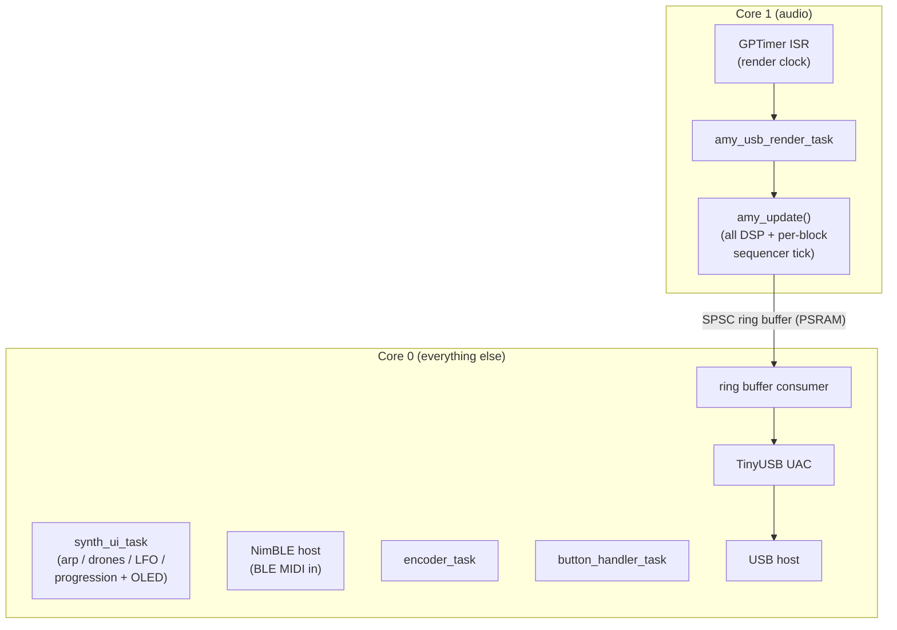
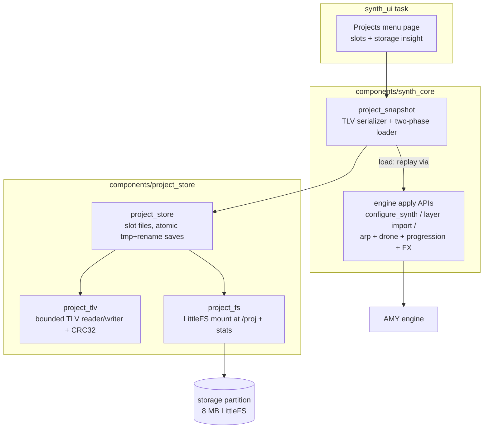
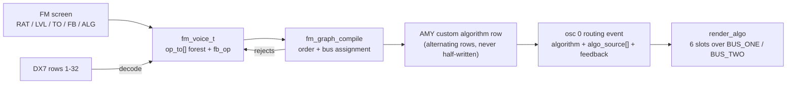

# S3-Amysynth

A pocket-sized groovebox built on the ESP32-S3. Drums, melodic step
sequences, an arpeggiator and two tempo-locked drones all play at once,
synthesized on the chip in real time by the
[AMY](https://github.com/shorepine/amy) engine (which this project feeds
back into: [upstream contributions](https://rt-rtos.github.io/#oss)). The
mix arrives in your DAW as a plain USB audio device, or leaves the on-board
I2S DAC - the two paths differ only in what consumes the output buffer.
Play it live over **BLE MIDI** from a DAW, phone or controller, and save the
whole session - patterns, voices, effects, progression - to one of 32
project slots on flash.

The entire control surface is one rotary encoder, six buttons (four plus a
SHIFT chord layer and a shoulder button) and a 128x64 OLED, and everything
is edited live: patterns, patches, envelopes, filters, LFOs and FM operator
graphs change while the music keeps running.

Nothing is precomputed and nothing streams down from the host. Every voice
is rendered on-device, one 256-sample block every 5.3 ms, on a core that
dense polyphony can push to nearly full load - which is what makes the
firmware side of this project interesting.

> USB audio is the active output today: most S3 dev boards have a second
> USB port, so audio and the serial diagnostics run side by side during
> development. The I2S DAC is wired and is the intended standalone output.

## Prototype Video

<video src="https://rt-rtos.github.io/assets/amybox.mp4" poster="assets/1.jpg" controls loop playsinline width="640"></video>

https://github.com/user-attachments/assets/620f663a-9390-42c4-92a9-24b24c08af9b

> Video not playing? [Watch the prototype demo](https://rt-rtos.github.io/assets/amybox.mp4)

## What it does

At boot you get a playing groove: a four-track drum layer playing the
built-in TR-808 PCM bank (seeded with a four-on-the-floor pattern) and a
melodic layer, running at 108 BPM. From there:

- **Step sequencer** - up to 4 layers of 4 tracks x 16 steps, edited live
  on the grid. Every step carries its own pitch offset (+-24 semitones),
  probability, 1-4 ratchet sub-hits, a fire-every-N-loops count and an
  only-after-previous condition (the two conditions combine), set from a
  per-step popup. Tracks have mute/solo and per-track repeat rates (fire
  every 1/2/4/8 bars).
- **Per-row voices** - every melodic row owns its own AMY synth slot, so
  stacked same-pitch notes on different rows don't collapse into one voice.
- **Arpeggiator** - a standalone instrument on its own screen: 8 note slots
  (with rests), UP/DOWN/SLOT-order directions, 1-4 octaves, nine
  tempo-locked rates including triplets, gate length, portamento glide, and
  its own scale/root quantizer (or the global one). See
  [ARP-ARCHITECTURE.md](components/synth_core/ARP-ARCHITECTURE.md).
- **Two drones** - a free-running drone (chord carrier plus mono sub, raw
  wave or any patch, with the full filter / LFO / distortion editor set) and
  a stutter drone: a chord carrier chopped by a tempo-locked square gate with
  swing, gate length and rhythmic step patterns, a slowly sweeping filter
  with per-gate "blip" zaps, and a sub up to three octaves below. See
  [DRONE.md](components/synth_core/custompatches/DRONE.md).
- **BLE MIDI live play** - the device advertises as a BLE-MIDI peripheral
  (`Amysynth`); note on/off from any BLE-MIDI host (DAW, phone app, hardware
  controller) plays a dedicated live voice with its own patch, glide and
  voice editors.
- **Chord progression and chord presets** - up to 8 chords (root, type,
  duration in bars) that auto-advance with playback, re-voicing any layer
  with chord mode on and re-rooting the arpeggiator's quantizer as they go;
  plus an 8-slot chord preset bank with live audition. Fourteen chord types.
- **Voice editors** - graphical on-OLED editors for ADSR envelopes (two per
  voice, each with a choice of four curve types), a biquad filter (LPF24 /
  LPF / phaser / notch / HPF / BPF) whose response plot follows the
  *actual* modulated cutoff live while envelopes and LFOs move it, an LFO
  with filter/amp/pitch/pan/wavetable-scan and distortion targets plus a
  second-order "wobble" modulator, and a per-voice distortion stage (clip,
  fold and bitcrush in any combination) - bound to whichever instrument
  opened them. See
  [Voice editors](#voice-editors).
- **FM operator editor** - a DX7-chart editor for a live 6-operator FM
  voice: custom operator topologies, per-operator envelopes, ratio, level
  and feedback, with the 32 DX7 algorithms as starting points. See
  [FM operator editor](#fm-operator-editor).
- **Patches** - AMY's Juno (128) and DX7 (128) banks, piano, seven raw
  oscillator waves (including noise and Karplus-Strong), three designed
  bass presets, five wavetable banks, four fixed FM presets plus the custom
  FM voice, and additive organ/bell voices.
- **Drum banks** - the built-in TR-808 bank, plus the Gamma9001 banks (909,
  Linn, MR12, SynFX, Power, Perc, Misc: 136 samples streamed from the
  `drums` flash partition) selectable per layer from the menu, with
  per-track preset cycling across all of them. A bank switch is a full kit
  change - samples, pitches and the per-track envelope and filter defaults.
  A DX7/Juno synth drum engine is available as a build option.
- **Resampler** - arm the menu's Sample item and the firmware records 1.5 s
  of its own final mix into a PCM preset, playable from any drum track(due to PCM playback limitations, playback will end up somewhere else when finalized).
- **Global FX page** - three-band EQ plus echo, chorus and reverb with
  extended parameters (feedback, time, tone, rate, depth, damping,
  crossover), a bus distortion stage, and per-layer note FX (gate, glide,
  groove).
- **Scale quantizer** - snaps melodic input to one of twelve scales, from
  the church modes to harmonic minor and whole tone; the arp can carry its
  own independent quantizer.
- **Projects** - full session snapshots in 32 named slots on an 8 MB
  LittleFS partition, with atomic saves and a two-phase loader that refuses
  a corrupt file without touching the running session.

Audio leaves the device over **USB Audio Class 2.0** (48 kHz stereo,
16-bit) via TinyUSB - the device enumerates as a USB microphone, so any DAW
or recorder can capture it without drivers.

## Hardware

- **MCU:** ESP32-S3-N16R8 (dual-core Xtensa LX7, 16 MB flash, 8 MB PSRAM)
- **DAC:** PCM5102 (I2S) - wired on the board as the intended standalone
  output path; not yet driven by the firmware (USB is the active egress)
- **Display:** SSD1306 128x64 OLED (I2C, U8g2). Optional: the firmware boots
  and plays headless without it and re-probes the bus every 5 s, so a panel
  can be plugged in later
- **Input:** rotary encoder with push, six buttons (`MY_BUTTON_0`-`3`,
  `MY_BUTTON_SHOULDER`, `MY_BUTTON_SHIFT`)
- **Status LED:** onboard addressable RGB LED (WS2812, GPIO48) - render-load
  indicator
- **Radio:** the S3's BLE controller with the NimBLE host, for BLE MIDI in
  (build option)
- **Audio out (active):** USB Audio Class 2.0 to host

## Software

- **SDK:** ESP-IDF 6.0.2; IDF FreeRTOS on both cores with every task pinned
  to a core
- **Synthesis:** AMY engine, vendored - 21 documented local edits in
  [AMY-EDITS.md](AMY-EDITS.md), several of them upstreamed
- **USB:** TinyUSB 0.19 with Espressif's `usb_device_uac` 1.3.1, vendored
  and patched ([UAC-EDITS.md](UAC-EDITS.md))
- **BLE MIDI:** NimBLE (`CONFIG_SYNTH_WIRELESS`)
- **Storage:** LittleFS (`joltwallet/littlefs`) for projects; a raw flash
  partition for the drum samples
- **Graphics:** U8g2
- Application code in C, organized as ESP-IDF components

## Architecture notes

The audio DSP and everything else run on separate cores, connected only by a
ring buffer:



A few design decisions worth calling out:

- **Manual render loop.** AMY runs in `AMY_AUDIO_IS_NONE` mode; the project owns
  the render task, which calls `amy_update()` and pushes blocks to the USB ring
  buffer. This avoids AMY spawning its own audio tasks (which deadlocks in this
  configuration).
- **Core split.** The audio DSP task is pinned to core 1; USB, UI, and input
  live on core 0, so heavy synthesis doesn't starve the USB/timer path. The
  sequencer tick runs once per rendered block on the audio core, slaved to the
  sample clock, so tempo cannot drift against the audio.
- **Per-row / per-instrument synths.** Each drum track, each melodic row, the
  arp, and the drones own their own AMY synth slots. Fixed consumers pack the
  bottom of the slot space (arp 1, stutter drone 2-3, free-running drone 4-5,
  drums 6-9, live play 10) and the melodic rows are an open-ended arena on top
  (11 up to `max_synths - 1`); the whole map lives in one header,
  `synth_slots.h`, and growing melodic polyphony is a single-constant change.
  Because AMY routes note-on
  by `(synth, pitch)`, a shared synth would collapse two same-pitch notes into
  one voice; separate slots keep them independent.
- **Tempo-locked from the audio clock.** The arp schedule and the drone's stutter
  LFO + filter sweep derive their timing from AMY's sequencer tick counter (the
  same clock the grid rides). The AMY music clock is the master clock for all
  audio-path logic, so everything stays beat-locked across tempo changes.
- **Deferred envelope authority.** A patch's own envelope plays by default; a
  custom envelope only overrides it once committed in the ADSR editor, so
  changing presets doesn't permanently shadow it. The same authored/unauthored
  rule applies to the filter, LFO and distortion settings.
- **A shared voice-parameter layer.** The melodic rows, the arp, both drones
  and the BLE live voice all embed one `voice_params_t` block (EG0/EG1
  envelopes, filter, LFO, distortion, amp trim) and share the code that
  builds 2-osc WAVE voices and wires the native AMY LFO - so a fix or feature
  in one instrument's voice model lands in every instrument.

### Project storage

Full session snapshots (patterns, per-row voice params, arp, both drones,
chord progression, FX, tempo) can be saved to 32 named slots on an 8 MB LittleFS
`storage` partition occupying the flash above the app and the 4 MB `drums`
sample partition, managed from a Projects menu page that also reports
per-project size and free space:



Design points: the file format is our own parameter model written field by
field into versioned TLV sections (never AMY patch strings or raw struct
dumps), so saves survive both struct growth and AMY updates; AMY state is
regenerated on load by replaying the same apply paths a live edit uses. Loads
are two-phase - everything is parsed, bounds-checked, and staged before any
live state is touched, so a corrupt file is refused with the session intact.
Saves write a temp file and rename it (atomic on LittleFS), so power loss
never corrupts an existing project. Menu clicks only queue the request: the
load/save itself executes on the `synth_ui` task, the one task allowed to
rebuild sequencer layer topology (single-applier contract), keeping flash
I/O off the input path. `components/project_store` is
synth-agnostic (files, TLV container, mount); the serializer that knows the
instrument model lives in `synth_core/project/`. The user-facing side is the
Projects page described under [Usage Guide](#projects-menu--projects).

The `drums` partition feeds AMY's Gamma9001 drum banks: 136 PCM samples
(TR-909, Linn 9000, MR-12, synthetic and acoustic percussion) as presets
256-391, on top of the 19-sample TR-808 bank baked into the app. The blob
is raw int16 PCM generated from the AMY sample library (`amy.headers.generate_gamma9001_headers()` upstream) and
is mmapped read-only at boot; if the partition is absent or blank the boot
log says so and those presets simply stay disabled.

## Optimization & performance

Two separate problems, one per core. Core 1 renders: an idle patch costs a
few percent of the 5333 µs block budget, but polyphony scales it linearly, and
dense layers with long-tail patches and the full effect chain can push the
render core to nearly 100 % load. That saturation has to degrade gracefully:
an over-budget block is counted, never caught up (strict one block per tick,
so the sample clock cannot drift), and the USB ring's headroom absorbs the
lateness before the host notices. The same holds for memory: voice churn under
polyphony grows AMY's per-osc arena and event pool, and on a part with ~100 KB
of internal RAM free that used to be a hard crash - the engine now survives
allocation failure on every voice and event path, logs it once and counts the
rest, and places the arena under its own memory caps, all contributed upstream
to AMY (#961, #993, #744, #1106, #1107). The measurement work below (block-time
histograms, worst-block snapshots, per-stage profiling) exists to know exactly
where each cycle goes.

Core 0 owns everything else, and there the goal is stable output rather than
throughput: close to every click, crackle and pop that reached the USB stream
has been traced to its source and removed - RTOS scheduling jitter, kernel
critical sections on periodic grids, TinyUSB endpoint handling, and bugs in the
Espressif UAC driver (fixes submitted upstream). The result is audio that stays
clean at full load.

**Render pacing - hardware clock, not tick delays.** The render task is paced by a
GPTimer firing one alarm per audio block (5333 µs at 48 kHz / 256), whose ISR (in
IRAM, registered on core 1) wakes the task via a direct task notification. The loop
is strict 1:1 (exactly one block rendered per wake, never a catch-up backlog), so
AMY's sample clock stays locked to real time and the sequencer tempo cannot drift.
See `main/render_clock.{c,h}`. An alternative pacing backend
(`CONFIG_RENDER_CLOCK_I2S_ENABLE`, default off) derives the block cadence from a
pin-less I2S channel's DMA backpressure instead of the GPTimer ISR.

**Core affinity.** AMY is built with multicore/multithread disabled (required to
avoid a FABT deadlock), so all DSP runs synchronously inside the render task. That
task is pinned to **core 1**, and the sequencer tick runs inside it, once per
block; USB (TinyUSB UAC), UI, input and the BLE host are pinned to **core 0**.
Heavy synthesis and the USB/timer path no longer compete for the same core.

**Hot DSP in IRAM.** AMY's per-block hot kernels - `amy_render`, the biquad,
phaser, EQ and distortion filter stages, the LUT oscillator renderers, the
envelope and partial interpolators and the log2/exp2 tables, about thirty
functions - are annotated `AMY_IRAM_ATTR` so they execute from internal
instruction RAM instead of
flash/PSRAM-cached XIP, removing cache-miss stalls from the audio inner loop. The
per-function attribute is used (rather than `.lf` "noflash" linker fragments) because
it is honoured under GCC LTO, which renames `.text.*` sections. LTO is on across
`main`, `synth_core`, `display`, `u8g2`, and `amy` for cross-module inlining of the
DSP loop.

**Memory placement.** Internal DRAM is the scarce resource on this part
(flash `.text`/`.rodata` is already served via the PSRAM XIP cache), so allocations
are placed by access pattern. The 64 KB USB ring buffer lives in PSRAM - it is touched
only at block/frame granularity, so the latency is irrelevant there - while the
per-output-sample clipping lookup table sits in internal DRAM where it is hot. The
build uses 32 KB I-cache and QIO flash.

**Lock-free USB audio path.** The render task (producer, core 1) and the USB mic
task (consumer, core 0) share the ring buffer through a **single-producer/single-consumer
lock-free ring**: atomic writer-owned and reader-owned indices with release/acquire
ordering and no mutex, so the high-priority render task never blocks on a lock held by
the lower-priority consumer. Writes are all-or-nothing (a full buffer drops a whole
block cleanly rather than splicing a half-block), and the real-time path drops instead
of stalling, with a `usb_drops` diagnostic counter. See
`components/usb_audio/usb_audio.c`.

**O(active events) sequencer tick.** The sequencer tick runs once per rendered
block on the audio core, gated by the sample clock. Scheduled events sit in a
linked index of occupied slots (AMY 1.2.121), so each tick scans only what is
actually scheduled rather than the full tag space. Arp re-emits are coalesced to
at most one per UI frame instead of one per parameter change.

**One display flush per frame.** All screen renderers are fill-only; the UI task
composites the bottom hint strip and issues a single `u8g2_SendBuffer` per redraw
(the blocking ~20 ms I2C transfer), and only when a view signature actually changed.

**Branch hinting.** The render loop and USB write path mark their rare/diagnostic
branches `unlikely()` (overrun count, USB-full drop, underrun) so the compiler lays
out the steady-state success path straight-line.

Profiling and instrumentation are covered in [Diagnostics](#diagnostics) below.

The component layout:

| Component | Role |
| --- | --- |
| `main/` | app entry, task creation, AMY + USB init, render clock, input routing |
| `components/synth_core/` | sequencer core, screens/UI, quantizer, arp, drone, FM voice, sampler, FX cache |
| `components/display/` | display HAL + screen renderers + reusable graph-popup widget |
| `components/usb_audio/` | USB audio ring buffer / UAC glue |
| `components/usb_device_uac/` | vendored Espressif UAC driver with local patches (see [UAC-EDITS.md](UAC-EDITS.md)) |
| `components/wireless/` | NimBLE BLE-MIDI peripheral + MIDI parser feeding the live voice |
| `components/harness/` | opt-in serial test harness (`CONFIG_DEV_SERIAL_HARNESS`) for scripted on-device testing |
| `components/rotary_encoder/`, `components/my_buttons/` | input drivers |
| `components/seq_clamp/` | header-only clamping helpers shared across the UI/engine code |
| `components/project_store/` | project persistence: LittleFS mount, TLV container, slot files with atomic saves |
| `components/status_led/` | onboard RGB LED driven as a render-load indicator |
| `components/diagnostics/` | opt-in profiling hooks + the core-load sampler shared with the status LED |
| `components/amy/` | vendored AMY engine (see [AMY-EDITS.md](AMY-EDITS.md) for local patches) |
| `components/u8g2/` | vendored U8g2 graphics library |

## Diagnostics

All diagnostics print over the normal serial log (`idf.py monitor`) at the default
115200 baud. There is one always-on line plus opt-in hooks gated behind Kconfig
so release builds carry no overhead. Beyond the four described below:
`CONFIG_AMYSYNTH_RENDER_STATS` (per-block render time: min / mean / p99 / max, a
16-bucket histogram and a worst-block snapshot), `CONFIG_AMY_PROFILE_MODE`
(AMY's own per-stage profiling, COARSE or FULL), `CONFIG_AMYSYNTH_DROPOUT_TS`
(a timestamp ring for dropout events), `CONFIG_DEV_SERIAL_HARNESS` (a line-command
harness on the console UART - `sys.build`, `st.heap`, `st.drop`, `in.btn`,
`tr.bpm` and friends - so a script or an agent can drive the device headless),
and the on-device DEV screen (`CONFIG_SYNTH_DEV_MENU`).

### Always on - render heartbeat

The `app_main` idle loop prints one line every 5 s with no build flags required:

```
Main loop idle... seq_tick=N tick_hook_calls=N render_blocks=N render_overruns=N usb_drops=N render_sysclock_ms=N
```

- **`render_blocks` vs `render_sysclock_ms`** - the realtime sanity check. `render_blocks`
  counts blocks rendered; `render_sysclock_ms` is AMY's own sample clock in ms. Over any
  interval `render_blocks × (256 / 48000)` should equal the `render_sysclock_ms` delta. If
  blocks fall behind wall time, render is not keeping up.
- **`render_overruns`** - number of GPTimer ticks that fired while the previous block was
  still rendering (i.e. a block took longer than its 5333 µs budget). A climbing value means
  the per-block DSP cost is at the edge; it is diagnostic only (the strict 1:1 loop never
  renders a backlog, so tempo can't drift).
- **`usb_drops`** - whole blocks dropped because the USB ring buffer was full (host not
  draining). Occasional drops under host stalls are expected on the real-time path; a steadily
  climbing count means the consumer can't keep up.
- **`seq_tick` / `tick_hook_calls`** - the sequencer's tick counter and how many times the
  tick hook has fired, for confirming the musical clock is advancing.

These are **free-running totals, not rates** - read the *delta between two lines*, not the
absolute value.

### Always on - status LED

The board's onboard RGB LED (`CONFIG_AMYSYNTH_STATUS_LED`, default on) reports
core 1's busy share as a color band: green below 50 %, yellow from 50 %, orange
from 75 %, red from 90 %, with hysteresis so the color holds steady when the
load sits on a boundary. A failed heap allocation interrupts the load color
with a short magenta blink burst.

The number behind the color comes from idle-hook counters in
`components/diagnostics/core_load.c`, sampled once per second by a low-priority
core-0 task - no task-table walks, no critical sections, and the render path
itself carries no instrumentation, so watching the load cannot perturb it. The
displayed value is a mean over the sample window; short spikes average out. See
[components/status_led/README.md](components/status_led/README.md).

### `CONFIG_USB_AUDIO_DIAGNOSTICS` - ring-buffer detail

Adds an `audio diag:` line to the same idle loop:

```
audio diag: init=1 fill=U peak_fill=U writes=N drops=N underruns=N peak_abs=N
```

- **`fill`** is the *instantaneous* sample count in the ring at the moment of the dump (a
  spot reading, not an average); **`peak_fill`** is the high-water mark since boot.
- **`underruns`** counts UAC reads that found less than a full frame (consumer starved);
  **`drops`** counts producer-side full-buffer drops. Healthy steady state: both deltas ~0
  with `fill` sitting comfortably between empty and the 32768-sample capacity.
- **`peak_abs`** is the largest absolute sample written - useful for spotting clipping
  headroom. The counters are written by single-owner tasks and read lock-free, so a snapshot
  can be off by one update; treat them as advisory.

### `CONFIG_AMYSYNTH_RTOS_STATS` - task & core profiling

Enables a periodic dump (interval `CONFIG_AMYSYNTH_RTOS_STATS_PERIOD_MS`, default 5000):
a per-task table (core, priority, stack high-water mark, cumulative CPU%), a per-core
busy/idle %, and a heap snapshot (internal vs PSRAM free + largest block).

Peculiarities when reading it:

- **Per-task `cpu%` is cumulative since boot**, computed from each task's lifetime run-time
  counter over the total. It is *not* the load over the last interval - a task that was busy
  early then idled still shows a high number. For "what's hot right now," use the **per-core
  busy%**, which *is* interval-based (it diffs the IDLE-task counters against `esp_timer` wall
  time between dumps). The first dump only prints "baseline captured" since it has no prior
  sample to diff.
- **`core` for unpinned tasks** shows as a large number (`tskNO_AFFINITY`), not 0/1.
- **`stack_hwm`** is the minimum free stack words ever seen for that task - a small value
  (approaching 0) means that task is close to overflowing.
- Relies on `FREERTOS_USE_TRACE_FACILITY`, `GENERATE_RUN_TIME_STATS`,
  `VTASKLIST_INCLUDE_COREID`, and `RUN_TIME_STATS_USING_ESP_TIMER` (all set in `sdkconfig`),
  which is why the counters are in microseconds on the `esp_timer` base.

### `CONFIG_AMYSYNTH_HEAP_CHECK` - heap-corruption bisection

Compiles in the `DIAG_HEAP_CHECK()` checkpoints (`components/diagnostics/include/diag_heap.h`)
that run `heap_caps_check_integrity_all()` at key init steps and log `HEAP OK` / `HEAP CORRUPT`
with a label under the `heapchk` tag, to pin corruption to its source. Disabled, every
checkpoint compiles to nothing.

> **Watchdog caveat:** with `CONFIG_HEAP_POISONING_COMPREHENSIVE` the integrity scan is very
> slow; running many checkpoints back-to-back inside `app_main` can starve the idle task and
> trip the task watchdog. Use only while actively chasing a corruption bug.

### Performance implications of leaving diagnostics on

- **Always-on heartbeat:** negligible. A handful of counter reads plus one log line every 5 s.
- **Status LED:** negligible - one core-0 task wake per 100 ms, two counter
  increments per idle-hook call, and an LED write only when the color band changes.
  It pulls in no FreeRTOS stats facility.
- **`USB_AUDIO_DIAGNOSTICS`:** low but non-zero. The producer/consumer track a few extra
  counters and a peak-sample scan on the audio path; fine for tuning, but it is gated off by
  default so the steady-state hot loop carries nothing in release builds.
- **`AMYSYNTH_RTOS_STATS`:** the dump itself `malloc`s a `TaskStatus_t[]` and walks every task,
  which is a brief spike on the **core 0** idle loop (where it runs), not on the core 1 audio
  path - so it does not directly cost render budget, but a short period (e.g. 1000 ms) adds
  steady core-0 churn. More importantly, the underlying run-time-stats facility imposes a small
  always-on scheduler cost whenever it is compiled in. Leave it **off for release**; turn it on
  to profile.
- **`AMYSYNTH_HEAP_CHECK`:** potentially large and bursty (see the watchdog caveat). Debug only.

General rule: the default (release) configuration has every opt-in hook disabled and only the
cheap heartbeat and the status LED active, so shipping firmware pays effectively nothing.

## Usage Guide

### Controls

Buttons are named by their firmware enum (`my_button_id_t`): `MY_BUTTON_0`
to `MY_BUTTON_3`, the encoder push `MY_BUTTON_ENC`, `MY_BUTTON_SHOULDER` and
the hold-modifier `MY_BUTTON_SHIFT`. Pin assignments are in
`components/my_buttons/include/my_buttons.h`.

| Control | Description |
|---|---|
| **Encoder (rotate)** | Navigate / select; adjusts the value when a field is in edit mode |
| `MY_BUTTON_ENC` (short) | Confirm / toggle step; enters edit mode on the focused field |
| `MY_BUTTON_SHOULDER` | Per screen: toggle the step under the cursor (grid), flip EG1 sweep polarity (envelope editor), switch target tab (LFO editor), toggle feedback on the selected operator (FM screen) |
| `MY_BUTTON_SHIFT` + `MY_BUTTON_1` | Open the voice editors (ADSR first) for the active instrument |
| `MY_BUTTON_SHIFT` + `MY_BUTTON_2` | Open / close the per-step popup (sequencer screen) |
| `MY_BUTTON_SHIFT` + `MY_BUTTON_3` | In the envelope / LFO / distortion editors: toggle apply scope (this track vs. the whole layer) |
| `MY_BUTTON_0` (short) | Cycle active layer (sequencer screen); inside an editor: **commit** and close |
| `MY_BUTTON_0` (long) | Toggle global playback; inside an editor: **cancel** and close |
| `MY_BUTTON_1` (hold + encoder) | Cycle patch for the selected track / instrument |
| `MY_BUTTON_2` (hold + encoder) | Transpose the selected track's base note by semitones |
| `MY_BUTTON_3` (short) | Open / close the main menu; inside an editor: next page |

A one-line **hint strip** along the bottom of the screen shows what the
buttons do in the current context.

---

### Screens and navigation

All screen changes go through the **menu overlay** (`MY_BUTTON_3`): the
encoder scrolls items, the encoder click activates them. While any editor
is open, `MY_BUTTON_3` cycles editor pages instead of toggling the menu.

| Menu action | Destination |
|---|---|
| Screen: Seq | Step sequencer grid (default at boot) |
| Screen: Arp | Arpeggiator |
| Screen: Drone | Free-running drone (the stutter drone is a dive row inside it) |
| Screen: Prog | Chord progression editor |
| Screen: TrackOpts | Per-track options (repeat rate, mute/solo, chord mode) |
| Screen: FM | 6-op FM operator editor for patch 276 (with `CONFIG_SYNTH_CUSTOM_FM`) - see [FM operator editor](#fm-operator-editor) |
| Chords / FX / Projects / Wireless | Dive pages inside the menu (see below) |
| DEV | Developer screen (with `CONFIG_SYNTH_DEV_MENU`, default on): heap, per-core load, OOM count, status/drop bars |

**Overlay precedence (highest first):** Filter editor > LFO editor >
Distortion editor > per-step popup > ADSR graph > Menu > the mode screens
(Seq / Arp / Drone / Prog / TrackOpts / FM / DEV).

---

### Sequencer

The device boots to the sequencer with one drum layer (seeded with a
four-on-the-floor groove) and one melodic layer already running at 108 BPM.

**Controls:**

| Input | Action |
|---|---|
| Encoder | Move step cursor (wraps track to track) |
| `MY_BUTTON_ENC` (short) | Toggle step at cursor |
| `MY_BUTTON_SHOULDER` | Toggle step at cursor (two-handed entry: one hand on the encoder, one on the button) |
| `MY_BUTTON_SHIFT` + `MY_BUTTON_1` | Open the voice editors (bound to the selected track) |
| `MY_BUTTON_SHIFT` + `MY_BUTTON_2` | Open the per-step popup for the step under the cursor |
| `MY_BUTTON_SHIFT` + encoder | On an FM row: step the FM algorithm (banner `ALGO n` / `ALGO CUST`) |
| `MY_BUTTON_0` (short) | Cycle active layer - resets cursor to track 0 step 0 |
| `MY_BUTTON_0` (long) | Toggle play / stop |
| `MY_BUTTON_1` (hold + encoder) | Cycle patch for the selected track |
| `MY_BUTTON_2` (hold + encoder) | Transpose selected track's pitch (semitones, MIDI 0-127) |
| `MY_BUTTON_3` (short) | Open menu |

**Layers:**

- Up to 4 layers; layer 0 is always the drum layer (cannot be deleted).
- Add / remove melodic layers via menu items **Add Layer** / **Del Layer**.
- Each layer is 4 tracks x 16 steps. (The engine and the project format
  carry up to 32 steps per layer, and a 16-step and a 32-step layer stay
  in phase; the UI does not create 32-step layers yet.)
- Melodic layers share one patch across all 4 tracks; drum tracks each carry their own patch.

**Per-step popup** (`MY_BUTTON_SHIFT` + `MY_BUTTON_2` on a step):

| Field | Range |
|---|---|
| Pitch | -24 to +24 semitones on top of the track's base note |
| Prob | 0-100 % (5 % steps) |
| Ratchet | 1-4 sub-hits within the step |
| Every | 1-4: fire only every Nth loop (1 = every loop) |
| Prev | ON / OFF: fire only if the previous step fired |

Every and Prev are independent conditions and both must hold. The encoder
click cycles the fields and toggles adjust mode (Prev toggles directly);
`MY_BUTTON_SHIFT` + `MY_BUTTON_2` again, or `MY_BUTTON_0`, closes it.

**Track options (menu → Screen: TrackOpts):**

Rows: layer selector, track selector, **Repeat Rate** (track fires every
1/2/4/8 bars), **Mute**, **Solo** (solo overrides mute; a **CLR** row appears
in the title bar while anything is soloed and clears all solos), and for
melodic layers **Chord Mode / Root / Type** (read-only while the global
progression is enabled).

**Patch selection:**

`MY_BUTTON_1` hold + encoder cycles a curated catalog of 30 patches by
default: four DX7 voices (E.Piano 1, Piano 1, Syn-Lead 1, Flute 1), two
Junos (A18 Piano, B61 E.Piano with tremolo), the built-in piano, the seven
raw waves, the three bass presets, the five wavetables, the five FM voices
and the three additive voices (entries for build options that are off are
skipped). Set `CONFIG_SEQ_PATCH_BROWSE_FULL_RANGE=y` to walk the full
numeric range instead:

| Range | Patches |
|---|---|
| 0-127 | Juno-106 bank |
| 128-255 | DX7 bank |
| 256 | Built-in piano |
| 257-263 | Raw waves: sine, saw down, saw up, pulse, triangle, noise, Karplus-Strong |
| 264-266 | Bass presets: sub-heavy detune, sine-reinforced acid/pluck, DX7-style |
| 267-271 | Wavetable banks (with `CONFIG_AMY_WAVETABLE`, default on) |
| 272-276 | FM Bass, FM E.Piano, FM Bell, FM Lead, FM Custom (with `CONFIG_SYNTH_CUSTOM_FM`) |
| 277-279 | Add Organ (8 harmonics), Add Bell (6 inharmonic partials), Add Custom (with `CONFIG_SYNTH_ADDITIVE`) |

Add Custom currently plays the organ default; it has no editor screen yet.

**Scale quantizer:**

Enabled via menu item **Quant**. Changing **Scale** or **Root** re-snaps all
active melodic steps immediately - there is no undo. **ArpQ** chooses
whether the arp follows the global scale (GLOB) or plays its slots unsnapped
(OWN, chromatic by default).

---

### Menu - runtime parameters

| Item | Range |
|---|---|
| DEV | Developer screen (with `CONFIG_SYNTH_DEV_MENU`) |
| Screen: Seq / Arp / Drone / Prog / TrackOpts / FM | Switch mode screen |
| BPM | 40-300 |
| Quant | ON / OFF |
| Scale | Chromatic, Major (Ionian), Natural Minor, Dorian, Phrygian, Lydian, Mixolydian, Minor Pentatonic, Major Pentatonic, Harmonic Minor, Locrian, Whole Tone |
| Root | C ... B |
| ArpQ | GLOB (follow the global quantizer) / OWN (the arp's own scale, chromatic by default = no snapping) |
| Arp | ON / OFF |
| Drone | ON / OFF - the free-running drone |
| Stutter | ON / OFF - the stutter drone |
| Drum Bank | 808 (built-in, default) / 909 / Linn / MR12 / SynFX / Power / Perc / Misc - the Gamma9001 banks are listed while the `drums` partition is mounted; Synth (DX7/Juno patches) appears first when built with `CONFIG_SYNTH_DRUM_SYNTH_MODE` |
| Add Layer / Del Layer | add or remove a melodic layer |
| Chords | opens the chord preset bank (see below) |
| FX | opens the effects page (see below) |
| Projects | opens the project slots (see below) |
| Wireless | opens the BLE MIDI page (with `CONFIG_SYNTH_WIRELESS`) |
| Volume | 0-200 % (unity = 100 %) |
| Sample / Sample Cancel | arm / cancel the resampler (see below) |

---

### Effects page (menu → FX)

All effects are global - they apply to the entire mix. Levels step in 5 %
increments; extended parameters keep AMY's factory defaults until first
edited.

| Item | Range |
|---|---|
| EQ Low / Mid / High | -15 to +15 dB (1 dB steps) |
| Echo | 0-100 % level, plus Fbk 0-99 %, Time 0-743 ms, Tone -99 to +99 |
| Chorus | 0-100 % level, plus Rate 0.05-10 Hz, Depth 0-100 % |
| Reverb | 0-100 % level, plus Live 0-100 %, Damp 0-100 %, Xover 500-8000 Hz |
| Dist | stage set: OFF / CLIP / FOLD / C+F / CRSH / C+H / F+H / ALL (clip, fold, bitcrush and their combinations) |
| Dst Drive / Bits / Rate / Mix | pre-gain 1-16, bit depth 1-24, sample-rate divisor 1-64, wet/dry 0-100 % |
| NoteFX | opens the per-layer note FX page |
| Preset FX | ON / OFF - see [Quirks](#non-obvious-quirks) |

**NoteFX** (per melodic layer, the active one): **Gate** 10-100 % of the
step (100 = legato), **Glide** in ms (AMY-native portamento between
consecutive notes), **Groove** 0-100 % accent / humanize amount.

---

### Chord presets (menu → Chords)

An 8-slot bank of authored chords (root + type), separate from the Prog
screen's progression list. Clicking a slot loads it into an edit view with
**Root**, **Type** and **Clear** rows and auditions it live; changes commit
immediately and re-voice every melodic track that references that slot.

---

### Projects (menu → Projects)

One row per slot (32 by default, `CONFIG_SYNTH_PROJECT_MAX_SLOTS`) under a
storage-usage line. Clicking a slot cycles its action: **Load**, **Save**
(armed on the first click, executed on the second, so a stray click never
overwrites), **Ren** (inline character editor: A-Z, 0-9, space, `-`;
`MY_BUTTON_1` saves the name, `MY_BUTTON_2` discards), **Del**, **Exit**.
Results are written into the row itself. Load and save run on the UI task,
never on the input path; a second click while one is in flight is ignored.
The snapshot covers patterns, per-row voice parameters, arp, both drones,
the chord progression, FX and tempo - see
[Project storage](#project-storage).

---

### Wireless - BLE MIDI in (menu → Wireless)

With `CONFIG_SYNTH_WIRELESS` the device runs a NimBLE peripheral exposing the
standard BLE-MIDI service under the name **Amysynth**, so any BLE-MIDI host
(a DAW's Bluetooth MIDI, a phone app, a hardware controller) can pair and
play it. Incoming note on/off (with velocity) drive a dedicated **live
voice** on its own synth slot, independent of the sequencer rows; CC,
pitch bend and aftertouch are parsed but not yet routed.

| Row | Meaning |
|---|---|
| BLE MIDI | ON / OFF - starts or stops the radio on demand (the BLE stack is only allocated while on; `NO RAM` if it cannot be) |
| Status | connected / advertising / off |
| Source | WAVE (raw waves, bass presets, wavetables) or PATCH (any catalog patch) |
| Patch | the live voice's patch |
| Glide | OFF or 1-100 ms portamento |

While the page is open, `MY_BUTTON_SHIFT` + `MY_BUTTON_1` opens the voice
editors bound to the live voice, so its envelopes, filter, LFO and
distortion are edited the same way as any track's.

---

### Resampler (menu → Sample)

Select a drum track on the grid, then activate **Sample** in the menu: the
state machine steps IDLE → ARMED → RECORDING → READY. While recording, the
firmware captures **1.5 s of its own final mix** (everything currently
playing, folded to mono) into a PCM preset, which is then assigned to the
selected drum track - instant resampling for building evolving loops.
**Sample Cancel** aborts at any stage. There is one recording slot: a new
capture replaces the previous one on every track that used it, and it lives
in RAM only (it does not survive a power cycle).

---

### Arpeggiator

The arp runs on its own dedicated synth slot, independent of the sequencer's
layers. It schedules repeating AMY events that are always in sync with the
sequencer's BPM and quantizes to its own scale / root (or the global one,
per the menu's **ArpQ** row).

**Controls on the ARP screen:**

| Input | Action |
|---|---|
| Encoder | Navigate fields and note slots; adjust when editing |
| `MY_BUTTON_ENC` (short) | Enter / exit edit mode on the focused field |
| `MY_BUTTON_SHIFT` + `MY_BUTTON_1` | Open the voice editors (bound to the arp) |
| `MY_BUTTON_1` (hold + encoder) | Cycle the arp's own patch |
| `MY_BUTTON_3` | Menu |
| `MY_BUTTON_0` (long) | Play / stop |

**Fields (cursor order):** Enable → Mode (UP / DOWN / SLOT) → Oct (1-4) →
Rate (1/1 · 1/4 · 1/8 · 1/16 · 1/32 plus triplet variants 1/4T · 1/8T ·
1/16T · 1/32T, all tempo-locked) → Gate % (10-100 %) → Porta (0-100 ms
glide) → Note slots 0-7.

Note slots store raw chromatic MIDI pitches; turning below the range clears
the slot. In **SLOT** direction the pattern plays the slots in their written
order, and an empty slot can be turned down once more into a **REST**, which
holds silence for its step (UP/DOWN skip rests entirely). All quantization to
the arp's scale/root happens at playback, so editing a slot never
permanently absorbs a quantized pitch.

The arp is a normal patch voice like a sequencer row (any catalog patch,
`MY_BUTTON_1` hold to cycle); the filter and LFO editors apply on top of it.

**Quantization source (menu → ArpQ).** **GLOB** snaps the arp to the menu's
Quant / Scale / Root like the grid. **OWN** uses the arp's private scale,
which is Chromatic by default - so OWN is the "no snapping" setting: slots
play exactly the pitches you wrote, whatever the global quantizer does. The
private scale has no editor on the device (`CONFIG_SEQ_ARP_DEFAULT_SCALE`
sets it; a loaded project restores its own), and the chord progression
re-roots the arp while it is enabled in either mode, restoring the previous
scale/root when turned off.

Kconfig defaults at boot: disabled, chromatic, root E2, gate 75 %, 1 octave,
patch 138 (DX7 E.Piano 1). The arp produces no sound until enabled **and**
at least one slot is filled.

---

### Drones

Two independent drone instruments, each on its own pair of synth slots
(chord carrier + mono sub), each with its own ON/OFF row in the menu
(**Drone** and **Stutter**). Both are fully independent of the sequencer
grid and the chord progression; timing derives from the same AMY musical
clock. `Screen: Drone` opens the free-running drone; its **STUTTER** row
dives into the stutter drone's screen.

**Free-running drone** - a sustained chord, no gating. Rows:

| Row | Range / notes |
|---|---|
| STUTTER | dive into the stutter drone (also shows whether it is on) |
| DRONE | ON / OFF |
| SOURCE | WAVE (raw oscillator) or PATCH (any patch) |
| WAVE | SAW / SAWUP / PULSE / TRI / SINE (WAVE mode only) |
| ROOT | C1-C5 |
| CHORD | one of the fourteen chord types |
| LEVEL | 0.0-1.0 |
| SUB | ON / OFF - mono octave-down voice |
| SUB INT | 0 to -36 semitones below chord root |
| PATCH | patch number (PATCH mode only) |

Its envelope, filter, LFO and distortion are edited with the shared voice
editors (`MY_BUTTON_SHIFT` + `MY_BUTTON_1`); it is the drone with the full
editor set.

**Stutter drone** - a chord carrier chopped by a tempo-locked square gate.
Controls: encoder moves the row cursor and adjusts when editing,
`MY_BUTTON_ENC` toggles edit, `MY_BUTTON_1` hold + encoder cycles the patch
(PATCH mode), `MY_BUTTON_SHIFT` + `MY_BUTTON_1` opens its envelope and filter
editors.

| Parameter | Range / notes |
|---|---|
| SOURCE | WAVE (raw oscillator) or PATCH (AMY preset) |
| WAVE | SAW / SAWUP / PULSE / TRI / SINE (WAVE mode only) |
| ROOT | C1-C5 (chromatic; shifts the entire voicing) |
| CHORD | one of the fourteen chord types; carrier capped at 5 voices |
| RES | 0.1-3.0 filter resonance |
| PEAK | 0.0-1.0 - always-on carrier level (WAVE mode only; keep it above 0) |
| DUCK | 0.0-1.0 - stutter depth; 1.0 = full hard gate (WAVE mode only) |
| VISUALISE | ON / OFF - switch the screen to the drone visualizer |
| STUTTER rate | 1/4 · 1/8 · 1/16 · 1/32 · 1/1 · 1/4T · 1/8T · 1/16T · 1/32T, tempo-locked (WAVE mode only) |
| GATE | 0.05-0.95 - gate duty cycle (WAVE mode only) |
| SWING | 0-66 % |
| PATTERN | FULL (all 8), FOUR (4-on-the-floor), OFFBT (upbeats), GALOP (short-short-long), DUB (dub push); 8-step masks against stutter subdivisions |
| BLIP | 0.0-1.0 filter-zap intensity on gate edges |
| SWEEP LO / HI | 100-8000 Hz - filter cutoff sweep range |
| SWEEP SPD | 1-16 bars per sweep cycle |
| SUB | ON / OFF - mono octave-down voice |
| SUB INT | 0 to -36 semitones below chord root |
| PATCH | AMY preset number (PATCH mode only) |

In **PATCH mode**, the stutter LFO (PEAK / DUCK / STUTTER / GATE rows) is
inactive - the patch owns its own oscillators and amplitude. Filter sweep and
resonance still apply. The stutter drone's filter is a fixed LPF24 whose
cutoff is the sweep midpoint, so its filter editor shows only cutoff and
resonance, and it has no LFO or distortion page.

---

### Chord progression (Prog screen)

The Prog screen (menu → Screen: Prog) holds a list of up to 8 chord entries.
When the progression is enabled it auto-advances through them as the
sequencer plays, re-voicing any layers that have chord mode on and re-rooting
the **arpeggiator's** quantizer to match. The drones do not follow it - their
ROOT/CHORD rows stay fully manual.

Each entry has three fields, cycled by the encoder click while editing:

| Field | Options |
|---|---|
| Root | C, C#, D, D#, E, F, F#, G, G#, A, A#, B |
| Chord type | Maj, Min, Maj7, Min7, 7, Sus2, Sus4, Dim, Aug, Min9, Maj9, 6, Min6, 9 |
| Duration | 1, 2, 3, 4, 8, or 16 bars |

**Controls on the Prog screen:**

| Input | Action |
|---|---|
| Encoder | Scroll cursor (row 0 = enable toggle; rows 1-8 = entries); adjust when editing |
| `MY_BUTTON_ENC` (short) | Enter / exit edit; advance to next sub-field within an entry |
| `MY_BUTTON_1` | Delete the entry at the cursor |
| `MY_BUTTON_2` | Append a new entry (default: C Maj 1 bar) |
| `MY_BUTTON_3` | Menu |
| `MY_BUTTON_0` (long) | Play / stop |

**Per-layer chord mode** is set from TrackOpts (menu → Screen: TrackOpts).
When a melodic layer has chord mode on, the progression overwrites its notes
to the nearest chord tone on each bar change. Without chord mode on a layer,
the progression advances visually but doesn't transpose that layer's steps.
While the progression is enabled, the per-layer chord rows in TrackOpts are
locked out. The progression is part of the project snapshot.

---

### Non-obvious quirks

**Preset FX overwrites your EQ and Chorus on every patch load.** AMY's built-in
Juno patch strings encode global `eq` and `chorus` commands that fire every time
a patch is loaded. With **Preset FX = OFF** (default), the firmware immediately
reasserts your cached FX settings after each load, so patches are "timbre only."
With **Preset FX = ON**, each patch load re-applies whatever FX settings that
preset embeds - across all layers and instruments simultaneously.

**Scale changes are live and non-destructive only on the grid.** Changing the
global scale or root in the menu re-snaps all active melodic step pitches on the
next sequencer tick. The stored pitches are updated in place - there is no undo.

**The arp and drones can ignore the global quantizer.** With ArpQ = OWN the
arp plays its slots unsnapped (chromatic by default) whatever the menu's
Quant / Scale / Root say; the chord progression, when enabled, still re-roots
it. The drones' chords follow their own ROOT and CHORD rows, always.

**Stutter drone PATCH mode disables the stutter.** In PATCH mode the PEAK /
DUCK / STUTTER / GATE rows are hidden and the LFO gate is inactive. The
patch's own AMY oscillators drive the amplitude. Filter sweep and resonance
still apply.

**PEAK (stutter drone) should stay above 0.** AMY skips zero amplitude
coefficients entirely: at exactly 0 the always-on carrier level drops out of
the amplitude combine and the level jumps. The row allows 0; keep it above.

**`MY_BUTTON_1` and `MY_BUTTON_2` change role per context.** Outside editors
they are hold-gesture triggers (patch / pitch). In the envelope editor they
become curve-type cycle (`MY_BUTTON_1`) and amp-trim mode (`MY_BUTTON_2`); in
the filter editor `MY_BUTTON_1` is the enable toggle; on the Prog screen they
are entry delete / entry append; in a project rename they are save / discard.

**All oscillators share a fixed pool of 250.** Melodic layers, the arp, drum
tracks, the drones and the live voice all draw from a single pool. Heavy
polyphonic patches across many layers can exhaust it and cause voice-stealing.

**Layer cycling resets the grid cursor.** `MY_BUTTON_0` single-click cycles
layers but always resets to track 0, step 0, edit mode on. An in-progress
patch-hold or pitch-hold gesture does not survive the switch.

---

## Voice editors

Four modal editors - envelope, filter, LFO, distortion - reachable from any
instrument screen with `MY_BUTTON_SHIFT` + `MY_BUTTON_1` and cycled with
`MY_BUTTON_3`. They bind to whichever instrument opened them (a melodic row,
the arp, either drone, the BLE live voice, or an FM operator), audition
every change live, and commit either to the single track or the whole
layer (`MY_BUTTON_SHIFT` + `MY_BUTTON_3` toggles the scope; melodic rows
only). In every editor `MY_BUTTON_0` tap commits and closes, `MY_BUTTON_0`
long cancels.

### Envelope (ADSR) editor

Press `MY_BUTTON_SHIFT` + `MY_BUTTON_1` from the sequencer, arp, drone or
wireless screen to open the graphical envelope editor, bound to whichever
instrument opened it.

**Controls:**

| Input | Action |
|---|---|
| Encoder | Move / adjust the selected envelope point |
| `MY_BUTTON_ENC` (short) | Toggle between point-select and value-adjust mode |
| `MY_BUTTON_0` (short) | **Commit** and close |
| `MY_BUTTON_0` (long) | **Cancel** - close without saving |
| `MY_BUTTON_1` | Cycle the envelope **curve type** (see below) |
| `MY_BUTTON_2` | Toggle amp-trim mode (encoder adjusts amplitude trim 0-100 % instead of time/level) |
| `MY_BUTTON_3` (short) | Next page: EG0 → EG1 → Filter editor |
| `MY_BUTTON_SHOULDER` | On the EG1 page: flip the sweep polarity (upward / downward cutoff sweep) |
| `MY_BUTTON_SHIFT` + `MY_BUTTON_3` | Toggle apply scope: this track only vs. all tracks in the layer |

Each voice carries **two envelopes**: EG0 shapes amplitude; EG1 is free for
modulation and is what the custom bass presets use to sweep their filter.
Both are edited on the same graph; the first `MY_BUTTON_3` from EG0 opens
the EG1 page (targets without one - the free-running drone and FM operators
- go straight to the filter). On EG1 the editor also carries the sweep
**depth** in octaves, and `MY_BUTTON_SHOULDER` flips its sign.

**Curve types.** Every envelope has one of four shapes, cycled with
`MY_BUTTON_1` and previewed live: **NORMAL** (AMY's default), **LINEAR**,
**DX7** (the DX7's attack curve - what makes FM modulator envelopes sound
right) and **TRUE EXP**. Switching rescales the points so the perceived
duration stays the same; the name flashes on screen for a second.

**Points:** Attack peak → Sustain level → Release end. Decay time is
auto-derived from attack time and sustain level - it is not a separately
draggable point.

A committed envelope persists across patch changes; an unedited row always
follows the patch's own envelope (see *deferred authority* under Architecture
notes).

Time range auto-switches between SHORT (0-2 s) and LONG (0-15 s,
log-squashed) based on total envelope length. The transition has hysteresis
(>= 2000 ms switches to LONG; <= 1700 ms switches back).

---

### Filter editor

`MY_BUTTON_3` from the EG1 page (or from EG0 on targets without one).

**Parameters:** cutoff (20 Hz-8 kHz, log-scaled, one semitone per detent),
resonance (Q 0.51-8.0), type (LPF24 / LPF / PHASR / NOTCH / HPF / BPF, in
encoder order), enable (`MY_BUTTON_1` is an instant enable toggle). On a
Karplus-Strong patch a **FB** field appears between Q and type: the string's
feedback (decay), 0-100 %, independent of the biquad.

**The response plot is live.** The screen plots the frequency response of
the current settings, and while the editor is open the render task taps
AMY's actual per-block modulated cutoff for the bound voices, so the curve
and cursor move as EG1 sweeps and filter LFOs act on it - you see what the
filter is doing, not just what was typed. The band holds its last value for
about two seconds through silences (slow sweeps advance mostly between
notes) and freezes while a value is being typed. This is
`CONFIG_FILTER_SCOPE` (default on) and costs the render loop one load and
one branch per block when the editor is closed. It is not armed for the
stutter drone, whose editor shows the sweep midpoint rather than a cutoff.

---

### LFO editor

`MY_BUTTON_3` from the filter editor. The LFO rides AMY's native
modulation oscillator on wave-based patches, so it is evaluated per audio
block; on patch strings (Juno / DX7) and PCM it is re-sent as a 20 Hz
staircase - same numbers and law, coarser stepping.

**Fields:** target checklist, wave (Sine / Triangle / Saw up / Saw down /
Square / Random sample-and-hold), rate, depth (0-100 %), filter octave
range, the three WOBBLE rows, enable.

**Rates**, all tempo-locked: 1/8 · 1/4 · 1/2 · 1 bar · 2 bars · 4 bars ·
1/16 · 1/32 · 1/4T · 1/8T · 1/16T · 1/32T.

**Targets** live on two tabs, switched with `MY_BUTTON_SHOULDER`: tab 1 is
**Filter / Amp / Pitch / Pan / Scan**, tab 2 is **Drive / Mix** (distortion
pre-gain and wet/dry, active only when the voice has a distortion stage
set). **Scan** sweeps the wavetable cycle position on wavetable patches
(and pulse width on PULSE).

**How depth maps to each target.** Depth is one 0-100 % knob, but what 100 %
*means* is per-target, and splits two ways by the parameter's natural unit:

- **Interval targets (multiplicative) - Pitch, Drive.** Depth swings a fixed
  musical interval *around the current value*, so the audible size scales with
  the value you set. Pitch is anchored at one semitone per 100 %. Drive is
  denominated in octaves of pre-gain: full depth swings +-2 octaves (x4 / /4)
  around the committed drive - subtle on a low drive, dramatic on a high one.
- **Offset targets (additive) - Amp, Pan, Scan, Mix.** Depth swings a fixed
  *absolute* amount that does not scale with the current value, then clamps to
  the legal range. Mix at full depth swings +-0.5 of the 0-1 wet/dry range; set
  near 0 % or 100 % it clips against the end, so one half of the LFO cycle
  flattens.
- **Filter is the exception.** Its sweep *width* is the **Flt** octave-range
  field (0.25-4 octaves in quarter-octave steps), not the depth knob - turning
  depth up does nothing to a filter sweep once a range is set.

**WOBBLE** is a second LFO on the first one's own depth or rate - the
"wobble" of a dubstep bass, or a slow drift on a pad. **WRt** picks its
rate from the same tempo-locked list, **WDp** its depth (OFF, 1-9 dB; shown
in octaves of rate swing in RATE mode), **WMd** what it reaches: Dep+Rt,
Dep or Rate. The rows are struck through on voices whose LFO is the 20 Hz
software stepper - wobble needs the native carrier.

---

### Distortion editor

`MY_BUTTON_3` from the LFO editor. A per-voice distortion stage in front of
the filter, with the same parameter set as the global bus stage on the FX
page: stage set (OFF / CLIP / FOLD / C+F / CRSH / C+H / F+H / ALL), drive
1-16, bits 1-24, rate 1-64, mix 0-100 %. The screen sketches the shaping
curve for the current stage set and drive as a visual hint - at 128x64 it
shows the character of the setting (soft clip, fold-back, step size), not an
accurate transfer function, and extreme settings turn it into noise; trust
your ears here. Every change auditions live on the bound instrument. Commit, cancel and the
layer-vs-track apply scope work as in the other editors. The stutter drone
has no distortion page; the free-running drone does.

## FM operator editor

Patch **276 (FM Custom)** is one live-editable 6-operator DX7-style voice on
AMY's ALGO oscillator: a control osc plus six sine operators per note. Every
sequencer row and the arp that use patch 276 play the same voice, so an edit
on this screen changes all of them at once - it is one authored instrument,
not a per-track setting. The fixed FM presets 272-275 are not editable here.
Requires `CONFIG_SYNTH_CUSTOM_FM`; open it with **Menu → Screen: FM**.

The voice is not yet stored in project snapshots: it resets to its default
(algorithm 1, only the OP2 → OP1 pair audible) on boot.

### Screen

Left, the operator chart in DX7 algorithm-sheet layout: carriers on the
bottom row over a shared output bus, each modulator stacked above what it
modulates, a small loop on the feedback operator. Operators are labelled
OP1-OP6 as on the DX7 sheets (OP1 is the leftmost carrier of every
algorithm); the selected one is drawn inverted, and a frame around a box
means the cursor is on the chart rather than in the panel. Right, the
selected operator's rows:

| Row | Meaning |
|---|---|
| RAT | Frequency ratio, curated steps 0.5, 1, 1.5, 2 ... 12, 14, 16 (snaps to the nearest step, then walks) |
| LVL | 0-100 %. For a modulator this *is* the modulation index (brightness); for a carrier it is that carrier's gain. 0 silences the operator |
| TO | What the operator modulates: OUT (carrier) or one other operator |
| FB | Feedback amount 0-120 %, voice-level - see below |
| ALG | DX7 algorithm 1-32, or CUST for an authored topology |

### Controls

| Input | Action |
|---|---|
| Encoder | Walk the six operator boxes (selecting as it goes), then the panel rows. In adjust mode, change the row's value |
| `MY_BUTTON_ENC` | On a box: jump to its rows. On a row: toggle adjust mode |
| `MY_BUTTON_SHOULDER` | Toggle the feedback loop on the selected operator |
| `MY_BUTTON_SHIFT` + `MY_BUTTON_1` | Open the envelope editor on the selected operator |
| `MY_BUTTON_1` hold + encoder | Cycle patch (leaves the voice) |
| `MY_BUTTON_3` | Menu |

From the sequencer grid, `MY_BUTTON_SHIFT` + encoder on a row set to patch
276 steps the same ALG ring without leaving the grid; the banner reads
`ALGO n` or `ALGO CUST`.

### Operator envelopes

Each operator has its own amplitude envelope (EG0), defaulting to a short
percussive shape (4 / 300 ms, 60 %, 200 ms) on the DX7 curve - the curve is
what makes a modulator envelope sound like FM instead of a fading sine.
`MY_BUTTON_SHIFT` + `MY_BUTTON_1` opens the ADSR editor titled `FM OPn EG0`
on the selected operator. Compared with the other editor targets:
`MY_BUTTON_2`'s amp-trim mode edits that operator's LVL; there is no EG1
page and no filter / LFO / distortion tab (operators render before the
per-voice filter), so `MY_BUTTON_3` "Next" commits and reopens the same
editor; there is no track/layer scope. The row's ordinary ADSR, opened from
the sequencer, still applies on top as a VCA over the carriers - both shape
the note.

### Custom topologies and their limits

Turning TO or toggling feedback switches ALG to CUST, seeded from the
algorithm you were on, so you always start from what you were hearing. The
ALG row walks 1 ... 32 then CUST and wraps; CUST keeps the last authored
topology until you edit it again.



- **One target per operator.** An authored graph is a forest: each operator
  modulates exactly one thing. DX7 rows where one modulator feeds two
  operators draw correctly, but the first topology edit keeps each
  operator's first target only.
- **Two modulation buses.** AMY renders the six operators in sequence through
  two shared block buses (plus a scratch copy for the read-and-overwrite
  case), which is why routing is a compiled program rather than free wiring.
  The compiler orders operators so every modulator renders before what it
  modulates and refuses a graph that would need a third live bus. With six
  single-target operators every acyclic wiring fits (all 16,807 of them), so
  in practice the TO row only ever skips cycles; the guard is what makes the
  one-target rule sufficient, and it would bite on fan-out, which the UI does
  not author.
- **No cycles.** TO skips the operator itself and anything already modulating
  it. The buses hold whole 256-sample blocks, so a routing loop would be
  block-delayed feedback, not FM feedback - that is what the FB flag is for.
- **One feedback operator, one amount.** Self-feedback is the DX7 kind (the
  operator's own last two output samples, averaged, added to its phase every
  sample) and is a flag on exactly one operator; the amount lives on the
  voice, which is the FB row. `MY_BUTTON_SHOULDER` moves the loop. The FB row
  is struck through while the selected operator is not the one carrying the
  loop: the value still edits, but it applies to whichever operator has it.
  FB at 0 % disables the path, so a loop with no amount is silent.
- **Level, not on/off.** There is no operator enable; an unused operator is
  one at LVL 0 %. The default voice ships with four operators at 0 % for
  exactly this reason.

---

## Documentation

- [RUNTIME-ARCHITECTURE.md](RUNTIME-ARCHITECTURE.md) - tasks, cores, clocks: the render loop, per-block sequencer tick, USB ring
- [SEQUENCER-ARCHITECTURE.md](SEQUENCER-ARCHITECTURE.md) - sequencer core, layers, tags, timing
- [ARP-ARCHITECTURE.md](components/synth_core/ARP-ARCHITECTURE.md) - the standalone arpeggiator
- [DRONE.md](components/synth_core/custompatches/DRONE.md) - the stutter drone (voice model, chords, tempo sync)
- [AMY-EDITS.md](AMY-EDITS.md) - local patches to the vendored AMY engine
- [UAC-EDITS.md](UAC-EDITS.md) - local patches to the vendored USB audio class driver
- Per-component READMEs under `components/`

## Building

ESP-IDF 6.0.2 with the `esp32s3` target. Source the IDF environment, then:

```sh
idf.py set-target esp32s3
idf.py build
idf.py flash monitor
```

`sdkconfig.defaults` carries the project configuration (48 kHz UAC, PSRAM
XIP, LTO, the custom partition table). The Gamma9001 drum blob
(`components/amy/drums.bin`, generated by `tools/gen-gamma9001-drums.py`
from the AMY sample library) is flashed to the `drums` partition by the
normal `flash` target when present; without it the firmware boots with the
808 bank only. Flashing over USB from a Windows host uses USBIPD passthrough.

## Project context

This is a self-directed learning project for getting deeper into embedded audio
and real-time firmware. The interesting problems it has run into so far:

- coordinating timing-sensitive work (audio rendering, the sequencer tick, and
  UI refresh) across two cores without glitches
- making a constrained USB/audio pipeline behave (buffering, drop-vs-block
  trade-offs, sample-rate correctness), down to fixes in the vendored UAC
  driver and TinyUSB's endpoint handling
- surviving allocation failure on a part with ~100 KB of internal RAM free,
  and getting that resilience merged into the engine upstream
- learning AMY's voice/patch/envelope model well enough to extend it - the arp,
  drones, FM operator editor, live BLE voice and resampler are built entirely
  on its public event API
- fitting a usable UI on a 128x64 display with one encoder and a few buttons,
  including editors that show what the engine is actually doing (the live
  filter scope) rather than only what was typed
- keeping a clean line between project code and vendored dependencies, patching
  upstream only for confirmed bugs and tracking those edits in `AMY-EDITS.md`
  and `UAC-EDITS.md`

