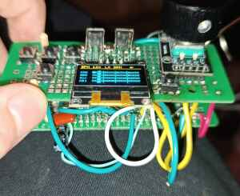

# S3-Amysynth

A handheld synthesizer and step sequencer built on the ESP32-S3 with ESP-IDF.
Audio is generated on-device by the [AMY](https://github.com/shorepine/amy)
synth engine and streamed to a PC/DAW over USB Audio (with an I2S DAC path
wired for later standalone use), driven by an OLED + encoder UI for live editing.

## Prototype Video

https://github.com/user-attachments/assets/c1125515-0647-46e4-b6fc-ae1bccc93855

<video src="https://rt-rtos.github.io/assets/amybox%20(2).mp4" poster="assets/1.jpg" controls muted loop playsinline width="640">
  <a href="https://rt-rtos.github.io/assets/amybox%20(2).mp4"></a>
</video>

> Video not playing? [Watch the prototype demo](https://rt-rtos.github.io/assets/amybox%20(2).mp4)

## What it does

S3-Amysynth runs a multi-layer step sequencer that drives the AMY engine in
real time, plus two standalone instruments that sit alongside the grid:

- **Drum layer** — a 16/32-step grid across 4 tracks, live-editable while
  playing. Each track plays its own curated Juno patch.
- **Melodic layers** — added/removed at runtime, each with per-row synths so
  stacked notes don't collapse into one voice.
- **Arpeggiator** — a standalone arp on its own synth and its own screen: up to
  8 note slots, its own scale/root quantizer, direction, octaves, and a
  tempo-locked rate. See [ARP-ARCHITECTURE.md](components/synth_core/ARP-ARCHITECTURE.md).
- **Stutter drone** — a standalone tempo-synced drone: a chord played through a
  square-LFO amplitude gate ("stutter") and a sweeping filter, with a mono sub.
  See [DRONE.md](components/synth_core/custompatches/DRONE.md).
- **Envelope editor** — an on-OLED ADSR graph for shaping amplitude, shared by
  the melodic rows, the arp, and the drone.
- **Patch selection** — cycles AMY's built-in Juno/DX7/piano presets at runtime.
- **Scale quantizer** — snaps melodic notes to a selectable musical scale.
- **Global effects** — EQ, echo, chorus, and reverb levels from the main menu,
  applied across everything.

The arp and drone are reached through a menu overlay and stay isolated from the
sequencer grid, so each instrument keeps its own state and input.

Audio currently leaves the device over **USB Audio Class 2.0** (48 kHz stereo,
16-bit) via TinyUSB. The board also wires an I2S PCM5102 DAC for standalone
output, which is planned but not yet the active path.

## Hardware

- **MCU:** ESP32-S3-N16R8 (dual-core Xtensa LX7, 16 MB flash, 8 MB PSRAM)
- **DAC:** PCM5102 (I2S) — present, reserved for later standalone output
- **Display:** SSD1306 128×64 OLED (I2C, U8g2)
- **Input:** rotary encoder + push buttons, one ADC potentiometer
- **Audio out (active):** USB Audio Class 2.0 to host  |  **(inactive)** I2S DAC

## Software

- **SDK:** ESP-IDF 6.0, FreeRTOS (non-SMP dual-core)
- **Synthesis:** AMY engine (vendored, with a few documented local patches)
- **USB:** TinyUSB + Espressif UAC2 device
- **Graphics:** U8g2
- Application code in C, organized as ESP-IDF components

## Architecture notes

A few design decisions worth calling out:

- **Manual render loop.** AMY runs in `AMY_AUDIO_IS_NONE` mode; the project owns
  the render task, which calls `amy_update()` and pushes blocks to the USB ring
  buffer. This avoids AMY spawning its own audio tasks (which deadlocks in this
  configuration).
- **Core split.** The audio DSP task is pinned to core 1; USB, the sequencer
  tick, UI, and input live on core 0, so heavy synthesis doesn't starve the
  USB/timer path.
- **Per-row / per-instrument synths.** Each melodic row, the arp, and the drone
  own their own AMY synth slots. Because AMY routes note-on by `(synth, pitch)`,
  a shared synth would collapse two same-pitch notes into one voice; separate
  slots keep them independent.
- **Tempo-locked from the audio clock.** The arp schedule and the drone's stutter
  LFO + filter sweep derive their timing from AMY's sequencer tick counter (the
  same clock the grid rides). 
  Amy music clock is the master clock for all current and future audio-path logic for staying synced/beat-locked
  across tempo changes.
- **Deferred envelope authority.** A patch's own envelope plays by default; a
  custom envelope only overrides it once committed in the graph editor, so
  changing presets doesn't permanently shadow it.

## Optimization & performance

Real-time audio on a dual-core MCU leaves little timing margin: the render task
already uses roughly 85–90% of one core's per-block budget, so most of the work
below is about removing jitter, stalls, and wasted cycles rather than chasing raw
throughput.

**Render pacing — hardware clock, not tick delays.** The render task is paced by a
GPTimer firing one alarm per audio block (5333 µs at 48 kHz / 256), whose ISR (in
IRAM, registered on core 1) wakes the task via a direct task notification. The loop
is strict 1:1 (exactly one block rendered per wake, never a catch-up backlog), so
AMY's sample clock stays locked to real time and the sequencer tempo cannot drift.
See `main/render_clock.{c,h}`.

**Core affinity.** AMY is built with multicore/multithread disabled (required to
avoid a FABT deadlock), so all DSP runs synchronously inside the render task. That
task is pinned to **core 1**; USB (TinyUSB UAC), the sequencer tick, UI, and input
are pinned to **core 0**. Heavy synthesis and the USB/timer path no longer compete
for the same core.

**Hot DSP in IRAM.** AMY's per-block hot functions (`amy_render`, `render_osc_wave`,
`amy_fill_buffer`, `hold_and_modify`, the filter/oscillator/envelope inner loops)
are annotated `IRAM_ATTR` so they execute from internal instruction RAM instead of
flash/PSRAM-cached XIP, removing cache-miss stalls from the audio inner loop. The
per-function attribute is used (rather than `.lf` "noflash" linker fragments) because
it is honoured under GCC LTO, which renames `.text.*` sections. LTO is on across
`main`, `synth_core`, `display`, `u8g2`, and `amy` for cross-module inlining of the
DSP loop.

**Memory placement.** Internal DRAM is the scarce resource on this part
(flash `.text`/`.rodata` is already served via the PSRAM XIP cache), so allocations
are placed by access pattern. The 64 KB USB ring buffer lives in PSRAM — it is touched
only at block/frame granularity, so the latency is irrelevant there — while the
per-output-sample clipping lookup table sits in internal DRAM where it is hot. The
build uses 32 KB I-cache and QIO flash.

**Lock-free USB audio path.** The render task (producer, core 1) and the USB mic
task (consumer, core 0) share the ring buffer through a **single-producer/single-consumer
lock-free ring**: atomic writer-owned and reader-owned indices with release/acquire
ordering and no mutex, so the high-priority render task never blocks on a lock held by
the lower-priority consumer. Writes are all-or-nothing (a full buffer drops a whole
block cleanly rather than splicing a half-block), and the real-time path drops instead
of stalling, with a `usb_drops` diagnostic counter. See
`components/usb_audio/usb_audio.c`.

**O(active events) sequencer tick.** The 500 µs sequencer tick scans a dense
active-tag list (O(active events), with O(1) add/remove) rather than walking the full
tag space, keeping the per-tick cost on core 0 proportional to what is actually playing
so it doesn't starve the audio/USB path. Arp re-emits are coalesced to at most one per
UI frame instead of one per parameter change.

**Branch hinting.** The render loop and USB write path mark their rare/diagnostic
branches `unlikely()` (overrun count, USB-full drop, underrun) so the compiler lays
out the steady-state success path straight-line.

Profiling and instrumentation are covered in [Diagnostics](#diagnostics) below.

The component layout:

| Component | Role |
| --- | --- |
| `main/` | app entry, task creation, AMY + USB init, input routing |
| `components/synth_core/` | sequencer core, OLED UI, quantizer, arp, drone, envelope editor |
| `components/display/` | display HAL + screen renderers + reusable graph-popup widget |
| `components/usb_audio/` | USB audio ring buffer / UAC glue |
| `components/rotary_encoder/`, `components/my_buttons/` | input drivers |
| `components/amy/` | vendored AMY engine (see [AMY-EDITS.md](AMY-EDITS.md) for local patches) |

## Diagnostics

All diagnostics print over the normal serial log (`idf.py monitor`) at the default
115200 baud. There is one always-on line plus three opt-in hooks gated behind Kconfig
so release builds carry no overhead.

### Always on — render heartbeat

The `app_main` idle loop prints one line every 5 s with no build flags required:

```
Main loop idle... seq_tick=N tick_hook_calls=N render_blocks=N render_overruns=N usb_drops=N render_sysclock_ms=N
```

- **`render_blocks` vs `render_sysclock_ms`** — the realtime sanity check. `render_blocks`
  counts blocks rendered; `render_sysclock_ms` is AMY's own sample clock in ms. Over any
  interval `render_blocks × (256 / 48000)` should equal the `render_sysclock_ms` delta. If
  blocks fall behind wall time, render is not keeping up.
- **`render_overruns`** — number of GPTimer ticks that fired while the previous block was
  still rendering (i.e. a block took longer than its 5333 µs budget). A climbing value means
  the per-block DSP cost is at the edge; it is diagnostic only (the strict 1:1 loop never
  renders a backlog, so tempo can't drift).
- **`usb_drops`** — whole blocks dropped because the USB ring buffer was full (host not
  draining). Occasional drops under host stalls are expected on the real-time path; a steadily
  climbing count means the consumer can't keep up.
- **`seq_tick` / `tick_hook_calls`** — the sequencer's tick counter and how many times the
  tick hook has fired, for confirming the musical clock is advancing.

These are **free-running totals, not rates** — read the *delta between two lines*, not the
absolute value.

### `CONFIG_USB_AUDIO_DIAGNOSTICS` — ring-buffer detail

Adds an `audio diag:` line to the same idle loop:

```
audio diag: init=1 fill=U peak_fill=U writes=N drops=N underruns=N peak_abs=N
```

- **`fill`** is the *instantaneous* sample count in the ring at the moment of the dump (a
  spot reading, not an average); **`peak_fill`** is the high-water mark since boot.
- **`underruns`** counts UAC reads that found less than a full frame (consumer starved);
  **`drops`** counts producer-side full-buffer drops. Healthy steady state: both deltas ~0
  with `fill` sitting comfortably between empty and the 32768-sample capacity.
- **`peak_abs`** is the largest absolute sample written — useful for spotting clipping
  headroom. The counters are written by single-owner tasks and read lock-free, so a snapshot
  can be off by one update; treat them as advisory.

### `CONFIG_AMYSYNTH_RTOS_STATS` — task & core profiling

Enables a periodic dump (interval `CONFIG_AMYSYNTH_RTOS_STATS_PERIOD_MS`, default 5000):
a per-task table (core, priority, stack high-water mark, cumulative CPU%), a per-core
busy/idle %, and a heap snapshot (internal vs PSRAM free + largest block).

Peculiarities when reading it:

- **Per-task `cpu%` is cumulative since boot**, computed from each task's lifetime run-time
  counter over the total. It is *not* the load over the last interval — a task that was busy
  early then idled still shows a high number. For "what's hot right now," use the **per-core
  busy%**, which *is* interval-based (it diffs the IDLE-task counters against `esp_timer` wall
  time between dumps). The first dump only prints "baseline captured" since it has no prior
  sample to diff.
- **`core` for unpinned tasks** shows as a large number (`tskNO_AFFINITY`), not 0/1.
- **`stack_hwm`** is the minimum free stack words ever seen for that task — a small value
  (approaching 0) means that task is close to overflowing.
- Relies on `FREERTOS_USE_TRACE_FACILITY`, `GENERATE_RUN_TIME_STATS`,
  `VTASKLIST_INCLUDE_COREID`, and `RUN_TIME_STATS_USING_ESP_TIMER` (all set in `sdkconfig`),
  which is why the counters are in microseconds on the `esp_timer` base.

### `CONFIG_AMYSYNTH_HEAP_CHECK` — heap-corruption bisection

Compiles in `HEAP_CHECK()` / `SEQ_HEAP_CHECK()` / `CORE_HEAP_CHECK()` / `ARP_HEAP_CHECK()`
checkpoints that run `heap_caps_check_integrity_all()` at key init steps and log
`HEAP OK` / `HEAP CORRUPT` with a label, to pin corruption to its source. Disabled, every
checkpoint compiles to nothing.

> **Watchdog caveat:** with `CONFIG_HEAP_POISONING_COMPREHENSIVE` the integrity scan is very
> slow; running many checkpoints back-to-back inside `app_main` can starve the idle task and
> trip the task watchdog. Use only while actively chasing a corruption bug.

### Performance implications of leaving diagnostics on

- **Always-on heartbeat:** negligible. A handful of counter reads plus one log line every 5 s.
- **`USB_AUDIO_DIAGNOSTICS`:** low but non-zero. The producer/consumer track a few extra
  counters and a peak-sample scan on the audio path; fine for tuning, but it is gated off by
  default so the steady-state hot loop carries nothing in release builds.
- **`AMYSYNTH_RTOS_STATS`:** the dump itself `malloc`s a `TaskStatus_t[]` and walks every task,
  which is a brief spike on the **core 0** idle loop (where it runs), not on the core 1 audio
  path — so it does not directly cost render budget, but a short period (e.g. 1000 ms) adds
  steady core-0 churn. More importantly, the underlying run-time-stats facility imposes a small
  always-on scheduler cost whenever it is compiled in. Leave it **off for release**; turn it on
  to profile.
- **`AMYSYNTH_HEAP_CHECK`:** potentially large and bursty (see the watchdog caveat). Debug only.

General rule: the default (release) configuration has every opt-in hook disabled and only the
cheap heartbeat active, so shipping firmware pays effectively nothing.

## Documentation

- [SEQUENCER-ARCHITECTURE.md](SEQUENCER-ARCHITECTURE.md) — sequencer core, layers, tags, timing
- [ARP-ARCHITECTURE.md](components/synth_core/ARP-ARCHITECTURE.md) — the standalone arpeggiator
- [DRONE.md](components/synth_core/custompatches/DRONE.md) — the stutter drone (voice model, chords, tempo sync)
- [AMY-EDITS.md](AMY-EDITS.md) — local patches to the vendored AMY engine
- Per-component READMEs under `components/`

## Building

```sh
idf.py set-target esp32s3
idf.py build
idf.py flash monitor
```

Flashing over USB from a Windows host uses USBIPD passthrough.

## Project context

This is a self-directed learning project for getting deeper into embedded audio
and real-time firmware. The interesting problems it has run into so far:

- coordinating timing-sensitive work (audio rendering, the sequencer tick, and
  UI refresh) across two cores without glitches
- making a constrained USB/audio pipeline behave (buffering, drop-vs-block
  trade-offs, sample-rate correctness)
- learning AMY's voice/patch/envelope model well enough to extend it — the arp
  and drone are built entirely on its public event API
- fitting a usable UI on a 128×64 display with one encoder and a few buttons
- keeping a clean line between project code and vendored dependencies, patching
  upstream only for confirmed bugs and tracking those edits in `AMY-EDITS.md`

Some parts are more finished than others; the scope is intentionally broad for
its stage.
