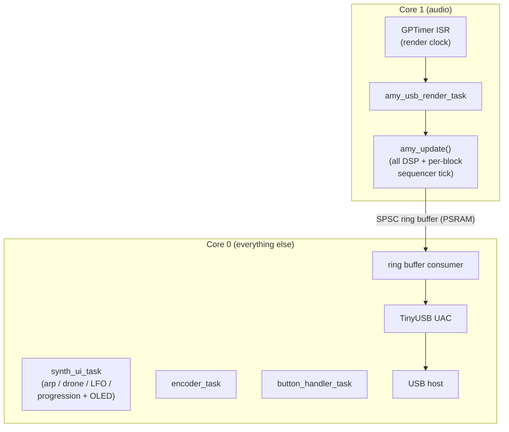
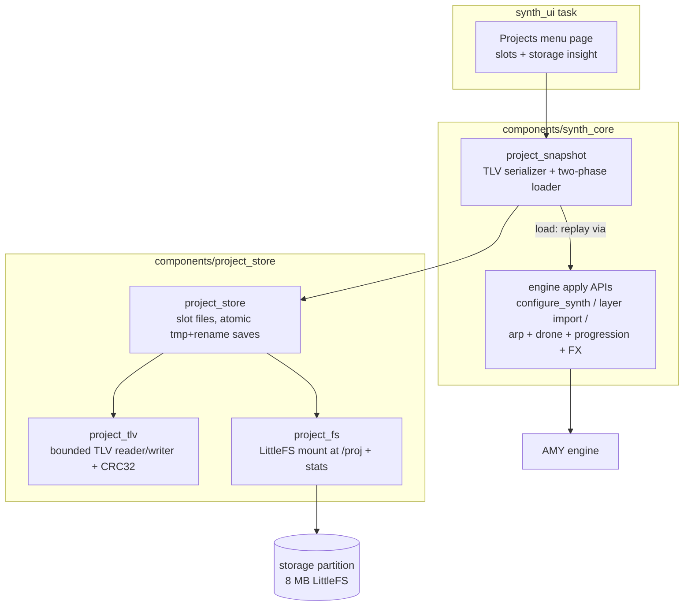

# S3-Amysynth

A pocket-sized groovebox built on the ESP32-S3. Drums, melodic step
sequences, an arpeggiator, and a tempo-locked stutter drone all play at
once, synthesized on the chip in real time by the
[AMY](https://github.com/shorepine/amy) engine - and the whole mix arrives
in your DAW as a plain USB UAC device, or direct I2S output (the only difference is what consumes the output buffer).
The entire control surface is one rotary encoder, four buttons, and a 128x64 OLED, and
everything is edited live: patterns, patches, envelopes, filters and LFOs
change while the music keeps running.

Nothing is precomputed and nothing streams down from the host. Every voice
is rendered on-device, one 256-sample block every 5.3 ms, on a core budget
that is already ~85-90% spoken for - which is what makes the firmware side
of this project interesting. 

> (The board also wires an I2S DAC for a future standalone mode; UAC is practical during development due to the 2 USB ports on many S3 boards - serial logs with runtime performance and diagnostics while using the device for a normal workflow.)

## Prototype Video


<video src="https://github.com/user-attachments/assets/18ee83c0-162c-4c39-9f19-2d1f17abcdaa" poster="assets/1.jpg" controls loop playsinline width="640">
</a>
</video>

> Video not playing? [Watch the prototype demo](https://rt-rtos.github.io/assets/amybox.mp4)

## What it does

At boot you get a playing groove: a four-track drum layer (808-style PCM
samples or synth patches, seeded with a four-on-the-floor pattern) and a
melodic layer, running at 108 BPM. From there:

- **Step sequencer** - up to 4 layers of 4 tracks x 16 or 32 steps, edited
  live on the grid. Each step can carry its own probability, 1-4 ratchet
  sub-hits, and a conditional trigger (FILL every N loops / only-after-PREV),
  set from a per-step popup. Tracks have mute/solo and per-track repeat
  rates (fire every 1/2/4/8 bars).
- **Per-row voices** - every melodic row owns its own AMY synth slot, so
  stacked same-pitch notes on different rows don't collapse into one voice.
- **Arpeggiator** - a standalone instrument on its own screen: 8 note slots
  (with rests), UP/DOWN/SLOT-order directions, 1-4 octaves, nine
  tempo-locked rates including triplets, portamento glide, and its own
  scale/root quantizer. See
  [ARP-ARCHITECTURE.md](components/synth_core/ARP-ARCHITECTURE.md).
- **Stutter drone** - a tempo-synced drone: a chord carrier chopped by a
  square LFO gate with swing, gate-length and rhythmic step patterns, a
  slowly sweeping filter with per-gate "blip" zaps, and a mono sub up to
  three octaves below. See
  [DRONE.md](components/synth_core/custompatches/DRONE.md).
- **Chord progression** - up to 8 chords (root, type, duration in bars)
  that auto-advance with playback, re-voicing any layer with chord mode on
  and re-rooting the arpeggiator's quantizer as they go.
- **Sound shaping editors** - graphical on-OLED editors for ADSR envelopes
  (two per voice: EG0 for amplitude, EG1 typically for filter sweeps), a
  biquad filter with live frequency-response plot, and an LFO with
  filter/amp/pitch/pan/wavetable-scan targets - bound to whichever
  instrument opened them.
- **Patches** - AMY's built-in Juno and DX7 banks plus piano, raw
  oscillator waves, custom multi-osc bass presets, five wavetable banks,
  and (optionally) a live-editable 6-operator FM voice.
- **Resampler** - arm the menu's Sample item and the firmware records 1.5 s
  of its own output into a PCM preset, playable from any drum track.
- **Global FX page** - three-band EQ plus echo, chorus and reverb with
  extended parameters (feedback, time, tone, rate, depth, damping,
  crossover), applied to the whole mix.
- **Scale quantizer** - snaps melodic input to one of nine scales; the arp
  carries its own independent quantizer.

Audio leaves the device over **USB Audio Class 2.0** (48 kHz stereo,
16-bit) via TinyUSB - the device enumerates as a USB microphone, so any DAW
or recorder can capture it without drivers.

## Hardware

- **MCU:** ESP32-S3-N16R8 (dual-core Xtensa LX7, 16 MB flash, 8 MB PSRAM)
- **DAC:** PCM5102 (I2S) - wired on the board, reserved for a future
  standalone output path (no firmware driver yet)
- **Display:** SSD1306 128x64 OLED (I2C, U8g2)
- **Input:** rotary encoder + push buttons, one ADC potentiometer
- **Status LED:** onboard addressable RGB LED (WS2812, GPIO48) - render-load
  indicator
- **Audio out (active):** USB Audio Class 2.0 to host

## Software

- **SDK:** ESP-IDF 6.0, FreeRTOS (non-SMP dual-core)
- **Synthesis:** AMY engine (vendored, with a few documented local patches)
- **USB:** TinyUSB + Espressif UAC2 device
- **Graphics:** U8g2
- Application code in C, organized as ESP-IDF components

## Architecture notes

The audio DSP and everything else run on separate cores, connected only by a
ring buffer:



A few design decisions worth calling out:

- **Manual render loop.** AMY runs in `AMY_AUDIO_IS_NONE` mode; the project owns
  the render task, which calls `amy_update()` and pushes blocks to the USB ring
  buffer. This avoids AMY spawning its own audio tasks (which deadlocks in this
  configuration).
- **Core split.** The audio DSP task is pinned to core 1; USB, UI, and input
  live on core 0, so heavy synthesis doesn't starve the USB/timer path. The
  sequencer tick runs once per rendered block on the audio core, slaved to the
  sample clock, so tempo cannot drift against the audio.
- **Per-row / per-instrument synths.** Each drum track, each melodic row, the
  arp, and the drones own their own AMY synth slots. Fixed consumers pack the
  bottom of the slot space (arp 1, stutter drone 2-3, free-running drone 4-5,
  drums 6-9, live play 10) and the melodic rows are an open-ended arena on top
  (11 up to `max_synths - 1`); the whole map lives in one header,
  `synth_slots.h`, and growing melodic polyphony is a single-constant change.
  Because AMY routes note-on
  by `(synth, pitch)`, a shared synth would collapse two same-pitch notes into
  one voice; separate slots keep them independent.
- **Tempo-locked from the audio clock.** The arp schedule and the drone's stutter
  LFO + filter sweep derive their timing from AMY's sequencer tick counter (the
  same clock the grid rides). The AMY music clock is the master clock for all
  audio-path logic, so everything stays beat-locked across tempo changes.
- **Deferred envelope authority.** A patch's own envelope plays by default; a
  custom envelope only overrides it once committed in the graph editor, so
  changing presets doesn't permanently shadow it. The same authored/unauthored
  rule applies to the filter and LFO settings.
- **A shared voice-parameter layer.** The melodic rows, the arp, and the drone
  all embed one `voice_params_t` block (EG0/EG1 envelopes, filter, LFO, amp
  trim) and share the code that builds 2-osc WAVE voices and wires the
  native AMY LFO - so a fix or feature in one instrument's voice model lands
  in all three.

### Project storage

Full session snapshots (patterns, per-row voice params, arp, drone, chord
progression, FX, tempo) can be saved to 32 named slots on an 8 MB LittleFS
`storage` partition occupying the flash above the app and the 4 MB `drums`
sample partition, managed from a Projects menu page that also reports
per-project size and free space:



Design points: the file format is our own parameter model written field by
field into versioned TLV sections (never AMY patch strings or raw struct
dumps), so saves survive both struct growth and AMY updates; AMY state is
regenerated on load by replaying the same apply paths a live edit uses. Loads
are two-phase - everything is parsed, bounds-checked, and staged before any
live state is touched, so a corrupt file is refused with the session intact.
Saves write a temp file and rename it (atomic on LittleFS), so power loss
never corrupts an existing project. Menu clicks only queue the request: the
load/save itself executes on the `synth_ui` task, the one task allowed to
rebuild sequencer layer topology (single-applier contract), keeping flash
I/O off the input path. `components/project_store` is
synth-agnostic (files, TLV container, mount); the serializer that knows the
instrument model lives in `synth_core/project/`.

The `drums` partition feeds AMY's Gamma9001 drum banks: 136 PCM samples
(TR-909, Linn 9000, MR-12, synthetic and acoustic percussion) as presets
256-391 plus the ready-made kit patches 385-390, on top of the 19-sample
TR-808 bank baked into the app. The blob is raw int16 PCM generated from the
AMY sample library (`amy.headers.generate_gamma9001_headers()` upstream) and
is mmapped read-only at boot; if the partition is absent or blank the boot
log says so and those presets simply stay disabled.

## Optimization & performance

Real-time audio on a dual-core MCU leaves little timing margin: the render task
already uses roughly 85-90% of one core's per-block budget, so most of the work
below is about removing jitter, stalls, and wasted cycles rather than chasing raw
throughput.

**Render pacing - hardware clock, not tick delays.** The render task is paced by a
GPTimer firing one alarm per audio block (5333 µs at 48 kHz / 256), whose ISR (in
IRAM, registered on core 1) wakes the task via a direct task notification. The loop
is strict 1:1 (exactly one block rendered per wake, never a catch-up backlog), so
AMY's sample clock stays locked to real time and the sequencer tempo cannot drift.
See `main/render_clock.{c,h}`. An alternative pacing backend
(`CONFIG_RENDER_CLOCK_I2S_ENABLE`, default off) derives the block cadence from a
pin-less I2S channel's DMA backpressure instead of the GPTimer ISR.

**Core affinity.** AMY is built with multicore/multithread disabled (required to
avoid a FABT deadlock), so all DSP runs synchronously inside the render task. That
task is pinned to **core 1**; USB (TinyUSB UAC), the sequencer tick, UI, and input
are pinned to **core 0**. Heavy synthesis and the USB/timer path no longer compete
for the same core.

**Hot DSP in IRAM.** AMY's per-block hot functions (`amy_render`, `render_osc_wave`,
`amy_fill_buffer`, `hold_and_modify`, the filter/oscillator/envelope inner loops)
are annotated `IRAM_ATTR` so they execute from internal instruction RAM instead of
flash/PSRAM-cached XIP, removing cache-miss stalls from the audio inner loop. The
per-function attribute is used (rather than `.lf` "noflash" linker fragments) because
it is honoured under GCC LTO, which renames `.text.*` sections. LTO is on across
`main`, `synth_core`, `display`, `u8g2`, and `amy` for cross-module inlining of the
DSP loop.

**Memory placement.** Internal DRAM is the scarce resource on this part
(flash `.text`/`.rodata` is already served via the PSRAM XIP cache), so allocations
are placed by access pattern. The 64 KB USB ring buffer lives in PSRAM - it is touched
only at block/frame granularity, so the latency is irrelevant there - while the
per-output-sample clipping lookup table sits in internal DRAM where it is hot. The
build uses 32 KB I-cache and QIO flash.

**Lock-free USB audio path.** The render task (producer, core 1) and the USB mic
task (consumer, core 0) share the ring buffer through a **single-producer/single-consumer
lock-free ring**: atomic writer-owned and reader-owned indices with release/acquire
ordering and no mutex, so the high-priority render task never blocks on a lock held by
the lower-priority consumer. Writes are all-or-nothing (a full buffer drops a whole
block cleanly rather than splicing a half-block), and the real-time path drops instead
of stalling, with a `usb_drops` diagnostic counter. See
`components/usb_audio/usb_audio.c`.

**O(active events) sequencer tick.** The sequencer tick runs once per rendered
block on the audio core, gated by the sample clock. Scheduled events sit in a
linked index of occupied slots (AMY 1.2.121), so each tick scans only what is
actually scheduled rather than the full tag space. Arp re-emits are coalesced to
at most one per UI frame instead of one per parameter change.

**One display flush per frame.** All screen renderers are fill-only; the UI task
composites the bottom hint strip and issues a single `u8g2_SendBuffer` per redraw
(the blocking ~20 ms I2C transfer), and only when a view signature actually changed.

**Branch hinting.** The render loop and USB write path mark their rare/diagnostic
branches `unlikely()` (overrun count, USB-full drop, underrun) so the compiler lays
out the steady-state success path straight-line.

Profiling and instrumentation are covered in [Diagnostics](#diagnostics) below.

The component layout:

| Component | Role |
| --- | --- |
| `main/` | app entry, task creation, AMY + USB init, render clock, input routing |
| `components/synth_core/` | sequencer core, screens/UI, quantizer, arp, drone, FM voice, sampler, FX cache |
| `components/display/` | display HAL + screen renderers + reusable graph-popup widget |
| `components/usb_audio/` | USB audio ring buffer / UAC glue |
| `components/rotary_encoder/`, `components/my_buttons/` | input drivers |
| `components/seq_clamp/` | header-only clamping helpers shared across the UI/engine code |
| `components/project_store/` | project persistence: LittleFS mount, TLV container, slot files with atomic saves |
| `components/status_led/` | onboard RGB LED driven as a render-load indicator |
| `components/diagnostics/` | opt-in profiling hooks + the core-load sampler shared with the status LED |
| `components/amy/` | vendored AMY engine (see [AMY-EDITS.md](AMY-EDITS.md) for local patches) |

## Diagnostics

All diagnostics print over the normal serial log (`idf.py monitor`) at the default
115200 baud. There is one always-on line plus three opt-in hooks gated behind Kconfig
so release builds carry no overhead.

### Always on - render heartbeat

The `app_main` idle loop prints one line every 5 s with no build flags required:

```
Main loop idle... seq_tick=N tick_hook_calls=N render_blocks=N render_overruns=N usb_drops=N render_sysclock_ms=N
```

- **`render_blocks` vs `render_sysclock_ms`** - the realtime sanity check. `render_blocks`
  counts blocks rendered; `render_sysclock_ms` is AMY's own sample clock in ms. Over any
  interval `render_blocks × (256 / 48000)` should equal the `render_sysclock_ms` delta. If
  blocks fall behind wall time, render is not keeping up.
- **`render_overruns`** - number of GPTimer ticks that fired while the previous block was
  still rendering (i.e. a block took longer than its 5333 µs budget). A climbing value means
  the per-block DSP cost is at the edge; it is diagnostic only (the strict 1:1 loop never
  renders a backlog, so tempo can't drift).
- **`usb_drops`** - whole blocks dropped because the USB ring buffer was full (host not
  draining). Occasional drops under host stalls are expected on the real-time path; a steadily
  climbing count means the consumer can't keep up.
- **`seq_tick` / `tick_hook_calls`** - the sequencer's tick counter and how many times the
  tick hook has fired, for confirming the musical clock is advancing.

These are **free-running totals, not rates** - read the *delta between two lines*, not the
absolute value.

### Always on - status LED

The board's onboard RGB LED (`CONFIG_AMYSYNTH_STATUS_LED`, default on) reports
core 1's busy share as a color band: green below 50 %, yellow from 50 %, orange
from 75 %, red from 90 %, with hysteresis so the color holds steady when the
load sits on a boundary. A failed heap allocation interrupts the load color
with a short magenta blink burst.

The number behind the color is the IDLE-task run-time counter delta, sampled
once per second by a low-priority core-0 task - the render path itself carries
no instrumentation, so watching the load cannot perturb it. The displayed value
is a mean over the sample window; short spikes average out. Enabling the LED
selects `FREERTOS_GENERATE_RUN_TIME_STATS`, the same facility the RTOS stats
dump below relies on. See
[components/status_led/README.md](components/status_led/README.md).

### `CONFIG_USB_AUDIO_DIAGNOSTICS` - ring-buffer detail

Adds an `audio diag:` line to the same idle loop:

```
audio diag: init=1 fill=U peak_fill=U writes=N drops=N underruns=N peak_abs=N
```

- **`fill`** is the *instantaneous* sample count in the ring at the moment of the dump (a
  spot reading, not an average); **`peak_fill`** is the high-water mark since boot.
- **`underruns`** counts UAC reads that found less than a full frame (consumer starved);
  **`drops`** counts producer-side full-buffer drops. Healthy steady state: both deltas ~0
  with `fill` sitting comfortably between empty and the 32768-sample capacity.
- **`peak_abs`** is the largest absolute sample written - useful for spotting clipping
  headroom. The counters are written by single-owner tasks and read lock-free, so a snapshot
  can be off by one update; treat them as advisory.

### `CONFIG_AMYSYNTH_RTOS_STATS` - task & core profiling

Enables a periodic dump (interval `CONFIG_AMYSYNTH_RTOS_STATS_PERIOD_MS`, default 5000):
a per-task table (core, priority, stack high-water mark, cumulative CPU%), a per-core
busy/idle %, and a heap snapshot (internal vs PSRAM free + largest block).

Peculiarities when reading it:

- **Per-task `cpu%` is cumulative since boot**, computed from each task's lifetime run-time
  counter over the total. It is *not* the load over the last interval - a task that was busy
  early then idled still shows a high number. For "what's hot right now," use the **per-core
  busy%**, which *is* interval-based (it diffs the IDLE-task counters against `esp_timer` wall
  time between dumps). The first dump only prints "baseline captured" since it has no prior
  sample to diff.
- **`core` for unpinned tasks** shows as a large number (`tskNO_AFFINITY`), not 0/1.
- **`stack_hwm`** is the minimum free stack words ever seen for that task - a small value
  (approaching 0) means that task is close to overflowing.
- Relies on `FREERTOS_USE_TRACE_FACILITY`, `GENERATE_RUN_TIME_STATS`,
  `VTASKLIST_INCLUDE_COREID`, and `RUN_TIME_STATS_USING_ESP_TIMER` (all set in `sdkconfig`),
  which is why the counters are in microseconds on the `esp_timer` base.

### `CONFIG_AMYSYNTH_HEAP_CHECK` - heap-corruption bisection

Compiles in the `DIAG_HEAP_CHECK()` checkpoints (`components/diagnostics/include/diag_heap.h`)
that run `heap_caps_check_integrity_all()` at key init steps and log `HEAP OK` / `HEAP CORRUPT`
with a label under the `heapchk` tag, to pin corruption to its source. Disabled, every
checkpoint compiles to nothing.

> **Watchdog caveat:** with `CONFIG_HEAP_POISONING_COMPREHENSIVE` the integrity scan is very
> slow; running many checkpoints back-to-back inside `app_main` can starve the idle task and
> trip the task watchdog. Use only while actively chasing a corruption bug.

### Performance implications of leaving diagnostics on

- **Always-on heartbeat:** negligible. A handful of counter reads plus one log line every 5 s.
- **Status LED:** negligible on the audio path - one core-0 task wake per 100 ms, one
  task-table snapshot per second, and an LED write only when the color band changes. Its
  real cost is the run-time-stats facility it pulls in (see the `AMYSYNTH_RTOS_STATS` note
  below); turn the LED off if you want that facility out of the build entirely.
- **`USB_AUDIO_DIAGNOSTICS`:** low but non-zero. The producer/consumer track a few extra
  counters and a peak-sample scan on the audio path; fine for tuning, but it is gated off by
  default so the steady-state hot loop carries nothing in release builds.
- **`AMYSYNTH_RTOS_STATS`:** the dump itself `malloc`s a `TaskStatus_t[]` and walks every task,
  which is a brief spike on the **core 0** idle loop (where it runs), not on the core 1 audio
  path - so it does not directly cost render budget, but a short period (e.g. 1000 ms) adds
  steady core-0 churn. More importantly, the underlying run-time-stats facility imposes a small
  always-on scheduler cost whenever it is compiled in. Leave it **off for release**; turn it on
  to profile.
- **`AMYSYNTH_HEAP_CHECK`:** potentially large and bursty (see the watchdog caveat). Debug only.

General rule: the default (release) configuration has every opt-in hook disabled and only the
cheap heartbeat and the status LED active, so shipping firmware pays effectively nothing.

## Usage Guide

### Controls

| Control | Description |
|---|---|
| **Encoder (rotate)** | Navigate / select; adjusts value when in edit mode |
| **ENC push (short)** | Confirm / toggle step; enters edit mode for focused field |
| **ENC push (long)** | Open ADSR/envelope editor for the active instrument |
| **B0 - play/layer (short)** | Cycle active layer (sequencer screen only) |
| **B0 - play/layer (long)** | Toggle global playback (cancels an open editor instead) |
| **B1 - patch (hold + encoder)** | Cycle patch for the selected track / instrument |
| **B2 - pitch (hold + encoder)** | Transpose selected track's base note by semitone |
| **B3 - menu (short)** | Open / close the main menu overlay |
| **B3 - menu (long)** | Open the per-step Step Trig popup (sequencer screen) |

A one-line **hint strip** along the bottom of the screen shows what the
buttons do in the current context.

---

### Screens and navigation

All screen changes go through the **menu overlay** (B3). Navigation order within
the overlay: encoder scrolls items, encoder click activates them. While any
editor is open, B3 short-press cycles between editor tabs (ADSR → Filter → LFO →
ADSR; the drone skips the LFO tab) instead of toggling the menu.

| Menu action | Destination |
|---|---|
| Screen: Seq | Step sequencer grid (default at boot) |
| Screen: Arp | Arpeggiator |
| Screen: Drone | Stutter drone |
| Screen: Prog | Chord progression editor |
| Screen: TrackOpts | Per-track options (repeat rate, mute/solo, chord mode) |
| Screen: FM - **Very WIP**| 6-op FM voice editor (only with `CONFIG_SYNTH_CUSTOM_FM`) |

**Overlay render priority (highest first):** Step Trig popup > Filter editor >
LFO editor > ADSR graph > Menu > Arp / Drone / Prog / TrackOpts / FM > Sequencer.

---

### Sequencer

The device boots to the sequencer with one drum layer (seeded with a
four-on-the-floor groove) and one melodic layer already running at 108 BPM.

**Controls:**

| Input | Action |
|---|---|
| Encoder | Move step cursor (wraps track→track; 32-step layers auto-page) |
| ENC short | Toggle step at cursor |
| ENC long | Open ADSR editor (bound to selected track) |
| B0 short | Cycle active layer - resets cursor to track 0 step 0 |
| B0 long | Toggle play / stop |
| B1 hold + encoder | Cycle patch for the selected track |
| B2 hold + encoder | Transpose selected track's pitch (semitones, MIDI 0-127) |
| B3 short | Open menu |
| B3 long | Open the Step Trig popup for the step under the cursor |

**Layers:**

- Up to 4 layers; layer 0 is always the drum layer (cannot be deleted).
- Add / remove melodic layers via menu items **Add Layer** / **Del Layer**.
- Each layer is 4 tracks × 16 or 32 steps (set at creation time).
- Melodic layers share one patch across all 4 tracks; drum tracks each carry their own patch.
- A 16-step layer and a 32-step layer running simultaneously stay in phase - the 16-step pattern loops twice per 32-step cycle.

**Step Trig popup (B3 long-press on a step):**

| Field | Range |
|---|---|
| Probability | 0-100 % (5 % steps) |
| Ratchet | 1-4 sub-hits within the step |
| Cond | NONE / FILL (fire every Nth loop, N = 2-8) / PREV (only if the previous step fired) |

ENC short cycles the popup's fields; B3 short or ENC long closes it.

**Track options (menu → Screen: TrackOpts):**

Rows: layer selector, track selector, **Repeat Rate** (track fires every
1/2/4/8 bars), **Mute**, **Solo** (solo overrides mute), and for melodic
layers **Chord Mode / Root / Type** (locked while the global progression is
enabled).

**Patch selection:**

B1 hold + encoder cycles through a curated list of 17 patches by default (DX7
electric pianos, a few Juno leads, acoustic piano, and raw wave types). Set
`CONFIG_SEQ_PATCH_BROWSE_FULL_RANGE=y` to walk the full numeric range: Juno
0-127, DX7 128-255, piano 256, raw waves 257-263 (including noise and
Karplus-Strong), custom bass presets 264-266, wavetable banks 267-271 (with
`CONFIG_AMY_WAVETABLE`, default on), and FM voices 272-276 (with
`CONFIG_SYNTH_CUSTOM_FM`).

**Scale quantizer:**

Enabled via menu item **Quant**. Changing **Scale** or **Root** re-snaps all
active melodic steps immediately - there is no undo. The arp has its own
independent scale and root (see below).

---

### Menu - runtime parameters

| Item | Range |
|---|---|
| BPM | 40-300 |
| Quant | ON / OFF |
| Scale | Chromatic, Major, Natural Minor, Dorian, Phrygian, Lydian, Mixolydian, Minor Pentatonic, Major Pentatonic |
| Root | MIDI 0-127 |
| Arp | ON / OFF |
| Drone | ON / OFF |
| Drum Mode | Synth (Juno/DX7 patches) / PCM (808-style samples) |
| Add Layer / Del Layer | add or remove a melodic layer |
| FX | opens the effects page (see below) |
| Volume | 0-200 % (unity = 100 %) |
| Sample / Smp Cancel | arm / cancel the resampler (see below) |

---

### Effects page (menu → FX)

All effects are global - they apply to the entire mix. Levels step in 5 %
increments; extended parameters keep AMY's factory defaults until first
edited.

| Item | Range |
|---|---|
| EQ Low / Mid / High | −15 to +15 dB (1 dB steps) |
| Echo | 0-100 % level, plus Fbk 0-99 %, Time 0-743 ms, Tone −99 to +99 |
| Chorus | 0-100 % level, plus Rate 0.05-10 Hz, Depth 0-100 % |
| Reverb | 0-100 % level, plus Live 0-100 %, Damp 0-100 %, Xover 500-8000 Hz |
| Preset FX | ON / OFF - see [Quirks](#non-obvious-quirks) |

---

### Resampler (menu → Sample)

Select a drum track on the grid, then activate **Sample** in the menu: the
state machine steps IDLE → ARMED → RECORDING → READY. While recording, the
firmware captures **1.5 s of its own final mix** (everything currently
playing) into a PCM preset, which is then assigned to the selected drum
track - instant resampling for building evolving loops. **Smp Cancel**
aborts at any stage. The recording lives in RAM only (it does not survive a
power cycle).

---

### Arpeggiator

The arp runs on its own dedicated synth slot, independent of the sequencer's
layers. It uses
its own scale / root quantizer and schedules repeating AMY events that are
always in sync with the sequencer's BPM.

**Controls on the ARP screen:**

| Input | Action |
|---|---|
| Encoder | Navigate fields and note slots; adjust when editing |
| ENC short | Enter / exit edit mode on focused field |
| ENC long | Open ADSR editor (bound to arp) |
| B1 hold + encoder | Cycle the arp's own patch |
| B3 | Menu |
| B0 long | Play / stop |

**Fields (cursor order):** Enable → Direction (UP / DOWN / SLOT) → Octaves
(1-4) → Rate (1/1 · 1/4 · 1/8 · 1/16 · 1/32 plus triplet variants 1/4T ·
1/8T · 1/16T · 1/32T, all tempo-locked) → Gate % (10-100 %) → Source (PTCH /
WAVE) → Wave (SAW / SAW-UP / PULSE / TRI / SINE / NOISE / KS; WAVE mode only)
→ Glide (0-2000 ms portamento) → Note slots 0-7.

Note slots store raw chromatic MIDI pitches; turning below the range clears
the slot. In **SLOT** direction the pattern plays the slots in their written
order, and an empty slot can be turned down once more into a **REST**, which
holds silence for its step (UP/DOWN skip rests entirely). All quantization to
the arp's own scale/root happens at playback, so editing a slot never
permanently absorbs a quantized pitch.

In **WAVE** mode the arp builds its own 2-osc voice (oscillator + native AMY
LFO), which is what the LFO editor drives; in **PTCH** mode the patch owns
its oscillators and the LFO settings are stored but inactive.

Kconfig defaults at boot: disabled, Major scale, root E2, gate 75 %,
1 octave, patch 138 (DX7 E.Piano 1). The arp produces no sound until enabled
**and** at least one slot is filled.

---

### Drone synth

A tempo-locked stutter drone (two dedicated slots: chord carrier + mono sub).
Fully
independent of the sequencer grid and the chord progression; timing derives
from the same AMY musical clock.

**Controls on the Drone screen:**

| Input | Action |
|---|---|
| Encoder | Move row cursor; adjust value when editing |
| ENC short | Toggle edit on focused row |
| ENC long | Open ADSR editor (bound to drone) |
| B1 hold + encoder | Cycle patch (PATCH mode only) |
| B3 | Menu |
| B0 long | Play / stop |

**Parameters:**

| Parameter | Range / notes |
|---|---|
| SOURCE | WAVE (raw oscillator) or PATCH (AMY preset) |
| WAVE | SAW / SAWUP / PULSE / TRI / SINE (WAVE mode only) |
| ROOT | C1-C5 (chromatic; shifts the entire voicing) |
| CHORD | Maj, Min, Maj7, Min7, Dom7, Sus2, Sus4, Dim, Aug, Min9, Maj9 - same set as Prog mode; carrier capped at 5 voices |
| RES | 0.1-3.0 filter resonance |
| PEAK | 0.0-1.0 - always-on carrier level (WAVE mode only; must stay > 0) |
| DUCK | 0.0-1.0 - stutter depth; 1.0 = full hard gate (WAVE mode only) |
| VISUALISE | ON / OFF - switch the screen to the drone visualizer |
| STUTTER rate | 1/4 · 1/8 · 1/16 · 1/32, tempo-locked LFO (WAVE mode only) |
| GATE | 0.05-0.95 - gate duty cycle (WAVE mode only) |
| SWING | 0-66 % |
| PATTERN | FULL (all 8), FOUR (4-on-the-floor), OFFBT (upbeats), GALOP (short-short-long), DUB (dub push); 8-step masks against stutter subdivisions |
| BLIP | 0.0-1.0 filter-zap intensity on gate edges |
| SWEEP LO / HI | 100-8000 Hz - filter cutoff sweep range |
| SWEEP SPD | 1-16 bars per sweep cycle |
| SUB | ON / OFF - mono octave-down voice |
| SUB INT | 0 to −36 semitones below chord root |
| PATCH | AMY preset number (PATCH mode only) |

In **PATCH mode**, the stutter LFO (PEAK / DUCK / STUTTER / GATE rows) is
inactive - the patch owns its own oscillators and amplitude. Filter sweep and
resonance still apply.

---

### Chord progression (Prog screen)

The Prog screen (menu → Screen: Prog) holds a list of up to 8 chord entries.
When the progression is enabled it auto-advances through them as the
sequencer plays, re-voicing any layers that have chord mode on and re-rooting
the **arpeggiator's** quantizer to match. The drone does not follow it - its
ROOT/CHORD rows stay fully manual.

Each entry has three fields, cycled by ENC click while editing:

| Field | Options |
|---|---|
| Root | C, C#, D, D#, E, F, F#, G, G#, A, A#, B |
| Chord type | Maj, Min, Maj7, Min7, Dom7, Sus2, Sus4, Dim, Aug, Min9, Maj9 |
| Duration | 1, 2, 3, 4, 8, or 16 bars |

**Controls on the Prog screen:**

| Input | Action |
|---|---|
| Encoder | Scroll cursor (row 0 = enable toggle; rows 1-8 = entries); adjust when editing |
| ENC short | Enter / exit edit; advance to next sub-field within an entry |
| B1 | Delete the entry at the cursor |
| B2 | Append a new entry (default: C Maj 1 bar) |
| B3 | Menu |
| B0 long | Play / stop |

**Per-layer chord mode** is set from TrackOpts (menu → Screen: TrackOpts).
When a melodic layer has chord mode on, the progression overwrites its notes
to the nearest chord tone on each bar change. Without chord mode on a layer,
the progression advances visually but doesn't transpose that layer's steps.
While the progression is enabled, the per-layer chord rows in TrackOpts are
locked out.

**Current limitation:** the progression does not persist across power cycles
(no NVS save yet).

---

### Envelope (ADSR) editor

Long-press ENC from the sequencer, arp, or drone screen to open the graphical
ADSR editor. The editor binds to whichever instrument opened it.

**Controls:**

| Input | Action |
|---|---|
| Encoder | Move / adjust the selected ADSR point |
| ENC short | Toggle between point-select and value-adjust mode |
| ENC long | **Commit** envelope and close |
| B0 long | **Cancel** - close without saving |
| B1 | Toggle apply scope: this track only vs. all tracks in the layer (melodic only) |
| B2 | Toggle amp-edit mode (encoder adjusts amplitude trim 0-100 % instead of time/level) |
| B3 short | Cycle to the Filter editor |
| B3 long | Switch between the EG0 (amplitude) and EG1 breakpoint sets |

Each voice carries **two envelopes**: EG0 shapes amplitude; EG1 is free for
modulation and is what the custom bass presets use to sweep their filter.
Both are edited on the same graph, switched with B3 long-press.

**Points:** Attack peak → Sustain level → Release end. Decay time is
auto-derived from attack time and sustain level - it is not a separately
draggable point.

A committed envelope persists across patch changes; an unedited row always
follows the patch's own envelope (see *deferred authority* under Architecture
notes).

Time range auto-switches between SHORT (0-2 s) and LONG (0-15 s,
log-squashed) based on total envelope length. The transition has hysteresis
(≥2000 ms switches to LONG; ≤1700 ms switches back).

---

### Filter and LFO editors

While the ADSR editor is open, press B3 to cycle to the **Filter editor**,
then B3 again for the **LFO editor** (melodic / arp only - the drone has no
LFO tab), then back to ADSR.

**Filter parameters:** cutoff (20 Hz-8 kHz, log-scaled), resonance
(Q 0.51-8.0), type (LPF / HPF / BPF / LPF24), enable. The screen plots the
live frequency response. ENC long = commit, B0 long = cancel, B1 = instant
enable toggle.

**LFO parameters:** target, wave (Sine / Triangle / Saw up / Saw down / Square /
Random sample-and-hold), rate (1/8 bar up to 4 bars, tempo-locked), depth
(0-100 %), enable. Targets live on two tabs, switched with the **shoulder
button**: tab 1 is **Filter / Amp / Pitch / Pan / Scan**, tab 2 is **Dist Drive /
Dist Mix** (distortion pre-gain and wet/dry, active only when the track has a
distortion type set). The **Scan** target sweeps the wavetable cycle position on
wavetable patches (and pulse width on PULSE). ENC long = commit, B0 long = cancel.

**How LFO depth maps to each target.** Depth is one 0-100 % knob, but what 100 %
*means* is per-target, and splits two ways by the parameter's natural unit - so a
given depth does **not** produce the same-sized effect on every target:

- **Interval targets (multiplicative) - Pitch, Dist Drive.** Depth swings a fixed
  musical interval *around the current value*, so the audible size scales with the
  value you set. Pitch is anchored at one semitone per 100 %. Dist Drive is
  denominated in octaves of pre-gain: full depth swings +-2 octaves (x4 / ÷4)
  around the committed drive - subtle on a low drive, dramatic on a high one.
- **Offset targets (additive) - Amp, Pan, Scan, Dist Mix.** Depth swings a fixed
  *absolute* amount that does not scale with the current value, then clamps to the
  legal range. Dist Mix at full depth swings +-0.5 of the 0-1 wet/dry range; set
  near 0 % or 100 % it clips against the end, so one half of the LFO cycle flattens.
- **Filter is the exception.** Its sweep *width* comes from the filter editor's
  octave-range control, not the depth knob - turning depth up does nothing to a
  filter sweep once an octave range is set. There, depth is only the Amp/Pitch/
  Pan/Scan control.

Native patches (wave / bass) evaluate this per audio block; PCM and other
software-LFO tracks re-send it as a 20 Hz staircase - identical numbers and law,
coarser stepping. ENC long = commit, B0 long = cancel.

---

### Non-obvious quirks

**Preset FX overwrites your EQ and Chorus on every patch load.** AMY's built-in
Juno patch strings encode global `eq` and `chorus` commands that fire every time
a patch is loaded. With **Preset FX = OFF** (default), the firmware immediately
reasserts your cached FX settings after each load, so patches are "timbre only."
With **Preset FX = ON**, each patch load re-applies whatever FX settings that
preset embeds - across all layers and instruments simultaneously.

**Scale changes are live and non-destructive only on the grid.** Changing the
global scale or root in the menu re-snaps all active melodic step pitches on the
next sequencer tick. The stored pitches are updated in place - there is no undo.

**The arp and drone use independent quantizers.** The global Scale / Root set in
the menu does not affect the arp's own pitch snapping (though the chord
progression, when enabled, re-roots the arp). The drone chord follows its own
ROOT and CHORD rows, always.

**Drone PATCH mode disables the stutter.** In PATCH mode the PEAK / DUCK /
STUTTER / GATE rows are hidden and the LFO gate is inactive. The patch's own
AMY oscillators drive the amplitude. Filter sweep and resonance still apply.

**PEAK (drone) must stay above 0.** \
**TODO: Setting this to 0 should not be possible**
 AMY skips zero amplitude coefficients
entirely. If PEAK hits exactly 0, the always-on carrier level is omitted from
the amplitude combine and the level jumps. Keep PEAK above 0.0 for the intended
gating behaviour.

**B1 and B2 change role per context.** Outside editors they are hold-gesture
triggers (patch / pitch). Inside the ADSR editor they become apply-scope (B1)
and amp-edit mode (B2). In the PROG screen they become entry delete (B1) /
entry append (B2).

**All oscillators share a fixed pool of 250.** Melodic layers, the arp, drum
tracks, and the drone all draw from a single pool. Heavy polyphonic patches
across many layers can exhaust it and cause voice-stealing.

**Layer cycling resets the grid cursor.** B0 single-click cycles layers but
always resets to track 0, step 0, edit mode on. An in-progress patch-hold or
pitch-hold gesture does not survive the switch.

---

## Documentation

- [RUNTIME-ARCHITECTURE.md](RUNTIME-ARCHITECTURE.md) - tasks, cores, clocks: the render loop, per-block sequencer tick, USB ring
- [SEQUENCER-ARCHITECTURE.md](SEQUENCER-ARCHITECTURE.md) - sequencer core, layers, tags, timing
- [ARP-ARCHITECTURE.md](components/synth_core/ARP-ARCHITECTURE.md) - the standalone arpeggiator
- [DRONE.md](components/synth_core/custompatches/DRONE.md) - the stutter drone (voice model, chords, tempo sync)
- [AMY-EDITS.md](AMY-EDITS.md) - local patches to the vendored AMY engine
- Per-component READMEs under `components/`

## Building

```sh
idf.py set-target esp32s3
idf.py build
idf.py flash monitor
```

Flashing over USB from a Windows host uses USBIPD passthrough.

## Project context

This is a self-directed learning project for getting deeper into embedded audio
and real-time firmware. The interesting problems it has run into so far:

- coordinating timing-sensitive work (audio rendering, the sequencer tick, and
  UI refresh) across two cores without glitches
- making a constrained USB/audio pipeline behave (buffering, drop-vs-block
  trade-offs, sample-rate correctness)
- learning AMY's voice/patch/envelope model well enough to extend it - the arp,
  drone, FM editor, and resampler are built entirely on its public event API
- fitting a usable UI on a 128×64 display with one encoder and a few buttons
- keeping a clean line between project code and vendored dependencies, patching
  upstream only for confirmed bugs and tracking those edits in `AMY-EDITS.md`

Some parts are more finished than others; the scope is intentionally broad for
its stage.
