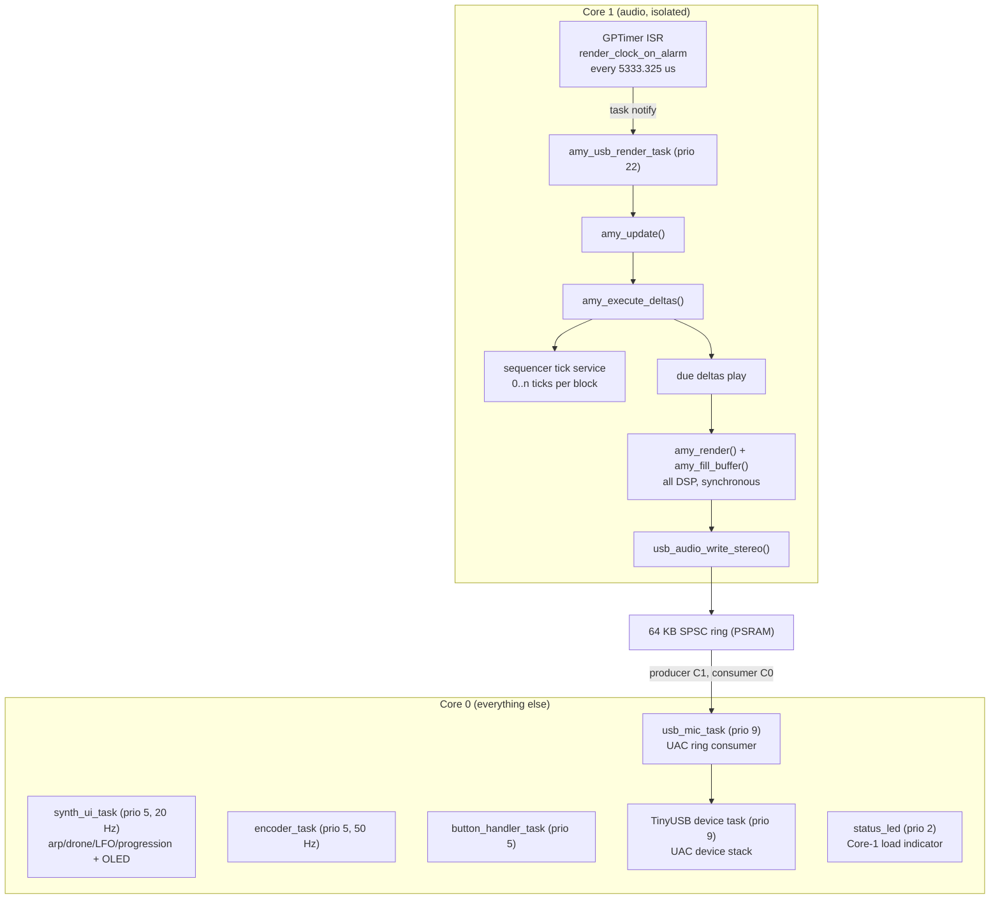
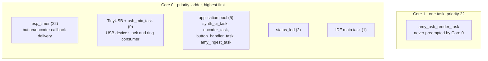
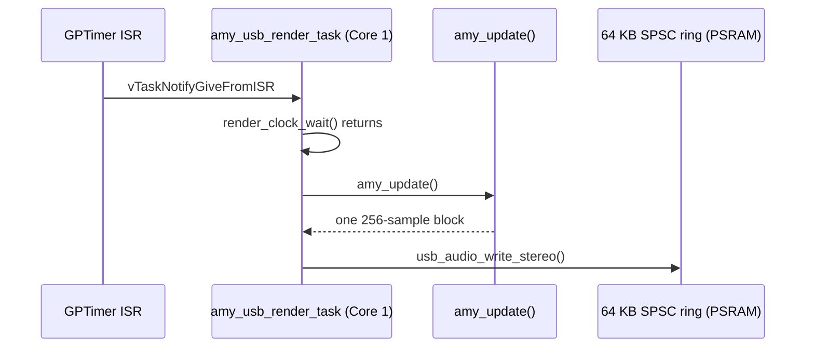
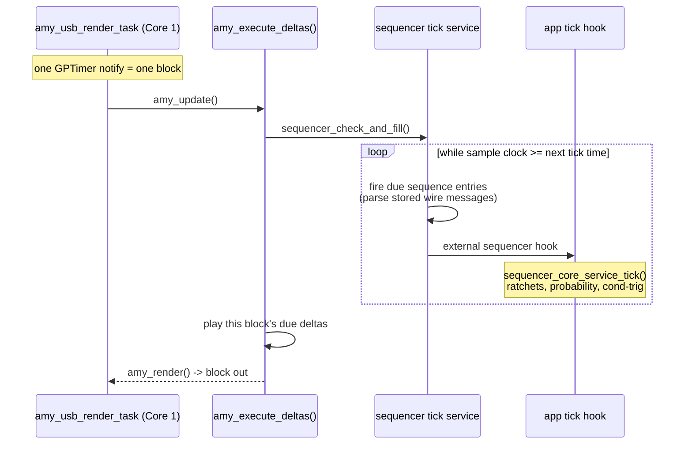

# Runtime Architecture - Tasks, Cores, Clocks

How the firmware is scheduled: which tasks exist, where they are pinned, what
clocks pace them, and how a rendered audio block travels from the DSP core to
the USB host. Feature-level design lives in the companion docs
([SEQUENCER-ARCHITECTURE.md](SEQUENCER-ARCHITECTURE.md),
[ARP-ARCHITECTURE.md](components/synth_core/ARP-ARCHITECTURE.md),
[DRONE.md](components/synth_core/custompatches/DRONE.md)); this one covers the
runtime skeleton they all sit on.

Kernel context: ESP-IDF FreeRTOS (the IDF dual-core kernel, not the Amazon SMP
kernel), 1000 Hz tick, and every task in the firmware is pinned to a core -
bound multiprocessing, no migration.

## System overview

Core 1 does exactly one thing: render one 256-sample block per timer tick and
push it into the ring - and "render one block" includes the sequencer, whose
tick service is the first thing `amy_update()` runs, on this task, before any
DSP. Core 0 owns UI, input, and USB egress; it has no part in the audio or
sequencer clock.

## Tasks

| Task | Name | Stack | Prio | Core | Role |
|---|---|---:|---:|---:|---|
| `amy_usb_render_task` (`main/main.c`) | `amy_render` | 8192 | **22** | **1** | Master render loop: wait for the GPTimer notify, `amy_update()` (sequencer tick + all DSP), write to the USB ring. |
| `synth_ui_task` (`components/synth_core/synth_ui/`) | `seq_ui` | 8192 | 5 | 0 | OLED UI at 20 Hz; services the arp/drone/LFO/progression engines; single display flush per frame. |
| `encoder_task` (`main/main.c`) | `encoder_task` | 8192 | 5 | 0 | Rotary-encoder poll at 50 Hz; routes detents by active view. |
| `button_handler_task` (`main/main.c`) | `button_task` | 8192 | 5 | 0 | Blocks on the button event queue; runs the full button dispatch (see SEQUENCER-ARCHITECTURE.md, Button Mapping). |
| `amy_ingest_task` (`components/synth_core/amy_helpers.c`) | `amy_ingest` | 8192 | 5 | 0 | AMY event pump: drains queued `amy_event`s into `amy_add_event()` off the render path, urgent decorated-step trig jobs first. |
| `encoder_init_task` (`main/main.c`) | `encoder_init_task` | 2048 | 5 | 0 | One-shot bring-up: encoder hardware, status LED, post-init heap report; self-deletes. |
| `usb_mic_task` (`components/usb_device_uac/`, vendored) | `usb_mic_task` | 4096 | **9** | 0 | Ring consumer; feeds the USB mic endpoint. |
| `tusb_device_task` (`components/usb_device_uac/`, vendored) | `TinyUSB` | 4096 | **9** | 0 | TinyUSB device stack: enumeration, control transfers, endpoint servicing. |
| `status_led` (`components/status_led/`) | `status_led` | 3072 | **2** | 0 | Onboard WS2812 showing Core-1 render load (see the component README). |

Priorities in one picture. The two cores schedule independently, and the render
task is the only task on Core 1 - no Core-0 priority, however high, can preempt
it. Core 0 then runs its own ladder: the system `esp_timer` task at 22 (it
delivers the button and encoder callbacks), the two USB tasks at 9, the
application pool at 5, the status LED at 2, and the IDF main task at 1. USB
egress therefore outranks everything interactive, which is what keeps the mic
endpoint fed while the UI is busy. (Dev builds with `CONFIG_DEV_SERIAL_HARNESS`
add the harness command task at 3, between the application pool and the LED.)

Button and encoder callbacks never run UI logic in callback context: the
`iot_button` component delivers events on the system `esp_timer` task, where a
thin shim only enqueues them; `button_handler_task` does the actual dispatch.

## Render clock - GPTimer

`main/render_clock.c` owns a single GPTimer configured for a 40 MHz resolution
(1 tick = 25 ns) with an auto-reload alarm of 213,333 ticks = 5333.325 us -
one 256-sample block at 48 kHz. The ISR is `IRAM_ATTR` and does nothing but
`vTaskNotifyGiveFromISR` to the render task; the timer is started from inside
the render task so the ISR registers on Core 1.

Two properties are deliberate and worth knowing before touching this code:

- **The granted resolution is read back, never assumed.** The GPTimer prescaler
  is a truncating integer divider of the 80 MHz APB clock, so only exact
  divisors are granted as requested. An earlier revision requested 3 MHz, which
  silently truncates to a prescale of 26 (3,076,923 Hz) - the render clock and
  therefore the sequencer tempo ran 2.56 % fast. The code now derives the alarm
  period from `gptimer_get_resolution()`'s answer, so a non-exact request
  becomes a visible error instead of a silent detune.
- **Strict 1:1 pacing.** If `render_clock_wait()` reports more than one elapsed
  tick (the previous block overran), the loop still renders exactly one block
  and only counts the overrun. There is no catch-up backlog, so AMY's block
  counter - and everything slaved to it, including sequencer tempo - stays
  locked to real time; the USB ring absorbs the jitter.

An opt-in alternative backend (`CONFIG_RENDER_CLOCK_I2S_ENABLE`) paces the same
seam with I2S DMA backpressure instead of a GPTimer; the GPTimer path is the
proven default.

## Sequencer clock - per block, on the render task

There is no sequencer timer. AMY's sequencer (vendored, v1.2.121) advances
inside `amy_execute_deltas()`, which `amy_update()` runs at the top of every
block - on the render task, Core 1. Each call compares the sample-derived
clock against a 64-bit next-tick accumulator and issues however many 48-PPQ
ticks have come due (usually 0 or 1; the block period is finer than one tick
up to roughly 234 BPM):

Consequences of this shape:

- **Tempo cannot drift against the audio.** The tick gate reads a clock derived
  from the count of rendered blocks, so sequencer time is sample time. A render
  stall delays ticks but never loses or compresses them.
- **Everything the tick does is on the render budget.** Scheduled events are
  stored as raw wire-message strings and parsed only when they fire; the fire
  path copies the message out under AMY's lock and parses outside it. Firing
  cost lands inside the 5333 us block budget, which is why the app-side tick
  hook (`sequencer_core_service_tick()` - the per-step ratchet/probability
  engine) confines itself to cheap decisions and enqueues real work elsewhere.
- **The scan is proportional to what is scheduled.** Occupied entries are
  threaded through the table as an ascending index list, so a tick walks only
  live entries rather than the full tag space.

The arp, drones, and sequencer UI all slave to the resulting tick counter; see
SEQUENCER-ARCHITECTURE.md for how steps, tags, and layers map onto it.

## USB egress - lock-free SPSC ring

`components/usb_audio/` owns a 64 KB single-producer/single-consumer ring in
PSRAM: the render task (Core 1) produces one block per tick, the vendored UAC
mic task (Core 0) consumes it for the USB host. No mutex crosses the cores -
each side publishes its own index with release ordering and reads the other's
with acquire ordering. Writes are all-or-nothing: when the host stops draining
and the ring fills, the whole block is dropped (and counted) rather than
spliced, so AMY's clock phase never bends to USB health. A Kconfig option
(`CONFIG_USB_AUDIO_BLOCKING_WRITE`) flips this to a blocking retry that slaves
the synth to the host's consumption rate instead. Details in
`components/usb_audio/README.md`.

## Why the affinity matters

- Audio runs alone on Core 1 so blocking I2C (OLED), USB churn, and input
  polling on Core 0 can never stall the 5333 us render budget.
- Nothing in the render loop or the GPTimer ISR may block, allocate, or log.
- When moving work between cores, measure the full per-core load (drivers, USB,
  timers, ISRs), not just the task being moved - `CONFIG_AMYSYNTH_RTOS_STATS`
  prints per-task and per-core figures, and the status LED gives an always-on
  coarse read of Core-1 load (see `components/status_led/README.md`).
