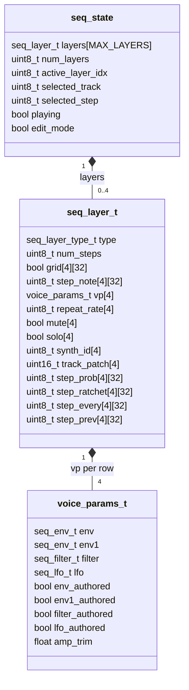
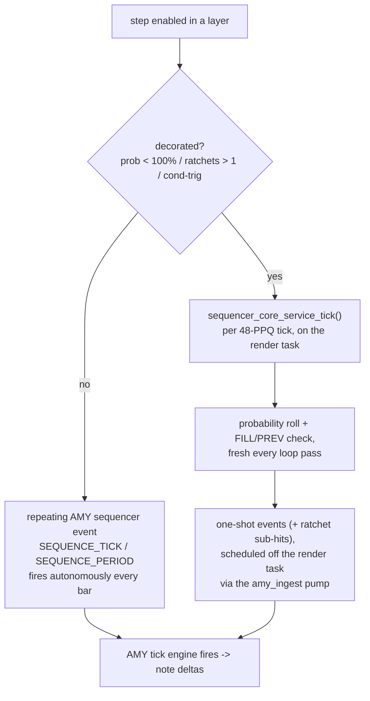
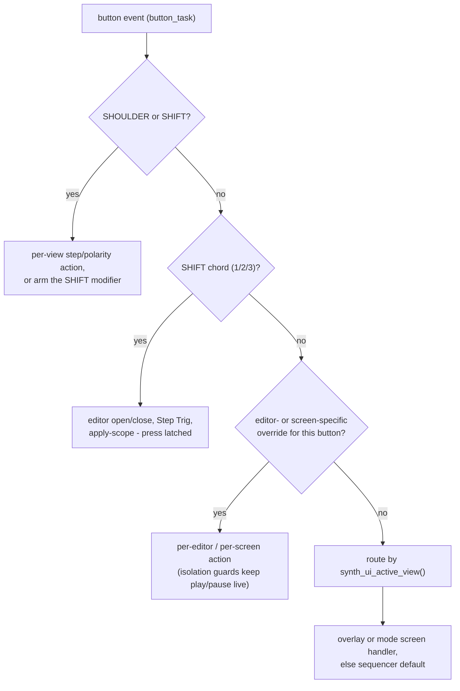
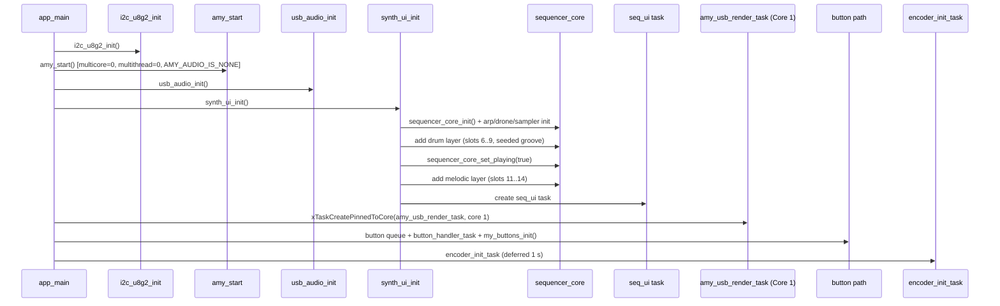

# Multi-Layer Sequencer Architecture

> Build target: ESP32-S3-N16R8, ESP-IDF 6.0.

---

## Overview

The sequencer is split into cooperating layers:

```
main.c  ──button events──▶  synth_ui/  ──state changes──▶  sequencer_core/  ──amy_add_event──▶  AMY engine
                            (FreeRTOS task + screens)         (engine TUs)
                                   │
                             display_*.c  ──u8g2──▶  SSD1306 OLED
```

| Layer | Location | Responsibility |
|---|---|---|
| UI / input | `components/synth_core/synth_ui/` | Encoder + button dispatch, per-screen input handlers, cursor navigation, layer cycling, OLED refresh (20 Hz task) |
| Audio core | `components/synth_core/sequencer_core/` | Owns all AMY scheduling; edits to grid, note, BPM immediately call `amy_add_event()` |
| Display | `components/display/display_seq.c` (and siblings) | Pure render functions; read flat view structs and drive U8g2 |
| Types / state | `sequencer_core/seq_model.h` | Shared data structures (`seq_layer_t` and friends) |

The engine side is split by concern rather than living in one file:

| File | Role |
|---|---|
| `seq_model.h` | data model (`seq_layer_t`, per-step decoration fields, LFO/filter/env types) |
| `seq_core_config.h` | compile-time limits, Kconfig fallbacks, synth-slot and tag layout |
| `seq_core_state.c` | layer table and lifecycle |
| `seq_core_engine.c` | tag scheduling, transport, mute/solo gating |
| `seq_core_trig.c` | per-step probability / ratchet / conditional-trig evaluation |
| `seq_core_synth.c` | patch loading, drum Synth/PCM engine switch |
| `seq_core_editors.c` | envelope / filter / LFO commits from the editors |
| `seq_core_tempo.c` | BPM |
| `seq_core_progression.c` | chord progression |

---

## Data Model

### `seq_layer_t`  (`sequencer_core/seq_model.h`)

One instance per active sequencer layer. Holds everything about a single
pattern. Abridged to its current field groups:

```c
typedef struct {
    seq_layer_type_t type;                        // SEQ_LAYER_DRUM | SEQ_LAYER_MELODIC
    uint8_t  num_steps;                           // 16 or 32
    uint8_t  num_tracks;                          // always SEQ_TRACKS (4)
    bool     grid[SEQ_TRACKS][SEQ_MAX_STEPS];     // step on/off
    uint8_t  step_note[SEQ_TRACKS][SEQ_MAX_STEPS];// per-step MIDI pitch
    uint8_t  track_base_note[SEQ_TRACKS];         // base pitch shown on OLED

    voice_params_t vp[SEQ_TRACKS];                // per-row EG0+EG1 envelopes, filter,
                                                  // LFO (each with deferred-authority
                                                  // flag) + output trim
    uint8_t  repeat_rate[SEQ_TRACKS];             // fires every N bars (1/2/4/8)
    bool     mute[SEQ_TRACKS];                    // per-track mute
    bool     solo[SEQ_TRACKS];                    // per-track solo (overrides mute)
    bool     chord_mode;                          // progression re-voices this layer
    uint8_t  chord_root;                          // chromatic 0-11
    chord_type_t chord_type;
    uint8_t  swing_pct;                           // odd 16ths delayed by % of a step

    uint8_t  synth_id[SEQ_TRACKS];                // one AMY synth slot per row
    uint16_t patch;                               // shared melodic timbre
    uint16_t track_patch[SEQ_TRACKS];             // per-track timbre (drum layer)
    uint16_t track_pcm_preset[SEQ_TRACKS];        // per-track PCM preset (drum/PCM)
    uint32_t synth_flags;
    uint8_t  num_voices;
    uint8_t  step_page;                           // display page 0|1 (32-step only)

    // per-step decorations (100/1/NONE = "plain" step, zero extra cost)
    uint8_t  step_prob[SEQ_TRACKS][SEQ_MAX_STEPS];      // 0..100 %
    uint8_t  step_ratchet[SEQ_TRACKS][SEQ_MAX_STEPS];   // 1..SEQ_MAX_RATCHET (4)
    uint8_t  step_every[SEQ_TRACKS][SEQ_MAX_STEPS];     // loop divisor, 1 = every pass
    uint8_t  step_prev[SEQ_TRACKS][SEQ_MAX_STEPS];      // 1 = only if prev attempt fired
    // further per-step fields (note transform, micro-timing nudge, velocity
    // offset, ratchet taper) exist in the model ahead of their UI
    ...
} seq_layer_t;
```

Two structural points worth noting:

- **`synth_id` is per row.** Both drum and melodic layers give every track its
  own AMY synth slot, which is what keeps same-pitch notes on different rows
  from collapsing into one voice and lets each drum track carry its own patch.
- **`voice_params_t` is the shared voice-config block.** The same struct is
  embedded by the arp (`s_arp.vp`) and the drone (`s_d.vp`), so the editors and
  the deferred-authority rules behave identically across all three engines.

### UI state

The UI-facing state (`seq_state`, owned by `synth_ui/synth_ui_state.c`) wraps
the layer array with cursor / edit-mode / active-layer bookkeeping and is read
by the pure renderers in `components/display/`. See `display_seq.h`.

### Compile-time limits (`seq_model.h`)

| Define | Value | Meaning |
|---|---|---|
| `SEQ_TRACKS` | 4 | Tracks per layer |
| `SEQ_STEPS` | 16 | Default steps for a new layer |
| `SEQ_MAX_STEPS` | 32 | Maximum per layer |
| `MAX_LAYERS` | 4 | Maximum simultaneous layers |



---

## AMY Scheduling

Plain steps are scheduled as **repeating AMY sequencer events** using
`SEQUENCE_TICK` / `SEQUENCE_PERIOD`. No FreeRTOS timer fires audio - all timing
is owned by the AMY tick engine driven by `amy_update()` in
`amy_usb_render_task`.

**Decorated steps take a different path.** A step whose probability is below
100 %, whose ratchet count exceeds 1, or which carries a conditional trigger
does not get a periodic tag at all: `sequencer_core_service_tick()`
(`seq_core_trig.c`) evaluates it once per loop iteration and schedules one-shot
events instead, so the probability roll and FILL/PREV conditions are decided
fresh on every pass.



The tick engine itself runs once per rendered audio block on the core-1 render
task, slaved to the sample clock - see
[RUNTIME-ARCHITECTURE.md](RUNTIME-ARCHITECTURE.md) for that clock chain.

### Tag layout

`SEQUENCE_TAG` is `uint32_t`. Tags are assigned by layer / track / step
position:

```
ON  tag = layer × (SEQ_TRACKS × SEQ_MAX_STEPS × 2)
          + track × SEQ_MAX_STEPS
          + step

OFF tag = ON tag + (SEQ_TRACKS × SEQ_MAX_STEPS)

Preview = MAX_LAYERS × (SEQ_TRACKS × SEQ_MAX_STEPS × 2)
          + layer × SEQ_TRACKS + track
```

With `MAX_LAYERS=4`, `SEQ_TRACKS=4`, `SEQ_MAX_STEPS=32` the full map
(`seq_core_config.h`) is:

| Range | Owner |
|---|---|
| 0-1023 | step ON/OFF events, all 4 layers |
| 1024-1055 | one-shot preview events (one per layer per track) |
| 1056-1119 | arpeggiator (`SEQ_ARP_TAG_BASE` .. `SEQ_ARP_TAG_MAX`) |
| 1120-1247 | ratchet one-shots for decorated steps (`SEQ_RATCHET_TAG_BASE` ..) |
| 1248-1631 | chord one-shots (`SEQ_CHORD_TAG_BASE` .. `SEQ_CHORD_TAG_MAX`) |
| 1632-1727 | chord preview one-shots (`SEQ_CHORD_PREVIEW_TAG_BASE` ..) |

`main.c` sets `amy_cfg.max_sequencer_tags = 1730`, clearing the highest used
tag (1727) with margin (AMY's `sequencer_add_wire()` rejects
`tag >= max_sequences` - see ARP-ARCHITECTURE.md).

### Period derivation

Each layer's bar period is `num_steps × SEQ_TICKS_PER_STEP` (where
`SEQ_TICKS_PER_STEP = AMY_SEQUENCER_PPQ / 4 = 12`).

| `num_steps` | Bar period (ticks) | Typical use |
|---|---|---|
| 16 | 192 | Standard 1-bar pattern |
| 32 | 384 | Extended 2-bar pattern |

When a 16-step layer and a 32-step layer run simultaneously, the 16-step
layer's period (192) divides evenly into the 32-step period (384), so the
shorter pattern **repeats exactly twice** per longer cycle - it never goes
silent.

A per-track **repeat rate** (`repeat_rate[track]`, values 1/2/4/8) stretches
this further: the track's steps fire only every Nth bar, evaluated in the trig
path.

### Gate widths

The two layer types gate differently:

| Layer type | Source | Shipped value |
|---|---|---|
| Drum | compile-time `SEQ_DRUM_GATE_NUMERATOR/DENOMINATOR` (Kconfig; this tree builds with 1/2) | 1/2 step = 6 ticks |
| Melodic | runtime per-layer `gate_pct` (10..100 % of a step, NoteFX-editable); the Kconfig ratio `SEQ_MELODIC_GATE_NUMERATOR/DENOMINATOR` (11/12) only seeds its boot default (92 %) | near-legato by default |

Drums honor note-offs (real patches, not one-shots), so the drum gate controls
choke vs. ring; the near-legato melodic default lets notes connect instead of
stabbing, and 100 % is full legato.

---

## AMY Synth Slot Assignment

| Consumer | Synth slots | Patch | Voices |
|---|---|---|---|
| Drum layer (layer 0) | **6-9** (one per track) | per-track from the curated drum list (defaults 58/245/221/220) or per-track PCM presets in PCM mode | 1 |
| Melodic layers | **11-62**, contiguous blocks of 4 from base 11 | `CONFIG_SEQ_MELODIC_PATCH`, shared across the layer's rows | 1 per row |
| Arp | **63** | `CONFIG_SEQ_ARP_DEFAULT_PATCH` | 4 |
| Drone | **64 / 65** (carrier / sub) | build-your-own or AMY preset | 5 / 1 |
| Drone (free-running mode) | **66 / 67** (carrier / sub) | build-your-own or AMY preset | chord size / 1 |

`main.c` sets `amy_cfg.max_synths = 68`. The melodic ceiling
(`SEQ_MAX_SYNTH = 62`) keeps layer blocks clear of the arp and drone slots.

The drum layer is a **per-track patch layer**: each of its 4 tracks owns a
dedicated synth slot in the fixed block 6-9 and loads its own patch. In
**Synth** mode that patch comes from a curated DX7/Juno drum list
(`seq_core_synth.c`); in **PCM** mode each track plays an AMY PCM preset
(808-style kick/snare/hat/clap by default). Note-offs are honored (flags = 0)
so each patch's own release shapes the tail; the drum gate (above) controls
choke vs. ring.

Default melodic base notes: **C4 / E4 / G4 / B4** (Cmaj7 voicing). Default
drum pitches: **39 / 45 / 53 / 82** (role-tuned per track). Both editable via
hold MY_BUTTON_2 + encoder. Drum **patch** selection is the patch-hold gesture
(MY_BUTTON_1 + encoder), cycling the selected drum track through the curated
list.

---

## Public API

`sequencer_core.h` is the engine's public surface. Representative slices (the
header is the source of truth - it has grown well beyond this list):

```c
/* Lifecycle / transport */
void sequencer_core_init(void);
void sequencer_core_set_playing(bool playing);
void sequencer_core_set_bpm(uint16_t bpm);
uint8_t sequencer_core_get_current_step(uint8_t layer_idx);

/* Layer management */
uint8_t          sequencer_core_add_layer(seq_layer_type_t type, uint8_t num_steps);
uint8_t          sequencer_core_get_num_layers(void);
seq_layer_type_t sequencer_core_get_layer_type(uint8_t layer_idx);

/* Per-layer step / note control */
void    sequencer_core_set_step(uint8_t layer_idx, uint8_t track,
                                uint8_t step, bool state);
void    sequencer_core_set_track_midi_note(uint8_t layer_idx, uint8_t track,
                                           uint8_t midi_note);

/* Per-track performance state */
void sequencer_core_set_track_mute(uint8_t layer_idx, uint8_t track, bool mute);
void sequencer_core_set_track_solo(uint8_t layer_idx, uint8_t track, bool solo);
void sequencer_core_set_track_repeat_rate(uint8_t layer_idx, uint8_t track,
                                          seq_repeat_rate_t rate);

/* Per-step decorations */
void sequencer_core_set_step_prob(uint8_t layer_idx, uint8_t track,
                                  uint8_t step, uint8_t prob);
/* ...ratchet, cond_type, cond_param accessors follow the same shape */
```

Mute/solo gating happens in one place - `sequencer_track_audible()`
(`seq_core_engine.c`): if any track in the layer is soloed, only soloed tracks
sound; otherwise un-muted tracks sound. Both the plain emit path and the
decorated-step trig path consult it.

---

## Button Mapping

Seven logical buttons (`components/my_buttons/`), dispatched by
`dispatch_button_event()` in `main/main.c`:

| Button (GPIO) | Gesture | Action |
|---|---|---|
| MY_BUTTON_0 (17) | single click | Cycle active layer; with an editor open: commit and close it |
| MY_BUTTON_0 (17) | long press | Toggle play / stop; with an editor open: cancel / discard it |
| MY_BUTTON_ENC (16) | press | Sequencer: toggle the focused step. Editors: toggle select <-> adjust. Menu and mode screens: activate the focused item |
| MY_BUTTON_SHOULDER (15) | press | Sequencer: toggle the step under the cursor (two-handed entry). ADSR editor: flip the EG1 sweep polarity |
| MY_BUTTON_1 (18) | held + encoder | Cycle the active screen's patch (drone / arp / selected drum track / melodic) |
| MY_BUTTON_1 (18) | press, per editor | Filter editor: toggle enabled. ADSR editor: cycle EG curve type. Progression screen: delete entry. Rename editor: save |
| MY_BUTTON_2 (8) | held + encoder | Transpose the selected track's base note (semitones) |
| MY_BUTTON_2 (8) | press, per screen | ADSR editor: toggle amp-edit mode. Progression screen: add entry. Track Options: delete shown layer. Rename editor: discard |
| MY_BUTTON_3 (42) | single click | Open / close the menu overlay; with an editor open: cycle editor pages (EG0 -> EG1 -> filter -> LFO); Step Trig popup: close |
| MY_BUTTON_SHIFT (47) | held | Chord modifier - a bare tap does nothing |
| SHIFT + 1 | chord | Open the ADSR editor, or close-commit whichever editor is open |
| SHIFT + 2 | chord | Toggle the Step Trig (probability / ratchet / cond-trig) popup |
| SHIFT + 3 | chord | Toggle apply-to-whole-layer scope inside the envelope / LFO editors |

Track Options additionally maps button 1 click = add melodic layer. BPM is set
via the menu overlay's `BPM` item, or with a bare encoder turn when
`edit_mode=false`.

Dispatch model: `iot_button` delivers events on the system `esp_timer` task,
where the callback only enqueues them (depth-16 queue in `main.c`; a full queue
drops rather than reorders); `button_handler_task` runs the routing cascade, so
no UI logic executes in timer-callback context. Precedence, first match wins:



The same `synth_ui_active_view()` resolver routes the encoder, so button and
encoder input always agree with the draw code about which screen is active.

---

## OLED Display Layout

```
[0,0]──────────────────────────────[127,0]
BPM 108   L0 DRM        ▶         y=8
──────────────────────────────────  y=10
CHH  □■□□ □■□□ □■□□ □■□□           y=20
ABD  □□□□ □■□□ □□□□ □■□□           y=30
Snr  □□□□ □□□□ □□□□ □□□□           y=40
CBl  □□□□ □□□□ □□□□ □□□□           y=50
──────────────────────────────────  y=57
[hint strip: current button roles]  y=57..63
```

- Header: `BPM NNN` | `LN TYP` (layer index + DRM/MEL) | ▶/▮▮ | `P1`/`P2` (32-step only)
- Track labels: per-track patch number (drum layer) or note name e.g. "C4", "C#4" (melodic layer)
- Label inverts (white-on-black) while MY_BUTTON_2 is held for the selected track
- Step cells: 5×5 px filled = active, outline = inactive
- Beat separators: vertical lines every 4 steps
- Playhead: XOR column over current step (only shown if step is on this page)
- Cursor: rounded rectangle around selected cell (edit mode only)
- Hint strip: bottom 7 rows, composited by the UI task after the screen fill

For 32-step layers the 16-cell window shown is `page × 16 .. (page+1) × 16 − 1`.
Scrolling the cursor past step 15 flips to page 1; past step 31 wraps to step 0
page 0.

All renderers are **fill-only**; `synth_ui_task` issues the single
`u8g2_SendBuffer` per redraw after compositing the hint strip, and only when a
view signature changed (the blocking ~20 ms I2C transfer is the scarce
resource).

---

## FreeRTOS Task Summary

Configured at creation (stack = words passed to `xTaskCreatePinnedToCore`):

| Task | Priority | Core | Stack | Rate |
|---|---:|---:|---:|---|
| `amy_render` | 22 | 1 | 8192 | Deadline-driven (one 256-sample block per GPTimer wake, 5333 µs) |
| `seq_ui` | 5 | 0 | 8192 | 20 Hz (`vTaskDelayUntil`, 50 ms); sized for AMY patch-string parses during deferred layer adds |
| `button_task` | 5 | 0 | 8192 | Blocks on the button event queue |
| `amy_ingest` | 5 | 0 | 8192 | AMY event pump (`amy_helpers.c`): drains queued `amy_event`s off the render path, urgent decorated-step trig jobs (`seq_trig_pump.c`) first |
| `encoder_task` | 5 | 0 | 8192 | 50 Hz poll |
| `status_led` | 2 | 0 | 3072 | 10 Hz tick (blink animation); one core-load sample per second |
| TinyUSB / UAC tasks | (component) | 0 | - | USB service, pinned to core 0 via sdkconfig |
| `esp_timer` | 22 | 0 | - | System timer callbacks (button events originate here, then queue out); the sequencer tick does not run here - it advances per block on the core-1 render task |

The `seq_ui` task owns one call path per frame: service the arp / drone /
progression / LFO engines, resolve the active view, build its flat view
struct, draw, composite the hint strip, and flush once. No AMY state is
touched outside the queued event API.

---

## Initialization Sequence

```
app_main
  ├── i2c_u8g2_init()
  ├── amy_start()              ← multicore=0, multithread=0, AMY_AUDIO_IS_NONE,
  │                              max_synths=68, max_sequencer_tags=1730
  ├── usb_audio_init()
  ├── synth_ui_init(u8g2)
  │     ├── amy_helpers_init()          (shared event scratch + mutex)
  │     ├── sequencer_core_init()
  │     ├── arp_core_init() / drone_core_init() / sample_rec_init()
  │     ├── add drum layer        → synth slots 6..9, seeded groove
  │     ├── sequencer_core_set_playing(true)
  │     ├── add melodic layer     → synth slots 11..14
  │     └── xTaskCreate(seq_ui task)
  ├── xTaskCreatePinnedToCore(amy_usb_render_task, core 1)
  ├── button queue + button_handler_task
  ├── my_buttons_init() + register_cb()
  └── encoder_init_task (deferred 1 s)
```

The same order expressed as a sequence diagram:



---

## Future Development Considerations

### More than 4 layers

Increase `MAX_LAYERS` in `seq_model.h`. The tag formula scales automatically
(raise `amy_cfg.max_sequencer_tags` to keep the arp and ratchet windows above
the step window). Memory impact per layer is dominated by the per-step
decoration arrays; the OLED shows one layer at a time, so display code is
unaffected. Melodic slot pressure: each layer consumes a block of 4 slots
between 11 and 62, so the practical ceiling is ~12 melodic layers before the
slot map, not memory, is the limit.

### Whole-layer mute / play-stop per layer

Per-track mute/solo (scoped within a layer) is implemented and editable from
TrackOpts. A whole-layer mute, or per-layer transport independent of the
global `sequencer_core_set_playing(bool)`, remains open.

### Saving patterns (NVS)

No persistence is implemented. `seq_layer_t` is a flat struct with no
pointers, so it is directly serialisable to NVS with `nvs_set_blob`. Key
design decision: use a fixed blob key per slot index (e.g. `"layer_0"`,
`"layer_1"`) and save the layer count separately. The chord progression and
the resampler's PCM capture are similarly RAM-only today.

### AMY `write_samples_fn` / future upstream UAC support

The current audio path is `AMY_AUDIO_IS_NONE` with `amy_usb_render_task`
manually calling `amy_update()` → `usb_audio_write_stereo()`. If AMY upstream
adds a proper ESP UAC path, migration would involve setting
`amy_cfg.audio = AMY_AUDIO_IS_USB_GADGET` and pointing
`amy_cfg.write_samples_fn` to a thin wrapper, eliminating
`amy_usb_render_task`. The sequencer core is unaffected by this change.
