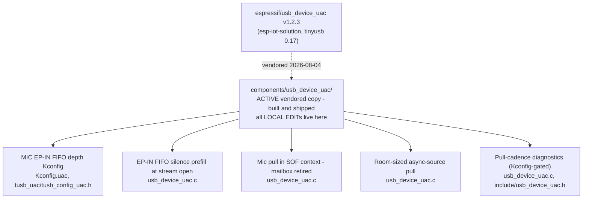

# usb_device_uac Local Edits

Edits applied on top of the vendored `espressif/usb_device_uac` component
(`components/usb_device_uac/`). Upstream source:
[esp-iot-solution](https://github.com/espressif/esp-iot-solution)
`components/usb/usb_device_uac`. Vendored base: **v1.2.3** (registry release,
vendored 2026-08-04), which pins `espressif/tinyusb ^0.17.0~2`.

All edits are marked `// LOCAL EDIT (S3-Amysynth)` in the source. The
component is vendored (not a managed dependency) precisely because these
edits exist; managed components are hash-checked and cannot be patched in
place.

⚠ **Version horizon:** upstream is now v1.3.x and pins TinyUSB **0.19**,
whose audio-class rework replaces `tud_audio_tx_done_pre_load_cb` /
`tud_audio_rx_done_post_read_cb` with `tud_audio_tx_done_isr` /
`tud_audio_rx_done_isr` running in **hard ISR context**. A naive re-vendor or
tinyusb bump compiles cleanly and streams silence: the mic-supply override
below simply stops being called. Do not bump either pin without re-porting
the supply path (the 0.19-correct form writes to the EP-IN FIFO from task
context via `tud_audio_write()`; `tu_fifo` is SPSC-safe).

## Active edits

### 1. MIC EP-IN FIFO depth as a Kconfig tunable

`Kconfig.uac` (`UAC_MIC_FIFO_DEPTH_MS`, default 10),
`tusb_uac/tusb_config_uac.h` (`CFG_TUD_AUDIO_FUNC_1_EP_IN_SW_BUF_SZ`).

Upstream hardwires the EP-IN software FIFO to `(MIC_INTERVAL_MS + 1)`
packets, which violates TinyUSB's EP-IN flow-control precondition (FIFO of
at least 4×Navg) and caps the fill level below the flow-control setpoint, so
the stream runs permanently about one packet above empty. The depth knob
sizes it in milliseconds instead.

Upstream status: PR candidate, offered as
[esp-iot-solution#764](https://github.com/espressif/esp-iot-solution/pull/764)
(formula-sizing variant; the Kconfig variant is mentioned in the PR body as
an alternative).

### 2. EP-IN FIFO prefill at stream open

`usb_device_uac.c`, `tud_audio_set_itf_cb` mic branch.

At stream open the FIFO is empty and flow-control corrections are capped at
one ±1-frame packet per 11 frames (~0.4%), so climbing from empty takes
seconds; any frame that catches the FIFO below one packet ships an audible
zero-length packet. Prefill with silence to one packet short of full: this
bridges the gap until the application's first audio arrives (the app ring is
flushed at open, so its first block can be a full render period away), then
drains to the setpoint silently via large packets. Mirrors the buffered
start the component already does for the speaker path.

Upstream status: a half-depth (setpoint-targeting) variant is part of
esp-iot-solution#764. The near-full variant is app-specific (trades stream-
open latency for the first-block gap) and stays local.

### 3. Mic pull in SOF context - the lossy chunk handoff retired

`usb_device_uac.c`: `usb_mic_task` and the one-slot
`mic_buf_read`/`mic_buf_write`/`mic_data_size` mailbox are deleted;
`tud_audio_tx_done_pre_load_cb` calls `input_cb` itself and writes straight
into the EP FIFO.

The stock design crossed two same-nominal-rate clocks (FreeRTOS tick
producer, SOF-clocked consumer) through a depth-1 handoff, silently dropping
a full chunk at every phase crossing - measured at ~0.75 chunks/s sustained
plus periodic ZLP bursts. Single clock in the supply path removes the race
at any clock offset. See commit d4b4040 for the full analysis.

Upstream status: PR candidate. On upstream's current TinyUSB 0.19 base the
same fix takes a different form (task-side direct FIFO write, since the
replacement callback runs in hard ISR context); the candidate diff is
written against upstream master accordingly.

### 4. Room-sized async-source pull

`usb_device_uac.c`, `tud_audio_tx_done_pre_load_cb`: the pull is sized by EP
FIFO room (whole frames) instead of a fixed nominal chunk, and short
`input_cb` returns are honored as the rate signal.

Available audio rides the FIFO high; TinyUSB's EP-IN flow control converts
fill level into 47/48/49-frame packets (±~2000 ppm of rate authority), so
the endpoint carries the device's true sample rate - the declared
asynchronous-source behavior - with zero loss at any clock offset and no
host-visible change. See commit fd12bc2.

⚠ **Contract coupling:** this edit REQUIRES the app-side `input_cb`
(`components/usb_audio/usb_audio.c`) to return only real audio - a callback
that zero-pads to the requested length would pin the FIFO full and scatter
inserted silence at the correction rate. The two ship together.

Upstream status: held back deliberately. It changes undocumented `input_cb`
semantics that existing integrations rely on; upstream-suitable only as an
opt-in mode with the callback contract documented. Offer after the part-3
candidate lands, if at all.

### 5. Pull-cadence diagnostics

`usb_device_uac.c`, `include/usb_device_uac.h`:
`uac_device_get_pull_stats()` - pre-load invocations, FIFO-room gate skips,
executed pulls, bytes pulled - compiled in only under
`CONFIG_AMYSYNTH_DROPOUT_TS` (defined in `components/diagnostics`).

The instrument that attributed the consumption deficit to its layer during
the dropout investigation. Permanent local edit; never an upstream
candidate.

## Dropped (merged upstream or retired)

| Item | Status |
|------|--------|
| (none yet) | #764 pending review; SOF-pull candidate prepared |

## Re-vendor checklist

On any usb_device_uac re-vendor or tinyusb version bump:

1. Read the version-horizon warning above; verify which callback set the new
   TinyUSB base uses and what context it runs in.
2. Re-apply or retire each edit above (retire = the upstream PR landed).
3. Verify `audiod_tx_packet_size()` in the resolved tinyusb version carries
   the corrected FIFO guard (`nominal*4 <= depth`,
   [hathach/tinyusb#3809](https://github.com/hathach/tinyusb/pull/3809));
   snapshots through 0.19.0~3 predate it.
4. Update the tinyusb pin note in `main/idf_component.yml`.
5. Re-run the dropout soak battery before trusting the stream.
