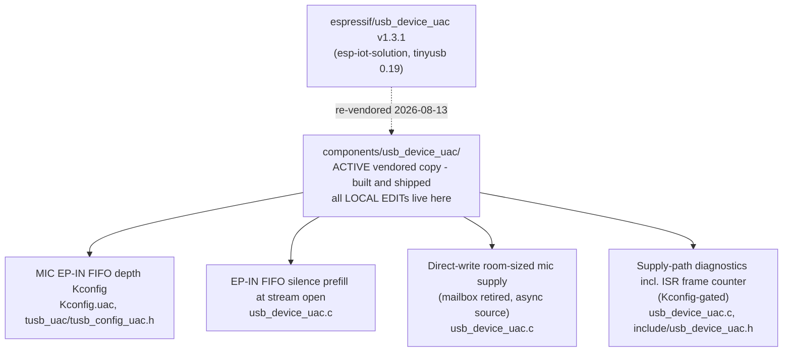

# usb_device_uac Local Edits

Edits applied on top of the vendored `espressif/usb_device_uac` component
(`components/usb_device_uac/`). Upstream source:
[esp-iot-solution](https://github.com/espressif/esp-iot-solution)
`components/usb/usb_device_uac`. Vendored base: **v1.3.1** (upstream master
db9f2f4, re-vendored 2026-08-13; previous base v1.2.3 on TinyUSB 0.17),
which pins `espressif/tinyusb ^0.19.0~3`.

All edits are marked `// LOCAL EDIT (S3-Amysynth)` in the source. The
component is vendored (not a managed dependency) precisely because these
edits exist; managed components are hash-checked and cannot be patched in
place.

The 0.19 base is load-bearing, not incidental: TinyUSB 0.19's audio class
re-arms the ISO IN endpoint in **ISR context** (`audiod_tx_xfer_isr`),
where 0.17 re-armed from `tud_task`. The 0.17 design dropped a frame
whenever task scheduling delayed the re-arm past the next IN token -
measured at ~0.74 missed service intervals/s (999.2565 completed
frames/s), heard as 1 ms of host-inserted silence about once a second,
invisible to every counter except the frame-service rate. Do not
downgrade the tinyusb pin. Note `0.19.0~3` still predates the
hathach/tinyusb#3809 flow-control guard fix - harmless at >=4-packet FIFO
depth, verify on any bump.

## Active edits

### 1. MIC EP-IN FIFO depth as a Kconfig tunable

`Kconfig.uac` (`UAC_MIC_FIFO_DEPTH_MS`, default 10),
`tusb_uac/tusb_config_uac.h` (`CFG_TUD_AUDIO_FUNC_1_EP_IN_SW_BUF_SZ`).

Upstream hardwires the EP-IN software FIFO to `(MIC_INTERVAL_MS + 1)`
packets, which violates TinyUSB's EP-IN flow-control precondition (FIFO of
at least 4x the nominal packet) at small intervals and leaves no jitter
margin. The depth knob sizes it in milliseconds instead.

Upstream status: PR candidate, offered as
[esp-iot-solution#764](https://github.com/espressif/esp-iot-solution/pull/764)
(formula-sizing variant; the Kconfig variant is mentioned in the PR body as
an alternative).

### 2. EP-IN FIFO prefill at stream open

`usb_device_uac.c`, `tud_audio_set_itf_cb` mic branch.

At stream open the FIFO is empty and flow-control corrections are capped at
one +-1-frame packet per 11 frames (~0.4%), so climbing from empty takes
seconds; any frame that catches the FIFO below one packet ships an audible
zero-length packet. Prefill with silence to one packet short of full: this
bridges the gap until the application's first audio arrives (the app ring
is flushed at open, so its first block can be a full render period away),
then drains to the setpoint silently via large packets.

Upstream status: a half-depth (setpoint-targeting) variant is part of
esp-iot-solution#764. The near-full variant is app-specific and stays
local.

### 3. Direct-write room-sized mic supply (mailbox retired, async source)

`usb_device_uac.c`: the one-slot `mic_buf_read`/`mic_buf_write`/
`mic_data_size` mailbox, its critical section, and the data-moving
`tud_audio_tx_done_isr` override are deleted; `usb_mic_task` writes
straight into the EP-IN FIFO with `tud_audio_write()` (`tu_fifo` is
single-producer single-consumer safe against the transfer ISR - the usage
`audio_device.h` recommends for clock-driven sources).

Two mechanisms in one edit:

- **Mailbox retirement**: the stock design crossed two same-nominal-rate
  clocks (FreeRTOS tick producer, USB-frame consumer) through a depth-1
  handoff, silently dropping a chunk at every phase crossing. Single
  writer into a real FIFO removes the race at any clock offset.
- **Room-sized async-source pull**: the pull requests whatever whole-frame
  room the FIFO has and honors short `input_cb` returns as the rate
  signal. Available audio rides the FIFO high; EP-IN flow control converts
  fill into 47/48/49-frame packets, so the wire carries the device's true
  sample rate (the declared asynchronous-source behavior) with zero loss
  at any clock offset.

⚠ **Contract coupling:** the room-sized pull REQUIRES the app-side
`input_cb` (`components/usb_audio/usb_audio.c`) to return only real
audio - a callback that zero-pads to the requested length would pin the
FIFO full and scatter inserted silence at the correction rate. The two
ship together.

Upstream status: the mailbox-retirement half is a PR candidate (prepared
against upstream master as a task-side direct-write change; on 0.17 bases
the same fix takes the pre-load-callback form). The room-sized half is
held back deliberately - it changes undocumented `input_cb` semantics, so
it is upstream-suitable only as an opt-in mode with the callback contract
documented.

### 4. Supply-path diagnostics (Kconfig-gated)

`usb_device_uac.c`, `include/usb_device_uac.h`:
`uac_device_get_pull_stats()` - {ISO service intervals completed, no-room
task skips, executed pulls, bytes pulled} - compiled in only under
`CONFIG_AMYSYNTH_DROPOUT_TS` (defined in `components/diagnostics`).

The service-interval counter increments in a minimal
`tud_audio_tx_done_isr` override (hard ISR context - counter increment
only, nothing else may go in that function). Its rate against a 1000/s
wall-clock expectation is the missed-service-interval instrument: the
0.17 base read 999.2565/s (the re-arm race); this base must read
~1000.000/s. Permanent local edit; never an upstream candidate.

## Dropped / superseded

| Item | Status |
|------|--------|
| SOF-context pull in `tud_audio_tx_done_pre_load_cb` (0.17 form, commit d4b4040) | Superseded by the 0.19 re-vendor: the callback no longer exists and its replacement runs in hard ISR; the same fix now takes the direct-task-write form (edit 3). |
| Pull-cadence pre-load counters (0.17 form, commit b11828c) | Re-homed as edit 4; `out[0]` changed meaning from pre-load invocations to ISR-counted service intervals (same rate-vs-1000 math). |

## Re-vendor checklist

On any usb_device_uac re-vendor or tinyusb version bump:

1. Verify which callback set the new TinyUSB base uses and what context it
   runs in; never let the supply path regress to task-context re-arm
   (the 0.17 missed-frame bug class).
2. Re-apply or retire each edit above (retire = the upstream PR landed).
3. Verify `audiod_tx_packet_size()` in the resolved tinyusb version carries
   the corrected FIFO guard (`nominal*4 <= depth`,
   [hathach/tinyusb#3809](https://github.com/hathach/tinyusb/pull/3809));
   snapshots through 0.19.0~3 predate it.
4. Update the tinyusb pin note in `main/idf_component.yml`.
5. Acceptance: frame-service rate ~1000.000/s via
   `uac_device_get_pull_stats`, plus a capture-morphology check for ~1 ms
   inserted-silence holes (host silence insertion is DITHERED - strict
   consecutive-zero scans are blind; use a near-zero template scan).
