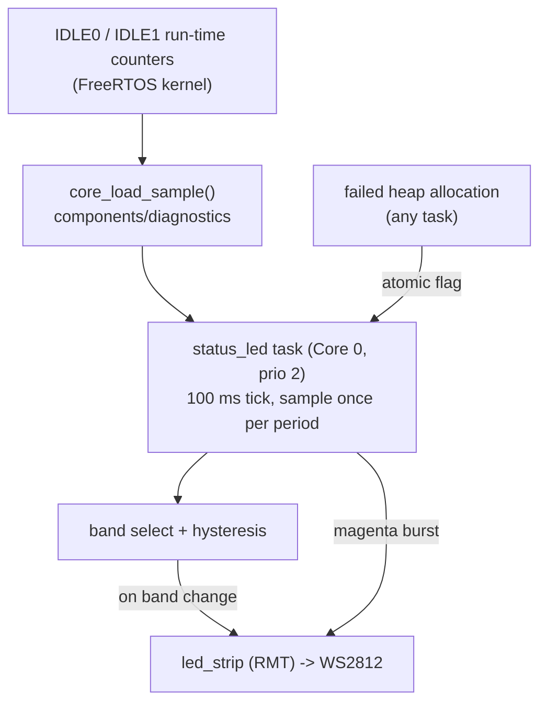

# status_led Component

Drives the board's onboard addressable RGB LED (WS2812) as a render-load
indicator: one glance tells you how much of the audio core's per-block budget
the current patch/pattern combination is using, without a serial console
attached.

## Features

- **Load color bands**: green below 50 %, yellow from 50 %, orange from 75 %,
  red from 90 % of core 1's busy share, with 5 % hysteresis at the band edges
  so the color does not flicker when the load sits on a boundary.
- **Luma-weighted colors**: the band colors are pre-normalized to roughly equal
  photopic brightness (R 0.30 / G 0.59 / B 0.11), so a green LED does not read
  as "louder" than a red one. `led_strip` has no gamma/luma facility of its
  own, so the weighting lives in the band table.
- **Allocation-failure blink**: a failed heap allocation is answered with a
  short magenta blink burst, after which the LED returns to the load color.
- **Write-on-change only**: the WS2812 latches its color, so the LED is
  rewritten only when the band actually changes - steady state is zero RMT
  traffic.

## Architecture

- `status_led.c`: the LED driver setup and the updater task.
- `include/status_led.h`: the public API and its contract.
- Uses the `espressif/led_strip` managed component (RMT backend, one LED) and
  the `core_load` sampler from `components/diagnostics`.

The updater is a low-priority task pinned to **core 0**, ticking at 100 ms for
the blink animation. A core-load sample is taken only once per
`CONFIG_AMYSYNTH_STATUS_LED_PERIOD_MS` window, so the steady-state cost is one
`uxTaskGetSystemState()` snapshot per period plus the occasional 24-bit RMT
frame. The alloc-failure hook runs in the context of whichever task's
allocation failed and only sets an atomic flag; the burst itself is animated by
the updater task.

### Load measurement

The displayed figure is the **per-core busy share derived from the IDLE task
run-time counters** - the delta of IDLE1's counter against wall time between
two samples. Nothing in the render path is instrumented: the audio task, the
DSP inner loops, and the USB write path are untouched by this component, so
turning the indicator on cannot perturb what it measures. Because the counters
attribute ISR time to the interrupted task, the figure is the whole core's
load (render task, timers, driver ISRs), not one task's slice.

Consequences worth knowing:

- The value is a **mean over the sample window**. Spikes shorter than the
  window average out; per-block spike analysis is what the `render_stats`
  diagnostic is for.
- It depends on the kernel's run-time-stats facility. Enabling the LED selects
  `FREERTOS_GENERATE_RUN_TIME_STATS` (which in turn selects
  `FREERTOS_USE_TRACE_FACILITY`), and that facility carries a small always-on
  scheduler cost. The clock source must stay the default
  `FREERTOS_RUN_TIME_STATS_USING_ESP_TIMER`, so counter time and wall time
  share one 1 MHz base.
- The first sample only captures a baseline and reports nothing; the LED holds
  the green band until the second one lands.

### Contract

`status_led_start()` is called once, from a core-0 task, after the scheduler is
running and init-time allocation is done - core 0 because the RMT backend
allocates its interrupt on the calling core and it must stay off the DSP core.
Every failure path (driver init, task creation) logs a warning and leaves the
module inert rather than aborting: the synth runs fine without its indicator.
With `CONFIG_AMYSYNTH_STATUS_LED` off, the whole API compiles to empty inline
stubs.

## Public API (`status_led.h`)

| Function | Purpose |
| --- | --- |
| `status_led_start()` | Create the LED driver, start the updater task, register the alloc hook |
| `status_led_notify_alloc_failure()` | Request a blink burst; one atomic store, any task context (not ISR-safe) |

## Configuration

Under **Component config -> Status LED**:

| Config | Default | Meaning |
| --- | --- | --- |
| `AMYSYNTH_STATUS_LED` | `y` | Master gate. Selects `FREERTOS_GENERATE_RUN_TIME_STATS`. |
| `AMYSYNTH_STATUS_LED_GPIO` | `48` | LED data line. ESP32-S3-DevKitC-1 v1.0 boards route it to GPIO48, v1.1 boards to GPIO38. |
| `AMYSYNTH_STATUS_LED_BRIGHTNESS` | `12` | Full-scale colors are scaled by `BRIGHTNESS/255`. Keep it low - the onboard LED is bright, and below ~8 the yellow/orange distinction is lost to 8-bit channel quantization. |
| `AMYSYNTH_STATUS_LED_PERIOD_MS` | `1000` | Load sample interval (200-5000 ms), i.e. the window the displayed load averages over. |
| `AMYSYNTH_STATUS_LED_ALLOC_BLINK` | `y` | Register `heap_caps_register_failed_alloc_callback()` for the magenta burst. |

## Notes

- The alloc callback fires on **every** failed allocation, including the first
  leg of a deliberate internal-then-PSRAM fallback. An occasional blink can
  therefore mean a graceful degrade rather than a hard out-of-memory
  condition.
- One LED needs a single 24-bit RMT frame, which fits the FIFO, so the driver
  runs without DMA.
