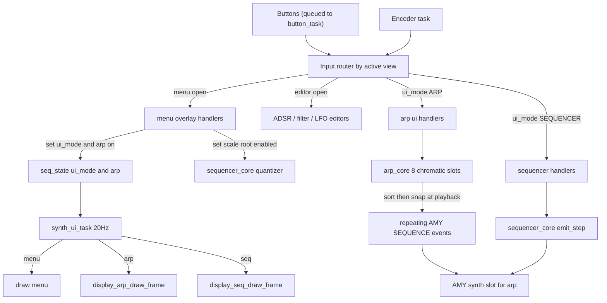
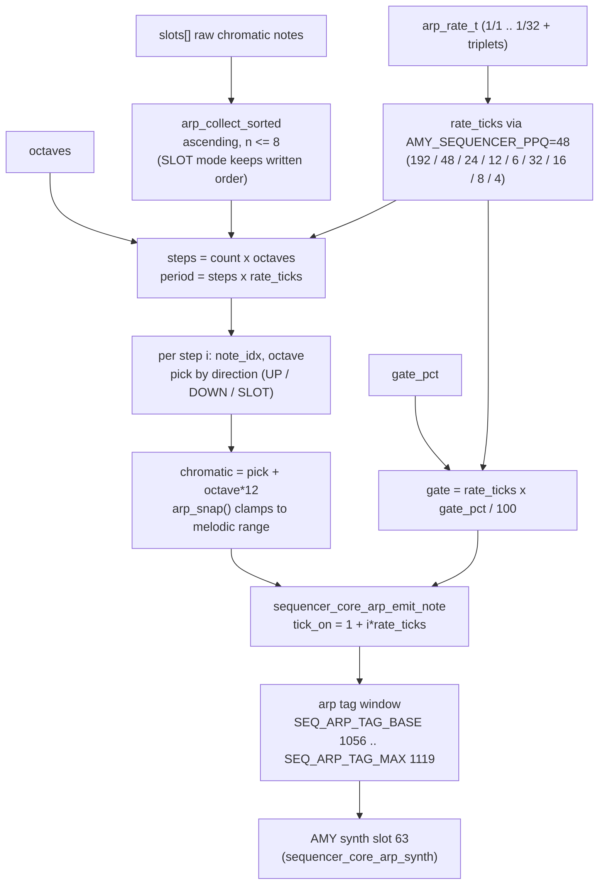
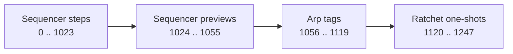

# Standalone Arpeggiator Architecture

> Build target: ESP32-S3-WROOM-1 (N16R8), ESP-IDF 6.0.
> Companion to `SEQUENCER-ARCHITECTURE.md`. Read that first — the arp reuses the
> sequencer's AMY event plumbing, mutex, and OLED task.

---

## Overview

The arpeggiator is a **second top-level screen** that runs **in parallel with**
the step sequencer, not inside it. It owns its own note inputs, its own
scale/root quantizer, its own dedicated AMY synth slot, and its own block of AMY
sequencer tags. It locks to the same global tempo as the sequencer by scheduling
**repeating AMY SEQUENCE events**, exactly like the sequencer's steps.

## Architecture



```
encoder / buttons ─▶ synth_ui/ ─▶ arp_core.c ─▶ sequencer_core/ ─▶ AMY engine
   (main.c)          (arp screen +     (arp model +   (shared event
                      dirty/service)    scheduling)     buffer + mutex)
                           │
                     display_arp.c ─u8g2─▶ SSD1306 OLED
```

| Layer | File | Responsibility |
|---|---|---|
| Arp model | `components/synth_core/arp_core.c` | Owns arp state (enabled, dir, octaves, rate, gate, scale, root, patch, source/wave, glide, 8 note slots + the shared voice params). Computes the note sequence and (re)emits it. |
| Voice layer | `components/synth_core/voice_config.c` | Shared with the melodic rows and drone: builds the 2-osc WAVE voice and wires the native AMY LFO. |
| AMY bridge | `components/synth_core/sequencer_core/` | `sequencer_core_arp_*` helpers: configure the arp synth, emit/clear arp tags through the shared event buffer + mutex. Owns the arp tag window. |
| UI / input | `components/synth_core/synth_ui/ui_screen_arp.c` | Arp screen cursor/edit state, builds the flat `arp_view_t`, dispatches encoder/button to `arp_*` setters, coalesces refreshes (`arp_core_service`). |
| Display | `components/display/display_arp.c` | Pure render of `arp_view_t` → U8g2. No arp logic. |
| View type | `components/display/display_arp.h` | `arp_view_t` flat struct + cursor index defines. |

**Design rule:** the arp is independent of the sequencer's layers. It never
reads or writes the layer array. The only things it shares are the global
tempo, the single AMY event buffer/mutex, and (when the chord progression is
enabled) the progression's root/scale updates.

### Emit path

From rate/tick input through `arp_core_refresh` to the AMY synth slot:



---

## Data Model

### `arp_state_t`  (`arp_core.c`, file-static `s_arp`)

```c
typedef struct {
    bool       enabled;
    arp_dir_t  dir;                   // ARP_UP | ARP_DOWN | ARP_SLOT
    uint8_t    octaves;               // 1..ARP_OCT_MAX (4)
    arp_rate_t rate;                  // 1/1, 1/4, 1/8, 1/16, 1/32 + triplets
    uint8_t    gate_pct;              // 10..100
    int16_t    slots[ARP_MAX_SLOTS];  // raw chromatic MIDI, -1 = empty,
                                      // ARP_REST (-2) = rest (SLOT mode)
    uint8_t    scale_index;           // arp's OWN quantizer scale
    uint8_t    root_note;             // arp's OWN quantizer root
    uint16_t   patch;                 // arp's OWN AMY patch (PATCH source)
    arp_source_t source;              // ARP_SRC_PATCH (default) | ARP_SRC_WAVE
    uint16_t   wave;                  // AMY waveform when source==WAVE
    voice_params_t vp;                // shared voice params: EG0/EG1 envelopes,
                                      // filter, native LFO (WAVE mode only),
                                      // amp trim — each deferred-authority
    uint16_t   portamento_ms;         // glide between pitches, 0 = off
} arp_state_t;
```

**Key decision — slots store RAW chromatic notes, not snapped notes.** The arp
snaps to its own scale/root only at *playback* (and for display via
`arp_get_slot_snapped`). The stored value never absorbs its own quantized
output, so repeated edits don't compound drift. `slots[]` is null-terminated:
the first `-1` ends the active set.

**Directions.** `ARP_UP` / `ARP_DOWN` play the sorted set ascending /
descending. `ARP_SLOT` plays the slots in their written order and honours
`ARP_REST` entries (a rest occupies a step of silence); UP/DOWN skip rests
entirely. On the UI, an empty slot turned down once becomes a REST, turned up
seeds a note at the arp root.

### `arp_view_t`  (`display_arp.h`)

Flat, render-only snapshot built fresh each frame. The renderer is pure — it
never calls back into `arp_core`. Cursor index space:
`0=ENABLE, 1=MODE, 2=OCT, 3=RATE, 4=GATE, 5=SOURCE, 6=WAVE, 7=GLIDE,
8..15 = slots 0..7` (WAVE is skipped in PATCH mode).

### Compile-time limits

| Define | Value | File | Meaning |
|---|---|---|---|
| `ARP_MAX_SLOTS` | 8 | `arp_core.h` | Note input slots |
| `ARP_OCT_MAX` | 4 | `arp_core.h` | Max octave span |
| `ARP_MAX_STEPS` | `ARP_MAX_SLOTS × ARP_OCT_MAX` = 32 | `arp_core.c` | Max distinct scheduled arp notes |
| `ARP_REST` | −2 | `arp_core.h` | Rest sentinel in `slots[]` |
| `ARP_PORTAMENTO_MAX_MS` | 2000 | `arp_core.h` | Glide ceiling |
| `ARP_RATE_COUNT` | 9 | `arp_core.h` | Rate subdivisions |

---

## AMY Scheduling

The arp builds a repeating pattern out of AMY SEQUENCE events, one note-on +
note-off pair per arp step, all sharing one **period** (the full arp cycle
length). AMY replays them every period forever until cleared.

### Tag window

The arp's tags sit **immediately above** the sequencer's tag space so the two
never collide. Defined in `sequencer_core/seq_core_config.h`:

```
sequencer step on/off : 0 .. MAX_LAYERS*SEQ_TRACKS*SEQ_MAX_STEPS*2 - 1   (0..1023)
sequencer previews    : 1024 .. 1024 + MAX_LAYERS*SEQ_TRACKS*2 - 1       (..1055)
─────────────────────────────────────────────────────────────────────────────────
SEQ_ARP_TAG_BASE  = 1056
SEQ_ARP_TAG_COUNT = ARP_MAX_SLOTS * ARP_OCT_MAX * 2 = 64
SEQ_ARP_TAG_MAX   = 1056 + 64 - 1 = 1119
─────────────────────────────────────────────────────────────────────────────────
ratchet one-shots     : 1120 .. 1247  (decorated sequencer steps)
```

Each arp step `i` uses tag `SEQ_ARP_TAG_BASE + i*2` (note-on) and `+1`
(note-off). With `ARP_MAX_STEPS = 32`, that's tags 1056..1119.

> **AMY tag bound.** AMY's `sequencer_add_wire()` (v1.2.121+) rejects
> `tag >= max_sequences`, fixing the historical off-by-one where a write at
> index `max_sequences` overran `sequences[]`. To stay clear, `main.c` sets
> `amy_cfg.max_sequencer_tags = 1280` (above the highest window at 1247).
> `sequencer_core_arp_emit_note()` also defensively drops any tag
> `> SEQ_ARP_TAG_MAX`. Keep `max_sequencer_tags`, `SEQ_ARP_TAG_BASE/COUNT`,
> the ratchet window, and the sequencer tag formula in sync.

The arp's slice of the global AMY tag ID space:



### Rate → ticks

`AMY_SEQUENCER_PPQ = 48`, so a 1/16 note = 12 ticks (matches the sequencer's
`SEQ_TICKS_PER_STEP`). Triplet rates fit three notes in the space of two.

| Rate | Ticks/note |
|---|---|
| `1/1` | 192 |
| `1/4` | 48 |
| `1/8` | 24 |
| `1/16` | 12 |
| `1/32` | 6 |
| `1/4T` | 32 |
| `1/8T` | 16 |
| `1/16T` | 8 |
| `1/32T` | 4 |

### Sequence computation (`arp_core_refresh`)

1. Collect non-empty slots — sorted ascending for UP/DOWN
   (`arp_collect_sorted`, bubble sort, n ≤ 8), written order (rests included)
   for SLOT.
2. `steps = count × octaves`; `period = steps × rate_ticks`;
   `gate = rate_ticks × gate_pct / 100` (min 1).
3. For each step `i`:
   - `note_idx = i % count`, `octave = i / count`.
   - pick by direction; a rest emits nothing for its step.
   - `chromatic = pick + octave*12`, then `arp_snap()` → clamp to melodic range.
   - `tick_on = 1 + i*rate_ticks`; emit on/off pair at `tag_base + i*2`.
4. Any previously-used arp tag not rewritten this pass was already cleared by
   `arp_clear_all()` at the top of `refresh`.

`tick 0` is reserved for "clear", so on/off ticks are forced ≥ 1.

---

## Sources: PATCH vs WAVE

`arp_set_source()` switches the arp synth between two voice models:

- **PATCH** (default): a normal AMY preset owns the oscillators. The stored
  LFO settings are retained but inactive (a patch's oscillator topology is
  its own).
- **WAVE**: a build-your-own 2-osc voice assembled by the shared
  `voice_build_wave()` (osc0 = carrier with the chosen waveform, osc1 =
  tempo-synced native AMY LFO wired by `voice_apply_native_lfo()`,
  `mod_source = 1`). This is the same voice model the drone and melodic WAVE
  patches use, so the LFO editor's targets (filter / amp / pitch / pan /
  wavetable scan) behave identically. Waves: SAW, SAW-UP, PULSE, TRIANGLE,
  SINE, NOISE, KS.

**Portamento** is AMY-native: `arp_set_portamento_ms()` sends one
`portamento_ms` event to the arp synth (0–2000 ms). It is re-pushed on every
rebuild because patch/source/wave changes reset AMY's internal glide state.

---

## AMY Synth Slot

| Consumer | Synth slots | Default patch | Voices |
|---|---|---|---|
| Drum layer | 6-9 (one per track) | curated drum list / PCM presets | 1 |
| Melodic layers | 11..62 (blocks of 4) | `CONFIG_SEQ_MELODIC_PATCH` | 1/row |
| **Arp** | **63** | `CONFIG_SEQ_ARP_DEFAULT_PATCH` (138) | 4 |
| Drone | 64 / 65 | build-your-own / preset | 5 / 1 |

The arp owns slot **63**, reserved above the melodic ceiling (62) so it never
collides with a melodic layer's per-row block. `main.c` sets
`amy_cfg.max_synths = 66` (the drone's sub slot 65 is the highest). The arp
synth uses 4 voices to allow note overlap at fast rates.

---

## Refresh Coalescing (performance)

Every arp setter changes scheduling, and a naive setter calls `arp_core_refresh()`
inline, which clears + re-emits up to 32 events — each through the shared AMY
event mutex on Core 0. A fast encoder spin through octaves/rate/gate would fire
one full re-emit per detent, flooding the mutex.

**Fix:** setters call `arp_mark_dirty()` (store value, set a flag) instead of
re-emitting. `arp_core_service()` performs at most one re-emit per call and is
invoked once per UI frame (20 Hz) from `synth_ui_task`. Fast edits collapse
into a single re-emit per 50 ms.

```c
// setter (arp_core.c)
void arp_set_octaves(uint8_t o) { ...; s_arp.octaves = o; arp_mark_dirty(); }

// once per frame (synth_ui_task)
arp_core_service();   // if dirty: arp_core_refresh(); else cheap no-op
```

`arp_set_patch()` is the exception — it only reconfigures the synth (no
re-schedule), so it does **not** mark dirty. `arp_core_init()` marks dirty once
so a boot-enabled arp emits on its first service tick.

> Companion optimization in `components/amy/src/sequencer.c`: the per-tick scan
> walks an **active-tag index** (only tags with live events) instead of
> `0..highest_tag`. The arp used to pin `highest_tag` at 1119 permanently,
> making every 500 µs tick scan ~1120 mostly-empty slots on Core 0. See
> `SEQUENCER-ARCHITECTURE.md` for that change.

---

## Public API

### `arp_core.h`

```c
/* Lifecycle */
void arp_core_init(void);
void arp_core_refresh(void);   // force immediate full re-emit
void arp_core_service(void);   // coalesced re-emit if dirty (call per frame)

/* Setters — each marks the arp dirty (except set_patch) */
void arp_set_enabled(bool);
void arp_set_direction(arp_dir_t);       // UP / DOWN / SLOT
void arp_set_octaves(uint8_t);           // 1..ARP_OCT_MAX
void arp_set_rate(arp_rate_t);           // 9 subdivisions incl. triplets
void arp_set_gate_pct(uint8_t);          // 10..100
void arp_set_scale(uint8_t);
void arp_set_root_note(uint8_t);
void arp_set_patch(uint16_t);            // reconfigures synth only
void arp_set_slot(uint8_t idx, int16_t chromatic_note);  // -1 clears, ARP_REST rests

/* Getters (for UI display) mirror the setters; plus: */
int16_t  arp_get_slot(uint8_t idx);          // raw chromatic, -1 = empty
int16_t  arp_get_slot_snapped(uint8_t idx);  // pitch actually played
uint8_t  arp_active_slot_count(void);

/* Portamento — pushed straight to the synth, does not mark dirty */
void     arp_set_portamento_ms(uint16_t ms); // 0..ARP_PORTAMENTO_MAX_MS (2000)
```

> This list is illustrative, not exhaustive — `arp_core.h` also exposes
> source/wave, ADSR (EG0/EG1), filter, LFO, and amp-trim setters/getters.
> Treat `arp_core.h` as the source of truth.

### `sequencer_core.h` (AMY bridge)

```c
uint8_t  sequencer_core_arp_synth(void);   // 63
uint8_t  sequencer_core_arp_voices(void);  // 4
uint32_t sequencer_core_arp_tag_base(void);// 1056
uint8_t  sequencer_core_clamp_melodic_note(int32_t);

void sequencer_core_arp_configure(uint16_t patch_number, uint8_t num_voices);
void sequencer_core_arp_emit_note(uint32_t tag_base, uint8_t midi_note,
                                  float velocity, uint32_t tick_on,
                                  uint32_t gate_ticks, uint32_t period);
void sequencer_core_arp_clear_note(uint32_t tag_base);  // clears base & base+1
```

---

## Screen, Input, and Isolation

### Screen selection

`ui_mode` is switched from the **menu overlay** ("Screen: Seq" / "Screen: Arp"
action items). The active view is resolved once per frame by
`ui_view_resolve.c`; the overlay precedence is:

```
step-trig popup > filter editor > LFO editor > ADSR graph > menu > mode screens > sequencer
```

The arp screen's input handlers only see events when the resolver says the arp
view is on top.

### Arp screen input

| Control | Action |
|---|---|
| Encoder turn (not editing) | Move cursor across fields then 8 slots (`ARP_CUR_*`) |
| Encoder turn (editing) | Adjust the focused field / slot value |
| `MY_BUTTON_ENC` short press | Toggle edit on the focused field |
| `MY_BUTTON_ENC` long press | Open ADSR graph editor (bound to arp) |
| `MY_BUTTON_1` hold + turn | Cycle the arp's OWN patch |
| `MY_BUTTON_3` single-click | Toggle menu overlay (or cycle editor tabs while one is open) |
| `MY_BUTTON_0` long-press | Global play/pause (shared with sequencer) |

### Seq/Arp isolation (`main.c`)

While the arp screen is active, all **sequencer-editing** gestures are blocked
so hidden sequencer state can't be mutated behind the arp view:

- `MY_BUTTON_2` drum-select is suppressed and its latch force-cleared (prevents
  a stuck "held" state if the screen switched mid-hold).
- `MY_BUTTON_0` single-click (layer cycle) is suppressed; long-press play/pause
  stays live.
- Step-toggle / track-note-nudge never reach the sequencer because the encoder
  path routes to the arp handlers while the arp view is active.

The arp's own controls and the `MY_BUTTON_1` arp-patch gesture remain live.

---

## OLED Display Layout (`display_arp.c`)

```
[0,0]──────────────────────────────────[127,0]
ARP:ON    UP            OCT:2            y=8   (macro row 1)
RATE:1/16     GATE:75%          P138     y=20  (macro row 2, patch right-aligned)
────────────────────────────────────────  y=26
[C3]  E3    G3    B3                      y=40  (slot row 0)
 --   --    --    --                      y=54  (slot row 1)
```

- **Macro row 1:** ARP enable, direction, octave span.
- **Macro row 2:** rate, gate %, and the **patch number** ("P138") right-aligned.
  The source/wave/glide readout shares the right-hand slot — see `display_arp.c`.
- **Patch name banner:** while patch-select is held, the patch's human name is
  drawn in a centered, cleared+framed box over the slot grid — mirroring
  the sequencer view. Only when `CONFIG_SEQ_PATCH_SHOW_NAMES` compiles the name
  table in; otherwise the block costs nothing.
- **Slots:** two rows of 4 cells; snapped note name, "--" for empty, or the
  rest marker. Selected cell framed; double-framed while editing.

The frame is only redrawn when a 32-bit FNV-1a signature of `arp_view_t`
changes; the draw itself is fill-only (the single `u8g2_SendBuffer` lives in
`synth_ui_task`).

---

## Boot Defaults (`Kconfig`, `arp_core_init`)

| Field | Kconfig | Default |
|---|---|---|
| enabled | `SEQ_ARP_DEFAULT_ENABLED` | n (off) |
| scale | `SEQ_ARP_DEFAULT_SCALE` | 1 (Major) |
| root | `SEQ_ARP_DEFAULT_ROOT_NOTE` | 40 (E2) |
| gate % | `SEQ_ARP_DEFAULT_GATE_PCT` | 75 |
| octaves | `SEQ_ARP_DEFAULT_OCTAVES` | 1 |
| patch | `SEQ_ARP_DEFAULT_PATCH` | 138 (DX7 E.Piano 1) |

`arp_core_init()` is called from `synth_ui_init()`, after
`sequencer_core_init()`. All slots start empty (`-1`); the arp produces no sound
until enabled and at least one slot is filled.

---

## Future Development Considerations

- **More slots / octaves.** Raising `ARP_MAX_SLOTS` or `ARP_OCT_MAX` grows
  `ARP_MAX_STEPS` and therefore `SEQ_ARP_TAG_COUNT`. You must also move the
  ratchet tag window up and raise `amy_cfg.max_sequencer_tags` (AMY
  off-by-one). Re-check the tag window comment in `seq_core_config.h`.
- **More arp directions** (up-down ping-pong, random). Add to `arp_dir_t` and
  extend the pick logic in `arp_core_refresh`; no scheduling/tag changes
  needed. (SLOT order and rests are already in.)
- **Per-slot velocity / accents.** `sequencer_core_arp_emit_note` already takes a
  velocity; add a `slot_vel[]` and plumb it through `arp_core_refresh`.
- **Tempo-change refresh.** Period is in ticks, so a BPM change retimes the arp
  automatically (AMY scales ticks). No re-emit needed unless `rate`/`octaves`/
  `slots` change. If a future feature needs a re-time, call `arp_core_refresh()`.
- **Persistence (NVS).** `arp_state_t` is a flat, pointer-free struct — directly
  serialisable with `nvs_set_blob`. Save under one key; re-emit via
  `arp_core_refresh()` after restore.
