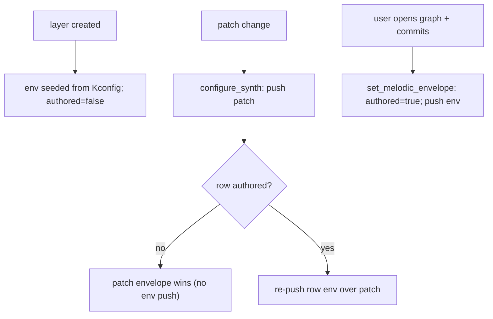

# synth_core Component

The application brain of S3-Amysynth: the multi-layer step sequencer engine,
every UI screen, the scale/chord quantizer, and the standalone instruments
(arpeggiator, stutter drone, FM voice, resampler). Everything here talks to
AMY exclusively through its queued event API and hands flat view structs to
the `display` component for rendering.

## Layout

**Top level**

| File | Role |
| --- | --- |
| `amy_helpers.c` | shared AMY event scratch + mutex (an `amy_event` is ~800 B and never lives on a task stack) |
| `amy_fx.c` | global FX cache and post-patch-load reassert (`synth_ui_fx_reassert_global`) |
| `quantizer.c` | scale tables and chord math (shared by grid, arp, progression, drone) |
| `arp_core.c` | arpeggiator engine — see [ARP-ARCHITECTURE.md](ARP-ARCHITECTURE.md) |
| `voice_config.c` | shared voice-parameter layer: builds 2-osc WAVE voices, wires the native AMY LFO |
| `graph_popup_amy.c` | AMY breakpoint ↔ graph-widget adapter for the envelope editor |

**`sequencer_core/`** — the engine, split by concern: `seq_model.h` (data
model), `seq_core_state.c` (layer lifecycle), `seq_core_engine.c` (tag
scheduling, transport, mute/solo), `seq_core_trig.c` (per-step
probability/ratchet/conditional trigs), `seq_core_synth.c` (patch loading,
drum Synth/PCM engines), `seq_core_editors.c` (envelope/filter/LFO commits),
`seq_core_tempo.c` (BPM), `seq_core_progression.c` (chord progression).

**`synth_ui/`** — the 20 Hz UI task (`synth_ui_task.c`), the per-screen input
handlers (`ui_screen_menu/arp/drone/prog/trackopts/stepedit/fxmenu/fm.c`),
the modal editors (`ui_editors.c`: ADSR graph, filter, LFO), the screen/overlay
precedence resolver (`ui_view_resolve.c`), patch cycling
(`ui_patch_cycle.c`), and the bottom hint strip (`synth_ui_hint.c`).

**`custompatches/`** — instruments and presets built on AMY's event API:
`drone_core.c` (see [DRONE.md](custompatches/DRONE.md)), `bass_presets.c`
(multi-osc bass patches with EG1-driven filter sweeps), `fm_presets.c` /
`fm_voice.c` (6-op FM presets + the live-editable FM voice, gated by
`CONFIG_SYNTH_CUSTOM_FM`), `sample_rec.c` (the 1.5 s output resampler).

## Highlights

- **Per-row synths everywhere.** Every track of every layer (drum and
  melodic) owns its own AMY synth slot: drums 6-9, melodic layers in blocks
  of 4 from slot 11 (cap 62), arp 63, drone 64/65. AMY routes note-on by
  `(synth, pitch)`, so shared slots would collapse same-pitch notes into one
  voice.
- **Non-blocking UI.** A dedicated FreeRTOS task (`seq_ui`, 20 Hz) services
  the arp/drone/progression engines, resolves the active view, and draws.
  Renderers are fill-only; the task issues one `u8g2_SendBuffer` per redraw,
  and only when a view signature changed.
- **AMY owns all musical timing.** Steps are repeating AMY sequencer events;
  decorated steps (probability / ratchet / conditional trigs) are evaluated
  per loop pass in `seq_core_trig.c`. No FreeRTOS timer fires audio.
- **One shared voice-parameter block.** `voice_params_t` (EG0 + EG1
  envelopes, filter, LFO, amp trim - each with a deferred-authority flag) is
  embedded per melodic row, by the arp, and by the drone, so editor behavior
  and patch-vs-user authority rules are identical across instruments.

## Initialization

`synth_ui_init(u8g2)` is the single entry point (called from `app_main` after
`amy_start()` and `usb_audio_init()`). It initializes the helpers, engine,
arp, drone and sampler, creates the boot drum + melodic layers, starts
playback, and spawns the UI task. Input arrives via
`synth_ui_handle_encoder(delta)` and the button dispatch in `main.c`.

## Melodic Envelope System

Melodic layers shape note onset/tail via an AMY EG0 envelope, with a second
envelope (EG1) available for modulation targets such as filter cutoff. The
system is layered: a compile-time **seed**, an optional **startup push**, and
a live **runtime editor**. These cooperate - they are not competing
implementations.

> **Synth model:** each **row** (track) owns its **own** AMY synth slot
> (`synth_id[track]`), so identical pitches on different rows allocate
> independent voices and each row has fully independent live envelopes,
> filter, and LFO. See *Per-row synths* above.

### Data flow

```
Kconfig defaults ──seed──> layer->vp[track].env ──push──> AMY synth (EG0)
                              ▲                            ▲
                              │                            │
                graph editor commit ────────────────────────
```

1. **Seed (compile-time).** On layer creation (`sequencer_core_add_layer`),
   every melodic row's `vp[track]` is initialised via
   `voice_params_init_defaults()`, with the EG0 values coming from
   `CONFIG_SEQ_MELODIC_ENV_*`. These are only the *initial* values of the
   per-row store.
2. **Push to AMY.** `sequencer_configure_melodic_envelope_track()` builds an
   AMY event (`bp_is_set[0]`, `eg_type[0]`, breakpoint times/values) and sends
   it, gated by `CONFIG_SEQ_MELODIC_ENVELOPE_ENABLED`. Only **authored** rows
   are pushed (see *Deferred authority*) - unauthored rows let the patch's own
   envelope play.
3. **Runtime edit.** The graph editor commits through
   `sequencer_core_set_melodic_envelope()`, which overwrites the same
   `vp[track].env` struct, marks the row **authored**, and immediately
   re-pushes to AMY. The EG1 breakpoint set follows the same path via its own
   store (`vp[track].env1`), switched in the editor with MY_BUTTON_3
   long-press.

### Deferred authority over patches

A patch preset carries its own envelope. We don't want a one-time custom curve
to permanently shadow every future preset on that row, so authority is
**deferred**:

- Each row's envelope has an `env_authored` flag (in `voice_params_t`),
  starting `false`.
- A **patch change** only re-imposes a row's stored envelope **if that row is
  authored**. Unauthored rows adopt the freshly-loaded patch's own envelope.
- A row becomes authored **only** when the user commits in the graph editor.
  Custom values are always *retained*, but they don't override a new preset
  until committed again.

The filter and LFO settings carry their own `filter_authored` /
`lfo_authored` flags with identical semantics.



Net effect: switch an *unauthored* row to a Juno preset and you hear Juno's
envelope; customize a row in the editor (authoring it) and it keeps your curve
across later patch changes.

### Kconfig options

| Config | Default | Meaning |
| --- | --- | --- |
| `SEQ_MELODIC_ENVELOPE_ENABLED` | `y` | Master gate for pushing any EG0 envelope to AMY. **If `n`, graph edits update the stored struct but never reach AMY** (the push is compiled out), so the editor appears broken. Keep `y` whenever the editor is used. |
| `SEQ_MELODIC_ENV_EG0_TYPE` | `0` | `0`=Normal (musical), `1`=Linear, `2`=DX7, `3`=True exp. Type `2` is for DX7 level tables and sounds wrong on a plain A/D/S/R breakpoint set. |
| `SEQ_MELODIC_ENV_ATTACK_MS` | `4` | Seed attack. Overwritten by editor commits. |
| `SEQ_MELODIC_ENV_DECAY_MS` | `250` | Seed decay. In the editor, decay time is **auto-derived** from attack + sustain (see *Locked sustain X*), so committed decay reflects the rule, not a dragged value. |
| `SEQ_MELODIC_ENV_SUSTAIN_PCT` | `30` | Seed sustain level (%). |
| `SEQ_MELODIC_ENV_RELEASE_MS` | `200` | Seed release. |
| `SEQ_ENV_DEBUG_DUMP` | `n` | Logs the exact breakpoint event sent to the row's synth on commit. Off for normal builds. |

The seed values are *not* stale once the editor exists - the editor writes the
exact same struct. Change them only if you want a different starting shape.

### Graph editor (`graph_popup_amy.c`, `synth_ui/ui_editors.c`)

- `graph_popup_amy.c` is the AMY↔widget adapter. It converts between AMY
  breakpoint arrays (times in ms, values 0..1) and the widget's normalised
  point model, prepending an implicit `(0,0)` origin.
- `synth_ui_graph_open_envelope()` seeds the 3-point editor (A/D/R, plus
  origin) from the bound target's stored envelope via `graph_seed_from_env()`.
- `graph_commit_to_env()` reads the points back, converts X→ms under the active
  range mapping, and commits to whichever instrument opened the editor. Edits
  reach AMY immediately on commit.
- **SHORT/LONG time range:** the X axis is linear in SHORT (2 s) and log-squashed
  in LONG (15 s). `graph_ms_to_x()`/`graph_x_to_ms()` are inverse mappings used
  on both seed and commit, so round-trips don't drift. The range auto-switches
  with hysteresis based on total envelope length.
- **Locked sustain X (auto-decay).** The sustain point is **Y-only**: the user
  sets its *level*, but its *X* (the decay time) is derived, not draggable. The
  widget enforces this via `graph_popup_set_adsr_lock_sx()`; the host
  recomputes S.x in `graph_recompute_decay()` after seeding and after every
  encoder edit. The rule (`graph_decay_ms()`, constants in `ui_editors.c`):

  ```
  decay_ms = clamp(DECAY_BASE_MS + attack_ms*DECAY_ATTACK_K
                   + (1 - sustain)*DECAY_SUSTAIN_SPAN_MS, MIN, MAX)
  ```

  i.e. **lower sustain → longer, more audible decay**, scaling gently with
  attack. `graph_commit_to_env()` reconstructs `decay = cum_d - cum_a`, which
  equals the derived value, so the committed `seq_env_t.decay_ms` carries the
  auto-decay.

### Voice sizing

Each row synth uses `SEQ_MEL_VOICES` voices (default **1** - a row only
sounds one pitch at a time). Bump to 2 for note-off/note-on overlap headroom
at the step boundary, at 2× oscillator cost. AMY's osc budget is **250**
(the AMY default); worst case (4 layers × 4 rows × 1 voice × ~6
oscs/DX7-voice) ≈ 96 oscs plus the drum, arp and drone slots - comfortably
under budget.

## Scale Table

| Index | Scale                   | Notes relative to root (e.g., C) | Character                                                        |
| ----- | ----------------------- | -------------------------------- | ---------------------------------------------------------------- |
| 0     | Chromatic               | C C# D D# E F F# G G# A A# B     | All 12 notes available; no scale restriction.                    |
| 1     | Major (Ionian)          | C D E F G A B                    | Bright, happy, conventional Western major scale.                 |
| 2     | Natural Minor (Aeolian) | C D D# F G G# A#                 | Darker, sadder, common minor scale.                              |
| 3     | Dorian                  | C D D# F G A A#                  | Minor feel with a brighter 6th; common in jazz and funk.         |
| 4     | Phrygian                | C C# D# F G G# A#                | Exotic, Spanish/Middle Eastern flavor due to the flat 2nd.       |
| 5     | Lydian                  | C D E F# G A B                   | Dreamy, floating sound because of the raised 4th.                |
| 6     | Mixolydian              | C D E F G A A#                   | Major-like but bluesier due to the flat 7th.                     |
| 7     | Minor Pentatonic        | C D# F G A#                      | Very common in blues, rock, and solos; hard to make wrong notes. |
| 8     | Major Pentatonic        | C D E G A                        | Open, melodic, folk/country sound; also very forgiving.          |
