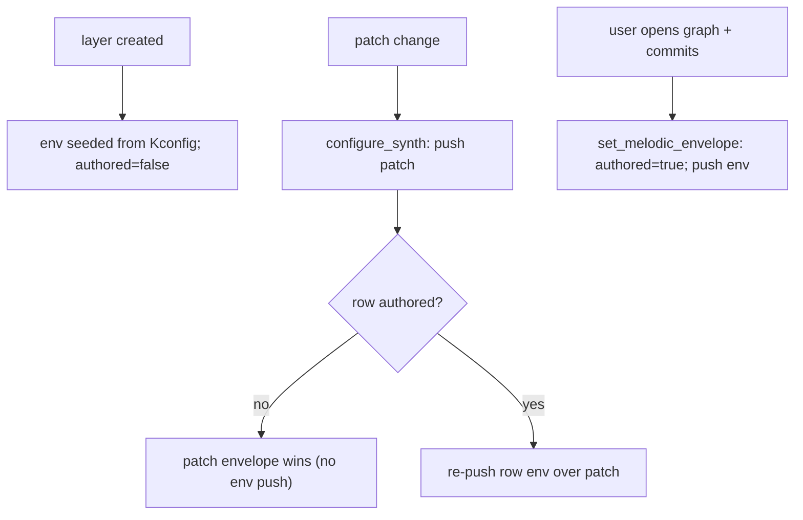

# synth_core Component

This component provides a minimal, non-blocking 16-step sequencer UI for the AMY synth project on an ESP32-S3 with a 128x64 OLED display.

## Features

- **4-Track x 16-Step Grid**: Displays 4 tracks (BD, SD, CH, OH) with 16 steps each.
- **Non-blocking UI**: Uses a dedicated FreeRTOS task (`synth_ui_task`) running at 20Hz to refresh the display without blocking audio processing.
- **Sequencer Timer**: A separate high-priority FreeRTOS task (`sequencer_timer_task`) handles BPM timing and schedules `amy_event`s for active steps.
- **Encoder Integration**: 
  - Rotating the encoder navigates the grid (in edit mode) or changes the BPM (in play mode).
  - Pressing the encoder button toggles the selected step (in edit mode) or toggles play/pause (in play mode).
- **Immediate Feedback**: Toggling a step immediately posts an `amy_event` to preview the sound.

## Architecture

- `synth_ui.c`: Contains the state machine, FreeRTOS tasks, and input handlers.
- `include/synth_ui.h`: Exposes the initialization and input handling functions.
- Relies on `display` for low-level display drawing helpers (`display_seq_draw_frame`).
- Relies on `amy` for audio synthesis and event scheduling.

## Usage

1. Initialize the display using `i2c_u8g2_init()`.
2. Call `synth_ui_init(u8g2)` with the initialized `u8g2_t` pointer.
3. In your encoder task, call `synth_ui_handle_encoder(delta)` when the encoder rotates.
4. In your button task/interrupt, call `synth_ui_handle_button()` when the encoder button is pressed.


## Melodic Envelope System

Melodic layers shape note onset/tail via an AMY EG0 envelope. The system is layered:
a compile-time **seed**, an optional **startup push**, and a live **runtime editor**.
These cooperate — they are not competing implementations.

> **Synth model:** each melodic **row** (track) owns its **own** AMY synth slot
> (`synth_id[track]`). Rows do not share a synth, so identical pitches on
> different rows allocate independent voices and each row has a fully independent
> live envelope. (Drums are the exception: one synth for all drum tracks, relying
> on MIDI-drum pitch separation.) See *Per-row synths* below.

### Data flow

```
Kconfig defaults ──seed──> layer->env[track] ──push──> AMY synth (EG0)
                              ▲                            ▲
                              │                            │
                graph editor commit ────────────────────────
```

1. **Seed (compile-time).** On layer creation (`sequencer_core.c`,
   `sequencer_core_add_layer`), every melodic row's `layer->env[track]` is
   initialised from `CONFIG_SEQ_MELODIC_ENV_*`. These are only the *initial*
   values of the per-row store.
2. **Push to AMY.** `sequencer_configure_melodic_envelope_track()` builds an AMY
   event (`bp_is_set[0]`, `eg_type[0]`, `eg0_times/values`) and sends it. This
   whole function is gated by `CONFIG_SEQ_MELODIC_ENVELOPE_ENABLED`. The layer-level
   `sequencer_configure_melodic_envelope()` only pushes rows that are **authored**
   (see *Deferred authority* below) — unauthored rows let the patch's own envelope
   play.
3. **Runtime edit.** The graph editor commits through
   `sequencer_core_set_melodic_envelope()`, which overwrites the **same**
   `layer->env[track]` struct, marks the row **authored**, and immediately
   re-pushes to AMY.

### Deferred authority over patches

A patch preset carries its own envelope. We don't want a one-time custom curve to
permanently shadow every future preset on that row, so authority is **deferred**:

- Each row has a `bool env_authored[track]` flag (`seq_layer_t`), starting `false`.
- A **patch change** (`sequencer_core_set_melodic_patch` → `configure_synth`) only
  re-imposes a row's stored envelope **if that row is authored**. Unauthored rows
  adopt the freshly-loaded patch's own envelope.
- A row becomes authored **only** when the user commits in the graph editor
  (`sequencer_core_set_melodic_envelope` sets the flag). Custom values are always
  *retained* in `layer->env[track]`, but they don't override a new preset until the
  user re-opens the editor and commits again.



Net effect: switch an *unauthored* row to a Juno preset and you hear Juno's
envelope; customize a row in the editor (authoring it) and it keeps your curve
across later patch changes. The `env_authored` flag is the single switch
implementing this; there is currently no UI to clear it (re-authoring just
overwrites with new committed values).

### Kconfig options

| Config | Default | Meaning |
| --- | --- | --- |
| `SEQ_MELODIC_ENVELOPE_ENABLED` | `y` | Master gate for pushing any EG0 envelope to AMY. **If `n`, graph edits update the stored struct but never reach AMY** (the push is `#ifdef`'d out), so the editor appears broken. Keep `y` whenever the editor is used. |
| `SEQ_MELODIC_ENV_EG0_TYPE` | `0` | `0`=Normal (musical), `1`=Linear, `2`=DX7, `3`=True exp. Type `2` is for DX7 level tables and sounds wrong on a plain A/D/S/R breakpoint set. |
| `SEQ_MELODIC_ENV_ATTACK_MS` | `10` | Seed attack. Overwritten by editor commits. |
| `SEQ_MELODIC_ENV_DECAY_MS` | `200` | Seed decay. Note: in the editor, decay time is **auto-derived** from attack + sustain (see *Locked sustain X*), so committed decay reflects the rule, not a dragged value. |
| `SEQ_MELODIC_ENV_SUSTAIN_PCT` | `60` | Seed sustain level (%). |
| `SEQ_MELODIC_ENV_RELEASE_MS` | `320` | Seed release. |
| `SEQ_ENV_DEBUG_DUMP` | `n` | Temporary HW verification. Logs the exact breakpoint event sent to the row's synth on commit (target synth, eg_type, A/D/S/R ms, sustain). Off for normal builds. |

The seed values are *not* stale once the editor exists — the editor writes the
exact same struct. Change them only if you want a different starting shape.

### Graph editor (`graph_popup_amy.c`, `synth_ui.c`)

- `graph_popup_amy.c` is the AMY↔widget adapter. It converts between AMY
  breakpoint arrays (times in ms, values 0..1) and the widget's normalised
  point model, prepending an implicit `(0,0)` origin.
- `synth_ui_graph_open_envelope()` seeds the 3-point editor (A/D/R, plus
  origin) from the **selected row's** stored envelope via `graph_seed_from_env()`.
- `graph_commit_to_env()` reads the points back, converts X→ms under the active
  range mapping, and calls `sequencer_core_set_melodic_envelope()`. Edits reach
  AMY immediately on commit.
- **SHORT/LONG time range:** the X axis is linear in SHORT (2 s) and log-squashed
  in LONG (15 s). `graph_ms_to_x()`/`graph_x_to_ms()` are inverse mappings used
  on both seed and commit, so round-trips don't drift. Toggling the range while
  editing preserves in-progress points (it re-maps current points rather than
  re-seeding from storage).
- **Locked sustain X (auto-decay).** The sustain point is **Y-only**: the user sets
  its *level*, but its *X* (the decay time) is derived, not draggable. The widget
  enforces this via `graph_popup_set_adsr_lock_sx()` + `adsr_x_editable()` (S.x
  nudges are ignored); the host recomputes S.x in `graph_recompute_decay()` after
  seeding and after every encoder edit. This removes the hidden decay-time control
  and the A/S marker overlap. The rule (`graph_decay_ms()`, all constants in
  `synth_ui.c`):

  ```
  decay_ms = clamp(DECAY_BASE_MS + attack_ms*DECAY_ATTACK_K
                   + (1 - sustain)*DECAY_SUSTAIN_SPAN_MS, MIN, MAX)
  ```

  i.e. **lower sustain → longer, more audible decay**, scaling gently with attack.
  `graph_commit_to_env()` reconstructs `decay = cum_d - cum_a`, which now equals the
  derived value, so the committed `seq_env_t.decay_ms` carries the auto-decay.

### Per-row synths

Each melodic row has its **own** AMY synth (`synth_id[SEQ_TRACKS]` in
`seq_layer_t`). All rows in a layer share the same patch, flags, and per-synth
voice count, but live on distinct synth slots. Consequences:

- **No cross-row voice collapse.** AMY routes note-on by `(synth, pitch)`. With a
  shared synth, two rows resolving to the same pitch on the same step collapsed
  onto one voice ("squashed / one note dominating"). Distinct synths fix this.
- **Independent envelopes.** Editing row 0's envelope then row 2's affects each
  row independently — there is no shared "active row" arbitration. (The old
  `s_active_env_track` concept was removed in this migration.)

**Slot allocation.** Drums use slot `SEQ_DRUM_SYNTH` (10). Melodic layers claim a
contiguous block of `SEQ_TRACKS` slots from a running counter
(`s_next_melodic_synth`, starting at `SEQ_MEL_SYNTH_BASE` = 11). The first
melodic layer gets 11..14, the next 15..18, etc. Allocation is guarded against
AMY's synth ceiling (`SEQ_MAX_SYNTH` = 63 < `max_synths` = 64).

**Voice sizing.** Each row synth uses `SEQ_MEL_VOICES` voices (default **1** — a
row only sounds one pitch at a time). Bump to 2 for note-off/note-on overlap
headroom at the step boundary, at 2× oscillator cost. AMY's default osc budget
is **180**; worst case (4 layers × 4 rows × 1 voice × ~6 oscs/DX7-voice) ≈ 96
oscs, comfortably under budget — and lower than the previous over-provisioned
16-voice shared pools.

### Build parameters for long test sessions

- Keep `SEQ_MELODIC_ENVELOPE_ENABLED=y` (else edits never reach AMY).
- Keep `SEQ_MELODIC_ENV_EG0_TYPE=0` (musical; type 2 sounds wrong here).
- Enable `USB_AUDIO_DIAGNOSTICS=y` for underrun/drop/ring-fill counters.
- Leave `USB_AUDIO_BLOCKING_WRITE` unset (drop mode preserves AMY clock
  alignment; blocking can mask real-time issues over a long run).
- Enable `AMYSYNTH_RTOS_STATS=y` to catch stack/load issues; consider raising
  `AMYSYNTH_RTOS_STATS_PERIOD_MS` to 15000–30000 so periodic dumps don't drown
  out the per-edit log line:
  `env L%u row%u -> A%u D%u S%u%% R%u` (emitted by `sequencer_core_set_melodic_envelope`),
  which confirms each commit landed.

## Scale Table

| Index | Scale                   | Notes relative to root (e.g., C) | Character                                                        |
| ----- | ----------------------- | -------------------------------- | ---------------------------------------------------------------- |
| 0     | Chromatic               | C C# D D# E F F# G G# A A# B     | All 12 notes available; no scale restriction.                    |
| 1     | Major (Ionian)          | C D E F G A B                    | Bright, happy, conventional Western major scale.                 |
| 2     | Natural Minor (Aeolian) | C D D# F G G# A#                 | Darker, sadder, common minor scale.                              |
| 3     | Dorian                  | C D D# F G A A#                  | Minor feel with a brighter 6th; common in jazz and funk.         |
| 4     | Phrygian                | C C# D# F G G# A#                | Exotic, Spanish/Middle Eastern flavor due to the flat 2nd.       |
| 5     | Lydian                  | C D E F# G A B                   | Dreamy, floating sound because of the raised 4th.                |
| 6     | Mixolydian              | C D E F G A A#                   | Major-like but bluesier due to the flat 7th.                     |
| 7     | Minor Pentatonic        | C D# F G A#                      | Very common in blues, rock, and solos; hard to make wrong notes. |
| 8     | Major Pentatonic        | C D E G A                        | Open, melodic, folk/country sound; also very forgiving.          |
