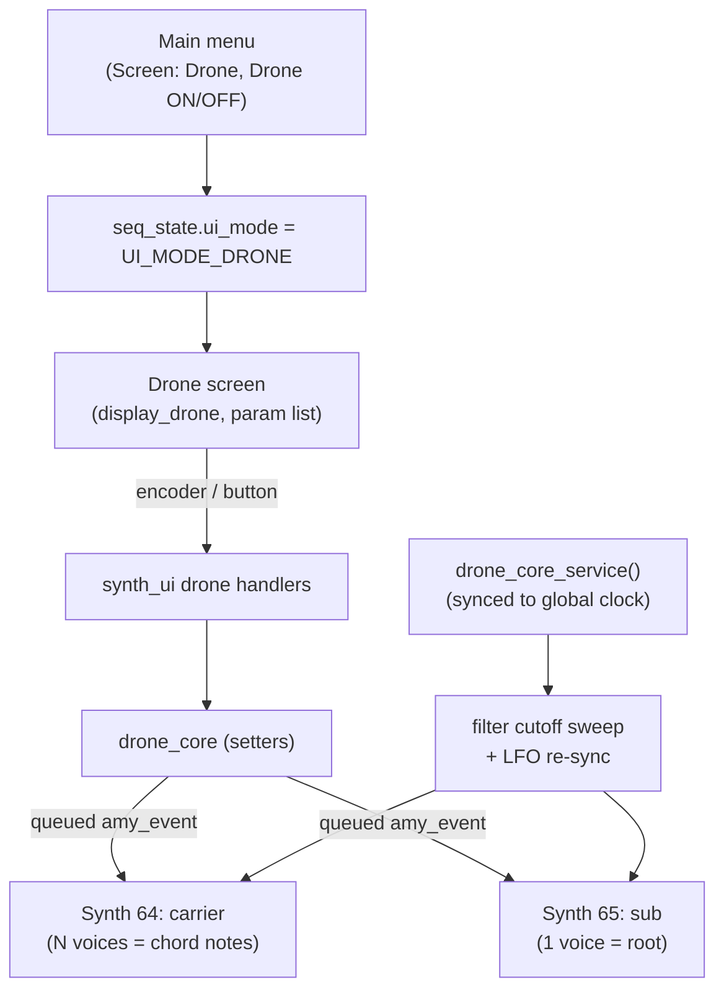

# Stutter House Drone — Architecture

A standalone, tempo-synced **drone synth** translated from an AMYboard
"stutter house drone" Python sketch. It is fully independent of the sequencer
layers and the arp — its own AMY synth slots, its own state, its own screen,
reached from the main menu. It is the first inhabitant of the
`custompatches/` subfolder, intended as the home for future custom patches.

```
SAW/SQUARE/TRI/SINE carrier, gated by a square LFO (the "stutter"),
through an LPF24 whose cutoff sweeps slowly. The carrier plays a CHORD;
a mono sub tracks the chord root an octave below. Everything (stutter
rate, sweep period, ADSR fade) locks to the global BPM.
```

## Files

| File | Role |
|---|---|
| `custompatches/drone_core.c` / `include/custompatches/drone_core.h` | The engine: state, AMY synth config, note scheduling, tempo-locked service. |
| `../display/display_drone.{c,h}` | The screen renderer (scrollable label:value list). |
| `synth_ui.c` | Glue: init, per-frame service, render branch, the parameter-list screen logic, menu items, input handlers. |
| `main/main.c` | Sets `amy_cfg.max_synths = 66`; routes drone-screen input. |

The module mirrors the **arp module** pattern 1:1 (standalone engine + own synth
slots + own screen, driven from the menu). If you understand `arp_core`, you
understand this.

## Signal flow



## AMY voice model (WAVE mode)

Each carrier synth is a **build-your-own (no patch)** instrument with
`oscs_per_voice = 2`:

- **osc1 = PULSE LFO.** Absolute Hz (`freq_coefs[COEF_NOTE]=0`), `amp const=1`,
  duty 0.5. Runs continuously. Its bipolar output (−1..+1) is the stutter source.
- **osc0 = carrier.** NOTE-following (`freq_coefs[COEF_NOTE]=1`) so each voice's
  pitch comes from its note-on (this is what lets the synth play a chord).
  `mod_source = 1` points at osc1 of the same voice. `filter_type = LPF24`,
  `resonance`, and `filter_freq` (swept) on top.

### How the amplitude / stutter math actually works

AMY combines amp coefficients with `combine_controls_mult` (amy.c), **not** a
sum. CONST/NOTE/VEL/EG0/EG1 are pure multipliers; MOD/BEND apply as
`(1 + coef·control)`. So the carrier amplitude is:

```
amp = amp_const · eg0 · (1 + amp_mod · LFO)        LFO ∈ {−1, +1}
```

- `amp_const` (0..1): the always-on level.
- `amp_mod`   (0..1): stutter depth. On the LFO-low half `amp = const·(1−mod)`
  → reaches **silence at mod=1** (true hard gate); on the high half
  `amp = const·(1+mod)`.
- `eg0`: the ADSR envelope (see below), multiplying the whole thing — so the
  envelope shapes the drone swell/fade **around** the LFO chop.

These map 1:1 to the Python `amp={'const':x,'mod':y}` wire values and are exposed
directly as the **CONST** and **MOD** screen rows (0.0–1.0, 0.1 steps).

> **Historical note / gotcha:** an earlier version derived a single "MIX" knob
> as `const = total·(1−mix)`, `mod = total·mix`. Because AMY *multiplies* and
> *skips zero coefs* (`if (coef != 0)`), this produced a cliff: at 95% mix the
> tone was near-silent, but at 100% `const` hit exactly 0, got skipped, and the
> level jumped to full. Exposing `const`/`mod` directly removes the remap and the
> discontinuity. Keep `const` > 0 to avoid the same skip.

## Chords

The carrier plays a **chord**, one AMY voice per note. Presets live in a fixed
width-5 MIDI matrix in `drone_core.c` (`-1` = unused), so the main synth is sized
to each chord's note count:

| Preset | Notes (MIDI) |
|---|---|
| Am7   | A2 C3 E3 G3 |
| Fmaj7 | F2 A2 C3 E3 |
| Dm9   | D2 F2 A2 C3 E3 |
| Cmaj9 | C3 E3 G3 B3 D4 |
| Gsus4 | G2 C3 D3 G3 |

`drone_set_chord()` releases the old chord's held notes, rebuilds the main synth
to the new voice count, then re-triggers — so switching to a smaller chord never
leaves voices stuck on.

The **sub** stays a single voice at `chord_root + sub_interval` (default −12).
This is deliberate: low frequencies + polyphony invite phase cancellation, so the
low end is kept mono.

## Tempo sync

`drone_core_service()` runs once per UI frame (20 Hz), like `arp_core_service()`.
Two jobs, both derived from `seq_state.bpm`:

1. **Stutter LFO** — `LFO_Hz = (BPM/60) · mult`, re-sent to osc1 when the BPM
   changes. Multipliers: `1/4 = ×1, 1/8 = ×2, 1/16 = ×4, 1/32 = ×8`. This matches
   the **arp's** convention (arp `1/16` = 12 ticks @ 48 PPQ = one event per
   sixteenth note), so a drone "1/16" stutter pulse lands on the same grid as an
   arp "1/16" note onset. One square cycle (on+off) spans one named note.
2. **Filter sweep** — a sine LFO over the cutoff between `sweep_lo` and
   `sweep_hi`, with a period of `sweep_bars` bars. Its phase is a **pure function
   of `sequencer_ticks()`** (AMY's 48-PPQ musical clock — the same one the
   sequencer and arp ride), NOT of the UI frame rate: one bar = `48*4 = 192`
   ticks, `phase = 2π · (tick % period_ticks) / period_ticks`. This makes the
   sweep frame-rate-independent (UI jitter or skipped frames cannot drift it) and
   genuinely beat-locked — it advances with tempo automatically and stays
   coherent with the bar grid across BPM changes. Re-sent to osc0 each service
   call; the sub uses `cutoff × 0.5`.

   > Earlier this accumulated a fixed `frame_dt = 0.050` per `service()` call,
   > assuming the UI task ticked at exactly 20 Hz. That was fragile: the UI task
   > does blocking I2C and competes on Core 0, so real elapsed time ≠ 50 ms and
   > the sweep drifted with load. Deriving phase from the absolute tick count
   > removes the dependency entirely.

`drone_set_enabled()` fires sustained note-ons (enable) / note-offs (disable); on
disable the ADSR **release** fades the chord out in time with the tempo-set
envelope.

## ADSR envelope (shared graph editor)

The drone reuses the existing ADSR **graph_popup** editor (the same widget the
melodic layers and the arp use). On the drone screen, **MY_BUTTON_ENC
long-press** opens the editor bound to the drone (`graph_target_t` =
`GRAPH_TGT_DRONE` in `synth_ui.c`); commit calls `drone_set_envelope()`.

- The envelope is **deferred-authority**: not pushed until the user commits, so
  an un-edited drone holds at full sustain (EG0 = 1.0 on a held note). Once
  authored, it is re-applied after any rebuild/source/chord change.
- It is pushed via the shared `sequencer_core_push_envelope(synth, env)` helper
  (the same EG0 breakpoint delta path the melodic layers use), to both the main
  and sub synths.

## PATCH mode

`drone_set_source(DRONE_SRC_PATCH)` loads an AMY patch preset onto the carrier
synth instead of the raw 2-osc voice. The patch owns its own oscillators and
amplitude, so:

- The **square-LFO stutter** and the **CONST/MOD** controls do **not** apply
  (WAVE-only). Those rows are hidden on the screen in PATCH mode.
- The **chord voicing, filter sweep, and resonance** still apply (filter +
  resonance are overlaid on the patch's osc0).
- Patches can be sensitive: a quiet/bandlimited patch fed through `LPF24` at a
  given cutoff/resonance can be filtered toward silence or have a single partial
  resonate. That is the filter interacting with the patch's fixed spectrum, not
  an amp issue.

## Synth slots & tag budget

| Slot range | Owner |
|---|---|
| 6–9 | drum layer |
| 11–62 | melodic layers |
| 63 | arp |
| **64** | **drone main carrier** (`DRONE_SYNTH_MAIN`) |
| **65** | **drone sub** (`DRONE_SYNTH_SUB`) |

`main/main.c` sets `amy_cfg.max_synths = 66`. AMY's instrument table is sized
from config (`instruments_init(config.max_synths)`), and `max_oscs = 180` leaves
ample headroom (5-voice main × 2 oscs + sub = ~12 oscs).

**Sequencer tags: zero.** The drone uses **direct** (immediate, non-scheduled)
note-on/param events, so it consumes no entries in AMY's `sequences[]` table —
no interaction with the sequencer/arp tag windows.

## Concurrency / safety

All AMY interaction goes through the queued event API (`amy_add_event`) using a
module-private scratch `amy_event` + mutex (`amy_event` is ~800 B and must never
sit on a task stack). The drone **never** touches `synth[]` directly — this
respects the `amy_render` lock fix (the render path walks `synth[]` under the
queue lock; all config/notes must be deltas). See `AMY-EDITS.md`.

## Input map (drone screen)

| Control | Action |
|---|---|
| Encoder turn | Move cursor / (in edit) adjust the focused row's value |
| MY_BUTTON_ENC short press | Toggle edit on the focused row |
| MY_BUTTON_ENC long press | Open the ADSR graph editor (bound to the drone) |
| MY_BUTTON_1 hold + turn | Cycle PATCH preset (PATCH mode only) |
| MY_BUTTON_3 | Menu toggle (global) |
| MY_BUTTON_0 long press | Play/stop (global) |

A drone-screen isolation guard in `main.c` (mirroring the arp guard) suppresses
the sequencer's editing gestures while the drone screen is up, but keeps the
menu toggle and global play/pause live. `synth_ui_drone_is_active()` is false
while the graph editor or menu is open, so those overlays never conflict.

## Screen layout (parameter list)

```
DRONE     : ON
SOURCE    : WAVE          (WAVE / PATCH)
WAVE      : SAW           (WAVE only: SAW/SAWUP/PULSE/TRI/SINE)
CHORD     : Am7           (Am7/Fmaj7/Dm9/Cmaj9/Gsus4)
RES       : 1.50
CONST     : 0.5           (WAVE only: always-on level)
MOD       : 0.5           (WAVE only: stutter depth)
STUTTER   : 1/16          (WAVE only: 1/4..1/32, tempo-locked)
SWEEP LO  : 600 Hz
SWEEP HI  : 2000 Hz
SWEEP SPD : 4 bar
SUB       : ON
SUB INT   : -12           (semitones below the chord root)
PATCH     : 25            (PATCH only)
```

## Global FX (related, in the main menu — not the drone)

Added alongside this work: **EQ Low/Mid/High (dB), Echo, Chorus, Reverb** levels
as menu value-items. These are built-in AMY global effects driven by single
`amy_event` field sends (`eq_l/m/h`, `echo_level`, `chorus_level`,
`reverb_level`), cached in `s_fx` for display since AMY exposes no FX getters.
They apply globally to everything, not just the drone.
