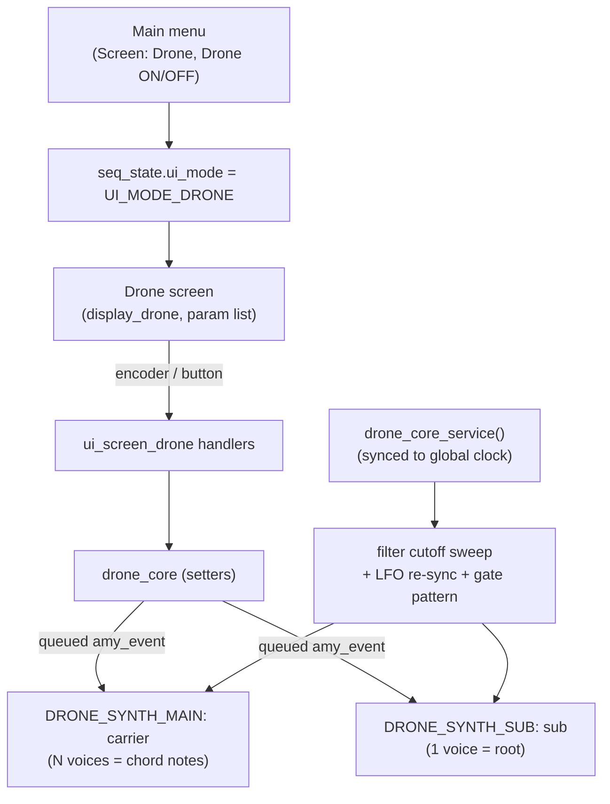
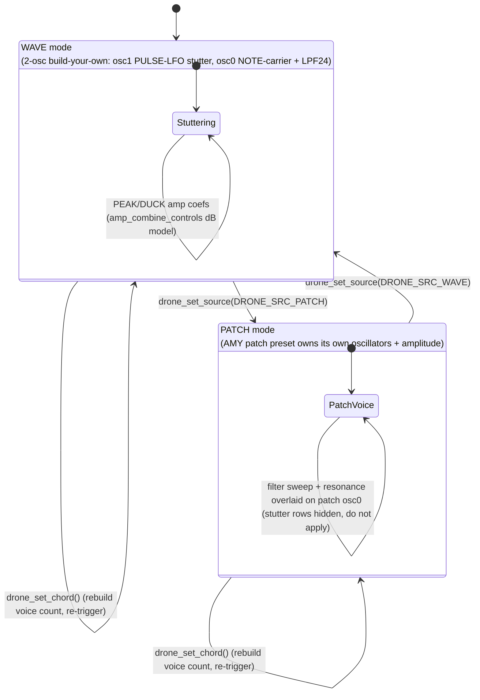

# Stutter House Drone — Architecture

A standalone, tempo-synced **drone synth** translated from an AMYboard
"stutter house drone" Python sketch. It is fully independent of the sequencer
layers, the arp, and the chord progression — its own AMY synth slots, its own
state, its own screen, reached from the main menu. It was the first inhabitant
of the `custompatches/` subfolder, now also home to the bass presets, the FM
voice, and the resampler.

```
SAW/SQUARE/TRI/SINE carrier, gated by a square LFO (the "stutter"),
through an LPF24 whose cutoff sweeps slowly. The carrier plays a CHORD;
a mono sub tracks the chord root an octave (or more) below. Everything
(stutter rate, sweep period, gate pattern, ADSR fade) locks to the global BPM.
```

## Files

| File | Role |
|---|---|
| `custompatches/drone_core.c` / `include/custompatches/drone_core.h` | The engine: state, AMY synth config, note scheduling, tempo-locked service. |
| `../synth_ui/ui_screen_drone.c` | The screen's input handling and view building. |
| `../../display/display_drone.{c,h}` | The screen renderer (scrollable label:value list + the visualizer view). |
| `../voice_config.c` | Shared voice layer: builds the 2-osc WAVE voice, wires the native LFO. |
| `main/main.c` | Sets `amy_cfg.max_synths` from `SYNTH_SLOT_COUNT`; routes drone-screen input. |

The module mirrors the **arp module** pattern 1:1 (standalone engine + own synth
slots + own screen, driven from the menu). If you understand `arp_core`, you
understand this.

### The sibling: the normal (free-running) drone

`custompatches/drone_std_core.c` is a second, independent drone engine on its
own slots **4 / 5** (`DRONE_STD_SYNTH_MAIN` / `_SUB`), so both drones can sound
at once. It keeps this module's chord voicing and mono sub but drops everything
tempo-locked: no stutter gate, no PEAK/DUCK amp coupling, no pattern/blip/swing
service, no swept filter. In their place it exposes the standard per-voice
toolset the sequencer rows use - a free filter edited in the filter graph
editor, a free AMY-native LFO (WAVE mode only; PATCH-mode instruments own their
own osc topology), and the shared ADSR/EG1 graph storage. Everything below in
this document describes the **stutter** drone unless it says otherwise.

## Signal flow



## AMY voice model (WAVE mode)

Each carrier synth is a **build-your-own (no patch)** instrument with
`oscs_per_voice = 2`, assembled by the shared `voice_build_wave()` (the same
voice model the arp's WAVE source uses):

- **osc1 = PULSE LFO.** Absolute Hz (`freq_coefs[COEF_NOTE]=0`), `amp const=1`,
  duty set by the **GATE** row. Runs continuously. Its bipolar output (−1..+1)
  is the stutter source.
- **osc0 = carrier.** NOTE-following (`freq_coefs[COEF_NOTE]=1`) so each voice's
  pitch comes from its note-on (this is what lets the synth play a chord).
  `mod_source = 1` points at osc1 of the same voice. `filter_type = LPF24`,
  `resonance`, and `filter_freq` (swept) on top.

### How the amplitude / stutter math actually works

On screen the two amplitude controls are labelled **PEAK** (on-beat carrier
level, `amp_peak`) and **DUCK** (duck depth, `amp_duck`); on the AMY wire they
become the CONST and MOD amp coefficients of the carrier osc. AMY's amp combine
is `amp_combine_controls` (`amy.c`), a **dB model**: every coefficient except
the two MOD slots is dB-compressed (`map_60dB_to_01f`) before the weighted sum,
the sum is tripled, and the result is exponentiated -

```
amp = 10^(3 · Σ coef·val)
```

The MOD slots are the exception: they sum in linearly, which makes MOD linear
*in the log domain*. A mod source does not scale the amplitude, it **shifts it
by decibels**.

The drone is authored directly against that. The carrier carries
`amp_coefs[COEF_CONST] = const_sent` and `amp_coefs[COEF_MOD] = m`, with osc1's
free-running PULSE as the mod source, so the per-sample gain is:

```
amp = const_sent · 10^(3 · m · LFO)        LFO ∈ [−1, +1]
```

`drone_core.c` solves the two knobs into those coefficients in one place (the
helpers below are the single source of truth - never inline the formula):

| Helper | Value |
|---|---|
| `s_amp_peak_lin()` | `peak_lin = clamp01(amp_peak · amp_trim)` |
| `s_amp_duck_db()` | `duck_db = amp_duck · 40` |
| `s_amp_m()` | `m = duck_db / 120` |
| `s_amp_const_sent()` | `const_sent = peak_lin · 10^(−duck_db/40)` |

Substituting back: at `LFO = +1` (on-beat) `amp = peak_lin` exactly; at
`LFO = −1` (off-beat) `amp = peak_lin · 10^(−duck_db/20)`. So the duck is
**unipolar and downward only** - PEAK sets the absolute on-beat ceiling and
DUCK sets how far below it the off-beat floor sits, in dB. `amp_duck = 1.0` is
a 40 dB floor, **not** silence; a true hard gate is not reachable on this rail.
`drone_get_amp_levels_norm()` derives the on-screen meter from the same
helpers, so display and engine cannot disagree.

The ADSR (`vp.env`, EG0) rides the same dB sum rather than multiplying the
result, so it shapes the swell and fade around the chop instead of scaling it.

> **Gotcha:** AMY skips a coefficient that is exactly zero (`if (coef == 0)
> continue`), so a rail allowed to reach 0 drops out of the sum instead of
> attenuating to nothing. An earlier single "MIX" knob derived
> `peak = total·(1−mix)` / `duck = total·mix` and hit precisely that cliff: at
> 95 % mix the tone was near-silent, but at 100 % the const coef became 0, got
> skipped, and the level jumped to full. Exposing the two controls directly
> removes the remap and the discontinuity. Keep PEAK > 0.

## Chords

The carrier plays a **chord**, one AMY voice per note, up to `DRONE_CHORD_MAX_NOTES = 5`.
Chord voicing is derived at runtime from the shared `quantizer_chord_intervals(chord_type_t)`
table — the same table used by the Prog screen and the scale quantizer.

**Root** is a drone-local MIDI note (24–72, C1–C5; default 45 = A2); all chord
intervals are computed relative to it. **Chord type** is any of the 11 shared
types:

| Type | Intervals (semitones from root) |
|---|---|
| Maj  | 0, 4, 7 |
| Min  | 0, 3, 7 |
| Maj7 | 0, 4, 7, 11 |
| Min7 | 0, 3, 7, 10 |
| Dom7 | 0, 4, 7, 10 |
| Sus2 | 0, 2, 7 |
| Sus4 | 0, 5, 7 |
| Dim  | 0, 3, 6 |
| Aug  | 0, 4, 8 |
| Min9 | 0, 3, 7, 10, 14 |
| Maj9 | 0, 4, 7, 11, 14 |

`drone_set_chord()` releases the old chord's held notes, rebuilds the main synth
to the new voice count, then re-triggers — so switching to a smaller chord never
leaves voices stuck on.

The **sub** stays a single voice at `chord_root + sub_interval` (default −12,
range 0 to −36). This is deliberate: low frequencies + polyphony invite phase
cancellation, so the low end is kept mono.

The drone does **not** follow the global chord progression — its ROOT/CHORD
rows are always manual. (The progression re-voices chord-mode layers and
re-roots the arp, not the drone.)

## Tempo sync

`drone_core_service()` runs once per UI frame (20 Hz), like `arp_core_service()`.
Everything it derives comes from the global BPM and AMY's 48-PPQ tick counter:

1. **Stutter LFO** — `LFO_Hz = (BPM/60) · mult`, re-sent to osc1 when the BPM
   changes. Multipliers: `1/4 = ×1, 1/8 = ×2, 1/16 = ×4, 1/32 = ×8`. This matches
   the **arp's** convention (arp `1/16` = 12 ticks @ 48 PPQ = one event per
   sixteenth note), so a drone "1/16" stutter pulse lands on the same grid as an
   arp "1/16" note onset. One square cycle (on+off) spans one named note.
   On top of the raw LFO sit the rhythm controls:
   - **GATE** (0.05–0.95) sets the pulse duty cycle — how much of each
     subdivision the gate stays open.
   - **SWING** (0–66 %) delays alternate gate openings.
   - **PATTERN** masks the stutter against an 8-step rhythm: FULL (all on),
     FOUR (four-on-the-floor), OFFBT (upbeats), GALOP (short-short-long),
     DUB (dub push).
   - **BLIP** (0–1) fires a short downward filter zap on gate edges for a
     percussive attack transient.
2. **Filter sweep** — a sine LFO over the cutoff between `sweep_lo` and
   `sweep_hi` (100–8000 Hz), with a period of `sweep_bars` bars (1–16). Its
   phase is a **pure function of `sequencer_ticks()`** (AMY's 48-PPQ musical
   clock — the same one the sequencer and arp ride), NOT of the UI frame rate:
   one bar = `48*4 = 192` ticks,
   `phase = 2π · (tick % period_ticks) / period_ticks`. This makes the
   sweep frame-rate-independent (UI jitter or skipped frames cannot drift it) and
   genuinely beat-locked — it advances with tempo automatically and stays
   coherent with the bar grid across BPM changes. Re-sent to osc0 each service
   call; the sub uses `cutoff × 0.5`. Resonance is capped at 3.0.

   > Earlier this accumulated a fixed `frame_dt = 0.050` per `service()` call,
   > assuming the UI task ticked at exactly 20 Hz. That was fragile: the UI task
   > does blocking I2C and competes on Core 0, so real elapsed time ≠ 50 ms and
   > the sweep drifted with load. Deriving phase from the absolute tick count
   > removes the dependency entirely.

`drone_set_enabled()` fires sustained note-ons (enable) / note-offs (disable); on
disable the ADSR **release** fades the chord out in time with the tempo-set
envelope.

## ADSR envelope (shared graph editor)

The drone reuses the shared ADSR **graph_popup** editor (the same widget the
melodic layers and the arp use). On the drone screen, **MY_BUTTON_ENC
long-press** opens the editor bound to the drone; commit calls
`drone_set_envelope()`. The drone's editable state lives in the same shared
`voice_params_t` block (`s_d.vp`) as the other instruments.

- The envelope is **deferred-authority**: not pushed until the user commits, so
  an un-edited drone holds at full sustain (EG0 = 1.0 on a held note). Once
  authored, it is re-applied after any rebuild/source/chord change.
- It is pushed via the shared envelope helper (the same EG0 breakpoint delta
  path the melodic layers use), to both the main and sub synths.
- The editor's tab cycle skips the LFO tab for the drone (the stutter LFO *is*
  the drone's modulation; ADSR → Filter → ADSR).

## PATCH mode

The carrier's source is one of two independent voice models, switched by
`drone_set_source()`; chord voicing (see [Chords](#chords)) rebuilds the voice
count in whichever mode is active, without changing modes:



`drone_set_source(DRONE_SRC_PATCH)` loads an AMY patch preset onto the carrier
synth instead of the raw 2-osc voice. The patch owns its own oscillators and
amplitude, so:

- The **square-LFO stutter** and the **PEAK / DUCK / STUTTER / GATE** controls
  do **not** apply (WAVE-only). Those rows are hidden on the screen in PATCH
  mode, and the engine builds no LFO oscillator at all.
- The **chord voicing, filter sweep, and resonance** still apply (filter +
  resonance are overlaid on the patch's osc0).
- Patches can be sensitive: a quiet/bandlimited patch fed through `LPF24` at a
  given cutoff/resonance can be filtered toward silence or have a single partial
  resonate. That is the filter interacting with the patch's fixed spectrum, not
  an amp issue.

## Synth slots & tag budget

| Slot range | Owner |
|---|---|
| 1 | arp |
| **2** | **drone main carrier** (`DRONE_SYNTH_MAIN`) |
| **3** | **drone sub** (`DRONE_SYNTH_SUB`) |
| 4 / 5 | free-running drone main / sub (`drone_std_core.c`) |
| 6–9 | drum layer (one per track) |
| 11–62 | melodic layers |

The full map lives in `synth_slots.h` (statics at the bottom, melodic arena on
top). `main/main.c` sets `amy_cfg.max_synths = SYNTH_SLOT_COUNT` (63). AMY's
instrument table is sized
from config (`instruments_init(config.max_synths)`). AMY's default 250 oscs leave
ample headroom (5-voice main × 2 oscs + sub × 2 = ~12 oscs).

**Sequencer tags: zero.** The drone uses **direct** (immediate, non-scheduled)
note-on/param events, so it consumes no entries in AMY's `sequences[]` table —
no interaction with the sequencer/arp/ratchet tag windows.

## Concurrency / safety

All AMY interaction goes through the queued event API (`amy_add_event`) using
the shared scratch `amy_event` + mutex in `amy_helpers` (an `amy_event` is
~800 B and must never sit on a task stack). The drone **never** touches
`synth[]` directly — this respects the render-lock rule (the render path walks
`synth[]` under the queue lock; all config/notes must be deltas). See
`AMY-EDITS.md`.

## Input map (drone screen)

| Control | Action |
|---|---|
| Encoder turn | Move cursor / (in edit) adjust the focused row's value |
| MY_BUTTON_ENC short press | Toggle edit on the focused row |
| MY_BUTTON_ENC long press | Open the ADSR graph editor (bound to the drone) |
| MY_BUTTON_1 hold + turn | Cycle PATCH preset (PATCH mode only) |
| MY_BUTTON_3 | Menu toggle (global) |
| MY_BUTTON_0 long press | Play/stop (global) |

A drone-screen isolation guard in `main.c` (mirroring the arp guard) suppresses
the sequencer's editing gestures while the drone screen is up, but keeps the
menu toggle and global play/pause live. The guard stands down while the graph
editor or menu overlays are on top, so those never conflict.

## Screen layout (parameter list)

WAVE-mode row order (PATCH mode hides the stutter rows and shows PATCH
instead of WAVE):

```
DRONE     : ON
SOURCE    : WAVE          (WAVE / PATCH)
WAVE      : SAW           (WAVE only: SAW/SAWUP/PULSE/TRI/SINE)
ROOT      : A2            (C1..C5, shifts the whole voicing)
CHORD     : Min7          (11 shared chord types)
RES       : 1.50          (0.1..3.0)
PEAK      : 0.5           (WAVE only: always-on level, keep > 0)
DUCK      : 0.5           (WAVE only: stutter depth)
VISUALISE : OFF           (switch to the drone visualizer view)
STUTTER   : 1/16          (WAVE only: 1/4..1/32, tempo-locked)
GATE      : 0.50          (WAVE only: duty cycle 0.05..0.95)
SWING     : 0             (0..66 %)
PATTERN   : FULL          (FULL/FOUR/OFFBT/GALOP/DUB)
BLIP      : 0.0           (0..1 filter-zap on gate edges)
SWEEP LO  : 600 Hz        (100..8000)
SWEEP HI  : 2000 Hz       (100..8000)
SWEEP SPD : 4 bar         (1..16)
SUB       : ON
SUB INT   : -12           (0..-36 semitones below the chord root)
PATCH     : 25            (PATCH only)
```

## Global FX (related — lives in the menu's FX page, not the drone)

The built-in AMY global effects — **EQ Low/Mid/High (dB), Echo, Chorus,
Reverb** with their extended parameters (feedback, time, tone, rate, depth,
liveness, damping, crossover) — are edited on the menu's dedicated **FX**
page. They are driven by single `amy_event` field sends and cached in the
firmware for display (AMY exposes no FX getters). They apply globally to
everything, not just the drone.
