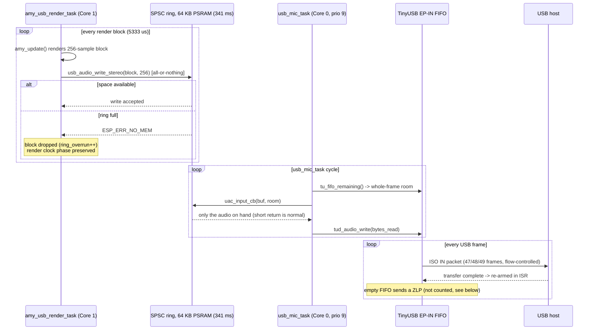

# USB Audio Component

This component provides a USB Audio Class 2.0 (UAC2) microphone interface for
the ESP32-S3. The device appears as a standard USB audio input on a host PC or
DAW and streams the synth's output directly over USB - no external DAC or
audio interface required.

## Features

- **UAC2 microphone device**: enumerates as a standard USB audio input
  (48 kHz, 16-bit, stereo).
- **Lock-free SPSC ring buffer**: 32768 int16 samples (64 KB = 341 ms of
  stereo audio), allocated in PSRAM (`heap_caps_malloc` with
  `MALLOC_CAP_SPIRAM`), decoupling the real-time producer from the USB
  consumer with no mutex.
- **Real-time-safe drop policy**: writes are all-or-nothing; when the ring is
  full a whole block is dropped (`ESP_ERR_NO_MEM`) rather than splicing a
  partial block or blocking the render task.
- **Async source, never padded**: the input callback returns only the audio
  the ring actually holds. A short return is the contract, not a fault - it is
  what lets the endpoint's flow control size packets to the device's true
  sample rate.
- **Diagnostics counters** behind `CONFIG_USB_AUDIO_DIAGNOSTICS` (fill level,
  peak fill, writes, drop events, peak sample), plus two counters from the
  `diagnostics` component that are live in every build.

## Architecture

- `usb_audio.c`: device init, UAC input callback, and the SPSC ring.
- `include/usb_audio.h`: the public API.
- `components/usb_device_uac/` holds the UAC implementation. It is **vendored,
  not a managed dependency** (base v1.3.1, on `espressif/tinyusb` 0.19) - the
  component carries local edits, which a hash-checked managed component cannot;
  they are listed in `UAC-EDITS.md` at the repository root. TinyUSB 0.19 is
  load-bearing there: its audio class re-arms the isochronous IN endpoint in
  ISR context, where 0.17 re-armed from the task and dropped a frame whenever
  scheduling delayed the re-arm past the next IN token.

The ring buffer decouples the AMY render task (producer, core 1) from the USB
device stack (consumer, core 0):



The ring uses writer-owned and reader-owned indices with release/acquire
ordering, so the high-priority render task never blocks on a lock held by the
lower-priority consumer.

### Dropout counters

The counters that attribute a dropout live in the `diagnostics` component
(`dropout_stats`), not here, because the events happen on different tasks.
Two of them are written today:

| Counter | Written by | Meaning |
| --- | --- | --- |
| `ring_overrun` | render task, Core 1 | the ring was full, a whole block was dropped |
| `render_overrun` | render task, Core 1 | the render clock reported more than one elapsed tick |

`wire_zlp` is meant to count zero-length packets (endpoint FIFO empty at
load time - genuine starvation under the async-source pull), but its only
writer, the `tud_audio_tx_done_post_load_cb` override in `usb_audio.c`, is a
TinyUSB 0.17 hook that 0.19 no longer calls; the linker discards it, so the
counter reads 0 regardless. `ring_underrun` and `chunk_drop` have no writer
at all. Treat a zero in any of the three as "not measured", not "did not
happen". The
counters are also blind to anything that blocks in ISR context, which no
counter on a task can see.

## Public API (`usb_audio.h`)

| Function | Purpose |
| --- | --- |
| `usb_audio_init()` | Allocate the ring (PSRAM) and start the UAC device |
| `usb_audio_write_stereo(samples, frames)` | Push one interleaved stereo block; all-or-nothing |
| `usb_audio_write_mono(samples, frames)` | Mono convenience variant (duplicated to both channels) |
| `usb_audio_consumer_active()` | True while the host is actually draining the stream |
| `usb_audio_diag_get_snapshot()` / `usb_audio_diag_reset()` | Diagnostics snapshot: fill / peak / write / drop counters need `CONFIG_USB_AUDIO_DIAGNOSTICS`; the `dropout_stats` mirrors in the same struct are valid in every build |

## How the project drives it

The render task owns the pacing: a hardware render clock (GPTimer alarm every
5333 µs, or optionally I2S-DMA backpressure) wakes it once per audio block, it
calls `amy_update()`, and pushes the finished block:

```c
// inside amy_usb_render_task (main.c), once per render-clock wake
uint32_t ticks = render_clock_wait();           // strict 1:1 pacing
int16_t *block = amy_update();                  // renders AMY_BLOCK_SIZE frames
if (block != NULL &&
    usb_audio_write_stereo(block, AMY_BLOCK_SIZE) == ESP_ERR_NO_MEM) {
    // whole block dropped; the loop never blocks or re-renders, so AMY's
    // sample clock stays locked to real time
}
```

AMY itself runs with `amy_cfg.audio = AMY_AUDIO_IS_NONE` so it spawns no audio
tasks of its own.

## Configuration

- **Sample rate**: `CONFIG_UAC_SAMPLE_RATE` must be **48000** and must match
  `AMY_SAMPLE_RATE` (48000 on the ESP branch). A mismatch does not fail the
  build - it ships detuned, resampled audio. Treat 48 kHz as an invariant.
- `CONFIG_USB_AUDIO_DIAGNOSTICS` (default off): compiles in the counters and
  the periodic `audio diag:` log line (see the root README's Diagnostics
  section).
- `CONFIG_USB_AUDIO_BLOCKING_WRITE` (default off): makes the caller retry a
  full ring with a 1-tick delay instead of dropping. Useful for bench tests;
  leave off for normal use - dropping preserves the render clock's phase,
  blocking can mask real-time problems.

UAC channel count and task affinity come from the `usb_device_uac` component's
own options (`sdkconfig.defaults` pins the UAC tasks to core 0, away from the
render task on core 1).
