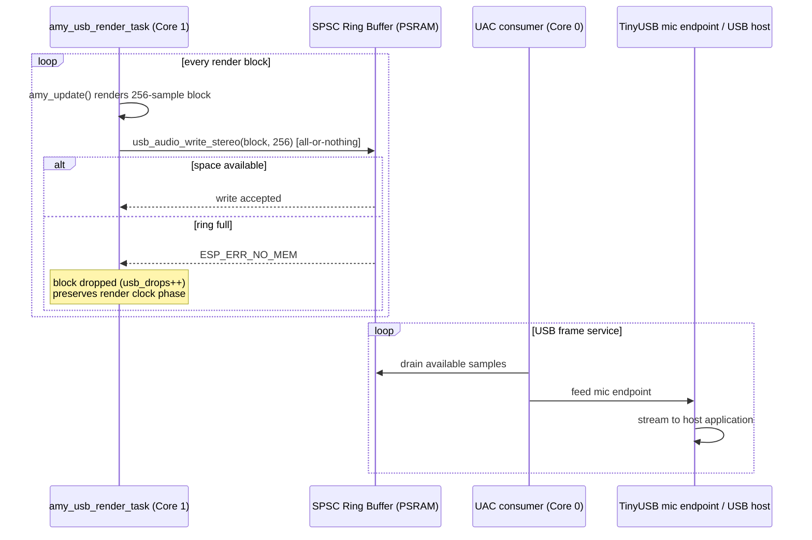

# USB Audio Component

This component provides a USB Audio Class 2.0 (UAC2) microphone interface for
the ESP32-S3. The device appears as a standard USB audio input on a host PC or
DAW and streams the synth's output directly over USB - no external DAC or
audio interface required.

## Features

- **UAC2 microphone device**: enumerates as a standard USB audio input
  (48 kHz, 16-bit, stereo).
- **Lock-free SPSC ring buffer**: 32768 int16 samples (64 KB), allocated in
  PSRAM (`heap_caps_malloc` with `MALLOC_CAP_SPIRAM`), decoupling the
  real-time producer from the USB consumer with no mutex.
- **Real-time-safe drop policy**: writes are all-or-nothing; when the ring is
  full a whole block is dropped (`ESP_ERR_NO_MEM`) rather than splicing a
  partial block or blocking the render task.
- **Diagnostics counters** behind `CONFIG_USB_AUDIO_DIAGNOSTICS` (fill level,
  peak fill, writes, drops, underruns, peak sample).

## Architecture

- `usb_audio.c`: device init, UAC input callback, and the SPSC ring.
- `include/usb_audio.h`: the public API.
- Relies on the `espressif/usb_device_uac` managed component for the UAC
  implementation and `espressif__tinyusb` for the USB stack.

The ring buffer decouples the AMY render task (producer, core 1) from the USB
device stack (consumer, core 0):



The ring uses writer-owned and reader-owned indices with release/acquire
ordering, so the high-priority render task never blocks on a lock held by the
lower-priority consumer.

## Public API (`usb_audio.h`)

| Function | Purpose |
| --- | --- |
| `usb_audio_init()` | Allocate the ring (PSRAM) and start the UAC device |
| `usb_audio_write_stereo(samples, frames)` | Push one interleaved stereo block; all-or-nothing |
| `usb_audio_write_mono(samples, frames)` | Mono convenience variant (duplicated to both channels) |
| `usb_audio_consumer_active()` | True while the host is actually draining the stream |
| `usb_audio_diag_get_snapshot()` / `usb_audio_diag_reset()` | Diagnostics counters (gated by Kconfig) |

## How the project drives it

The render task owns the pacing: a hardware render clock (GPTimer alarm every
5333 µs, or optionally I2S-DMA backpressure) wakes it once per audio block, it
calls `amy_update()`, and pushes the finished block:

```c
// inside amy_usb_render_task (main.c), once per render-clock wake
uint32_t ticks = render_clock_wait();           // strict 1:1 pacing
int16_t *block = amy_update();                  // renders AMY_BLOCK_SIZE frames
if (block != NULL &&
    usb_audio_write_stereo(block, AMY_BLOCK_SIZE) == ESP_ERR_NO_MEM) {
    // whole block dropped; the loop never blocks or re-renders, so AMY's
    // sample clock stays locked to real time
}
```

AMY itself runs with `amy_cfg.audio = AMY_AUDIO_IS_NONE` so it spawns no audio
tasks of its own.

## Configuration

- **Sample rate**: `CONFIG_UAC_SAMPLE_RATE` must be **48000** and must match
  `AMY_SAMPLE_RATE` (48000 on the ESP branch). A mismatch does not fail the
  build - it ships detuned, resampled audio. Treat 48 kHz as an invariant.
- `CONFIG_USB_AUDIO_DIAGNOSTICS` (default off): compiles in the counters and
  the periodic `audio diag:` log line (see the root README's Diagnostics
  section).
- `CONFIG_USB_AUDIO_BLOCKING_WRITE` (default off): makes the caller retry a
  full ring with a 1-tick delay instead of dropping. Useful for bench tests;
  leave off for normal use - dropping preserves the render clock's phase,
  blocking can mask real-time problems.

UAC channel count and task affinity come from the `usb_device_uac` component's
own options (`sdkconfig.defaults` pins the UAC tasks to core 0, away from the
render task on core 1).
