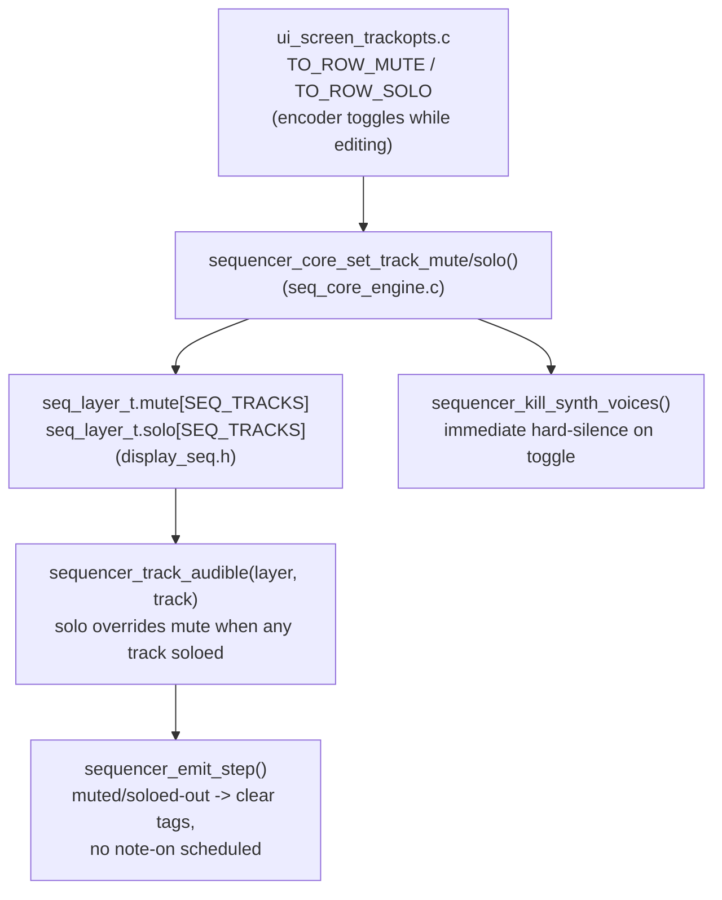

# B1 — Track mute/solo

Branch: `feat/b1-mute-solo`
Status: **complete** — build-verified vertical slice, gated end-to-end
(data model → tick/emit gating → TrackOpts UI).

## Summary

Added a bool-per-track **mute** and **solo** to the sequencer's per-layer
track data, gated in the tick/emit path so a muted (or soloed-out) track
never schedules a note-on, and exposed both as toggleable rows on the
existing TrackOpts screen.



## What was implemented

- **Data model** — `components/display/display_seq.h:118-121`: added
  `bool mute[SEQ_TRACKS]` and `bool solo[SEQ_TRACKS]` to `seq_layer_t`,
  alongside the existing `repeat_rate[SEQ_TRACKS]` (same per-track,
  per-layer scoping as everything else in that struct). Zero-initialized by
  the existing `memset` in `sequencer_core_add_layer` — no extra init code
  needed (unlike `amp_scale`, which needs a non-zero default).

- **Gating logic** — `components/synth_core/sequencer_core/seq_core_engine.c`:
  - `sequencer_layer_has_solo()` (line ~99) and `sequencer_track_audible()`
    (line ~110): solo, if engaged on *any* track in the layer, is the sole
    determinant of audibility for every track in that layer — it overrides
    mute even on the same track (see "Design decisions" below).
  - `sequencer_emit_step()` (line ~199-206): the existing
    `!s_playing || !layer->grid[track][step]` early-return/cancel path now
    also cancels (instead of scheduling a note-on) when
    `!sequencer_track_audible(layer, track)`. This is the single choke point
    all step scheduling goes through, so drum and melodic layers get the
    same gating for free.
  - `sequencer_core_set_track_mute/get_track_mute` and
    `sequencer_core_set_track_solo/get_track_solo` (line ~453-497): setters
    re-emit the affected track(s) (mute: just that track; solo: the whole
    layer, since one track's solo state changes every other track's
    audibility) and hard-kill (`sequencer_kill_synth_voices`) any track that
    just became inaudible, so an already-sounding note is silenced
    immediately rather than ringing out until its next scheduled note-off
    (re-emitting alone only updates the *future* schedule, per the existing
    tag-reuse comment on `sequencer_emit_step`).

- **Public API** — `components/synth_core/include/sequencer_core.h:204-218`:
  `sequencer_core_set_track_mute/get_track_mute`,
  `sequencer_core_set_track_solo/get_track_solo`, documented with the
  per-layer solo scope and override semantics.

- **TrackOpts UI**:
  - `components/display/display_trackopts.h`: `trackopts_row_t` gained
    `TO_ROW_MUTE=3` / `TO_ROW_SOLO=4` between `TO_ROW_REPEAT` and
    `TO_ROW_CHORD` (chord/root/type shifted from 3/4/5 to 5/6/7 — purely
    internal enum renumbering, no persisted/serialized use). `trackopts_view_t`
    gained `track_mute` / `track_solo` bools.
  - `components/synth_core/synth_ui/ui_screen_trackopts.c`: view builder
    populates the two new fields; the view-signature hash includes them (so
    a mute/solo toggle forces a redraw); the encoder handler toggles them on
    any encoder movement while `s_to_editing` is true — the exact same
    toggle gesture already used for `TO_ROW_CHORD`, reused rather than
    invented; drum-layer cursor clamping (3 call sites: view builder, layer
    encoder case, button handler) now stops at `TO_ROW_SOLO` instead of
    `TO_ROW_REPEAT`, since mute/solo apply to drum tracks too (chord rows
    remain melodic-only).
  - `components/display/display_trackopts.c`: the content-row area (below
    the L/T title bar) now renders a **scrolling** window of up to
    `TO_VIS_ROWS=4` rows (Repeat/Mute/Solo always; Chord/Root/Type only for
    melodic layers, 6 rows total) using the exact same scroll-window
    technique already used by the drone screen (`display_drone.c`) — first/
    last visible index computed from the cursor position, with the same
    corner-triangle scroll affordances. Drum layers (3 content rows) never
    scroll; melodic layers (6 rows) do. The row *positions* (y=22/33/44/55)
    are unchanged from before, so this fits inside the already-proven
    128x64 pixel budget with no geometry changes — only *which* row occupies
    which of the 4 visible slots is new. The old drum-layer placeholder text
    ("(drum track)") is removed since Mute/Solo now render there for real.

## Design decisions (and rejected alternatives)

1. **Solo scope is per-layer, not global.** `seq_layer_t` is "one instance
   per active sequencer pattern" (per `SEQUENCER-ARCHITECTURE.md`) with 4
   tracks; solo compares only within the 4 tracks of the *same* layer the
   TrackOpts screen is currently pointed at. Rejected: a single global solo
   set spanning all layers — nothing in the existing per-track precedent
   (`repeat_rate[SEQ_TRACKS]`, per-layer) suggested cross-layer scope, and a
   global scope would need extra bookkeeping this task didn't ask for.

2. **Solo overrides mute, including on the same track.** The task text says
   "soloed logic overrides mute" — read literally as: whenever any track in
   the layer is soloed, audibility is decided by the solo flag alone, so a
   track that is both muted and soloed still sounds. Rejected alternative:
   mute always wins even under solo (some DAWs do this) — the task's
   phrasing reads more naturally as solo being the overriding condition, and
   this is the simpler rule to reason about (`sequencer_track_audible()` in
   `seq_core_engine.c` is one `if`/`return` either way if this needs
   flipping later).

3. **Immediate hard-kill on toggle** (`sequencer_kill_synth_voices`), not
   just re-emit. Re-emitting alone only reprograms the *future* recurring
   schedule under the same AMY tag; it does not retroactively cut off a note
   already sounding. Muting/soloing is a "make it stop now" user action, so
   both setters explicitly silence any track whose audibility just flipped
   to false — mirroring the exact pattern already used elsewhere in this
   file for patch changes and pause (`sequencer_core_set_drum_patch`,
   `sequencer_core_set_playing`).

4. **TrackOpts row layout: scrolling window, not title-bar icons or an
   overflowing row list.** Melodic layers already used all 4 visible content
   rows (Repeat/Chord/Root/Type at y=22/33/44/55); adding Mute+Solo without
   a windowing scheme would render past y=64 (off the physical OLED).
   Considered and rejected: cramming M/S indicators into the title bar next
   to L/T (no existing precedent for a 4th/5th title-bar toggle, would be an
   invented interaction, not "reusing" the existing pattern) and shrinking
   the font/row height (would alter the already-tuned pixel layout of rows
   that already work). Chose to mirror the drone screen's existing
   scroll-window technique instead — genuinely the same reused pattern,
   just applied to a second screen.

## What is deferred / NOT done

- **No visual mute/solo indicator on the main step-grid screen**
  (`display_seq.c`). The task scoped the UI change to "a row toggle in the
  existing TrackOpts screen"; touching the main grid renderer would be
  scope creep and is also the screen most likely to collide with
  `feat/b3-step-probability`'s new per-step UI. A dimmed/marked track
  indicator on the main grid is a reasonable follow-up.
- **Pre-existing, unrelated doc drift in `SEQUENCER-ARCHITECTURE.md`** (e.g.
  `synth_id` shown as scalar instead of `synth_id[SEQ_TRACKS]`, missing
  `env`/`filter`/`lfo`/`amp_scale`/chord fields, a stale `bpm` field in
  `display_seq_state_t`) predates this change and was not fixed wholesale —
  only the two sections directly touched by this feature (the `seq_layer_t`
  code block and the "Separate play/stop per layer" future-work note, which
  explicitly proposed a similar feature) were updated.
- **Whole-layer mute/solo** (independent of per-track) is not implemented;
  `SEQUENCER-ARCHITECTURE.md`'s "Separate play/stop per layer" section now
  notes this as a still-open future option.

## Build/verification evidence

Raw `idf.py` from inside the worktree (MCP `esp-idf-eim` tools are bound to
the main repo worktree only, per task instructions):

```
source /home/fatta/esp-idf/S3-Amysynth/export.sh
cd /home/fatta/esp-idf/S3-Amysynth/.claude/worktrees/b1-mute-solo
idf.py set-target esp32s3
idf.py build
```

Result: **`Project build complete.`** —
`build/S3-Amysynth.bin` produced (731008 bytes). A second incremental
`idf.py build` run afterward rebuilt nothing (confirms the tree is clean)
and produced zero warnings from any of the six changed files.

**Environment note (not a code fix, not committed):** a fresh configure in
this worktree initially failed with `CMake Error ... GCC link time
optimization(LTO) is not supported`, root-caused to CMake 4.0.3's
`check_ipo_supported()` not forwarding `CMAKE_TOOLCHAIN_FILE` into its
internal `try_compile`, which breaks this project's response-file toolchain
scheme (`CMAKE_CXX_FLAGS` becomes `@"/cxxflags"` instead of
`@"<build>/toolchain/cxxflags"`). This is pre-existing and environmental —
unrelated to this feature's source changes, and latent in the main
worktree too (its already-built `build/` directory simply predates this
CMake version and was never reconfigured from scratch under it). Verified
by adding `list(APPEND CMAKE_TRY_COMPILE_PLATFORM_VARIABLES
CMAKE_TOOLCHAIN_FILE)` before the `check_ipo_supported()` call in
`managed_components/espressif__cmake_utilities/gcc.cmake` (an untracked,
component-manager-fetched file, not part of this branch's diff) purely to
unblock a fresh local configure. Not committed; flagging here so a
reviewer isn't surprised if they `fullclean` this worktree and hit the same
wall — the real fix belongs in the `cmake_utilities` dependency or a
repo-level CMake policy pin, out of scope for this feature.

## Files touched

- `components/display/display_seq.h`
- `components/synth_core/include/sequencer_core.h`
- `components/synth_core/sequencer_core/seq_core_engine.c`
- `components/display/display_trackopts.h`
- `components/display/display_trackopts.c`
- `components/synth_core/synth_ui/ui_screen_trackopts.c`
- `SEQUENCER-ARCHITECTURE.md` (doc: `seq_layer_t` struct block + per-layer
  mute future-work note)
- `docs/handoff/b1-mute-solo.md` (this file)

## Potential merge pitfalls

- **`feat/b3-step-probability`** — per its description, adds new per-step
  data fields to the sequencer_core layer/track struct (`seq_layer_t` in
  `display_seq.h`) under a stated `SEQ_STEPS x SEQ_TRACKS x MAX_LAYERS`
  memory budget concern. This branch also adds two `bool[SEQ_TRACKS]`
  arrays to the same struct. Both branches independently compile clean, but
  merging them will need a manual field-layout reconciliation of
  `seq_layer_t` (git will very likely show a struct-body conflict even if
  the two additions are logically independent) — check total struct size
  against whatever budget that branch established once merged. **Also
  check for a second, likely-unrelated conflict in `ui_screen_trackopts.c`
  and `display_trackopts.{c,h}` if that branch's new per-step UI touches
  the same screen** (unclear from the branch name alone; worth a diff-time
  check).
- **`feat/c1-hint-bar`** — touches `main.c`'s overlay dispatch and a
  persistent one-line status string; if it renders "MUTE"/"SOLO" style
  hints for the active screen, it may want to know about
  `synth_ui_trackopts_is_active()` / the new row IDs. No direct file
  overlap expected (this branch does not touch `main.c`), but worth a
  quick cross-check that a hint-bar string for TrackOpts still makes sense
  with 8 rows instead of 6.
- **`feat/a1-second-envelope`** — touches `ui_editors.c`'s `graph_target_t`
  and bass/drone/arp envelope presets; no file overlap with this branch,
  low risk.
- **Everything else in the parallel list** (`a2-fm-dx7`, `a4-wavetable`,
  `a5-pcm-sampling`, `a3-portamento-arp`, `i2s-clock-source`) does not touch
  `sequencer_core`'s per-track fields, the TrackOpts screen, or
  `display_seq.h`'s `seq_layer_t` — no expected conflict.
- **Re-test after merge:** any branch that also calls
  `sequencer_resync_layer()` or `sequencer_kill_synth_voices()` in a new
  code path should be re-tested together with this branch's solo setter,
  since solo's whole-layer resync + selective hard-kill is the most
  "expensive"/wide-reaching operation this feature adds to the tick/emit
  path.
