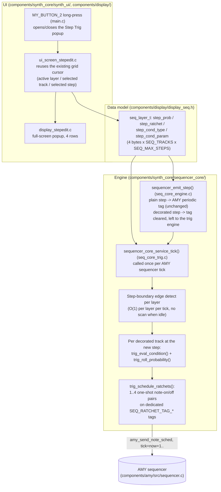

# B3 — Per-step probability / ratchet / conditional trigs

Branch: `feat/b3-step-probability`
Status: **complete** — probability, ratchet, and both proposed conditional
trigs (FILL and PREV) are implemented end to end (data model, tick-time
engine, UI). Build verified (see below).

## Summary

Every sequencer step (drum or melodic, any layer/track) now carries three
new decorations on top of the existing on/off + pitch:

- **Probability** — 0..100%, chance the step actually sounds when its loop
  comes around.
- **Ratchet** — 1..4 evenly-spaced sub-hits fired within the step's slot
  instead of one.
- **Conditional trig** (Elektron-style) — `FILL` (fires only once every N
  loops of the pattern, N = 2..8) or `PREV` (fires only if the immediately
  preceding step on the same track actually sounded).

A step with the default values (`prob=100`, `ratchet=1`, `cond=NONE`) is
"plain" and costs nothing extra — it keeps using the original always-on
repeating AMY sequence tag exactly as before this feature. Only a step that
deviates from that default ("decorated") is routed through the new
per-tick engine.

## Architecture



## What was implemented (file:line references)

### Data model
- `components/display/display_seq.h:41-59` — `SEQ_MAX_RATCHET` (4) and the
  `seq_step_cond_type_t` enum (`NONE=0`, `FILL=1`, `PREV=2`).
- `components/display/display_seq.h:157-172` — four new per-step arrays
  appended to the end of `seq_layer_t`: `step_prob`, `step_ratchet`,
  `step_cond_type`, `step_cond_param` (all `uint8_t[SEQ_TRACKS][SEQ_MAX_STEPS]`).

### Engine
- `components/synth_core/sequencer_core/seq_core_config.h:107-119` — the new
  ratchet tag space, `SEQ_RATCHET_TAG_BASE` (1120) .. `SEQ_RATCHET_TAG_MAX`
  (1247), 128 tags total, statically assigned per (layer, track, ratchet
  slot) — never pooled/shared, so an in-flight ratchet group can never
  collide with another track's schedule.
- `components/synth_core/sequencer_core/seq_core_trig.c` (new file, 284
  lines) — the whole engine:
  - `sequencer_core_step_is_decorated()` — the plain/decorated test.
  - `sequencer_core_service_tick()` — the one new per-tick entry point;
    O(num_layers) integer compares when nothing changed, only touches the
    current track column (≤4 tracks) on an actual step-boundary edge.
  - `trig_eval_condition()` / `trig_roll_probability()` /
    `trig_schedule_ratchets()` — condition/probability/ratchet logic.
  - `sequencer_core_set_step_prob/ratchet/cond` + matching getters — public
    setters clamp, store, and re-emit the step so the plain/decorated
    routing re-resolves immediately.
  - Own xorshift32 PRNG (`s_trig_rng_state`), deliberately **not** shared
    with `seq_core_editors.c`'s LFO PRNG — the two run on different
    FreeRTOS tasks (esp_timer "sequencer" task vs. `synth_ui_task`) even
    though both are pinned to Core 0, so sharing one PRNG would be a real
    (if narrow) data race.
- `components/synth_core/sequencer_core/seq_core_engine.c`:
  - `sequencer_step_velocity()` (line 59) de-`static`'d and declared in
    `seq_core_internal.h` so ratchet sub-hits reuse the exact same
    accent/jitter curve as plain steps.
  - `sequencer_emit_step()` (~line 178) — decorated steps now fall into the
    same early-return branch as "stopped"/"step off" (tags cleared, no
    periodic scheduling); this is the one-line hinge that hands a decorated
    step over to the trig engine.
  - `sequencer_core_set_playing()` — calls `sequencer_core_trig_reset()` per
    layer on play-start and `sequencer_core_trig_clear_all()` per layer on
    pause (mirrors the existing "Bug 1.1/1.2" ghost-note-on-stop fixes —
    ratchet one-shot tags live in a separate tag space from the plain
    ON/OFF pair, so they need the same explicit clear).
- `components/synth_core/sequencer_core/seq_core_state.c`:
  - `sequencer_core_add_layer()` — explicit `step_prob=100`,
    `step_ratchet=1` init (memset would otherwise leave 0% probability =
    permanently silent, same class of bug the existing `amp_scale` comment
    already warns about).
  - `sequencer_core_delete_layer()` — clears ratchet tags for every layer
    before compaction (parallel to the existing `sequencer_clear_layer_tags`
    call) and calls `sequencer_core_trig_reset_all()` after compaction.
- `main/main.c`:
  - `main_sequencer_tick_hook()` (~line 83) now also calls
    `sequencer_core_service_tick()` — this hook already runs once per AMY
    sequencer tick via `amy_cfg.amy_external_sequencer_hook`, so no new
    clock/task was introduced.
  - `amy_cfg.max_sequencer_tags` raised 1200 → 1280 to cover the new
    ratchet tag range with the same off-by-one safety margin the arp range
    already relies on.

### Public API (`components/synth_core/include/sequencer_core.h`)
`sequencer_core_set_step_prob/get_step_prob`,
`sequencer_core_set_step_ratchet/get_step_ratchet`,
`sequencer_core_set_step_cond/get_step_cond`, and
`sequencer_core_service_tick()`.

### UI
- `components/display/display_stepedit.h` / `.c` (new, 51 + 77 lines) — a
  full-screen popup renderer, same "takes over the display" convention as
  the existing ADSR/filter/LFO editors (`display_trackopts.c` was the
  template). Rows: Prob, Ratchet, Cond, and Param (Param only shown when
  Cond == FILL).
- `components/synth_core/synth_ui/ui_screen_stepedit.c` (new, 131 lines) —
  input handling. Deliberately has **no cursor of its own** — it reads
  `seq_state.active_layer_idx` / `.selected_track` / `.selected_step`, the
  same cursor the plain grid on/off toggle already uses, per the task's
  "reuse the existing per-step edit model" instruction.
- `main/main.c`:
  - `MY_BUTTON_2` long-press opens/closes the popup (only reachable from
    the plain sequencer screen — every arp/drone/prog/trackopts isolation
    block already intercepts `MY_BUTTON_2` earlier in the function and
    returns first).
  - `MY_BUTTON_ENC` short-press cycles the focused field (Prob → Ratchet →
    Cond → Param), long-press closes — mirrors the filter/LFO editor
    pattern exactly.
  - Encoder turns adjust the focused field's value.
- `components/synth_core/synth_ui/synth_ui_task.c` — new `V_STEPEDIT` view
  slotted into the existing render-dispatch `switch`, same tier as
  `V_FILTER`/`V_LFO`.

## Memory budget (explicit, as required)

New per-step fields: `step_prob` (1B) + `step_ratchet` (1B) +
`step_cond_type` (1B) + `step_cond_param` (1B) = **4 bytes/step**.

`4 bytes × SEQ_TRACKS(4) × SEQ_MAX_STEPS(32) = 512 bytes/layer`
`512 bytes × MAX_LAYERS(4) = 2048 bytes (2 KB) per seq_layer_t table.`

`seq_layer_t` is instantiated **twice** in this codebase (verified in
`components/synth_core/sequencer_core/seq_core_state.c:4` — the audio
engine's authoritative `s_layers[MAX_LAYERS]` — and
`components/synth_core/synth_ui/synth_ui_state.c:11` — the UI's own
`seq_state.layers[MAX_LAYERS]` mirror, kept in sync by explicit setter
calls, exactly like the pre-existing `grid[][]`/`step_note[][]` fields).
So the real system-wide RAM delta is **2 KB × 2 = 4 KB**, against the
~54 KB internal-DRAM-free budget noted in `docs/agent/00-CONTEXT-CARD.md`
(≈7.4%).

Runtime bookkeeping in `seq_core_trig.c` (not persisted, not doubled):
`s_layer_loop_count` (4×4B=16B) + `s_layer_last_step` (4×1B=4B) +
`s_track_last_played` (4×4×1B=16B) = 36 bytes.

AMY's `sequences[]`/active-tag-index tables grow by
`SEQ_RATCHET_TAG_COUNT(128) × ~24 bytes/tag (`sequence_info_t` + the two
`int32_t` active-list entries) ≈ 3 KB`, placed via `ram_caps_synth`
(`MALLOC_CAP_INTERNAL`, per `main.c`), so also internal DRAM.

**Total internal DRAM delta ≈ 4 KB (doubled struct) + 3 KB (AMY tag
tables) + 36 B (runtime bookkeeping) ≈ 7 KB.**

## Design decisions (and what was rejected)

1. **Plain vs. decorated split, not a full engine rewrite.** AMY's
   `sequences[]` mechanism (`components/amy/src/sequencer.c:145-191`) fires
   a scheduled tag unconditionally on every `tick % period == offset` match
   — there is no hook to gate an individual repetition. Rewriting every
   step to go through one-shot scheduling would have added per-tick cost
   (and PRNG calls) to patterns that never use these features. Instead,
   only steps that actually deviate from the defaults pay any cost; the
   common case (every existing pattern today) is provably unchanged
   (`sequencer_core_step_is_decorated()` returns `false` for the default
   field values, and the periodic-tag code path is untouched other than the
   one extra `||` clause).
2. **Dedicated, statically-assigned ratchet tag space (128 tags) instead of
   a pooled/shared scheme.** Only one step per track can be "current" at a
   time, so `MAX_LAYERS × SEQ_TRACKS × SEQ_MAX_RATCHET × 2` dedicated tags
   fully cover the worst case with zero pool-exhaustion risk and no runtime
   allocation bookkeeping — simpler to verify correct than a pool, at a
   cost of ~3 KB (see budget above), judged acceptable against the ~54 KB
   internal-DRAM headroom.
3. **Tick-service driven by the existing `amy_external_sequencer_hook`**
   (already wired in `main.c`, ~2 kHz worst case via the existing 500 µs
   `sequencer_check_and_fill()` poll) rather than a new timer/task. This
   matches the exact granularity ratchets need (subdividing a single step,
   which the 20 Hz `synth_ui_task` cannot resolve at high BPM) without
   adding any new clock — the CONTEXT-CARD's "Sequencer poll" row already
   documents this cadence.
4. **PREV conditional gates eligibility; probability still rolls on top.**
   i.e. a step with `cond=PREV` and `prob=50` only has a 50% chance to
   sound even when the previous step did play. This was the more musically
   useful reading (Elektron's own PREV-family conditions similarly combine
   with any other per-step probability control) and was simpler to reason
   about than making PREV mutually exclusive with probability.
5. **FILL semantics: `loop_count % N == 0`** (fires on loop 0, then every
   Nth loop after). Elektron's own hardware uses a slightly richer "X:Y"
   family (choose which of Y loops to fire on); a single-parameter "every
   Nth loop, phase fixed at 0" was chosen as the smallest useful subset that
   still qualifies as a genuine conditional trig, per the task's explicit
   permission to ship one concrete conditional rather than the full
   Elektron matrix. **Deferred**: an explicit per-step phase/offset
   parameter (which of the N loops it fires on) — would need one more
   `uint8_t` per step (another 512 B/layer) and one more UI field; the
   `step_cond_param` byte already reserves room for this if revisited later
   (currently only 2..8 of its 0..255 range is used).
   run.
6. **Ratchet sub-hit gate**: `n==1` (ratchet not actually subdividing)
   reuses the *exact* gate/off-beat-shortening math from
   `sequencer_emit_step()` so a merely-probabilistic or conditional
   (ratchet still 1) step is audibly identical to a plain one when it does
   fire, rather than introducing a second slightly-different feel.
7. **UI: full-screen popup, not an inline grid badge.** A small on-grid
   indicator (e.g. a dot in a decorated cell) was considered but deferred —
   it would require passing more per-cell state into
   `display_seq_draw_frame()`/`display_seq.h`, a file `seq_layer_t` lives in
   that other in-flight branches are also touching (see pitfalls below); the
   full-screen popup keeps this feature's footprint in `display_seq.c`/`.h`
   to the four new array fields only, at the cost of the user having to
   open the popup to see whether a step is decorated. **Deferred, concrete
   plan**: add a 1px corner mark to the existing 5×5 cell box in
   `display_seq_draw_frame()` (`components/display/display_seq.c:113-117`)
   when `sequencer_core_step_is_decorated()`-equivalent state is true for
   that cell — no data-model change needed since the fields already live in
   `seq_layer_t`, which `display_seq_draw_frame` already receives in full.
8. **Gesture: `MY_BUTTON_2` long-press**, chosen because by the time
   control reaches that button's generic handler in `main_button_event_cb`
   (`main.c`), every other screen (arp/drone/prog/trackopts) has already
   intercepted `MY_BUTTON_2` and returned — so the gesture is guaranteed to
   only ever fire on the plain sequencer grid, with zero new isolation
   logic needed in those other screens.

## What is NOT done / deferred

- **Per-step FILL phase/offset** (which of N loops it fires on, not just
  "the first") — see design decision 5 above; `step_cond_param`'s value
  range already leaves room.
- **On-grid decoration badge** — see design decision 7; concrete plan given.
- **Persisted pattern save/load** — this codebase has no pattern
  save/load subsystem at all yet (verified: no serialization code found for
  `seq_layer_t`), so the new fields are exactly as persistent (RAM-only,
  reset on reboot) as every other existing per-step field (`grid`,
  `step_note`) — not a regression, just noting it's out of scope.
- **A third conditional type** (e.g. Elektron's "NEI"/full X:Y matrix) —
  explicitly out of scope per the task's own guidance to ship one solid
  conditional rather than rush the full family.

## Build / verification evidence

Environment note (**not part of this feature, but required to get a clean
build in this fresh worktree — see below**): a from-scratch `idf.py
set-target esp32s3` in this worktree hit a **pre-existing, environment-wide
CMake 4.0.3 / `cmake_utilities` LTO-detection incompatibility**, unrelated
to any change in this branch:

```
CMake Error at managed_components/espressif__cmake_utilities/gcc.cmake:53 (message):
  GCC link time optimization(LTO) is not supported
```

`build/CMakeFiles/CMakeConfigureLog.yaml` shows the real cause: CMake
4.0.3's `CheckIPOSupported` module runs its LTO probe in an isolated
`_CMakeLTOTest-CXX` subdirectory, and ESP-IDF's `CMAKE_CXX_FLAGS` there is a
response-file reference (`@"toolchain/cxxflags"`) that is relative to the
*original* build directory — inside the isolated probe directory it
resolves to a non-existent `/cxxflags`, so the probe compile fails and
`check_ipo_supported()` reports "not supported" even though the toolchain
genuinely supports LTO (confirmed with a standalone minimal CMake project
using the exact same compiler — LTO detection succeeds there). The existing
successful build at the repo root has a stale `CMakeCache.txt` from before
this drift (cached at CMake 3.28.1, this environment's IDF export now
activates 4.0.3) and so never re-runs the broken check. **Every other
parallel worktree needing a from-scratch configure will very likely hit
this same wall** — it is not specific to this feature or these file
changes (the failure occurs during `project()` processing, before any
component's source files are compiled).

To get a clean, buildable verification without touching any tracked build
file, I generated `sdkconfig` (untracked, not part of this commit) via
`idf.py set-target esp32s3`, then flipped the single already-existing
`CONFIG_CU_GCC_LTO_ENABLE=y` → `# CONFIG_CU_GCC_LTO_ENABLE is not set` line
in that generated file (no tracked file touched; `sdkconfig` is not
committed) purely to route around the broken IPO probe for this
verification pass, then reconfigured and built:

```
source /home/fatta/.espressif/release-v6.0/esp-idf/export.sh
export IDF_PYTHON_ENV_PATH=/home/fatta/.espressif/python_env/idf6.0_py3.14_env
cd <this worktree>
idf.py set-target esp32s3        # generates sdkconfig
# (hit the LTO probe failure — see above)
sd '^CONFIG_CU_GCC_LTO_ENABLE=y$' '# CONFIG_CU_GCC_LTO_ENABLE is not set' sdkconfig
idf.py reconfigure               # succeeds: "GCC link time optimization(LTO) is not enable"
idf.py build                     # succeeds, zero warnings/errors
```

Result: `Project build complete.` — `S3-Amysynth.bin` generated
(0xb2be0 bytes, 30% of the app partition free), bootloader linked and
sized. A subsequent touch-and-rebuild of every changed/new file
(`seq_core_trig.c`, `ui_screen_stepedit.c`, `display_stepedit.c`,
`seq_core_engine.c`, `seq_core_state.c`, `main.c`) produced **zero
warnings and zero errors** (`grep -iE "warning|error"` on the full build
log returned nothing). All three new object files were confirmed present:
`seq_core_trig.c.obj`, `ui_screen_stepedit.c.obj`, `display_stepedit.c.obj`.

**LTO itself was never exercised** by this verification (it was disabled to
get past the unrelated probe bug) — this is a real gap: LTO's cross-TU
inlining is documented as the project's primary DSP perf lever, and the new
`seq_core_trig.c` was added to the `-O2` set in
`components/synth_core/CMakeLists.txt` (matching its sibling `seq_core_*`
engine files) but its behavior under LTO specifically has not been
confirmed. **Recommended before merge**: once the environment's CMake/
`cmake_utilities` version mismatch is resolved (or the main-repo's cached
build directory is used via the MCP tools, which never re-runs the broken
probe), rebuild with `CONFIG_CU_GCC_LTO_ENABLE=y` restored and confirm the
LTO build also succeeds.

## Potential merge pitfalls

- **`seq_layer_t` (`components/display/display_seq.h`) field-layout
  conflicts** — this is the single highest-risk file. At minimum
  `feat/b1-mute-solo` ("sequencer_core layer struct") almost certainly adds
  its own new per-track fields to the same struct. Both branches only
  *append* fields to the end of `seq_layer_t` (never reorder/remove
  existing ones), so a merge should be a mechanical union of two additive
  hunks — but re-verify the two sets of new fields land in a sensible
  order and that neither branch's `memset`-then-explicit-init pattern in
  `sequencer_core_add_layer()` (`seq_core_state.c`) clobbers the other's
  init loop. `feat/b3-step-probability`'s init loop is the
  `step_prob`/`step_ratchet` block added right after the existing
  `amp_scale` init in `seq_core_state.c:130-142`.
- **`seq_core_state.c` `sequencer_core_add_layer`/`delete_layer`** — both
  this branch and `feat/b1-mute-solo` very likely touch these same two
  functions (this branch: default-init loop + `sequencer_core_trig_reset_all()`
  calls; b1: presumably its own per-track mute/solo default-init). Re-test
  layer add/delete after merging both.
- **`main.c` button/encoder routing** — `feat/c1-hint-bar` ("main.c overlay
  dispatch, persistent one-line status string") and this branch both add
  new `if` blocks to `main_button_event_cb`/`encoder_task`. This branch's
  additions are self-contained, guarded, early-return blocks (matching the
  existing filter/LFO/graph idiom) so textual merge conflicts should be
  shallow, but re-verify gesture precedence order after merging — in
  particular that a hint-bar overlay (if it also wants screen-wide input
  priority) doesn't need to sit *above* the Step Trig popup's checks.
- **`main.c` `amy_cfg.max_sequencer_tags`** — raised 1200 → 1280 here.
  Any other branch touching AMY tag-space sizing (none currently listed,
  but worth a grep) should take the max of both, not just one branch's
  value blindly.
- **`sequencer_core.h` / `seq_core_internal.h` growth** — several other
  branches (`feat/a3-portamento-arp`, `feat/b1-mute-solo`) are also adding
  new per-track control-coefficient-style setters/getters to this same
  public header and its internal counterpart; this branch's additions are
  clearly delimited under a "Per-step probability / ratchet / conditional
  trig" heading in both files, which should keep merge hunks non-adjacent
  to most other additions.
- **Not a conflict but worth flagging**: this branch does not touch
  `display_trackopts.c`/`.h` or `ui_screen_trackopts.c` at all (despite
  those being the natural home for *per-track* options) — deliberately, to
  stay clear of `feat/b1-mute-solo`'s primary files. If a future pass wants
  to surface per-step decorations from the Track Options screen too, that
  would be new scope, not something this branch already touches.
- **Environment-wide build blocker** (see verification section) will
  likely affect every other agent's from-scratch worktree configure
  identically — flagging it here so it isn't mistaken for something any
  one feature branch broke.
