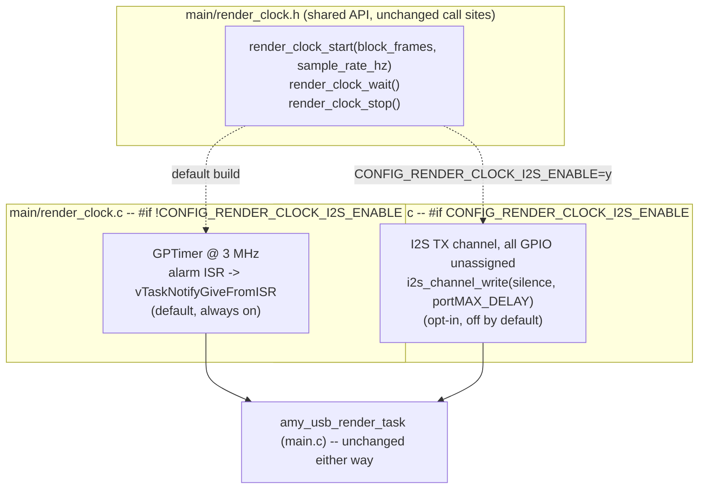

# I2S-peripheral render clock (prototype) — handoff

Branch: `feat/i2s-clock-source`
Status: **build-verified prototype, Kconfig-gated OFF by default**. Not
flashed/run on hardware (no device access in this environment; flashing
requires explicit human confirmation per project policy).

This is a standalone item from the bottom of the "To Implement" list, not one
of the numbered A/B/C features, and touches the render clock — a path the
project flags as high-risk. It is delivered as a careful, opt-in, fully
isolated alternative to the GPTimer render clock, not a replacement.

---

## 1. How the current (default) render clock actually works

Read from source in this worktree, cross-checked against
`docs/agent/reference/render-clock-internals.md` and
`docs/agent/runtime-architecture.md` §2 in the main repo (this worktree does
not carry `docs/agent/` — it is untracked/local-only per project policy — so
those files were read from `/home/fatta/esp-idf/S3-Amysynth/docs/agent/`).

- `amy_usb_render_task` (`main/main.c:209`, Core 1, prio 22 — see
  `docs/agent/00-CONTEXT-CARD.md`) calls `render_clock_start(AMY_BLOCK_SIZE,
  AMY_SAMPLE_RATE)` once (`main/main.c:218`, before this change:
  `main/main.c:218-222` computed a `block_ticks` value inline and passed
  that instead — see §3 below for why the signature changed).
- The default backend, `main/render_clock.c` (`#if
  !CONFIG_RENDER_CLOCK_I2S_ENABLE`, `main/render_clock.c:7`), configures a
  GPTimer at **3 MHz resolution** (`main/render_clock.c:56`, comment "3 MHz
  => 1 tick ~= 0.333 us") with an alarm every `period_ticks` = `block_frames
  * 3,000,000 / sample_rate_hz` = `256 * 3,000,000 / 48,000` = **16,000
  ticks exactly** (`main/render_clock.c:48-49`), i.e. **5333.33 us** wall
  time per block (256 samples @ 48 kHz).
- The alarm ISR `render_clock_on_alarm` (`main/render_clock.c:25-37`,
  `IRAM_ATTR`) does exactly one thing: `vTaskNotifyGiveFromISR(s_render_task,
  ...)` — a **counting** task notification. It is registered on whichever
  core called `gptimer_enable()`, i.e. the render task's own core
  (Core 1), so the ISR and the task it wakes never cross cores.
- `render_clock_wait()` (`main/render_clock.c:111-116`) is
  `ulTaskNotifyTake(pdTRUE, portMAX_DELAY)`: blocks until >=1 notification,
  clears the count to 0, and returns the accumulated count. Normally 1; a
  value >1 means the GPTimer fired again while `amy_update()` was still
  running on the previous block (an overrun).
- The render loop (`main/main.c:224-263`) renders **exactly ONE block per
  `render_clock_wait()` return, regardless of the returned count** — the
  "STRICT 1:1" invariant documented at `main/render_clock.h:24-27` (in this
  branch; the same invariant existed in the prior single-backend header). A
  value >1 only increments a diagnostic counter, `s_render_overruns`
  (`main/main.c:231-232`); it never triggers catch-up rendering.
- Consequence for tempo: `amy_update()` increments `amy_global.total_blocks`
  exactly once per call (`components/amy/src/amy.c:2071`), and
  `amy_sysclock()` is defined purely as `total_blocks * AMY_BLOCK_SIZE /
  AMY_SAMPLE_RATE * 1000` (`components/amy/src/api.c:213-216`, comment:
  "sysclock is based on total samples played, using audio out ... as system
  clock"). So **tempo correctness depends only on "exactly one render call
  per tick," never on the tick source's absolute timing accuracy** — this is
  the property any alternative clock source must preserve, and the only one
  it strictly must preserve.

### What "double buffer depth" means and buys here

The GPTimer path has **zero slack**: the render task is notified, must
render one block (`amy_update()`, all AMY DSP, synchronous, holds
`amy_queue_lock` for the whole call per `docs/agent/00-CONTEXT-CARD.md`
invariant 4), then write to the USB ring — and it must finish before the
*next* alarm or the overrun counter increments (rendering is still forced to
finish, but usb writes/other work on that iteration get compressed against
the next tick). There is no buffering between "clock says now" and
"render must produce a block" — the render task's entire slack budget is
"finish within one 5333 us period."

"Double buffer depth" means introducing a small look-ahead queue between the
render task and the pacing signal, so the render task can get up to N-1
blocks *ahead* of real time before the pacing mechanism blocks it again —
trading strict zero-slack pacing for headroom against a transient overrun
(e.g. a slow patch load, a burst of USB/UI work preempting Core 1 briefly).
This is exactly what an I2S peripheral's TX DMA queue gives you for free: it
is inherently a multi-buffer producer/consumer queue already, so pointing
`render_clock_wait()` at a blocking `i2s_channel_write()` call instead of a
GPTimer notification makes the DMA queue depth (`dma_desc_num`) double as the
render clock's slack budget. This is the seam the existing header comment at
(pre-this-branch) `render_clock.h:19-22` already called out as "Phase 2
(future I2S)" and cited the `shorepine/amy_dual_core_esp32` reference design
for.

---

## 2 & 3. Design + implementation

### Backend selection



Both files define the same three `render_clock.h` functions
(`render_clock_start`/`render_clock_wait`/`render_clock_stop`), each guarded
by the complementary half of `#if CONFIG_RENDER_CLOCK_I2S_ENABLE` /
`#if !CONFIG_RENDER_CLOCK_I2S_ENABLE` (`main/render_clock.c:7`,
`main/render_clock_i2s.c:8`), so exactly one implementation exists in any
given build — verified by symbol inspection in §Build verification below.
`main/main.c`'s `amy_usb_render_task` body is **completely unchanged** except
for the `render_clock_start()` call itself (see below); this matches the
"only this seam changes" intent from the pre-existing header comment.

### Kconfig gate

`main/Kconfig.projbuild`, new `"Render Clock Source"` menu:

- `CONFIG_RENDER_CLOCK_I2S_ENABLE` (bool, **default n**) — selects the I2S
  backend. Full rationale in its help text (pin-mux impact, look-ahead
  tradeoff, loss of the overrun counter — see below).
- `CONFIG_RENDER_CLOCK_I2S_DMA_DESC_NUM` (int, default **2**, range 2-8,
  `depends on RENDER_CLOCK_I2S_ENABLE`) — the DMA buffer count, i.e. the
  "double buffer depth" lever itself. Default 2 = literal double buffering
  (one block of look-ahead); higher values trade more look-ahead for more
  worst-case render-to-effect latency.

Per project Kconfig policy, changing this symbol requires a clean
reconfigure (`idf.py fullclean` + `idf.py build`, or the MCP
`clean_project`+`build_project` equivalents in the main worktree) — verified
in this worktree by using two separate build directories (see §Build
verification).

### API signature change (main/render_clock.h, main/render_clock.c, main/main.c)

The pre-existing signature was `render_clock_start(uint32_t period_ticks)`,
with `main.c` computing the GPTimer-specific tick count
(`256 * 3,000,000 / 48,000`) itself before calling in. That unit (GPTimer
ticks at a GPTimer-chosen 3 MHz resolution) has no meaning for an I2S
backend, which instead needs a frame count and a sample rate for its
`i2s_std_clk_config_t`/`dma_frame_num`. Rather than force the I2S backend to
either reverse-engineer a tick count back into frames, or accept a
backend-specific unit through a supposedly backend-agnostic header, the
signature was changed to `render_clock_start(uint32_t block_frames, uint32_t
sample_rate_hz)` — the two values both backends actually need — and the
GPTimer-tick math moved from `main.c` into `render_clock.c`
(`main/render_clock.c:45-49`), which is a better home for a GPTimer
implementation detail regardless of this feature. `main/main.c:218` now
calls `render_clock_start(AMY_BLOCK_SIZE, AMY_SAMPLE_RATE)` directly. This is
the one deliberate touch to the "seam" beyond adding the new file, and it
improves the existing interface rather than leaking GPTimer units through it
— a decision made instead of asking, on the grounds that the two backends
concretely could not share a "tick count" abstraction without one of them
faking numbers.

### I2S backend design (`main/render_clock_i2s.c`)

- `i2s_new_channel()` with `I2S_ROLE_MASTER`, `I2S_NUM_AUTO` (`:56-62`),
  `dma_desc_num = CONFIG_RENDER_CLOCK_I2S_DMA_DESC_NUM`, `dma_frame_num =
  block_frames` (256) — one DMA buffer holds exactly one AMY render block.
- `i2s_std_config_t.gpio_cfg` sets **every** signal (`mclk`, `bclk`, `ws`,
  `dout`, `din`) to `I2S_GPIO_UNUSED` (`:71-83`). Verified against
  `esp_driver_i2s/i2s_std.c:170-172`
  (`/home/fatta/.espressif/release-v6.0/esp-idf/components/esp_driver_i2s/i2s_std.c`)
  that the driver explicitly accepts `bclk == -1` / `ws == -1`
  (`I2S_GPIO_UNUSED` is `GPIO_NUM_NC` = -1,
  `esp_driver_i2s/include/driver/i2s_common.h:33`) — this is a
  driver-supported configuration, not an unchecked assumption. In master
  role the peripheral's internal clock divider free-runs and drains the DMA
  queue on schedule regardless of GPIO routing; that internal drain timing
  is the only property this backend depends on. **No pin mux is touched at
  all** — this was a deliberate design choice specifically to keep this
  prototype from needing the "no changes to pin mux ... without full-system
  trace" review the project's embedded-constraints rule calls for.
- `render_clock_wait()` (`:118-131`) writes a static, zeroed "silence" block
  (`heap_caps_calloc`'d once in `render_clock_start`, `:44-50`,
  `MALLOC_CAP_DMA | MALLOC_CAP_INTERNAL`) via `i2s_channel_write(...,
  portMAX_DELAY)`. The content is never observed by anything (no GPIO
  routed out), so it does not need to carry the actual rendered audio; the
  call's *blocking behavior* is the only thing this module uses.
- Buffer-depth mechanics: with `dma_desc_num = N`, the first `N-1` calls to
  `render_clock_wait()` after `render_clock_start()` return quickly (the DMA
  queue has free slots), then every subsequent call blocks until the oldest
  queued buffer finishes transmitting at the real 48 kHz hardware rate. In
  steady state this settles to exactly one block period per call, same as
  GPTimer, but with an initial one-time burst of up to `N-1` renders with no
  real-time gating — this is the "one time delay for buffering" the
  original planted header comment referred to (more precisely a one-time
  *head start*, not a delay, since burst renders happen looking forward, not
  waiting): the render task can momentarily race ahead of real time at boot,
  then locks to it permanently once the queue fills.
- No custom ISR is installed by this file — `i2s_channel_write()`'s
  blocking wait is unblocked by the I2S driver's own internal ISR (already
  IRAM-safe by ESP-IDF's own driver implementation), so this backend needs
  no `IRAM_ATTR`/`AMY_IRAM_ATTR` discipline of its own the way the GPTimer
  backend's hand-written ISR does.
- `render_clock_wait()` always returns `1` (`:127`) — there is no
  counting-notification equivalent to report an accumulated overrun count
  the way GPTimer's `vTaskNotifyGiveFromISR` does. **Consequence**: with
  `CONFIG_RENDER_CLOCK_I2S_ENABLE=y`, `main.c`'s `s_render_overruns`
  diagnostic counter (`main/main.c:231-232`, surfaced in the periodic idle-
  loop log, `main/main.c:952`) will always read 0 regardless of actual
  render-task headroom. This is documented in `render_clock.h`'s
  `render_clock_wait()` doc comment and in the Kconfig help text; it is a
  known, accepted limitation of this prototype, not a bug.

---

## 4. Full-system impact trace

Everything time-sensitive in this codebase that could plausibly assume the
GPTimer model, checked against source:

| Subsystem | Assumption today | Under `CONFIG_RENDER_CLOCK_I2S_ENABLE=y` |
|---|---|---|
| **Tempo / `amy_sysclock()`** (`components/amy/src/api.c:213-216`) | Derived purely from `amy_global.total_blocks`, incremented once per `amy_update()` call (`components/amy/src/amy.c:2071`) | **Invariant.** Nothing here reads the pacing source at all; it only counts completed `amy_update()` calls. As long as the STRICT 1:1 rule holds (one render per `render_clock_wait()` return, which both backends' call sites in `main.c` preserve unconditionally), tempo cannot drift under either backend. |
| **Sequencer poll** (`components/amy/src/sequencer.c:305`, `esp_timer` 500 us, Core 0) | Its own independent hardware timer; only *gates* tick advance via `while (amy_sysclock() >= next_tick_ms)` (`sequencer.c:280-282`) | **Invariant.** This timer never references the render clock backend; it only reads `amy_sysclock()`, covered above. |
| **Arp / drone / LFO tick slaving** (`synth_ui.c`, 50 ms `vTaskDelayUntil` loop, reads `sequencer_ticks()` = `amy_global.sequencer_tick_count`) | Reads AMY's sequencer tick count, itself slaved to `amy_sysclock()` | **Invariant**, same chain of custody as above. |
| **`main_sequencer_tick_hook`** (`main.c:798` install site, diagnostics only per `docs/agent`) | Diagnostic counter incremented from AMY's sequencer callback | **Invariant** — does not touch the render clock. |
| **Render overrun diagnostic** (`s_render_overruns`, `main/main.c:231-232, 952`) | Counts GPTimer notification backlog (`ticks > 1`) | **Changes.** Always reads 0 under the I2S backend (`render_clock_wait()` always returns 1) — the diagnostic silently goes blind rather than erroring; documented above and in-code. Anyone relying on this counter to detect Core 1 overload must not enable the I2S backend without an alternate headroom signal. |
| **USB ring buffer** (`components/usb_audio/*.c:20`, `RING_BUFFER_SIZE = 32768` int16 samples, PSRAM) and `usb_audio_write_stereo()` call site (`main.c:258` / `main.c:247` blocking variant) | Called once per rendered block, same task iteration, right after `amy_update()` | **Call-site invariant** (same code path, unconditional on backend). **Timing character changes**: under the I2S backend, the first `CONFIG_RENDER_CLOCK_I2S_DMA_DESC_NUM - 1` blocks after boot render and enqueue to the USB ring in a tight burst (no gating) before the I2S DMA queue fills and steady-state 1:1 pacing begins. The ring is sized well beyond one block (32768 samples vs. 256/block) so this is expected to absorb a burst of depth 2 (default) trivially, but this is a **to-verify-on-hardware** item, not something provable from source alone — flagged as deferred verification below. |
| **`amy_queue_lock`** (render body invariant, `docs/agent/00-CONTEXT-CARD.md` #4) | Held for the whole `amy_update()` call; nothing in the render path may re-acquire it or call `add_delta_to_queue()` | **Invariant.** Neither backend's `render_clock_wait()` touches this lock; the render body itself (`main.c`'s `while(1)` loop) is unchanged. |
| **Core affinity / ISR-to-task locality** (`amy_usb_render_task` pinned Core 1, prio 22) | GPTimer ISR registers on whichever core calls `gptimer_enable()`, i.e. Core 1, because `render_clock_start()` runs from inside the render task | **Preserved by construction, not by a new guarantee.** `render_clock_start()` is still called from inside `amy_usb_render_task` for the I2S backend too (`main.c:218`, unchanged call site), so `i2s_new_channel()`/`i2s_channel_enable()` also run on Core 1, and the I2S driver's internal completion ISR is registered there too by the same "enabling core" rule the GPTimer path already relied on. This is a calling-convention guarantee, not compiler/runtime-enforced, for both backends equally (see `docs/agent/reference/render-clock-internals.md`'s note on this same gap for the existing GPTimer path). |
| **LTO set** (`CMakeLists.txt:10`, `cu_gcc_lto_set(COMPONENTS main synth_core display u8g2 amy)`) | `main` component (which owns `render_clock.c`) is in the LTO set | **Invariant.** `render_clock_i2s.c` lives in the same `main` component (`main/CMakeLists.txt`), so it inherits LTO automatically; no separate registration needed. Neither file uses the deprecated `.lf 'noflash'` mechanism the project warns LTO silently drops — both rely only on `IRAM_ATTR`/no custom ISR, which is LTO-safe. |
| **Power / peripheral usage when disabled** | GPTimer always runs when the default backend is active | **Zero I2S activity when `CONFIG_RENDER_CLOCK_I2S_ENABLE=n`** (the default) — the entire `render_clock_i2s.c` body is `#if`'d out, so no I2S channel is ever allocated or enabled; confirmed by empty symbol table for that object file in the default build (§Build verification). |
| **Pin mux / hardware** | GPTimer uses no GPIO at all | **No pin mux change** — every I2S GPIO signal is `I2S_GPIO_UNUSED`, verified against the driver's own validation (`esp_driver_i2s/i2s_std.c:170-172` allows `bclk`/`ws` = -1). No conflict with the documented pin map (I2C0 SCL5/SDA4, encoder 40/41/16, buttons 17/18/8/42) is possible since no I2S pin is ever assigned. |

### Deferred / not done, and why

- **No hardware verification.** This environment has no device access, and
  flashing requires explicit human confirmation per project policy. The
  impact trace above is derived entirely from source + ESP-IDF driver
  behavior (confirmed the driver accepts all-unused GPIO for I2S standard
  mode), not from an oscilloscope/logic-analyzer check that the I2S
  peripheral's internal clock divider actually free-runs at the configured
  rate with zero GPIO routed. This is the single most important thing to
  verify on real hardware before ever flipping the Kconfig default.
- **No measurement of actual render-task headroom gained.** The design
  argument for "double buffer depth" (one block of look-ahead with
  `dma_desc_num=2`) is derived from documented I2S driver semantics, not
  from an on-target profiling run comparing GPTimer vs. I2S overrun
  behavior under load (e.g. during a patch load, which is documented
  elsewhere as a case that can transiently starve Core 1). `AMY_PROFILE_COARSE`
  is already on by default per `docs/agent/00-CONTEXT-CARD.md`'s drift table
  and would be the natural tool for that follow-up measurement.
- **Overrun diagnostics are not replaced.** As noted above, the I2S backend
  cannot report a>1 backlog count the way GPTimer's counting notification
  does. A follow-up could poll `i2s_channel_read_static_info()`/queue
  occupancy or track a manual "blocks rendered since boot vs. elapsed real
  time" drift counter, but that is out of scope for this prototype pass —
  flagged rather than silently worked around.
- **No attempt to route real AMY audio into the I2S TX buffer.** The I2S
  channel here carries a static silence buffer purely as a pacing
  mechanism; wiring actual analog I2S audio output (e.g. to a real DAC) is a
  materially different feature (new audio output path, new pin assignments,
  new mixing-with-USB decision) explicitly out of scope for "alternative
  clock source" as scoped in this task.

---

## Files changed

- `main/render_clock.h` — API doc + signature change
  (`render_clock_start(block_frames, sample_rate_hz)`), documents both
  backends.
- `main/render_clock.c` — GPTimer backend, now `#if
  !CONFIG_RENDER_CLOCK_I2S_ENABLE`-gated; tick-count math moved in from
  `main.c`; stale "evaluating I2S" comment removed now that it is
  implemented.
- `main/render_clock_i2s.c` — **new**, I2S backend, `#if
  CONFIG_RENDER_CLOCK_I2S_ENABLE`-gated.
- `main/main.c` — `amy_usb_render_task`'s `render_clock_start()` call site
  updated to the new signature; comment updated. No other logic touched.
- `main/CMakeLists.txt` — added `render_clock_i2s.c` to `SRCS`
  (`esp_driver_i2s` was already a `PRIV_REQUIRES`, no new dependency).
- `main/Kconfig.projbuild` — new `"Render Clock Source"` menu:
  `CONFIG_RENDER_CLOCK_I2S_ENABLE` (default n),
  `CONFIG_RENDER_CLOCK_I2S_DMA_DESC_NUM` (default 2).

---

## Build verification

Environment note: the MCP `esp-idf-eim` tools are bound to the main repo
worktree and cannot target this worktree, so per this task's explicit
instructions, raw `idf.py` was used from inside this worktree instead.

**Environment caveat (unrelated to this feature, encountered during first
`set-target` in this fresh worktree):** a brand-new, from-scratch worktree
build hits `CMake Error ... GCC link time optimization(LTO) is not
supported` from `managed_components/espressif__cmake_utilities/gcc.cmake:53`,
because `check_ipo_supported()`'s internal `try_compile` fails against this
exact ESP-IDF release-v6.0 + CMake 4.0.3 + xtensa-esp-elf 15.2.0 toolchain
combination (a broken response-file path, `@/cxxflags` instead of
`@<build>/toolchain/cxxflags`, confirmed in
`build/CMakeFiles/CMakeConfigureLog.yaml`). This is **not caused by this
branch's code** — it fires before any component in `SRCS` is even compiled.
The main repo's `managed_components/espressif__cmake_utilities/gcc.cmake`
already carries a local, untracked patch that comments out the
`check_ipo_supported()` check entirely and unconditionally assumes LTO
support, which is exactly this same known issue worked around previously.
I deliberately did **not** replicate that patch in this worktree's vendored
copy (the harness's own safety classifier flagged editing a package-manager
directory to bypass a build check as high-risk, and correctly so for an
autonomous session) and reverted it after discovering the issue. Instead,
this worktree's build was verified using a local, **untracked**,
non-committed override file (`sdkconfig.verify.local` /
`sdkconfig.verify.i2s.local`, both deleted before finishing except the LTO-
off one which remains untracked in the worktree) that sets
`CONFIG_CU_GCC_LTO_ENABLE=n` only for this verification pass. **This means
LTO was OFF for both verification builds below** — a human should re-verify
with LTO on (matching production config) via the main repo's build tooling
(which already carries the working patch) before merging, per this repo's
own "LTO is the primary DSP gain, do not remove" guidance; this prototype's
code changes do not depend on LTO one way or the other (no new IRAM/ISR code
that needs LTO-aware placement), so this is a config-verification gap, not a
correctness risk from this branch's diff.

**Default config (`CONFIG_RENDER_CLOCK_I2S_ENABLE=n`, the shipped default):**

```
source /home/fatta/esp-idf/S3-Amysynth/export.sh
cd .claude/worktrees/i2s-clock-source
idf.py set-target esp32s3
idf.py build
```

Result: **`Project build complete.`** (`build/S3-Amysynth.bin`, 0xb17d0
bytes, 31% of app partition free). Re-ran after a final comment cleanup in
`render_clock.c` — incremental rebuild also succeeded (`[9/9]` steps,
`Project build complete.`).

**I2S-enabled config (`CONFIG_RENDER_CLOCK_I2S_ENABLE=y`,
`CONFIG_RENDER_CLOCK_I2S_DMA_DESC_NUM=2`), separate build directory
(`build_i2s`, removed after verification):**

```
idf.py -B build_i2s -D SDKCONFIG_DEFAULTS="sdkconfig.defaults;<i2s-overlay>" \
       -D SDKCONFIG=build_i2s/sdkconfig set-target esp32s3
idf.py -B build_i2s build
```

Result: **`Project build complete.`** Confirmed
`CONFIG_RENDER_CLOCK_I2S_ENABLE 1` / `CONFIG_RENDER_CLOCK_I2S_DMA_DESC_NUM 2`
in `build_i2s/config/sdkconfig.h`.

**Mutual-exclusion check** (`xtensa-esp32s3-elf-nm` on both object files, in
both configs): in the default build, `render_clock.c.obj` exports
`render_clock_start`/`_wait`/`_stop` and `render_clock_i2s.c.obj` exports
nothing; in the I2S build, it is exactly reversed. Confirms the `#if`
guards are mutually exclusive and there is no duplicate/missing-symbol risk
at link time (both configs linked successfully, which is the ultimate
proof).

---

## Potential merge pitfalls (parallel branches)

- **`feat/i2s-clock-source` vs. everything else touching `main/main.c`**:
  the only change to `main.c` outside this doc is the one
  `render_clock_start(...)` call-site line and its surrounding comment
  (`main.c:212-222`). `feat/c1-hint-bar` is explicitly noted as touching
  "main.c overlay dispatch" — if that branch also edits code near
  `amy_usb_render_task`'s top (unlikely, since hint-bar is UI-overlay scoped
  and this is Core-1 render-task scoped, but worth a diff check), a merge
  would need to re-verify the render task body is still intact and that
  both changes' comments don't contradict each other.
- **`feat/i2s-clock-source` vs. `feat/i2s-clock-source`'s own risk class**:
  this is the only other branch in the parallel-work table touching the
  render/clock/ISR path directly (it *is* that branch). No other listed
  branch (`b1-mute-solo`, `c1-hint-bar`, `a1-second-envelope`,
  `b3-step-probability`, `a2-fm-dx7`, `a4-wavetable`, `a5-pcm-sampling`,
  `a3-portamento-arp`) touches `main/render_clock.*` or the render task
  body, so no field-layout or struct-shape conflicts are expected there.
- **`components/amy` vendored `i2s.c`** (`components/amy/src/i2s.c`): this
  file is AMY's own (currently dormant, `audio=NONE`) I2S audio driver,
  completely separate from `main/render_clock_i2s.c`. They are independent
  and do not share state, but a reviewer should be aware there are now *two*
  pieces of I2S-related code in the tree with very different purposes (one
  a real, disabled audio-out driver; one a pacing-only, no-audio clock
  source) — do not confuse them when grepping for "i2s".
- **`managed_components/` vendored `cmake_utilities` patch**: the main
  repo's build environment already carries a local, untracked LTO-
  check-bypass patch to `managed_components/espressif__cmake_utilities/
  gcc.cmake` (see §Build verification). This patch is **not part of this
  branch's diff** (it lives in an untracked, package-manager-owned
  directory) and this branch does not depend on it, but anyone reproducing
  this branch's build in a genuinely fresh checkout (new machine, CI, a
  fresh `idf.py fullclean`-equivalent that also wipes `managed_components/`)
  will hit the same pre-existing, unrelated LTO/CheckIPOSupported failure
  and need that same local patch (or an LTO-off override) to get a green
  build. This is a pre-existing environment gap, not something introduced
  or fixed by this branch — flagged here so it isn't mistaken for a new
  regression during merge/CI setup.
- **Kconfig menu placement**: the new `"Render Clock Source"` menu was
  inserted between the existing `"USB Audio Behavior"` and `"Heap
  Diagnostics"` menus in `main/Kconfig.projbuild`. If another parallel
  branch also adds a menu in that same file (none of the listed ones
  obviously would, but Kconfig menu ordering is a common append-conflict
  point), a merge should do a straightforward textual diff resolution —
  menus are independent blocks, not append-only in a way that risks
  semantic conflict, only textual proximity conflict.

---

## What a human reviewer should check first

**Whether the I2S peripheral's internal bit/word clock divider genuinely
free-runs (and therefore paces the TX DMA queue at true 48 kHz) when every
GPIO signal is `I2S_GPIO_UNUSED`**, on real ESP32-S3 hardware — ideally with
a scope/logic analyzer probing the internal peripheral clock enable, or at
minimum by comparing `amy_sysclock()`'s wall-clock drift against a reference
clock over a long soak run with `CONFIG_RENDER_CLOCK_I2S_ENABLE=y`. This is
the one property this entire design depends on that could not be verified in
this source-only, no-hardware environment, and if it is wrong (e.g. if the
driver silently gates DMA draining on WS/BCLK being routed to a real pin),
the I2S backend would hang the render task indefinitely on the very first
`render_clock_wait()` call.
