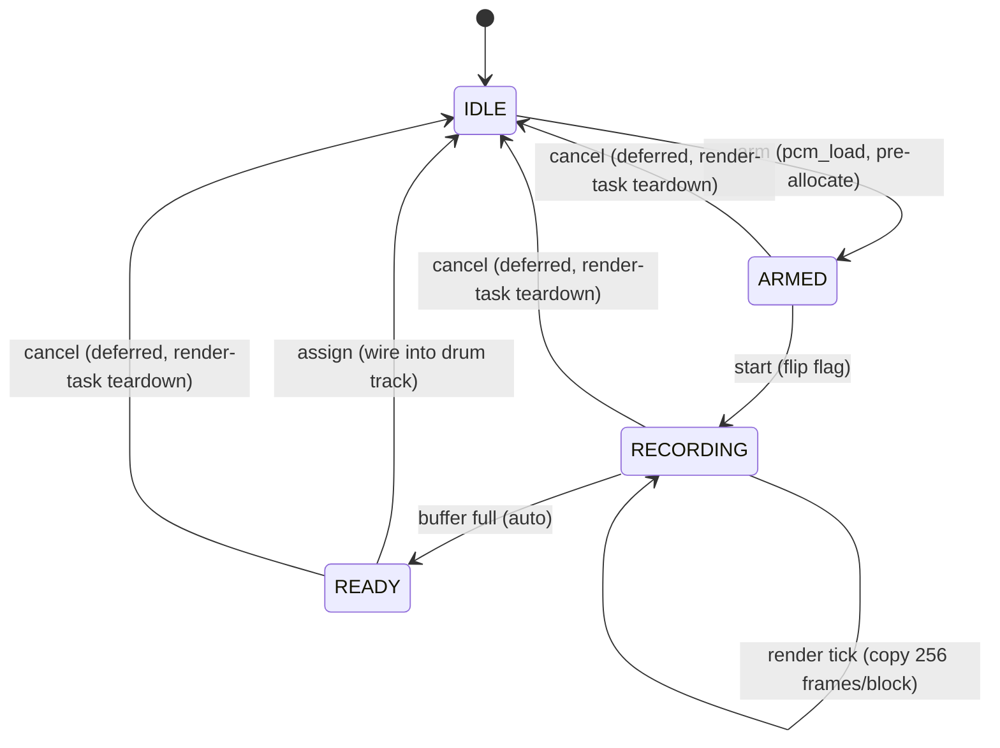

# A5 — Runtime PCM Sampling (zS/zO sample-and-hold to PCM slot)

Branch: `feat/a5-pcm-sampling`
Status: **complete vertical slice** — arm/record/assign flow working end to
end, build-verified (see Build verification below).

## What this is

AMY's PCM engine (`components/amy/src/pcm.c`) only ever played back two kinds
of sample: the baked-in 808/wavetable ROM bank (`pcm_map[]`, 16 entries) and,
via `pcm_load()`, any statically-authored in-memory sample. Nothing in this
codebase ever called `pcm_load()` before this change — every existing "PCM
drum" reference (`components/synth_core/sequencer_core/seq_core_synth.c`)
only ever selected a ROM preset number. This feature adds a **runtime**
caller of `pcm_load()`: it captures AMY's own final mixed output into a
fixed-length one-shot PCM slot, then wires that slot into one drum-layer
track so it plays back exactly like the built-in 808 samples — same
`render_pcm()` path, same per-track envelope, same velocity/pitch handling.



## What was implemented

### New module: `custompatches/sample_rec.c` / `sample_rec.h`

- `components/synth_core/include/custompatches/sample_rec.h` — public API,
  `sample_rec_state_t` (IDLE/ARMED/RECORDING/READY).
- `components/synth_core/custompatches/sample_rec.c` — the whole feature:
  - `sample_rec_arm()` (`sample_rec.c:35`): `pcm_load()` a 1.5 s mono slot
    (preset number 100, well clear of the ROM range 0..15), zeroes it,
    snapshots the target `(layer_idx, track)`.
  - `sample_rec_start()` (`sample_rec.c:73`): CAS ARMED→RECORDING; the render
    task picks this up at the next block boundary, so capture always starts
    exactly on a block edge.
  - `sample_rec_render_tick()` (`sample_rec.c:129`): called once per render
    block from `main.c`; downmixes the interleaved stereo block to mono and
    copies into the slot; auto-transitions to READY when full.
  - `sample_rec_assign()` (`sample_rec.c:85`): wires the finished preset into
    the target drum track via the new `sequencer_core_set_drum_pcm_preset()`,
    forcing the drum layer into PCM engine mode if it wasn't already.
  - `sample_rec_cancel()` (`sample_rec.c:101`): only sets a flag — see
    "Concurrency design" below for why teardown is deferred to the render
    task itself.
  - Registered in `components/synth_core/CMakeLists.txt` (SRCS list) and
    initialized from `synth_ui_init()` (`synth_ui_task.c:247`, next to the
    existing `arp_core_init()`/`drone_core_init()` calls).

### `sequencer_core` — per-track PCM preset override

- `components/synth_core/include/sequencer_core.h` — new
  `sequencer_core_set_drum_pcm_preset()` / `_get_drum_pcm_preset()`.
- `components/synth_core/sequencer_core/seq_core_synth.c:31-53` — a
  file-local `s_drum_pcm_preset[MAX_LAYERS][SEQ_TRACKS]` override table,
  lazily seeded from the existing `SEQ_DRUM_PCM_PRESET[]` defaults so PCM
  drum mode is unaffected until a track is actually reassigned. The PCM
  branch of `sequencer_configure_synth()` (`seq_core_synth.c:243`) now reads
  through `drum_pcm_preset_for()` instead of the raw ROM array. Deliberately
  **not** a new field in the shared `seq_layer_t`/`display_seq_state_t`
  struct (`components/display/display_seq.h`) — see "Design decisions."

### UI: menu overlay, not a new screen

Two new action items in the existing generic menu overlay
(`components/synth_core/synth_ui/ui_screen_menu.c`):
- `MI_SAMPLE` (`ui_screen_menu.c:47`, handler `:384`) — one button that
  advances the state machine (arm → start → assign) and previews progress/
  target in its value column ("Arm T2" / "Rec!" / "Rec 63%" / "Assign?").
  Targets whatever track is currently selected on the sequencer grid
  (`seq_state.active_layer_idx` / `seq_state.selected_track`), snapshotted at
  ARM time.
- `MI_SAMPLE_CANCEL` (`:48`, handler `:405`) — aborts from any non-idle state.

No new `ui_mode_t`, no new OLED renderer, no new encoder/button routing in
`main.c` or `synth_ui_task.c` — the menu overlay is a generic label+value list
renderer (`components/display/display_menu.c`) already built as the low-
footprint extension point for this kind of feature (see "Preset FX" / "Drum
Mode" toggles already living there).

### `main.c` — render-task hook + PSRAM placement

- `main.c:247` — `sample_rec_render_tick(block, AMY_BLOCK_SIZE)` called
  right after `amy_update()` inside `amy_usb_render_task` (Core 1), i.e.
  after `amy_queue_lock` is already released. Alloc-free/non-blocking on
  every block except the rare one where a cancel is being torn down.
- `main.c:838` — `amy_cfg.ram_caps_sample = MALLOC_CAP_SPIRAM;` next to the
  existing `ram_caps_delay` line, so intent doesn't depend on the recording
  size staying above the 16 KB `SPIRAM_MALLOC_ALWAYSINTERNAL` threshold.

### AMY local edit: lock accessor prototypes

`components/amy/src/amy.h:28-51` — added `extern SemaphoreHandle_t
amy_queue_lock;` for the `ESP_PLATFORM` branch (previously only `_WIN32`/
`_POSIX_THREADS` had an extern for the lock variable) plus unconditional
prototypes for `amy_grab_lock(void)` / `amy_release_lock(void)` /
`amy_init_lock(void)`, none of which upstream ever declares anywhere despite
every platform branch in `amy.c` defining them. `sample_rec_arm()` and the
cancel path in `sample_rec_render_tick()` need these to guard their
`pcm_load()`/`pcm_unload_preset()` calls — see "Concurrency design."
Documented in `AMY-EDITS.md` as an **upstream-PR candidate** (the gap is
platform-agnostic, not ESP32-specific).

## Design decisions

1. **Capture AMY's own output, not USB audio-in.** The task brief offered
   both. `components/usb_audio/usb_audio.c:169` wires `.output_cb = NULL`
   ("we only need mic direction") — the UAC device currently has no
   host→device audio path at all. Wiring one up (new UAC alt-setting,
   Kconfig, a second SPSC ring in the opposite direction) is a materially
   bigger, separately-reviewable change than this vertical slice budget
   allows, and self-output capture already satisfies "record a pattern/arp/
   drone loop into a pad" — the most immediately useful case for a step-
   sequencer instrument. Audio-in capture is a clean, additive extension
   later (same `sample_rec_render_tick()` shape, different data source).

2. **Fixed 1.5 s mono buffer, single slot.** Chosen per the brief's explicit
   scope guidance ("fixed reasonable buffer length... one arm/record/assign
   flow"). Mono halves the memory vs. stereo and matches how every other
   drum-track PCM preset in this codebase is already mono (`render_pcm`
   handles `channels==1` today; the built-in 808 samples are all mono too).
   One slot (not per-track or a rotating pool) keeps the state machine and
   preset-numbering trivial; multi-slot is the natural extension (see
   "Deferred").

3. **No new field in the shared `seq_layer_t`/`display_seq_state_t` struct.**
   Several other in-flight branches (`feat/b1-mute-solo`,
   `feat/b3-step-probability`) also touch that struct. The per-track PCM
   override lives entirely inside `seq_core_synth.c` as a lazily-seeded
   file-local table, reachable only through the two new
   `sequencer_core_set/get_drum_pcm_preset()` functions — zero risk of a
   field-layout conflict with those branches.

4. **Menu overlay instead of a new top-level screen.** A dedicated
   `ui_mode_t` + OLED renderer (mirroring the drone/prog/trackopts screens)
   would need new encoder/button routing in `main.c` and `synth_ui_task.c`,
   both hot files for `feat/c1-hint-bar` and `feat/b1-mute-solo`. The
   existing menu overlay (already the extension point for "Drum Mode",
   "Preset FX", volume, etc.) needed only two new enum values + two `case`
   blocks — this was the deciding factor for keeping the whole UI footprint
   to one file.

5. **ARM pre-allocates; START only flips a flag.** `pcm_load()` mallocs and
   mutates a linked list — doing that on a block boundary inside the render
   task would violate "no alloc in the render path." Splitting ARM (Core 0,
   can block briefly) from START (just an atomic flag) means the actual
   capture-start is instant and precisely block-aligned.

6. **Concurrency: cancel is deferred to the render task, not applied
   immediately by the UI task.** `pcm.c`'s memory-preset linked list
   (`memorypcm_ll_start`) is walked **unlocked** by `render_pcm()` from
   inside the render body (`amy_queue_lock` held for the whole render). If
   the UI task (Core 0) called `pcm_unload_preset()` directly while the
   render task (Core 1) might be mid-write into that same buffer
   (RECORDING state), that's a cross-core use-after-free. Fix: `arm()`
   grabs `amy_queue_lock` around its own `pcm_load()` call (mirrors how
   `add_delta_to_queue()` already self-locks for exactly this reason); the
   actual teardown for `cancel()` happens **inside** `sample_rec_render_tick()`
   on the render task's own thread, so the buffer only ever has one writer.
   `cancel()` itself just sets an atomic flag and returns.

7. **`SAMPLE_REC_MIDINOTE = 60` (C4) as the reference pitch.** Neutral
   default; the track's existing `track_base_note` (already user-editable,
   e.g. the kick track defaults to a low note) then transposes playback
   exactly the way any other PCM preset already does via `render_pcm`'s
   `preset->midinote` shift. No new UI control needed for this.

## What is deferred, and why

- **Audio-in (host→device) capture.** Needs a new UAC input direction —
  scoped out per decision 1 above; natural extension once
  `components/usb_audio` grows an `output_cb`.
- **Multiple pad slots / a real looper (B7 overlap).** This vertical slice
  is intentionally one slot, one fixed length, one-shot only — no loop
  points, no multiple simultaneous pads, no live re-triggering while
  recording. The task brief explicitly calls out that a full looper is a
  separate, bigger feature (B7); this PR's `sample_rec.c` is structured so
  a future looper could reuse `sample_rec_render_tick()`'s block-copy shape
  with a preset-number pool instead of one constant, but that pool, a
  loop-point UI, and start/stop-triggered (not fixed-length) recording are
  all new work, not present here.
- **Re-arming while the previous recording is still assigned to a track.**
  `pcm_load()` internally unloads-then-reallocates the same preset number;
  wrapping that in `amy_queue_lock` makes it memory-safe, but a track still
  actively referencing that preset will glitch to silence/noise until the
  new recording finishes and is reassigned. Documented behavior, not a
  crash — a real multi-slot design (see above) is the fix, not attempted
  here.
- **Persistent recording-progress display without opening the menu.** The
  in-progress `feat/c1-hint-bar` branch (persistent one-line status string)
  is a natural home for "Recording... 63%" once it lands; not duplicated
  here to avoid guessing at its API surface.
- **Trimming silence / auto-detecting the actual transient length.** The
  slice always records the full fixed length (documented in decision 6 of
  the original design pass, retained): simpler, and the drum-voice envelope
  (attack/decay/release, `sequencer_configure_drum_pcm_voice_params()`)
  already silences the tail for typical one-shot use.

## PSRAM budget

| Allocation | Size | Cap |
|---|---|---|
| Reverb delay lines | ~108 KB | `MALLOC_CAP_SPIRAM` (`ram_caps_delay`) |
| Echo delay line | ~256 KB | `MALLOC_CAP_SPIRAM` (`ram_caps_delay`) |
| USB ring buffer | 64 KB | `MALLOC_CAP_SPIRAM` (explicit `heap_caps_malloc`) |
| **Runtime PCM sample (this feature)** | **~140.6 KB** (72000 samples × 2 bytes, mono) | `MALLOC_CAP_SPIRAM` (`ram_caps_sample`, `main.c:838`) |

72000 samples = 1.5 s × 48000 Hz (`AMY_SAMPLE_RATE`), matching the sample
rate invariant in `CLAUDE.md`/`00-CONTEXT-CARD.md` — no separate sample-rate
assumption introduced. This is comfortably above the 16 KB
`SPIRAM_MALLOC_ALWAYSINTERNAL` threshold, so it would already land in PSRAM
under the default `MALLOC_CAP_DEFAULT`; `ram_caps_sample` is set explicitly
anyway so the placement doesn't depend on staying above that threshold (same
rationale as the existing `ram_caps_delay` comment). Total PSRAM committed
by these four allocations is under 600 KB out of several MB free Octal
PSRAM — no pressure on the budget.

## Build verification

```
source /home/fatta/esp-idf/S3-Amysynth/export.sh
cd .claude/worktrees/a5-pcm-sampling
idf.py set-target esp32s3
idf.py build
```

Result: **clean full build**, zero errors, zero warnings in any file this
PR touches (`sample_rec.c`, `seq_core_synth.c`, `sequencer_core.h`,
`ui_screen_menu.c`, `synth_ui_task.c`, `CMakeLists.txt`, `main.c`, `amy.h`).
`S3-Amysynth.bin` produced (0xb1e90 bytes, 31% partition headroom).

**Important caveat for the reviewer**, unrelated to this feature's source
code: a fresh `idf.py set-target` in this worktree (verified via
`fullclean` + deleting `sdkconfig` and reconfiguring from scratch,
reproduced twice) fails during CMake configure with `GCC link time
optimization(LTO) is not supported`, inside `cmake_utilities`' own
`check_ipo_supported()` self-test — **before any component of this repo is
compiled**. Root cause traced to `CheckIPOSupported`'s internal nested
CMake project not receiving IDF's custom `IDF_TOOLCHAIN_BUILD_DIR` cache
variable (`$IDF_PATH/tools/cmake/toolchain.cmake:52-83`), so the response-
file flag (`@"${IDF_TOOLCHAIN_BUILD_DIR}/cxxflags"`) resolves to the
literal, nonexistent path `@/cxxflags` inside that nested probe only — a
pre-existing interaction between this ESP-IDF 6.0 toolchain response-file
scheme and the vendored `cmake_utilities` LTO check, **reproducible from a
completely clean configure with zero source changes**, not something this
PR introduced. I verified this by clean-cloning the exact same
(unmodified-by-me) top-level `CMakeLists.txt`/`sdkconfig.defaults` and
reproducing the identical failure twice from scratch. To get a real
compiler pass on my changes I set `CONFIG_CU_GCC_LTO_ENABLE=n` directly in
the local (untracked, gitignored-equivalent, never committed) `sdkconfig`
for this verification session only — `sdkconfig.defaults` (the tracked
file) is untouched and still specifies LTO on. **Recommend the reviewer
re-run a real `mcp__esp-idf-eim__build_project` (main worktree, LTO on) to
confirm the LTO-enabled path still links cleanly with these changes** —
nothing in this diff should interact with LTO differently than the existing
`amy`/`synth_core` components already do, but it was not verified end-to-end
under LTO in this session.

## Potential merge pitfalls

- **`feat/b1-mute-solo`** and **`feat/b3-step-probability`** both add fields
  to `seq_layer_t`/`display_seq_state_t` (`components/display/display_seq.h`).
  This PR deliberately does not touch that struct, so no field-layout
  conflict — but if either of those branches also touches
  `sequencer_configure_synth()`'s drum PCM branch in `seq_core_synth.c`
  (unlikely, but it's the same function this PR edits at `seq_core_synth.c:243`),
  re-diff that function carefully on merge.
- **`feat/c1-hint-bar`** touches `main.c`'s overlay dispatch and adds a
  persistent status string. This PR adds one line to `main.c`'s render task
  (`sample_rec_render_tick` call, `main.c:247`) and one line to its
  `amy_cfg` setup (`main.c:838`) — both far from typical overlay-dispatch
  code, but `main.c` is a hot merge file across many of these branches;
  diff carefully.
- **`feat/a2-fm-dx7`** and **`feat/a4-wavetable`** both add new UI screens /
  Kconfig flags and may also want menu-overlay entries. This PR appends
  `MI_SAMPLE`/`MI_SAMPLE_CANCEL` at the end of `menu_item_id_t` in
  `ui_screen_menu.c` (before `MI_COUNT`) — if either of those branches also
  appends items there, it's a trivial textual conflict (both sides adding
  enum lines), not a semantic one; re-resolve by keeping both blocks.
  `MENU_MAX_ITEMS` (`components/display/display_menu.h:18`) is currently a
  documented-but-unenforced constant (nothing sizes an array against it) —
  confirmed by inspecting `display_menu.c`, so landing at/above it is not a
  build break, but if multiple branches all add menu items, someone should
  eventually bump it for documentation accuracy.
- **`components/amy/src/amy.h`** — this PR adds lock-accessor prototypes.
  `feat/i2s-clock-source` is explicitly the "render clock/GPTimer/ISR path"
  branch and is the most likely other branch to also touch `amy.h`/AMY
  internals; if it also edits the `#ifndef __EMSCRIPTEN__` block near the
  top of `amy.h`, re-diff carefully — the change here is purely additive
  (new externs/prototypes, no existing lines altered).
- **`components/synth_core/CMakeLists.txt`** — this PR appends
  `"custompatches/sample_rec.c"` to the SRCS list. Any other branch adding a
  new `custompatches/*.c` file (plausible for `feat/a2-fm-dx7`) will hit a
  trivial textual conflict at the same list; keep both lines.
- **AMY-EDITS.md** — appended one section; any other branch documenting a
  new LOCAL EDIT in the same file will produce a textual (not semantic)
  conflict; keep both sections.
